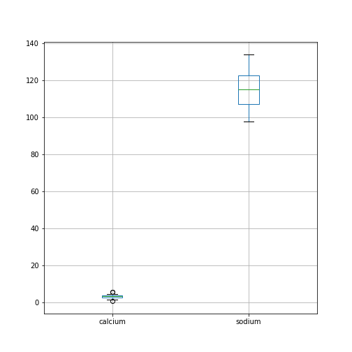
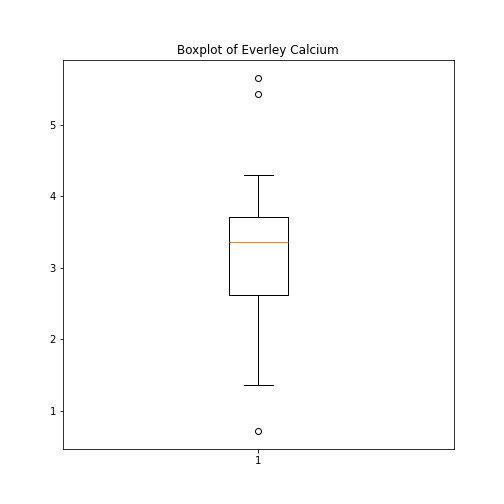
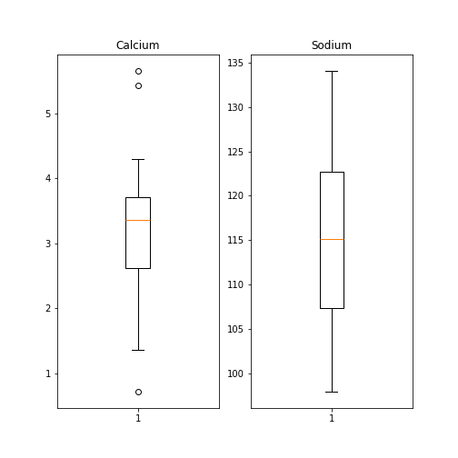
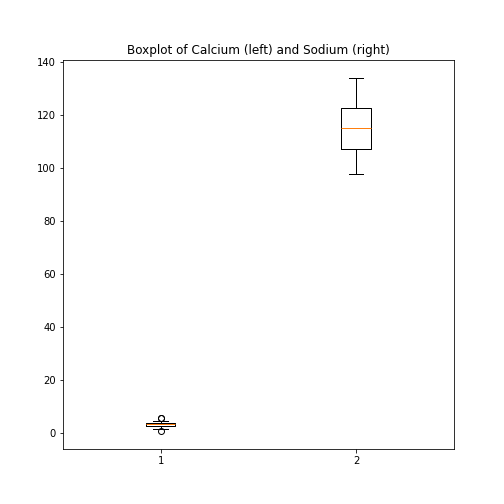
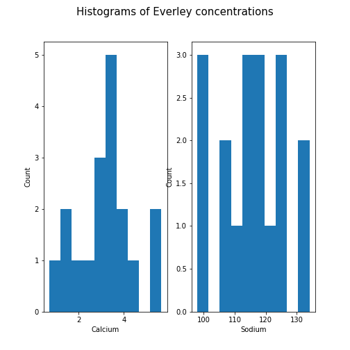
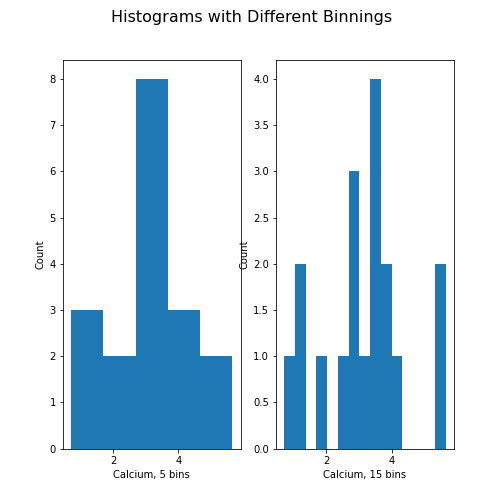
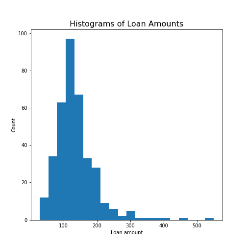

[**Download chapter PDF (.pdf).**](https://drive.usercontent.google.com/u/1/uc?id=1BwmP3qeemi5YFkTGMw-r8-z6L15_gE2B&export=download)

[**Download chapter notebook (.ipynb).**](https://drive.usercontent.google.com/u/1/uc?id=10T_wlrFbCu1ijkIc3QtrPUpi4k2oAxBA&export=download)

[<span style="color: rgb(255, 0, 0);">**Mandatory Lesson Feedback Survey**</span>](https://docs.google.com/forms/d/e/1FAIpQLSdr0capF7jloJhPH3Pki1B3LZoKOG16poOpuVJ7SL2LkwLHQA/viewform?pli=1)


::::::::::::::::::::::::::::::::::::: questions

- What is a Dataframe, and how can we read data into one?
- What are the different methods for manipulating data in Dataframes?
- What makes data visualisation simple, in Python?

::::::::::::::::::::::::::::::::::::::::::::::::

::::::::::::::::::::::::::::::::::::: objectives
- Import a dataset as a Pandas Dataframe
- Inspect a Dataframe and access data
- Produce an overview of data features
- Create data plots using Matplotlib
::::::::::::::::::::::::::::::::::::::::::::::::

<br>
<p align = "center">
<iframe width="560" height="315" src="https://www.youtube.com/embed/jdWOAzK81VE" title="YouTube video player" frameborder="0" allow="accelerometer; autoplay; clipboard-write; encrypted-media; gyroscope; picture-in-picture" allowfullscreen></iframe>
</p>
<br>

<p align = "center">
<iframe width="560" height="315" src="https://www.youtube.com/embed/zw6t3yHEqGU" title="YouTube video player" frameborder="0" allow="accelerometer; autoplay; clipboard-write; encrypted-media; gyroscope; picture-in-picture" allowfullscreen></iframe>
</p>
<br>

<p align = "center">
<iframe width="560" height="315" src="https://www.youtube.com/embed/mljXcIzx4ps" title="YouTube video player" frameborder="0" allow="accelerometer; autoplay; clipboard-write; encrypted-media; gyroscope; picture-in-picture" allowfullscreen></iframe>
</p>
<br>

:::::::::::::::::: prereq

## Prerequisites

- [Indexing of arrays](https://github.com/L2D-July2024-Part-I/Basic_Python/04-arrays.html#sec:list:indexing)
- [For-loop through an array](https://github.com/L2D-July2024-Part-I/Basic_Python/05-iterations.html#retaining-the-new-values)
- Basic statistics (distributions, mean, median and standard deviation)

::::::::::::::::::

:::::::::::::::::::::::::::::::::::::::::::::::::::::::::::::::::::: instructor

The diabetes data set is one of the challenging task.

::::::::::::::::::::::::::::::::::::::::::::::::::::::::::::::::::::::::::::::::


## Challenge: The diabetes dataset
<p style='text-align: justify;'>
Here is a screenshot of a diabetes dataset. It is taken from
[this webpage](https://www4.stat.ncsu.edu/~boos/var.select/diabetes.tab.txt), and is one of the [example datasets](https://scikit-learn.org/stable/modules/generated/sklearn.datasets.load_diabetes.html) used to illustrate machine learning functionality in scikit-learn (Part II of the L2D course).
</p>


<p style='text-align: justify;'>
This figure captures only the top part of the data. On the webpage, you will need to scroll down considerably to view all of it. Thus, our first data science task, will be to obtain an overview of this datset.
</p>

::::::::::::::::::::::::::::::::::::: callout

## The lesson

- Introduces code to read and inspect the data
- Works with a specific Dataframe and explains methods used to get an overview of the data
- Discusses the concept of 'distribution' as a way of summarising data within a single figure


:::::::: checklist

### To familiarise yourself with a dataset you need to:

- Access the data
- Check the content
- Produce a summary of basic properties

::::::::

<p style='text-align: justify;'>
In this lesson we will look solely at univariate features, where each data columns are studied independently of the others in the datasets. Further properties and bivariate features will be the topic of the next lesson.
</p>

::::::::::::::::::::::::::::::::::::::::::::::::

## Work-Through Example

:::::::::::::::::::::::::::::::::::::::::::::::: discussion

## Reading data into a Pandas DataFrame

<p style='text-align: justify;'>
The small practice data file for this section is called 'everleys_data.csv', and can be downloaded using the link given above in [Summary and Setup](../learners/setup.md) for this Lesson. To start, please create a subfolder called 'data' in the current directory and put the data file in it. It can now be accessed using the relative path `data/everleys_data.csv` or `data\everleys_data.csv`, respectively.
</p>

<p style='text-align: justify;'>
The file `everleys_data.csv` contains serum concentrations of calcium and sodium ions, sampled from 17 patients with Everley's syndrome - a rare genetic disorder that results in sufferers experiencing developmental delays, intellectual and physical abnormalities. The data are taken from a [BMJ statistics tutorial](https://www.bmj.com/about-bmj/resources-readers/publications/statistics-square-one/7-t-tests), and are stored as comma-separated values (csv): with two values given for each patient.
</p>
<p style='text-align: justify;'>
To get to know a dataset, we will use the Pandas package and the Matplotlib plotting library. The Pandas package for data science is included in the Anaconda distribution of Python. Check this [link for installation instructions](https://pandas.pydata.org/getting_started.html) to get started.
</p>

If you are not using the Anaconda distribution, please refer to [these guidelines](https://pandas.pydata.org/docs/getting_started/install.html).

<p style='text-align: justify;'>
In order to use the functions contained in Pandas, they must first to be imported. Since our dataset is in a '.csv' file, we must first read it from a csv file. For this, we must import the function `read_csv`, which will create a _Pandas DataFrame_ from data provided in a '.csv' file.
</p>

::::::::::::::::::::::::::::::::::::::::::::::::


``` python
from pandas import read_csv
```

<p style='text-align: justify;'>
Executing this code does not lead to any output on the screen. However, the function is now ready to be used. To use it, we type its name and provide the required arguments. The following code should import the Everley's data into your Python Notebook: 
</p>


``` python
# For Mac OS X and Linux:
# (please go to the next cell if using Windows)

df = read_csv("data/everleys_data.csv")
```


``` python
# For Windows:

# df = read_csv("data\everleys_data.csv")
```

<p style='text-align: justify;'>
Note the orientation of backward and forward slashes that differentiate filepaths given between Unix-based systems, and Windows. This code uses the `read_csv` function from Pandas to read data from a data file, in this case a file with extension '.csv'. Note that the location of the data file is specified within quotes by the relative path to the subfolder 'data', followed by the file name. Use your file browser or the browser in JupyterLab (or an ‘Explorer’-type pane in your IDE of choice) to check that subfolder does indeed exists, and contains the file within it.
</p>


After execution of the code, the data are contained in a variable called `df`. This is a structure referred to as a Pandas _DataFrame_.

> A [__Pandas DataFrame__](https://pandas.pydata.org/pandas-docs/stable/user_guide/dsintro.html#dataframe) is a 2-dimensional labelled data structure, with columns of (potentially different) types. You can think of it as a spreadsheet.


To see the contents of `df`, simply use:


``` python
df
```

``` output
     calcium      sodium
0   3.455582  112.690980
1   3.669026  125.663330
2   2.789910  105.821810
3   2.939900   98.172772
4   5.426060   97.931489
5   0.715811  120.858330
6   5.652390  112.871500
7   3.571320  112.647360
8   4.300067  132.031720
9   1.369419  118.499010
10  2.550962  117.373730
11  2.894129  134.052390
12  3.664987  105.346410
13  1.362779  123.359490
14  3.718798  125.021060
15  1.865868  112.075420
16  3.272809  117.588040
17  3.917591  101.009870
```

(Compare with the result of `print(df)` which displays the contents in a different format.)

<p style='text-align: justify;'>
The output shows in the first column an index, integers from 0 to 17; and the calcium and sodium concentrations in columns 2 and 3, respectively. The default indexing starts from zero (Python is a 'zero-based' programming language).
</p>

<p style='text-align: justify;'>
In a DataFrame, the first column is referred to as _Indices_, the first row is referred to as _Labels_. Note that the row with the labels is excluded from the row count. Similarly, the row with the indices is excluded from the column count.
</p>

For large datasets, the function `head` is a convenient way to get a feel of the dataset.


``` python
df.head()
```

``` output
    calcium      sodium
0  3.455582  112.690980
1  3.669026  125.663330
2  2.789910  105.821810
3  2.939900   98.172772
4  5.426060   97.931489
```

<p style='text-align: justify;'>
Without any input argument, this displays the first five data lines of data i the newly-created DataFrame. You can specify and alter the number of rows displayed by including a single integer as argument, e.g. `head(10)`.
</p>

<p style='text-align: justify;'>
If you feel there are too many decimal places in the default view, you can restrict their number by using the `round` method. The numerical argument that you provide in the round parentheses controls the number of decimal places the method rounds to, with digits up to 5 being rounded down, and above (and inclusive of) 5, being rounded up:
</p>


``` python
df.head().round(2)
```

``` output
   calcium  sodium
0     3.46  112.69
1     3.67  125.66
2     2.79  105.82
3     2.94   98.17
4     5.43   97.93
```

<p style='text-align: justify;'>
While it is possible to see how many rows there are in a DataFrame by displaying the whole DataFrame and looking at the last index, there is a convenient way to obtain this number, directly:
</p>


``` python
no_rows = len(df)

print('DataFrame has', no_rows, 'rows')
```

``` output
DataFrame has 18 rows
```

You could see above, that the columns of the DataFrame have labels. To see all labels:


``` python
column_labels = df.columns

print(column_labels)
```

``` output
Index(['calcium', 'sodium'], dtype='object')
```

Now we can count the labels to obtain the number of columns:


``` python
no_columns = len(column_labels)

print('DataFrame has', no_columns, 'columns')
```

``` output
DataFrame has 2 columns
```

<p style='text-align: justify;'>
And if you want to have both the number of the rows and the number columns displayed together, you can use the `shape` method. Shape returns a tuple of two numbers: the first is the number of rows, and the second is the number of columns.
</p>


``` python
df_shape = df.shape

print('DataFrame has', df_shape[0], 'rows and',df_shape[1],  'columns')
```

``` output
DataFrame has 18 rows and 2 columns
```


Notice that `shape` (like `columns`) is not followed by round parentheses. It is not a function that can take arguments. Technically, `shape` is a 'property' of the DataFrame.


To find out what data type is contained in each of the columns, us `dtypes`, another 'property':


``` python
df.dtypes
```

``` output
calcium    float64
sodium     float64
dtype: object
```


In this case, both columns contain floating point (decimal) numbers.

:::::::::::::::::::::::: challenge

## Practice Exercise 1

**Read data into a DataFrame**

<p style='text-align: justify;'>
Download the data file 'loan_data.csv' using the link given above in [Summary and Setup](../learners/setup.md) for this Lesson". It contains data that can be used for the assessment of loan applications. Read the data into a DataFrame. It is best to assign it a name other than 'df' (to avoid overwriting the Evereley dataset).
</p>

<p style='text-align: justify;'>
Display the first ten rows of the Loan dataset to see its contents. It is taken from a [tutorial on Data Handling in Python](https://www.analyticsvidhya.com/blog/2016/01/complete-tutorial-learn-data-science-python-scratch-2/) which you might find useful for further practice.
</p>

> From this exercise we can see that a DataFrame can contain different types of data: real numbers (e.g. LoanAmount), integers (ApplicantIncome), categorical data (Gender), and strings (Loan_ID).

::::::::::::::::: solution


``` python
from pandas import read_csv
# dataframe from .csv file
df_loan = read_csv("data/loan_data.csv")
# display contents
df_loan.head(10)
```

``` output
    Loan_ID  Gender Married  ... Loan_Amount_Term Credit_History Property_Area
0  LP001015    Male     Yes  ...            360.0            1.0         Urban
1  LP001022    Male     Yes  ...            360.0            1.0         Urban
2  LP001031    Male     Yes  ...            360.0            1.0         Urban
3  LP001035    Male     Yes  ...            360.0            NaN         Urban
4  LP001051    Male      No  ...            360.0            1.0         Urban
5  LP001054    Male     Yes  ...            360.0            1.0         Urban
6  LP001055  Female      No  ...            360.0            1.0     Semiurban
7  LP001056    Male     Yes  ...            360.0            0.0         Rural
8  LP001059    Male     Yes  ...            240.0            1.0         Urban
9  LP001067    Male      No  ...            360.0            1.0     Semiurban

[10 rows x 12 columns]
```
:::::::::::::::::
::::::::::::::::::::::::


## Accessing data in a DataFrame

<p style='text-align: justify;'>
If a datafile is large and you only want to check the format of data in a specific column, you can limit the display to that column.
To access data contained in a specific column of a DataFrame, we can use a similar convention as in a Python dictionary, treating the column names as 'keys'. E.g. to show all rows in column 'Calcium', use:
</p>


``` python
df['calcium']
```

``` output
0     3.455582
1     3.669026
2     2.789910
3     2.939900
4     5.426060
5     0.715811
6     5.652390
7     3.571320
8     4.300067
9     1.369419
10    2.550962
11    2.894129
12    3.664987
13    1.362779
14    3.718798
15    1.865868
16    3.272809
17    3.917591
Name: calcium, dtype: float64
```

To access individual rows of a column we use two pairs of square brackets:


``` python
df['calcium'][0:3]
```

``` output
0    3.455582
1    3.669026
2    2.789910
Name: calcium, dtype: float64
```

<p style='text-align: justify;'>
Here all rules for [slicing](https://docs.python.org/3/tutorial/introduction.html) can be applied.
As for lists and tuples, the indexing of rows is semi-inclusive, with the lower boundary included and upper boundary excluded.
Note that the first pair of square brackets refers to columns, and the second pair refers to the rows. However, this is different from accessing items in a nested list, for instance.
</p>

Accessing items in a Pandas DataFrame is analogous to accessing the values in a Python dictionary by referring to its keys.


To access non-contiguous elements, we use an additional pair of square brackets (as if for a list within a list):


``` python
df['calcium'][[1, 3, 7]]
```

``` output
1    3.669026
3    2.939900
7    3.571320
Name: calcium, dtype: float64
```

<p style='text-align: justify;'>
Another method for indexing and slicing a DataFrame is to use the 'index location' or `iloc` property. Note that properties in Python differ from methods. Syntactically, they use the same dot notation we are accustomed to with methods, but they differ in their use of square brackets, rather than the round parentheses that methods operate with. A property also refers directly to a specific **attribute** of an object. 

In this example `iloc` refers first to the rows of data, and then to columns - by index; all contained within a single pair of brackets. For example, to obtain all the rows of the first column (index `0`), you use:
</p>


``` python
df.iloc[:, 0]
```

``` output
0     3.455582
1     3.669026
2     2.789910
3     2.939900
4     5.426060
5     0.715811
6     5.652390
7     3.571320
8     4.300067
9     1.369419
10    2.550962
11    2.894129
12    3.664987
13    1.362779
14    3.718798
15    1.865868
16    3.272809
17    3.917591
Name: calcium, dtype: float64
```

To display only the first three calcium concentrations, slicing is used: note that the upper boundary is excluded):


``` python
df.iloc[0:3, 0]
```

``` output
0    3.455582
1    3.669026
2    2.789910
Name: calcium, dtype: float64
```

To access non-consecutive values, we can use a pair of square brackets within the outer pair of square brackets:


``` python
df.iloc[[2, 4, 7], 0]
```

``` output
2    2.78991
4    5.42606
7    3.57132
Name: calcium, dtype: float64
```

Similarly, we can access values from multiple columns:


``` python
df.iloc[[2, 4, 7], :]
```

``` output
   calcium      sodium
2  2.78991  105.821810
4  5.42606   97.931489
7  3.57132  112.647360
```

To pick only the even rows from the two columns, note the following colon notation:


``` python
df.iloc[:18:2, :]
```

``` output
     calcium      sodium
0   3.455582  112.690980
2   2.789910  105.821810
4   5.426060   97.931489
6   5.652390  112.871500
8   4.300067  132.031720
10  2.550962  117.373730
12  3.664987  105.346410
14  3.718798  125.021060
16  3.272809  117.588040
```

The number after the second colon indicates the _stepsize_.

:::::::::::::::::::::::::::::::::: challenge

## Practice Exercise 2

**Select data from DataFrame**

Display the calcium and sodium concentrations of all patients - except the first. Check the model solution at the bottom for options.

::::::::::::::::: solution


``` python
df[['calcium', 'sodium']][1:]
```

``` output
     calcium      sodium
1   3.669026  125.663330
2   2.789910  105.821810
3   2.939900   98.172772
4   5.426060   97.931489
5   0.715811  120.858330
6   5.652390  112.871500
7   3.571320  112.647360
8   4.300067  132.031720
9   1.369419  118.499010
10  2.550962  117.373730
11  2.894129  134.052390
12  3.664987  105.346410
13  1.362779  123.359490
14  3.718798  125.021060
15  1.865868  112.075420
16  3.272809  117.588040
17  3.917591  101.009870
```

:::::::::::::::::

::::::::::::::::::::::::::::::::::

Mixing the different methods of accessing specific data in a DataFrame can be confusing, and requires practice and diligence.

### **Search for missing values**

Some tables contain missing entries. You can check a DataFrame for such missing entries. If no missing entry is found, the function `isnull` will return `False`.


``` python
df.isnull().any()
```

``` output
calcium    False
sodium     False
dtype: bool
```

This shows that there are no missing entries in our DataFrame.

:::::::::::::::::::::::::::::::::: challenge
## Practice Exercise 3

**Find NaN in DataFrame**

In the Loan dataset, check the entry 'Self-employed' for ID LP001059. It shows how a missing value is represented as 'NaN' (not a number).

 Verify that the output of `isnull` in this case is `True`

::::::::::::::::: solution


``` python
df_loan['Self_Employed'][8]
```

``` output
nan
```


``` python
df_loan['Self_Employed'][8:9].isnull()
```

``` output
8    True
Name: Self_Employed, dtype: bool
```

:::::::::::::::::

::::::::::::::::::::::::::::::::::


## Basic data features:

### **Summary Statistics**

To get a summary of basic data features, it is possible to use the function `describe`:


``` python
description = df.describe()

description
```

``` output
         calcium      sodium
count  18.000000   18.000000
mean    3.174301  115.167484
std     1.306652   10.756852
min     0.715811   97.931489
25%     2.610699  107.385212
50%     3.364195  115.122615
75%     3.706355  122.734200
max     5.652390  134.052390
```

<p style='text-align: justify;'>
The `describe` function produces a new DataFrame (here called 'description') that contains the number of samples, the mean, the standard deviation, 25th, 50th, 75th  percentile, and the minimum and maximum values for each column of the data. Note that the indices of the rows have now been replaced by strings. To access rows, it is possible to refer to those names using the `loc` property. Thus, in order to access the mean of the calcium concentrations from the description, each of the following is valid:
</p>


``` python
# Option 1
description.loc['mean']['calcium']

# Option 2
description.loc['mean'][0]

# Option 3
description['calcium']['mean']

# Option 4
description['calcium'][1]
```

``` output
np.float64(3.1743005405555555)
<string>:3: FutureWarning: Series.__getitem__ treating keys as positions is deprecated. In a future version, integer keys will always be treated as labels (consistent with DataFrame behavior). To access a value by position, use `ser.iloc[pos]`
np.float64(3.1743005405555555)
np.float64(3.1743005405555555)
np.float64(3.1743005405555555)
```

:::::::::::::::::::::::::::::::::: challenge
## Practice Exercise 4

<p style='text-align: justify;'>
Use your own .csv dataset to practice. (If you don't have a dataset at hand, any excel table can be exported as .csv.) Firstly, read it into a DataFrame, and proceed by checking its header, accessing individual values or sets of values etc. Create a statistical summary using `describe`, and check for missing values using `.isnull`.
</p>

::::::::::::::::: solution
 [ad libitum]
:::::::::::::::::

::::::::::::::::::::::::::::::::::

### **Iterating through the columns**

Now we know how to access all data in a DataFrame and how to get a statistical summary statistics over each column.

Here is code to iterate through the columns and access the first two concentrations:


``` python
for col in df:

    print(df[col][0:2])
```

``` output
0    3.455582
1    3.669026
Name: calcium, dtype: float64
0    112.69098
1    125.66333
Name: sodium, dtype: float64
```

As a slightly more complex example, we access the median ('50%') of each column in the description, and add it to a list:


``` python
conc_medians = list()

for col in df:

    conc_medians.append(df[col].describe()['50%'])

print('The columns are: ', list(df.columns))
print('The medians are: ', conc_medians)
```

``` output
The columns are:  ['calcium', 'sodium']
The medians are:  [np.float64(3.3641954), np.float64(115.122615)]
```

<p style='text-align: justify;'>
This approach is useful for DataFrames with a larger number of columns. For instance, it is possible to follow this by creating a boxplot or histogram for the means, medians etc. of the DataFrame, thus giving a comprehensive overview of all (comparable) columns.
</p>

### **Selecting a subset based on a template**

<p style='text-align: justify;'>
Often, an analysis of a dataset may required on only part of the data. This can often be formulated by using a logical condition which specifies the required subset.
</p>

<p style='text-align: justify;'>
For this we will assume that some of the data are labelled '0' and some are labelled '1'. Let us therefore see how to add a new column to our Evereleys DataFrame, which contains the labels (which are, in this example, arbitrary).
</p>

<p style='text-align: justify;'>
Firstly, we can randomly create as many labels as we have rows in the DataFrame. We can use the <kbd>randint</kbd> function, which can be imported from the <kbd>numpy.random</kbd> module of the NumPy library. In its simplest form, the <kbd>randint</kbd> function accepts two arguments. Firstly, the upper bound of the integer needed, which defaults to zero. As Python is exclusive of the upper bound, providing '2' will thus yield either '0' or '1' only.
</p>


``` python
from numpy.random import randint

no_rows = len(df)

randomLabel = randint(2, size=no_rows)

print('Number of rows:  ', no_rows)
print('Number of Labels:', len(randomLabel))
print('Labels:          ', randomLabel)
```

``` output
Number of rows:   18
Number of Labels: 18
Labels:           [1 0 1 0 0 0 1 1 0 0 1 1 1 0 0 0 0 0]
```

Note how we obtain the number of rows (18) using <kbd>len</kbd> function and do not explicitly state it in the code.

<p style='text-align: justify;'>
Next, we must create a new data column in our `df` DataFrame which contains the labels. In order to create a new column, you may simply refer to a column name that does not yet exist, and subsequently assign values to it. Let us call it 'gender', assuming that '0' represents male and '1' represents female.
</p>

As gender specification can include more than two labels, try to create a column with more than two randomly assigned labels e.g. (0, 1, 2).


``` python
df['gender'] = randomLabel

df.head()
```

``` output
    calcium      sodium  gender
0  3.455582  112.690980       1
1  3.669026  125.663330       0
2  2.789910  105.821810       1
3  2.939900   98.172772       0
4  5.426060   97.931489       0
```

<p style='text-align: justify;'>
Now we can use the information contained in 'gender' to filter the data by gender. To achieve this, we use a conditional statement. Let us check which of the rows are labelled as '1':
</p>


``` python
df['gender'] == 1
```

``` output
0      True
1     False
2      True
3     False
4     False
5     False
6      True
7      True
8     False
9     False
10     True
11     True
12     True
13    False
14    False
15    False
16    False
17    False
Name: gender, dtype: bool
```

<p style='text-align: justify;'>
If we assign the result of the conditional statement (a boolean: True or False) to a variable, then this variable can act as a template to filter the data. If we call the DataFrame with that variable, we will only get the rows where the condition was found to be True:
</p>


``` python
df_female = df['gender'] == 1

df[df_female]
```

``` output
     calcium     sodium  gender
0   3.455582  112.69098       1
2   2.789910  105.82181       1
6   5.652390  112.87150       1
7   3.571320  112.64736       1
10  2.550962  117.37373       1
11  2.894129  134.05239       1
12  3.664987  105.34641       1
```

Using the boolean, we only pick the rows that are labelled '1' and thus get a subset of the data according to the label.

:::::::::::::::::::::::::::::::::: challenge

## Practice Exercise 5 

**Using a template**

Modify the code to calculate the number of samples labelled 0 and check the number of rows of that subset.

::::::::::::::::: solution


``` python
from numpy.random import randint
no_rows = len(df)
randomLabel = randint(2, size=no_rows)
df['gender'] = randomLabel
df_male = df['gender'] == 0
no_males = len(df[df_male])
print(no_males, 'samples are labelled "male".')
```

``` output
11 samples are labelled "male".
```
:::::::::::::::::
::::::::::::::::::::::::::::::::::

## Visualisation of data
<p style='text-align: justify;'>
It is easy to see from the numbers that the concentrations of sodium are much higher than those of calcium. However, to incorporate comparisons of medians, percentiles and the spread of the data, it is better to use visualisation.
</p>

<p style='text-align: justify;'>
The simplest way to visualise data, is to use Pandas' functionality which offers direct methods of plotting your data. Here is an example where a boxplot is created for each column:
</p>


``` python
df = read_csv("data/everleys_data.csv")
df.boxplot()
```



<p style='text-align: justify;'>
By default, boxplots are shown for all columns if no further argument is given to the function (empty round parentheses). As the calcium plot is quite condensed, we may wish to visualise it, separately. This can be done by specifying the calcium column as an argument:
</p>


``` python
# Boxplot of calcium results
df.boxplot(column='calcium')
```


## Plots using Matplotlib

> [__Matplotlib__](https://matplotlib.org) is a comprehensive library for creating static, animated and interactive visualizations in Python.

<p style='text-align: justify;'>
The above is an easy way to create boxplots directly on the DataFrame. It is based on the library Matplotlib and specifically uses the __pyplot library__. For simplicity, this code is put into a convenient Pandas function.
</p>

<p style='text-align: justify;'>
However, we are going to use __Matplotlib__ extensively later on in the course, and we will therefore start by introducing a more direct and generic way of using it.
</p>

To do this, we import the function <kbd>subplots</kbd> from the [pyplot library](https://matplotlib.org/stable/api/pyplot_summary.html):


``` python
from matplotlib.pyplot import subplots, show
```

<p style='text-align: justify;'>
The way to use <kbd>subplots</kbd> is to first set up a figure environment (below referred to in the code as an object titled 'fig') and an empty coordinate system (below referred to as object 'ax'). The plot is then created using one of the many methods available in Matplotlib. We will proceed by applying it to the coordinate system, 'ax'.
</p>

<p style='text-align: justify;'>
As an example, let us create a [boxplot](https://matplotlib.org/api/_as_gen/matplotlib.pyplot.boxplot.html#matplotlib.pyplot.boxplot|) of the calcium variable. As an argument of the function we need to specify the data. We can use the values of the 'calcium' concentrations from the column with the same name:
</p>


``` python
fig, ax = subplots()

ax.boxplot(df['calcium'])

ax.set_title('Boxplot of Everley Calcium')

show()
```



Note how we define the title of the plot by referring to the same coordinate system `ax`.

The value of <kbd>subplots</kbd> becomes apparent when it is used to generate more than one plot as part of a single figure: one of its many useful features.

<p style='text-align: justify;'>
Here is an example whereby we create two boxplots adjacent to each other. The keyword arguments to use is 'ncols' which is the number of figures per row. 'ncols=2' indicates that you are plotting two plots adjacent to each other.
</p>


``` python
fig, ax = subplots(ncols=2)

ax[0].boxplot(df['calcium'])
ax[0].set_title('Calcium')

ax[1].boxplot(df['sodium'])
ax[1].set_title('Sodium');

show()
```



Each of these subplots must now be referred to using indexing the coordinate system 'ax'. This figure gives a good overview of the Everley's data.


If you prefer to have the boxplots of both columns in a single figure, this can also be done:


``` python
fig, ax = subplots(ncols=1, nrows=1)

ax.boxplot([df['calcium'], df['sodium']], positions=[1, 2])
ax.set_title('Boxplot of Calcium (left) and Sodium (right)')

show()
```




:::::::::::::::::::::::::::::: challenge
## Practice Exercise 6 

**Boxplot from Loan data**

Plot the boxplots of the 'ApplicantIncome' and the 'CoapplicantIncome' in the Loan data using the above code.

::::::::::::::::: solution


``` python
fig, ax = subplots(ncols=1, nrows=1)
ax.boxplot([df_loan['ApplicantIncome'], df_loan['CoapplicantIncome']], positions=[1, 2])
ax.set_title('Applicant Income (left) & Co-Applicant Income (right)');

show()
```


:::::::::::::::::
::::::::::::::::::::::::::::::

### **Histogram**
<p style='text-align: justify;'>
Another good visual overview for data is the histogram. Containers or 'bins' are created over the range of values found within a column, and the count of the values for each bin is plotted on the vertical (y-)axis.
</p>


``` python
fig, ax = subplots(ncols=2, nrows=1)

ax[0].hist(df['calcium'])
ax[0].set(xlabel='Calcium', ylabel='Count');

ax[1].hist(df['sodium'])
ax[1].set(xlabel='Sodium', ylabel='Count');

fig.suptitle('Histograms of Everley concentrations', fontsize=15);

show()
```




This example code also demonstrates how to use methods from within subplots to add labels to the axes, together with a title for the overall figure.

Unless specified, a default value is used for the generation of the bins. It is set to 10 bins over the range of which values are found. The number of bins in the histogram can be changed using the keyword argument 'bins':


``` python
fig, ax = subplots(ncols=2, nrows=1)

ax[0].hist(df['calcium'], bins=5)
ax[0].set(xlabel='Calcium, 5 bins', ylabel='Count');

ax[1].hist(df['calcium'], bins=15)
ax[1].set(xlabel='Calcium, 15 bins', ylabel='Count');
fig.suptitle('Histograms with Different Binnings', fontsize=16);

show()
```




Note how the y-axis label of the right figure is slightly misplaced, and overlapping the border of the left figure. In order to correct for the placement of the labels and the title, you can use `tight_layout` automatically adjust for this:


``` python
fig, ax = subplots(ncols=2, nrows=1)

ax[0].hist(df['calcium'], bins=5)
ax[0].set(xlabel='Calcium, 5 bins', ylabel='Count');

ax[1].hist(df['calcium'], bins=15)
ax[1].set(xlabel='Calcium, 15 bins', ylabel='Count');
fig.suptitle('Histograms with Different Binnings', fontsize=16);
fig.tight_layout()

show()
```


::::::::::::::::::::::::::::::: challenge
## Practice Exercise 7: 

**Create the histogram of a column**

Take the loan data and display the histogram of the loan amount that people asked for. (Loan amounts are divided by 1000, i.e. in k£ on the horizontal axis).  Use 20 bins, as an example.

::::::::::::::::: solution


``` python
# Histogram of loan amounts in k£
fig, ax = subplots()
ax.hist(df_loan['LoanAmount'], bins=20)
ax.set(xlabel='Loan amount', ylabel='Count');
ax.set_title('Histograms of Loan Amounts', fontsize=16);

show()
```



:::::::::::::::::
:::::::::::::::::::::::::::::::

## Handling the Diabetes Dataset

Let us return to the dataset that commenced our exploration of the handling of data within a DataFrame.

Next, we will:

- Import the diabetes data from 'sklearn'
- Check the shape of the DataFrame and search for NANs
- Get a summary plot of one of its statistical quantities (i.e. mean) for all columns

Firstly, let's import the dataset and check its `head`. In some cases, this may take a moment: please be patient, and wait for the numbers to appear as output below your code cell (if you’re using an IDE).


``` python
from sklearn import datasets

diabetes = datasets.load_diabetes()

X = diabetes.data

from pandas import DataFrame

df_diabetes = DataFrame(data=X)

df_diabetes.head()
```

``` output
          0         1         2  ...         7         8         9
0  0.038076  0.050680  0.061696  ... -0.002592  0.019907 -0.017646
1 -0.001882 -0.044642 -0.051474  ... -0.039493 -0.068332 -0.092204
2  0.085299  0.050680  0.044451  ... -0.002592  0.002861 -0.025930
3 -0.089063 -0.044642 -0.011595  ...  0.034309  0.022688 -0.009362
4  0.005383 -0.044642 -0.036385  ... -0.002592 -0.031988 -0.046641

[5 rows x 10 columns]
```

If you don't see all the columns, use the cursor to scroll to the right. Next, let's check the number of columns and rows.


``` python
no_rows = len(df_diabetes)
no_cols = len(df_diabetes.columns)

print('Rows:', no_rows, 'Columns:', no_cols)
```

``` output
Rows: 442 Columns: 10
```

There are 442 rows organised in 10 columns.

In order o obtain an overview, let us extract the mean of each column using the <kbd>describe</kbd> and plot all means as a bar chart. The Matplotlib function to plot a bar chart is called <kbd>bar</kbd>:


``` python
conc_means = list()

for col in df_diabetes:
    conc_means.append(df_diabetes[col].describe()['mean'])

print('The columns are: ', list(df_diabetes.columns))
print('The medians are: ', conc_means, 2)
```

``` output
The columns are:  [0, 1, 2, 3, 4, 5, 6, 7, 8, 9]
The medians are:  [np.float64(-2.511816797794472e-19), np.float64(1.2307902309192911e-17), np.float64(-2.2455642172282577e-16), np.float64(-4.7975700837874414e-17), np.float64(-1.3814992387869595e-17), np.float64(3.918434204559376e-17), np.float64(-5.7771786349272854e-18), np.float64(-9.042540472060099e-18), np.float64(9.293722151839546e-17), np.float64(1.1303175590075123e-17)] 2
```


``` python
fig, ax = subplots()

bins = range(10)

ax.bar(bins, conc_means);

show()
```


<p style='text-align: justify;'>
Note how the bars in this plot go up and down. The vertical axis, however, has values ranging from -10^(-16)^ to +10^(-16)^. This means that, for all practical purposes, all means are zero which is not a coincidence. The original values have been normalised to mean zero for the purpose of applying a machine learning algorithm to them.
</p>

In this example, we can clearly observe the importance of checking the data before working with them.

## Exercises
:::::::::::::::::::::::::::::::::::::::: challenge

#### End of chapter Exercises

Download the cervical cancer dataset provided, import it using `read_csv`.

1. How many rows and columns are there?

2. How many columns contain floating point numbers (type float64)?

3. How many of the subjects are smokers?

4. Calculate the percentage of smokers

5. Plot the age distribution (with, for instance, 50 bins)

6. Get the mean and standard distribution of age of first sexual intercourse

::::::::::::::::::::: solution

## Solutions are provided after assignments are marked.


:::::::::::::::::::::

::::::::::::::::::::::::::::::::::::::::

::::::::::::::::::::::::::::::::::::: keypoints

- <kbd>Pandas</kbd> package contains useful functions to work with DataFrames.
- The <kbd>iloc</kbd> property is used to index and slice a DataFrame.
- <kbd>describe</kbd> function is used to obtain a statistical summary of basic data features.
- The simplest method for data visualisation, is to use Pandas' in-built functionality.
- `Matplotlib` is a comprehensive library for creating static, animated, and interactive visualizations, in Python.
::::::::::::::::::::::::::::::::::::::::::::::::


[r-markdown]: https://rmarkdown.rstudio.com/
