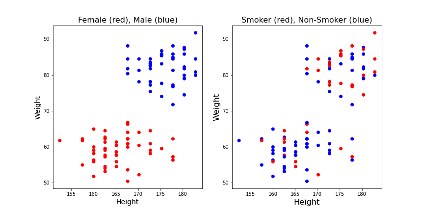
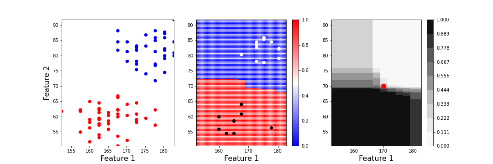

[**Download Chapter notebook (ipynb)**](https://drive.usercontent.google.com/u/1/uc?id=16T85vbrDYu4Z62ryFA5xVHpwrl7okIvy&export=download)

[**Download Chapter PDF**](https://drive.usercontent.google.com/u/1/uc?id=1nb6HmNUYC4RXMHv3bVY0NvLBikw_cH0m&export=download)

[<span style="color: rgb(255, 0, 0);">**Mandatory Lesson Feedback Survey**</span>](https://docs.google.com/forms/d/e/1FAIpQLSdr0capF7jloJhPH3Pki1B3LZoKOG16poOpuVJ7SL2LkwLHQA/viewform?pli=1)


:::::::::::::::::::::::::::::::::::::: questions

- How to prepare data for classification?
- Why do we need to train a model?
- What does a state space plot represent?
- How to obtain prediction probabilities?
- What are the important features?

::::::::::::::::::::::::::::::::::::::::::::::::

::::::::::::::::::::::::::::::::::::: objectives

- Understanding the classification challenge.
- Training a classifier model.
- Understanding the state space plot of model predictions.
- Obtaining prediction probabilities.
- Finding important features.

::::::::::::::::::::::::::::::::::::::::::::::::


:::::::::::::::::: prereq
- [Data Handling](https://learntodiscover.github.io/Data_Handling/)
- [Numpy arrays (see accompanying tutorial)](setup.md#numpy)
- [Basic Matplotlib plotting](https://matplotlib.org)
::::::::::::::::::

<p align = "center">
<iframe width="560" height="315" src="https://www.youtube.com/embed/NIU1JO26Jgk" title="YouTube video player" frameborder="0" allow="accelerometer; autoplay; clipboard-write; encrypted-media; gyroscope; picture-in-picture" allowfullscreen></iframe>
</p>
<br>
<p align = "center">
<iframe width="560" height="315" src="https://www.youtube.com/embed/3f627wXK6z0" title="YouTube video player" frameborder="0" allow="accelerometer; autoplay; clipboard-write; encrypted-media; gyroscope; picture-in-picture" allowfullscreen></iframe>
</p>
<br>
<p align = "center">
<iframe width="560" height="315" src="https://www.youtube.com/embed/EUrxpMr5bG4" title="YouTube video player" frameborder="0" allow="accelerometer; autoplay; clipboard-write; encrypted-media; gyroscope; picture-in-picture" allowfullscreen></iframe>
</p>
<br>

### **Import functions**

``` python
from pandas import read_csv

from numpy import arange, asarray, linspace, c_, meshgrid, zeros, ones

from numpy.random import uniform, seed

from matplotlib.pyplot import subplots, scatter, xlabel, ylabel, xticks, show
```

## Example: Visual Classification

Import the 'patients_data' toy dataset and scatter the data for Height and Weight.


``` python
# Please adjust your path to the file
df = read_csv('data/patients_data.csv')

print(df.shape)

# Convert inches to cm and pounds to kg:
df['Height'] = 2.540*df['Height']
df['Weight'] = 0.454*df['Weight']

df.head(10)
```

``` output
(100, 8)
   Age  Height  Weight  Systolic  Diastolic  Smoker  Gender  Peak Flow
0   38  180.34  79.904       124         93       1    Male        200
1   43  175.26  74.002       109         77       0    Male        615
2   38  162.56  59.474       125         83       0  Female        642
3   40  170.18  60.382       117         75       0  Female        511
4   49  162.56  54.026       122         80       0  Female        497
5   46  172.72  64.468       121         70       0  Female        528
6   33  162.56  64.468       130         88       1  Female        269
7   40  172.72  81.720       115         82       0    Male        324
8   28  172.72  83.082       115         78       0    Male        501
9   31  167.64  59.928       118         86       0  Female        723
```

<p style='text-align: justify;'>
Note that data in the first five columns are either integers (age) or real numbers (floating point). The classes (categorical data) in the last two columns come as binary (0/1) for 'smokers/non-smokers' and as strings for 'male/female'. Both can be used for classification.
</p>


:::::::::::::::::::: challenge
## The classification challenge

<p style='text-align: justify;'>
I am given a set of data from a single subject and feed them to a computational model. The model then predicts to what (predefined) _class_ this subject belongs. Example: given height and weight data, the model might try to predict whether the subject is a smoker or a non-smoker. A naive model will, of course, not be able to predict reasonably. The _supervised_ approach in machine learning is to provide the model with a set of data where the class has been verified beforehand and the model can test its (initially random) predictions against the provided class. An optimisation algorithm is then run to adjust the (internal) model setting such that the predictions improve as much as possible. When no further improvement is achieved, the algorithm stops. The model is then _trained_ and ready to predict.
</p>

::::::::::::::::::::

<p style='text-align: justify;'>
The act of classification is to assign labels to unlabelled data after model exposure to previously labelled data (e.g. based on medical knowledge in the case of disease data).
</p>
<p style='text-align: justify;'>
In contrast, in _unsupervised machine learning_ the assignment is done based on exposure to unlabelled data following a search for distinctive features or 'structure' in the data.
</p>
<p style='text-align: justify;'>
We can first check if we are able to distinguish classes visually. For this, we scatter the data of two columns of a dataframe using the column names. That is, we look at the distribution of points in a plane. Then we use the class __label__ to color each point in the plane according to the class it belongs to. String labels like 'male' / 'female' first need to be converted to Boolean (binary). 0/1 labels as in the 'smokers/non-smokers' column can be used directly.
</p>

Let us plot the height-weight data and label them for both cases.


``` python
fig, ax = subplots(figsize=(12,6),ncols=2,nrows=1)

gender_boolean = df['Gender'] == 'Female'

ax[0].scatter(df['Height'], df['Weight'], c=gender_boolean, cmap='bwr')
ax[0].set_xlabel('Height', fontsize=14)
ax[0].set_ylabel('Weight', fontsize=14)
ax[0].set_title('Female (red), Male (blue)', fontsize=16)

ax[1].scatter(df['Height'], df['Weight'], c=df['Smoker'], cmap='bwr')
ax[1].set_xlabel('Height', fontsize=16)
ax[1].set_ylabel('Weight', fontsize=16)
ax[1].set_title('Smoker (red), Non-Smoker (blue)', fontsize=16);

show()
```



<p style='text-align: justify;'>
It appears from these graphs that based on height and weight data it is possible to distinguish male and female. Based on visual inspection one could conclude that everybody with a weight lower than 70kg is female and everybody with a weight above 70kg is male. That would be a classification based on the weight alone. It also appears that the data points classified as 'male' are taller on average, so it might be helpful to have the height recorded as well. E.g it could improve the prediction of gender for new subjects with a weight around 70 kg. But it would not be the best choice if only a single quantity was used. Thus, a second conclusion is that based on these data the weight is more important for the classification than the height.
</p>

<p style='text-align: justify;'>
On the other hand, based on the smoker / non-smoker data it will not be possible to distinguish smokers from non-smokers. Red dots and blue dots are scattered throughout the graph. The conclusion is that height and weight cannot be used to predict whether a subject is a smoker.
</p>

## Supervised Learning: Training a Model
<p style='text-align: justify;'>
This lesson deals with labelled data. Labelled data are numerical data with an extra column of a __label__ for each sample. A sample can consist of any number of individual observations but must be at least two.
</p>
Examples of labels include 'control group / test group'; 'male / female'; 'healthy / diseased'; 'before treatment / after treatment'.
<p style='text-align: justify;'>
The task in Supervised Machine Learning is to fit (train) a model to distinguish between the groups by 'learning' from so-called training data. After training, the optimised model automatically labels incoming (unlabeled) data. The better the model, the better the labelling (prediction).
</p>
<p style='text-align: justify;'>
The model itself is a black box. It has set default parameters to start with and thus performs badly in the beginning. Essentially, it starts by predicting a label at random. The process of training consists in repeatedly changing the model parameters such that the performance improves. After the training, the model parameters are supposed to be optimal. Of course, the model cannot be expected to reveal anything about the mechanism or cause that underlies the distinction between the labels.
</p>
The performance of the model is tested by splitting a dataset with labels into:

- the `train data`, those that will be used for model fitting, and

- the `test data`, those that will be used to check how well the model predicts.

<p style='text-align: justify;'>
The result of the model fitting is then assessed by checking how many of the (withheld) labels in the test data were correctly predicted by the trained model. We can also retrieve the confidence of the model prediction, i.e. the probability that the assigned label is correct.
</p>
<p style='text-align: justify;'>
As an additional result, the procedure will generate the so-called feature importances: similar to how we concluded above that weight is more important than height for gender prediction, the feature importance informs to which degree each of the data columns actually contributes to the predictions.
</p>

## Scikit Learn

We will import our machine learning functionality from the [SciKit Learn library](https://scikit-learn.org/stable/).

:::::::::::::::::: callout
## SciKit Learn
<p style='text-align: justify;'>
SciKit Learn is a renowned open source application programming interface (API) for machine learning. It enjoys a vibrant community and is well maintained. It is always beneficial to use the official documentations for every API. SciKit Learn provides an exceptional documentation with detailed explanations and examples at every level.
</p>

::::::::::::::::::

<p style='text-align: justify;'>
The implementation of algorithms in SciKit Learn follows a very specific protocol. First and foremost, it uses a programming paradigm known as object-oriented programming (OOP). Thanks to Python, this does not mean that you as the user are also forced to use OOP. But you need to follow a specific protocol to use the tools that are provided by SciKit Learn.
</p>
<p style='text-align: justify;'>
Unlike functions that perform a specific task and return the results, in OOP, we use _classes_ to encapsulate interconnected components and functionalities. In accordance with the convention of best practices for Python programming (also known as PEP8), classes are implemented with camel-case characters; e.g. `RandomForestClassifier`. In contrast, functions should be implemented using lower-case characters only; e.g. `min` or `round`.
</p>

## Classification

### **Prepare data with labels**
<p style='text-align: justify;'>
The terminology that is widely used in Machine Learning (including Scikit Learn) refers to data points as __samples__, and the different types of recordings(columns in our case) are referred to as __features__. In `Numpy` notation, samples are organised in rows, features in columns.
</p>
<p style='text-align: justify;'>
We can use the function `uniform` from numpy.random to generate uniformly distributed random data. Here we create 100 samples of two features (as in the visualisation above). We decide to have values distributed between 0 and 100.
</p>
<p style='text-align: justify;'>
The convention in machine learning is to call the training data 'X'. This array must be __two dimensional__, where rows are the samples and columns are the features.
</p>


``` python
low  = 0
high = 100

n_samples, m_features = 100, 2

RANDOM_SEED  = 1234

seed(RANDOM_SEED)

random_numbers = uniform(low=low, high=high, size=(n_samples, m_features))

X = random_numbers.round(3)

print('Dimensions of training data')
print('')
print('Number of samples:  ', X.shape[0])
print('Number of features: ', X.shape[1])
print('')
```

``` output
Dimensions of training data

Number of samples:   100
Number of features:  2
```

:::::::::::::::: callout
## Note
<p style='text-align: justify;'>
This code uses a __random number generator__. The output of a random number generator is different each time it is run. On the one hand, this is good because it allows us to create many realisations of samples drawn from a fixed distribution. On the other hand, when testing and sharing code this prevents exact reproduction of results. We therefore use the `seed` function to reset the generator such that with a given number for the seed (the parameter called `RANDOM_SEED`) the same numbers are produced.
</p>

::::::::::::::::

Let us check the histograms of both features:


``` python
fig, ax = subplots()

ax.hist(X, bins=10);

show()
```


<p style='text-align: justify;'>
We find that both features are distributed over the selected range of values. Due to the small number of samples, the distribution is not very even.
</p>
<p style='text-align: justify;'>
The categorical data used to distinguish between different classes are called __labels__. Let us create an artificial set of labels for our first classification task.
</p>
<p style='text-align: justify;'>
We pick an arbitrary threshold and call all values `True` if the values in both the first and the second feature are above the threshold. The resulting labels `True` and `False` can be viewed as 0/1 using the method `astype` with argument `int`.
</p>


``` python
threshold = 50

y = (X[:,0] > threshold) & (X[:,1] > threshold)

y.astype(int)
```

array([0, 0, 0, 0, 1, 0, 1, 0, 0, 1, 0, 0, 1, 0, 0, 0, 0, 1, 0, 0, 0, 0,
       1, 0, 0, 0, 0, 1, 1, 1, 0, 0, 0, 0, 0, 1, 0, 0, 0, 0, 0, 1, 0, 1,
       0, 0, 1, 0, 1, 0, 1, 1, 0, 0, 0, 0, 0, 0, 0, 1, 1, 1, 0, 0, 0, 0,
       0, 0, 0, 0, 0, 1, 0, 0, 0, 1, 0, 1, 1, 1, 0, 1, 1, 0, 1, 0, 0, 0,
       0, 1, 0, 1, 0, 0, 0, 0, 0, 0, 0, 1])

If both features (columns) were risk factors, this might be interpreted as: only if both risk factors are above the threshold, a subject is classified as 'at risk', meaning it gets label 'True' or '1'.

Labels must be __one-dimensional__. You can check this by printing the `shape`.
The output should be a single number:


``` python
print('Number of labels:', y.shape)
```

Number of labels: (100,)

### **The Random Forest Classifier**

To start with our learning algorithm, we import one of the many classifiers from Scikit Learn: it is called Random Forest.


``` python
from sklearn.ensemble import RandomForestClassifier
```

The Random Forest is a member of the ensemble learning family, whose objective is to combine the predictions of several optimisations to improve their performance, generalisability, and robustness.

Ensemble methods are often divided into two different categories:

1. Averaging methods: Build several estimators independently, and average their predictions. In general, the combined estimator tends to perform better than any single estimator due to the reduction in variance. Examples: Random Forest and Decision Tree.

2. Boosting methods: Build the estimators sequentially, and attempt to reduce the bias of the combined estimator. Although the performance of individual estimators may be weak, upon combination, they amount to a powerful ensemble. Examples: Gradient Boosting and AdaBoost.

<p style='text-align: justify;'>
We now train a model using the Python class for the Random Forest classifier. Unlike a function (which we can use out of the box) a class needs to be _instantiated_ before it can be used. In Python, we instantiate a class as follows:
</p>


``` python
clf = RandomForestClassifier(random_state=RANDOM_SEED)
```

<p style='text-align: justify;'>
where `clf` now represents an _instance_ of class `RandomForestClassifier`. Note that we have set the keyword argument `random_state` to a number. This is to assure reproducibility of the results. (It does not have to be the same as above, pick any integer).
</p>

The instance of a class is typically referred to as an object, whose type is the class that it represents:


``` python
print('Type of clf:', type(clf))
print('')
```

``` output
Type of clf: <class 'sklearn.ensemble._forest.RandomForestClassifier'>
```

<p style='text-align: justify;'>
Once instantiated, we can use this object, `clf`, to access the methods that are associated with that class. Methods are essentially functions that are encapsulated inside a class.
</p>
<p style='text-align: justify;'>
In SciKit Learn all classes have a `.fit()`  method. Its function is to receive the training data and perform the training of the model.
</p>

### Train a model

To train a model, we apply the fit method to the training data, labelled 'X', given the corresponding labels 'y':


``` python
clf.fit(X, y)
```

```{=html}
<style>#sk-container-id-1 {
  /* Definition of color scheme common for light and dark mode */
  --sklearn-color-text: #000;
  --sklearn-color-text-muted: #666;
  --sklearn-color-line: gray;
  /* Definition of color scheme for unfitted estimators */
  --sklearn-color-unfitted-level-0: #fff5e6;
  --sklearn-color-unfitted-level-1: #f6e4d2;
  --sklearn-color-unfitted-level-2: #ffe0b3;
  --sklearn-color-unfitted-level-3: chocolate;
  /* Definition of color scheme for fitted estimators */
  --sklearn-color-fitted-level-0: #f0f8ff;
  --sklearn-color-fitted-level-1: #d4ebff;
  --sklearn-color-fitted-level-2: #b3dbfd;
  --sklearn-color-fitted-level-3: cornflowerblue;

  /* Specific color for light theme */
  --sklearn-color-text-on-default-background: var(--sg-text-color, var(--theme-code-foreground, var(--jp-content-font-color1, black)));
  --sklearn-color-background: var(--sg-background-color, var(--theme-background, var(--jp-layout-color0, white)));
  --sklearn-color-border-box: var(--sg-text-color, var(--theme-code-foreground, var(--jp-content-font-color1, black)));
  --sklearn-color-icon: #696969;

  @media (prefers-color-scheme: dark) {
    /* Redefinition of color scheme for dark theme */
    --sklearn-color-text-on-default-background: var(--sg-text-color, var(--theme-code-foreground, var(--jp-content-font-color1, white)));
    --sklearn-color-background: var(--sg-background-color, var(--theme-background, var(--jp-layout-color0, #111)));
    --sklearn-color-border-box: var(--sg-text-color, var(--theme-code-foreground, var(--jp-content-font-color1, white)));
    --sklearn-color-icon: #878787;
  }
}

#sk-container-id-1 {
  color: var(--sklearn-color-text);
}

#sk-container-id-1 pre {
  padding: 0;
}

#sk-container-id-1 input.sk-hidden--visually {
  border: 0;
  clip: rect(1px 1px 1px 1px);
  clip: rect(1px, 1px, 1px, 1px);
  height: 1px;
  margin: -1px;
  overflow: hidden;
  padding: 0;
  position: absolute;
  width: 1px;
}

#sk-container-id-1 div.sk-dashed-wrapped {
  border: 1px dashed var(--sklearn-color-line);
  margin: 0 0.4em 0.5em 0.4em;
  box-sizing: border-box;
  padding-bottom: 0.4em;
  background-color: var(--sklearn-color-background);
}

#sk-container-id-1 div.sk-container {
  /* jupyter's `normalize.less` sets `[hidden] { display: none; }`
     but bootstrap.min.css set `[hidden] { display: none !important; }`
     so we also need the `!important` here to be able to override the
     default hidden behavior on the sphinx rendered scikit-learn.org.
     See: https://github.com/scikit-learn/scikit-learn/issues/21755 */
  display: inline-block !important;
  position: relative;
}

#sk-container-id-1 div.sk-text-repr-fallback {
  display: none;
}

div.sk-parallel-item,
div.sk-serial,
div.sk-item {
  /* draw centered vertical line to link estimators */
  background-image: linear-gradient(var(--sklearn-color-text-on-default-background), var(--sklearn-color-text-on-default-background));
  background-size: 2px 100%;
  background-repeat: no-repeat;
  background-position: center center;
}

/* Parallel-specific style estimator block */

#sk-container-id-1 div.sk-parallel-item::after {
  content: "";
  width: 100%;
  border-bottom: 2px solid var(--sklearn-color-text-on-default-background);
  flex-grow: 1;
}

#sk-container-id-1 div.sk-parallel {
  display: flex;
  align-items: stretch;
  justify-content: center;
  background-color: var(--sklearn-color-background);
  position: relative;
}

#sk-container-id-1 div.sk-parallel-item {
  display: flex;
  flex-direction: column;
}

#sk-container-id-1 div.sk-parallel-item:first-child::after {
  align-self: flex-end;
  width: 50%;
}

#sk-container-id-1 div.sk-parallel-item:last-child::after {
  align-self: flex-start;
  width: 50%;
}

#sk-container-id-1 div.sk-parallel-item:only-child::after {
  width: 0;
}

/* Serial-specific style estimator block */

#sk-container-id-1 div.sk-serial {
  display: flex;
  flex-direction: column;
  align-items: center;
  background-color: var(--sklearn-color-background);
  padding-right: 1em;
  padding-left: 1em;
}


/* Toggleable style: style used for estimator/Pipeline/ColumnTransformer box that is
clickable and can be expanded/collapsed.
- Pipeline and ColumnTransformer use this feature and define the default style
- Estimators will overwrite some part of the style using the `sk-estimator` class
*/

/* Pipeline and ColumnTransformer style (default) */

#sk-container-id-1 div.sk-toggleable {
  /* Default theme specific background. It is overwritten whether we have a
  specific estimator or a Pipeline/ColumnTransformer */
  background-color: var(--sklearn-color-background);
}

/* Toggleable label */
#sk-container-id-1 label.sk-toggleable__label {
  cursor: pointer;
  display: flex;
  width: 100%;
  margin-bottom: 0;
  padding: 0.5em;
  box-sizing: border-box;
  text-align: center;
  align-items: start;
  justify-content: space-between;
  gap: 0.5em;
}

#sk-container-id-1 label.sk-toggleable__label .caption {
  font-size: 0.6rem;
  font-weight: lighter;
  color: var(--sklearn-color-text-muted);
}

#sk-container-id-1 label.sk-toggleable__label-arrow:before {
  /* Arrow on the left of the label */
  content: "▸";
  float: left;
  margin-right: 0.25em;
  color: var(--sklearn-color-icon);
}

#sk-container-id-1 label.sk-toggleable__label-arrow:hover:before {
  color: var(--sklearn-color-text);
}

/* Toggleable content - dropdown */

#sk-container-id-1 div.sk-toggleable__content {
  max-height: 0;
  max-width: 0;
  overflow: hidden;
  text-align: left;
  /* unfitted */
  background-color: var(--sklearn-color-unfitted-level-0);
}

#sk-container-id-1 div.sk-toggleable__content.fitted {
  /* fitted */
  background-color: var(--sklearn-color-fitted-level-0);
}

#sk-container-id-1 div.sk-toggleable__content pre {
  margin: 0.2em;
  border-radius: 0.25em;
  color: var(--sklearn-color-text);
  /* unfitted */
  background-color: var(--sklearn-color-unfitted-level-0);
}

#sk-container-id-1 div.sk-toggleable__content.fitted pre {
  /* unfitted */
  background-color: var(--sklearn-color-fitted-level-0);
}

#sk-container-id-1 input.sk-toggleable__control:checked~div.sk-toggleable__content {
  /* Expand drop-down */
  max-height: 200px;
  max-width: 100%;
  overflow: auto;
}

#sk-container-id-1 input.sk-toggleable__control:checked~label.sk-toggleable__label-arrow:before {
  content: "▾";
}

/* Pipeline/ColumnTransformer-specific style */

#sk-container-id-1 div.sk-label input.sk-toggleable__control:checked~label.sk-toggleable__label {
  color: var(--sklearn-color-text);
  background-color: var(--sklearn-color-unfitted-level-2);
}

#sk-container-id-1 div.sk-label.fitted input.sk-toggleable__control:checked~label.sk-toggleable__label {
  background-color: var(--sklearn-color-fitted-level-2);
}

/* Estimator-specific style */

/* Colorize estimator box */
#sk-container-id-1 div.sk-estimator input.sk-toggleable__control:checked~label.sk-toggleable__label {
  /* unfitted */
  background-color: var(--sklearn-color-unfitted-level-2);
}

#sk-container-id-1 div.sk-estimator.fitted input.sk-toggleable__control:checked~label.sk-toggleable__label {
  /* fitted */
  background-color: var(--sklearn-color-fitted-level-2);
}

#sk-container-id-1 div.sk-label label.sk-toggleable__label,
#sk-container-id-1 div.sk-label label {
  /* The background is the default theme color */
  color: var(--sklearn-color-text-on-default-background);
}

/* On hover, darken the color of the background */
#sk-container-id-1 div.sk-label:hover label.sk-toggleable__label {
  color: var(--sklearn-color-text);
  background-color: var(--sklearn-color-unfitted-level-2);
}

/* Label box, darken color on hover, fitted */
#sk-container-id-1 div.sk-label.fitted:hover label.sk-toggleable__label.fitted {
  color: var(--sklearn-color-text);
  background-color: var(--sklearn-color-fitted-level-2);
}

/* Estimator label */

#sk-container-id-1 div.sk-label label {
  font-family: monospace;
  font-weight: bold;
  display: inline-block;
  line-height: 1.2em;
}

#sk-container-id-1 div.sk-label-container {
  text-align: center;
}

/* Estimator-specific */
#sk-container-id-1 div.sk-estimator {
  font-family: monospace;
  border: 1px dotted var(--sklearn-color-border-box);
  border-radius: 0.25em;
  box-sizing: border-box;
  margin-bottom: 0.5em;
  /* unfitted */
  background-color: var(--sklearn-color-unfitted-level-0);
}

#sk-container-id-1 div.sk-estimator.fitted {
  /* fitted */
  background-color: var(--sklearn-color-fitted-level-0);
}

/* on hover */
#sk-container-id-1 div.sk-estimator:hover {
  /* unfitted */
  background-color: var(--sklearn-color-unfitted-level-2);
}

#sk-container-id-1 div.sk-estimator.fitted:hover {
  /* fitted */
  background-color: var(--sklearn-color-fitted-level-2);
}

/* Specification for estimator info (e.g. "i" and "?") */

/* Common style for "i" and "?" */

.sk-estimator-doc-link,
a:link.sk-estimator-doc-link,
a:visited.sk-estimator-doc-link {
  float: right;
  font-size: smaller;
  line-height: 1em;
  font-family: monospace;
  background-color: var(--sklearn-color-background);
  border-radius: 1em;
  height: 1em;
  width: 1em;
  text-decoration: none !important;
  margin-left: 0.5em;
  text-align: center;
  /* unfitted */
  border: var(--sklearn-color-unfitted-level-1) 1pt solid;
  color: var(--sklearn-color-unfitted-level-1);
}

.sk-estimator-doc-link.fitted,
a:link.sk-estimator-doc-link.fitted,
a:visited.sk-estimator-doc-link.fitted {
  /* fitted */
  border: var(--sklearn-color-fitted-level-1) 1pt solid;
  color: var(--sklearn-color-fitted-level-1);
}

/* On hover */
div.sk-estimator:hover .sk-estimator-doc-link:hover,
.sk-estimator-doc-link:hover,
div.sk-label-container:hover .sk-estimator-doc-link:hover,
.sk-estimator-doc-link:hover {
  /* unfitted */
  background-color: var(--sklearn-color-unfitted-level-3);
  color: var(--sklearn-color-background);
  text-decoration: none;
}

div.sk-estimator.fitted:hover .sk-estimator-doc-link.fitted:hover,
.sk-estimator-doc-link.fitted:hover,
div.sk-label-container:hover .sk-estimator-doc-link.fitted:hover,
.sk-estimator-doc-link.fitted:hover {
  /* fitted */
  background-color: var(--sklearn-color-fitted-level-3);
  color: var(--sklearn-color-background);
  text-decoration: none;
}

/* Span, style for the box shown on hovering the info icon */
.sk-estimator-doc-link span {
  display: none;
  z-index: 9999;
  position: relative;
  font-weight: normal;
  right: .2ex;
  padding: .5ex;
  margin: .5ex;
  width: min-content;
  min-width: 20ex;
  max-width: 50ex;
  color: var(--sklearn-color-text);
  box-shadow: 2pt 2pt 4pt #999;
  /* unfitted */
  background: var(--sklearn-color-unfitted-level-0);
  border: .5pt solid var(--sklearn-color-unfitted-level-3);
}

.sk-estimator-doc-link.fitted span {
  /* fitted */
  background: var(--sklearn-color-fitted-level-0);
  border: var(--sklearn-color-fitted-level-3);
}

.sk-estimator-doc-link:hover span {
  display: block;
}

/* "?"-specific style due to the `<a>` HTML tag */

#sk-container-id-1 a.estimator_doc_link {
  float: right;
  font-size: 1rem;
  line-height: 1em;
  font-family: monospace;
  background-color: var(--sklearn-color-background);
  border-radius: 1rem;
  height: 1rem;
  width: 1rem;
  text-decoration: none;
  /* unfitted */
  color: var(--sklearn-color-unfitted-level-1);
  border: var(--sklearn-color-unfitted-level-1) 1pt solid;
}

#sk-container-id-1 a.estimator_doc_link.fitted {
  /* fitted */
  border: var(--sklearn-color-fitted-level-1) 1pt solid;
  color: var(--sklearn-color-fitted-level-1);
}

/* On hover */
#sk-container-id-1 a.estimator_doc_link:hover {
  /* unfitted */
  background-color: var(--sklearn-color-unfitted-level-3);
  color: var(--sklearn-color-background);
  text-decoration: none;
}

#sk-container-id-1 a.estimator_doc_link.fitted:hover {
  /* fitted */
  background-color: var(--sklearn-color-fitted-level-3);
}
</style><div id="sk-container-id-1" class="sk-top-container"><div class="sk-text-repr-fallback"><pre>RandomForestClassifier(random_state=1234)</pre><b>In a Jupyter environment, please rerun this cell to show the HTML representation or trust the notebook. <br />On GitHub, the HTML representation is unable to render, please try loading this page with nbviewer.org.</b></div><div class="sk-container" hidden><div class="sk-item"><div class="sk-estimator fitted sk-toggleable"><input class="sk-toggleable__control sk-hidden--visually" id="sk-estimator-id-1" type="checkbox" checked><label for="sk-estimator-id-1" class="sk-toggleable__label fitted sk-toggleable__label-arrow"><div><div>RandomForestClassifier</div></div><div><a class="sk-estimator-doc-link fitted" rel="noreferrer" target="_blank" href="https://scikit-learn.org/1.6/modules/generated/sklearn.ensemble.RandomForestClassifier.html">?<span>Documentation for RandomForestClassifier</span></a><span class="sk-estimator-doc-link fitted">i<span>Fitted</span></span></div></label><div class="sk-toggleable__content fitted"><pre>RandomForestClassifier(random_state=1234)</pre></div> </div></div></div></div>
```

And that's it. All the machine learning magic done. `clf` is now a trained model with optimised parameters which we can use to predict new data.


### **Predict Test Data**

### Categorical Prediction
<p style='text-align: justify;'>
We start by creating a number of test data in the same way as we created the training data. Note that the number of test samples is arbitrary. You can create any number of samples. However, you must provide the same number of features (columns) used in the training of the classifier. In our case that is 2.
</p>


``` python
RANDOM_SEED_2 = 123

seed(RANDOM_SEED_2)

new_samples = 10

features = X.shape[1]

new_data = uniform(low=low, high=high, size=(10, 2))

print('Shape of new data', new_data.shape)
print('')
print(new_data)
```

``` output
Shape of new data (10, 2)

[[69.64691856 28.6139335 ]
 [22.68514536 55.13147691]
 [71.94689698 42.31064601]
 [98.07641984 68.48297386]
 [48.09319015 39.21175182]
 [34.31780162 72.90497074]
 [43.85722447  5.96778966]
 [39.80442553 73.79954057]
 [18.24917305 17.54517561]
 [53.15513738 53.18275871]]
```

<p style='text-align: justify;'>
There are 10 randomly created pairs of numbers in the same range as the training data. They represent 'unlabelled' incoming data which we offer to the trained model.
</p>

The method `.predict()` helps us to find out what the model claims these data to be:


``` python
predictions = clf.predict(new_data)

print('Predictions: ', predictions)
```

Predictions:  [False False False  True False False False False False  True]

They can also be viewed as zeros and ones:


``` python
predictions.astype(int)
```

array([0, 0, 0, 1, 0, 0, 0, 0, 0, 1])

According to the model, data points with indices 3, and 9 are in class `True` (or `1`).

<p style='text-align: justify;'>
Predicting individual samples is fine, but does not tell us whether the classifier was able to create a good model of the class distinction. To check the training result systematically, we create a state space grid over the state space. This is the same as creating a coordinate system of data points (as in a scatter plot), in our case with values from 0 to 100 in each feature.
</p>

Here we use a resolution of 100, ie. we create a 100 by 100 grid:


``` python
resolution = 100

vec_a = linspace(low, high, resolution)
vec_b = vec_a

grid_a, grid_b = meshgrid(vec_a, vec_b)

grid_a_flat = grid_a.ravel()
grid_b_flat = grid_b.ravel()

XY_statespace = c_[grid_a_flat, grid_b_flat]

print(XY_statespace.shape)
```

(10000, 2)

<p style='text-align: justify;'>
Now we can offer the grid of the X-Y state space as 'new data' to the classifier and obtain the predictions. We can then plot the grid points and colour them according to the labels assigned by the trained model.
</p>


``` python
predictions = clf.predict(XY_statespace)

predictions.shape
```

(10000,)

We obtain 10,000 predictions, one for each point on the grid.

To compare the data with the original thresholds and the model predictions we can use plots of the state space:


``` python
feature_1, feature_2 = 0, 1

fig, ax = subplots(ncols=2, nrows=1, figsize=(10, 5))

ax[0].scatter(X[:, feature_1], X[:, feature_2], c=y, s=4, cmap='bwr');
ax[1].scatter(XY_statespace[:, feature_1], XY_statespace[:, feature_2], c=predictions, s=1, cmap='bwr');

p1, p2 = [threshold, threshold], [100, threshold]
p3, p4 = [threshold, 100], [threshold, threshold]

ax[0].plot(p1, p2, c='k')
ax[0].plot(p3, p4, c='k')

ax[0].set_xlabel('Feature 1', fontsize=16)
ax[0].set_ylabel('Feature 2', fontsize=16);
ax[1].set_xlabel('Feature 1', fontsize=16);

show()
```


<p style='text-align: justify;'>
Left is a scatter plot of the data points used for training. They are coloured according to their labels. The black lines indicate the threshold boundaries that we introduced to distinguish the two classes. On the right hand side are the predictions for the coordinate grid. Label 0 is blue, label 1 is red.
</p>
<p style='text-align: justify;'>
Based on the training samples (left), a good classification can be achieved with the model (right). But some problems persist. In particular, the boundaries are not sharp.
</p>

### Probability Prediction
<p style='text-align: justify;'>
Let us pick a sample near the boundary. We can get its predicted label. In addition, using `.predict_proba()` we can get the probability of this prediction. This reflects the confidence in the prediction. 50% probability means, the prediction is at chance level, i.e. equivalent to a coin toss.
</p>

``` python
pos = 55

test_sample = [[pos, pos]]

test_sample_label = clf.predict(test_sample)

test_sample_proba = clf.predict_proba(test_sample)

print('Prediction:', test_sample_label)
print(clf.classes_, test_sample_proba)
```

``` output
Prediction: [False]
[False  True] [[0.57 0.43]]
```


``` python
bins = arange(test_sample_proba.shape[1])

fig, ax = subplots()

ax.bar(bins, test_sample_proba[0,:], color=('b', 'r'))
ax.set_ylabel('Probability', fontsize=16)
xticks(bins, ('Label 0', 'Label 1'), fontsize=16);

show()
```


<p style='text-align: justify;'>
Even though the sample is from the region that (according to the creation of the data) is in the 'True' region, it is labelled as false. The reason is that there were few or no training data points in that specific region.
</p>
<p style='text-align: justify;'>
Here is a plot of the probability for the state space. White represents False and Black represents True, the values in between are gray coded. Note that the probability values are complementary. We only need the probabilities for one of our classes.
</p>


``` python
state_space_proba = clf.predict_proba(XY_statespace)

grid_shape = grid_a.shape

proba_grid = state_space_proba[:, 1].reshape(grid_shape)

contour_levels = linspace(0, 1, 6)


fig, ax = subplots(figsize=(6, 5))

cax = ax.contourf(grid_a, grid_b, proba_grid, cmap='Greys', levels=contour_levels)
fig.colorbar(cax)

ax.scatter(test_sample[0][0], test_sample[0][1], c='r', marker='o', s=100)

ax.plot(p1, p2, p3, p4, c='r')

ax.set_xlabel('Feature 1', fontsize=16)
ax.set_ylabel('Feature 2', fontsize=16);

show()
```


The single red dot marks the individual data point we used to illustrate the prediction probability above.

### Feature Importances
<p style='text-align: justify;'>
We can check the contribution of each feature for the success of the classification. The feature importance is given as the fraction contribution of each feature to the prediction.
</p>


``` python
importances = clf.feature_importances_

print('Relative importance:')

template = 'Feature 1: {:.1f}%; Feature 2: {:.1f}%'

print(template.format(importances[0]*100, importances[1]*100))

bins = arange(importances.shape[0])

fig, ax = subplots()

ax.bar(bins, importances, color=('g', 'm'));
ax.set_ylabel('Feature Importance', fontsize=16)

xticks(bins, ('Feature 1', 'Feature 2'), fontsize=16);

show()
```

``` output
Relative importance:
Feature 1: 61.6%; Feature 2: 38.4%
```


In this case, the predictions are based on a 61% contribution from feature 1 and a 38% contribution from feature 2.

:::::::::::::::: callout
## Note
<p style='text-align: justify;'>
It should be noted that the attribute `.feature_importances_` will not work if applied to a Multi-Layer Pereceptron (MLP) Classifier. This attribute actually only works with specific models such as random forest or decision trees.

We can, however, make use of a permutation-based feature importance measure for the MLP classifier, instead. This can be accessed using the function `.permutation_importance`, which measures the decrease in the model's performance, each time a specific feature is shuffled; effectively measuring its importance to the resulting prediction.

This attribute is available within scikit-learn's inspection sub-library, and assuming you have a trained classifier stored in a variable, you could use it, as follows:


``` python
from sklearn.neural_network import MLPClassifier
from sklearn.inspection import permutation_importance
from sklearn.datasets import load_iris
from sklearn.model_selection import train_test_split

# Load a simple dataset
X, y = load_iris(return_X_y=True)

# Split into train and test sets
X_train, X_test, y_train, y_test = train_test_split(X, y, random_state=42)

# Train a multi-layer perceptron classifier
clf = MLPClassifier(max_iter=1000, random_state=42)
clf.fit(X_train, y_train)
```

```{=html}
<style>#sk-container-id-2 {
  /* Definition of color scheme common for light and dark mode */
  --sklearn-color-text: #000;
  --sklearn-color-text-muted: #666;
  --sklearn-color-line: gray;
  /* Definition of color scheme for unfitted estimators */
  --sklearn-color-unfitted-level-0: #fff5e6;
  --sklearn-color-unfitted-level-1: #f6e4d2;
  --sklearn-color-unfitted-level-2: #ffe0b3;
  --sklearn-color-unfitted-level-3: chocolate;
  /* Definition of color scheme for fitted estimators */
  --sklearn-color-fitted-level-0: #f0f8ff;
  --sklearn-color-fitted-level-1: #d4ebff;
  --sklearn-color-fitted-level-2: #b3dbfd;
  --sklearn-color-fitted-level-3: cornflowerblue;

  /* Specific color for light theme */
  --sklearn-color-text-on-default-background: var(--sg-text-color, var(--theme-code-foreground, var(--jp-content-font-color1, black)));
  --sklearn-color-background: var(--sg-background-color, var(--theme-background, var(--jp-layout-color0, white)));
  --sklearn-color-border-box: var(--sg-text-color, var(--theme-code-foreground, var(--jp-content-font-color1, black)));
  --sklearn-color-icon: #696969;

  @media (prefers-color-scheme: dark) {
    /* Redefinition of color scheme for dark theme */
    --sklearn-color-text-on-default-background: var(--sg-text-color, var(--theme-code-foreground, var(--jp-content-font-color1, white)));
    --sklearn-color-background: var(--sg-background-color, var(--theme-background, var(--jp-layout-color0, #111)));
    --sklearn-color-border-box: var(--sg-text-color, var(--theme-code-foreground, var(--jp-content-font-color1, white)));
    --sklearn-color-icon: #878787;
  }
}

#sk-container-id-2 {
  color: var(--sklearn-color-text);
}

#sk-container-id-2 pre {
  padding: 0;
}

#sk-container-id-2 input.sk-hidden--visually {
  border: 0;
  clip: rect(1px 1px 1px 1px);
  clip: rect(1px, 1px, 1px, 1px);
  height: 1px;
  margin: -1px;
  overflow: hidden;
  padding: 0;
  position: absolute;
  width: 1px;
}

#sk-container-id-2 div.sk-dashed-wrapped {
  border: 1px dashed var(--sklearn-color-line);
  margin: 0 0.4em 0.5em 0.4em;
  box-sizing: border-box;
  padding-bottom: 0.4em;
  background-color: var(--sklearn-color-background);
}

#sk-container-id-2 div.sk-container {
  /* jupyter's `normalize.less` sets `[hidden] { display: none; }`
     but bootstrap.min.css set `[hidden] { display: none !important; }`
     so we also need the `!important` here to be able to override the
     default hidden behavior on the sphinx rendered scikit-learn.org.
     See: https://github.com/scikit-learn/scikit-learn/issues/21755 */
  display: inline-block !important;
  position: relative;
}

#sk-container-id-2 div.sk-text-repr-fallback {
  display: none;
}

div.sk-parallel-item,
div.sk-serial,
div.sk-item {
  /* draw centered vertical line to link estimators */
  background-image: linear-gradient(var(--sklearn-color-text-on-default-background), var(--sklearn-color-text-on-default-background));
  background-size: 2px 100%;
  background-repeat: no-repeat;
  background-position: center center;
}

/* Parallel-specific style estimator block */

#sk-container-id-2 div.sk-parallel-item::after {
  content: "";
  width: 100%;
  border-bottom: 2px solid var(--sklearn-color-text-on-default-background);
  flex-grow: 1;
}

#sk-container-id-2 div.sk-parallel {
  display: flex;
  align-items: stretch;
  justify-content: center;
  background-color: var(--sklearn-color-background);
  position: relative;
}

#sk-container-id-2 div.sk-parallel-item {
  display: flex;
  flex-direction: column;
}

#sk-container-id-2 div.sk-parallel-item:first-child::after {
  align-self: flex-end;
  width: 50%;
}

#sk-container-id-2 div.sk-parallel-item:last-child::after {
  align-self: flex-start;
  width: 50%;
}

#sk-container-id-2 div.sk-parallel-item:only-child::after {
  width: 0;
}

/* Serial-specific style estimator block */

#sk-container-id-2 div.sk-serial {
  display: flex;
  flex-direction: column;
  align-items: center;
  background-color: var(--sklearn-color-background);
  padding-right: 1em;
  padding-left: 1em;
}


/* Toggleable style: style used for estimator/Pipeline/ColumnTransformer box that is
clickable and can be expanded/collapsed.
- Pipeline and ColumnTransformer use this feature and define the default style
- Estimators will overwrite some part of the style using the `sk-estimator` class
*/

/* Pipeline and ColumnTransformer style (default) */

#sk-container-id-2 div.sk-toggleable {
  /* Default theme specific background. It is overwritten whether we have a
  specific estimator or a Pipeline/ColumnTransformer */
  background-color: var(--sklearn-color-background);
}

/* Toggleable label */
#sk-container-id-2 label.sk-toggleable__label {
  cursor: pointer;
  display: flex;
  width: 100%;
  margin-bottom: 0;
  padding: 0.5em;
  box-sizing: border-box;
  text-align: center;
  align-items: start;
  justify-content: space-between;
  gap: 0.5em;
}

#sk-container-id-2 label.sk-toggleable__label .caption {
  font-size: 0.6rem;
  font-weight: lighter;
  color: var(--sklearn-color-text-muted);
}

#sk-container-id-2 label.sk-toggleable__label-arrow:before {
  /* Arrow on the left of the label */
  content: "▸";
  float: left;
  margin-right: 0.25em;
  color: var(--sklearn-color-icon);
}

#sk-container-id-2 label.sk-toggleable__label-arrow:hover:before {
  color: var(--sklearn-color-text);
}

/* Toggleable content - dropdown */

#sk-container-id-2 div.sk-toggleable__content {
  max-height: 0;
  max-width: 0;
  overflow: hidden;
  text-align: left;
  /* unfitted */
  background-color: var(--sklearn-color-unfitted-level-0);
}

#sk-container-id-2 div.sk-toggleable__content.fitted {
  /* fitted */
  background-color: var(--sklearn-color-fitted-level-0);
}

#sk-container-id-2 div.sk-toggleable__content pre {
  margin: 0.2em;
  border-radius: 0.25em;
  color: var(--sklearn-color-text);
  /* unfitted */
  background-color: var(--sklearn-color-unfitted-level-0);
}

#sk-container-id-2 div.sk-toggleable__content.fitted pre {
  /* unfitted */
  background-color: var(--sklearn-color-fitted-level-0);
}

#sk-container-id-2 input.sk-toggleable__control:checked~div.sk-toggleable__content {
  /* Expand drop-down */
  max-height: 200px;
  max-width: 100%;
  overflow: auto;
}

#sk-container-id-2 input.sk-toggleable__control:checked~label.sk-toggleable__label-arrow:before {
  content: "▾";
}

/* Pipeline/ColumnTransformer-specific style */

#sk-container-id-2 div.sk-label input.sk-toggleable__control:checked~label.sk-toggleable__label {
  color: var(--sklearn-color-text);
  background-color: var(--sklearn-color-unfitted-level-2);
}

#sk-container-id-2 div.sk-label.fitted input.sk-toggleable__control:checked~label.sk-toggleable__label {
  background-color: var(--sklearn-color-fitted-level-2);
}

/* Estimator-specific style */

/* Colorize estimator box */
#sk-container-id-2 div.sk-estimator input.sk-toggleable__control:checked~label.sk-toggleable__label {
  /* unfitted */
  background-color: var(--sklearn-color-unfitted-level-2);
}

#sk-container-id-2 div.sk-estimator.fitted input.sk-toggleable__control:checked~label.sk-toggleable__label {
  /* fitted */
  background-color: var(--sklearn-color-fitted-level-2);
}

#sk-container-id-2 div.sk-label label.sk-toggleable__label,
#sk-container-id-2 div.sk-label label {
  /* The background is the default theme color */
  color: var(--sklearn-color-text-on-default-background);
}

/* On hover, darken the color of the background */
#sk-container-id-2 div.sk-label:hover label.sk-toggleable__label {
  color: var(--sklearn-color-text);
  background-color: var(--sklearn-color-unfitted-level-2);
}

/* Label box, darken color on hover, fitted */
#sk-container-id-2 div.sk-label.fitted:hover label.sk-toggleable__label.fitted {
  color: var(--sklearn-color-text);
  background-color: var(--sklearn-color-fitted-level-2);
}

/* Estimator label */

#sk-container-id-2 div.sk-label label {
  font-family: monospace;
  font-weight: bold;
  display: inline-block;
  line-height: 1.2em;
}

#sk-container-id-2 div.sk-label-container {
  text-align: center;
}

/* Estimator-specific */
#sk-container-id-2 div.sk-estimator {
  font-family: monospace;
  border: 1px dotted var(--sklearn-color-border-box);
  border-radius: 0.25em;
  box-sizing: border-box;
  margin-bottom: 0.5em;
  /* unfitted */
  background-color: var(--sklearn-color-unfitted-level-0);
}

#sk-container-id-2 div.sk-estimator.fitted {
  /* fitted */
  background-color: var(--sklearn-color-fitted-level-0);
}

/* on hover */
#sk-container-id-2 div.sk-estimator:hover {
  /* unfitted */
  background-color: var(--sklearn-color-unfitted-level-2);
}

#sk-container-id-2 div.sk-estimator.fitted:hover {
  /* fitted */
  background-color: var(--sklearn-color-fitted-level-2);
}

/* Specification for estimator info (e.g. "i" and "?") */

/* Common style for "i" and "?" */

.sk-estimator-doc-link,
a:link.sk-estimator-doc-link,
a:visited.sk-estimator-doc-link {
  float: right;
  font-size: smaller;
  line-height: 1em;
  font-family: monospace;
  background-color: var(--sklearn-color-background);
  border-radius: 1em;
  height: 1em;
  width: 1em;
  text-decoration: none !important;
  margin-left: 0.5em;
  text-align: center;
  /* unfitted */
  border: var(--sklearn-color-unfitted-level-1) 1pt solid;
  color: var(--sklearn-color-unfitted-level-1);
}

.sk-estimator-doc-link.fitted,
a:link.sk-estimator-doc-link.fitted,
a:visited.sk-estimator-doc-link.fitted {
  /* fitted */
  border: var(--sklearn-color-fitted-level-1) 1pt solid;
  color: var(--sklearn-color-fitted-level-1);
}

/* On hover */
div.sk-estimator:hover .sk-estimator-doc-link:hover,
.sk-estimator-doc-link:hover,
div.sk-label-container:hover .sk-estimator-doc-link:hover,
.sk-estimator-doc-link:hover {
  /* unfitted */
  background-color: var(--sklearn-color-unfitted-level-3);
  color: var(--sklearn-color-background);
  text-decoration: none;
}

div.sk-estimator.fitted:hover .sk-estimator-doc-link.fitted:hover,
.sk-estimator-doc-link.fitted:hover,
div.sk-label-container:hover .sk-estimator-doc-link.fitted:hover,
.sk-estimator-doc-link.fitted:hover {
  /* fitted */
  background-color: var(--sklearn-color-fitted-level-3);
  color: var(--sklearn-color-background);
  text-decoration: none;
}

/* Span, style for the box shown on hovering the info icon */
.sk-estimator-doc-link span {
  display: none;
  z-index: 9999;
  position: relative;
  font-weight: normal;
  right: .2ex;
  padding: .5ex;
  margin: .5ex;
  width: min-content;
  min-width: 20ex;
  max-width: 50ex;
  color: var(--sklearn-color-text);
  box-shadow: 2pt 2pt 4pt #999;
  /* unfitted */
  background: var(--sklearn-color-unfitted-level-0);
  border: .5pt solid var(--sklearn-color-unfitted-level-3);
}

.sk-estimator-doc-link.fitted span {
  /* fitted */
  background: var(--sklearn-color-fitted-level-0);
  border: var(--sklearn-color-fitted-level-3);
}

.sk-estimator-doc-link:hover span {
  display: block;
}

/* "?"-specific style due to the `<a>` HTML tag */

#sk-container-id-2 a.estimator_doc_link {
  float: right;
  font-size: 1rem;
  line-height: 1em;
  font-family: monospace;
  background-color: var(--sklearn-color-background);
  border-radius: 1rem;
  height: 1rem;
  width: 1rem;
  text-decoration: none;
  /* unfitted */
  color: var(--sklearn-color-unfitted-level-1);
  border: var(--sklearn-color-unfitted-level-1) 1pt solid;
}

#sk-container-id-2 a.estimator_doc_link.fitted {
  /* fitted */
  border: var(--sklearn-color-fitted-level-1) 1pt solid;
  color: var(--sklearn-color-fitted-level-1);
}

/* On hover */
#sk-container-id-2 a.estimator_doc_link:hover {
  /* unfitted */
  background-color: var(--sklearn-color-unfitted-level-3);
  color: var(--sklearn-color-background);
  text-decoration: none;
}

#sk-container-id-2 a.estimator_doc_link.fitted:hover {
  /* fitted */
  background-color: var(--sklearn-color-fitted-level-3);
}
</style><div id="sk-container-id-2" class="sk-top-container"><div class="sk-text-repr-fallback"><pre>MLPClassifier(max_iter=1000, random_state=42)</pre><b>In a Jupyter environment, please rerun this cell to show the HTML representation or trust the notebook. <br />On GitHub, the HTML representation is unable to render, please try loading this page with nbviewer.org.</b></div><div class="sk-container" hidden><div class="sk-item"><div class="sk-estimator fitted sk-toggleable"><input class="sk-toggleable__control sk-hidden--visually" id="sk-estimator-id-2" type="checkbox" checked><label for="sk-estimator-id-2" class="sk-toggleable__label fitted sk-toggleable__label-arrow"><div><div>MLPClassifier</div></div><div><a class="sk-estimator-doc-link fitted" rel="noreferrer" target="_blank" href="https://scikit-learn.org/1.6/modules/generated/sklearn.neural_network.MLPClassifier.html">?<span>Documentation for MLPClassifier</span></a><span class="sk-estimator-doc-link fitted">i<span>Fitted</span></span></div></label><div class="sk-toggleable__content fitted"><pre>MLPClassifier(max_iter=1000, random_state=42)</pre></div> </div></div></div></div>
```

``` python
# Compute permutation importance on the test set
result = permutation_importance(clf, X_test, y_test, n_repeats=10, random_state=123)

# Display the mean importance for each feature
print(result.importances_mean)
```

[0.07368421 0.02105263 0.62368421 0.21578947]

</p>

::::::::::::::::

## Application

Now we pick the 'Height' and 'Weight' columns from the patients data to predict the gender labels. We use a split of 4/5 of the data for training and 1/5 for testing.


``` python
df = read_csv('data/patients_data.csv')

print(df.shape)

# Convert pounds to kg and inches to cm:
df['Weight'] = 0.454*df['Weight']
df['Height'] = 2.540*df['Height']

df.head(10)
```

``` output
(100, 8)
   Age  Height  Weight  Systolic  Diastolic  Smoker  Gender  Peak Flow
0   38  180.34  79.904       124         93       1    Male        200
1   43  175.26  74.002       109         77       0    Male        615
2   38  162.56  59.474       125         83       0  Female        642
3   40  170.18  60.382       117         75       0  Female        511
4   49  162.56  54.026       122         80       0  Female        497
5   46  172.72  64.468       121         70       0  Female        528
6   33  162.56  64.468       130         88       1  Female        269
7   40  172.72  81.720       115         82       0    Male        324
8   28  172.72  83.082       115         78       0    Male        501
9   31  167.64  59.928       118         86       0  Female        723
```


### **Prepare training data and labels**


``` python
# Extract data as numpy array
df_np = df.to_numpy()

# Pick a fraction of height and weight data as training data
samples = 80

X = df_np[:samples, [1, 2]]

print(X.shape)
```

(80, 2)

For the labels of the training data we convert the 'Male' and 'Female' strings to categorical values.


``` python
gender_boolean = df['Gender'] == 'Female'

y = gender_boolean[:80]

# printed as 0 and 1:

y.astype('int')
```

0     0
1     0
2     1
3     1
4     1
     ..
75    0
76    1
77    0
78    0
79    1
Name: Gender, Length: 80, dtype: int64

### **Train classifier and predict**


``` python
from sklearn.ensemble import RandomForestClassifier

seed(RANDOM_SEED)

clf = RandomForestClassifier(random_state=RANDOM_SEED)

clf.fit(X, y)
```

```{=html}
<style>#sk-container-id-3 {
  /* Definition of color scheme common for light and dark mode */
  --sklearn-color-text: #000;
  --sklearn-color-text-muted: #666;
  --sklearn-color-line: gray;
  /* Definition of color scheme for unfitted estimators */
  --sklearn-color-unfitted-level-0: #fff5e6;
  --sklearn-color-unfitted-level-1: #f6e4d2;
  --sklearn-color-unfitted-level-2: #ffe0b3;
  --sklearn-color-unfitted-level-3: chocolate;
  /* Definition of color scheme for fitted estimators */
  --sklearn-color-fitted-level-0: #f0f8ff;
  --sklearn-color-fitted-level-1: #d4ebff;
  --sklearn-color-fitted-level-2: #b3dbfd;
  --sklearn-color-fitted-level-3: cornflowerblue;

  /* Specific color for light theme */
  --sklearn-color-text-on-default-background: var(--sg-text-color, var(--theme-code-foreground, var(--jp-content-font-color1, black)));
  --sklearn-color-background: var(--sg-background-color, var(--theme-background, var(--jp-layout-color0, white)));
  --sklearn-color-border-box: var(--sg-text-color, var(--theme-code-foreground, var(--jp-content-font-color1, black)));
  --sklearn-color-icon: #696969;

  @media (prefers-color-scheme: dark) {
    /* Redefinition of color scheme for dark theme */
    --sklearn-color-text-on-default-background: var(--sg-text-color, var(--theme-code-foreground, var(--jp-content-font-color1, white)));
    --sklearn-color-background: var(--sg-background-color, var(--theme-background, var(--jp-layout-color0, #111)));
    --sklearn-color-border-box: var(--sg-text-color, var(--theme-code-foreground, var(--jp-content-font-color1, white)));
    --sklearn-color-icon: #878787;
  }
}

#sk-container-id-3 {
  color: var(--sklearn-color-text);
}

#sk-container-id-3 pre {
  padding: 0;
}

#sk-container-id-3 input.sk-hidden--visually {
  border: 0;
  clip: rect(1px 1px 1px 1px);
  clip: rect(1px, 1px, 1px, 1px);
  height: 1px;
  margin: -1px;
  overflow: hidden;
  padding: 0;
  position: absolute;
  width: 1px;
}

#sk-container-id-3 div.sk-dashed-wrapped {
  border: 1px dashed var(--sklearn-color-line);
  margin: 0 0.4em 0.5em 0.4em;
  box-sizing: border-box;
  padding-bottom: 0.4em;
  background-color: var(--sklearn-color-background);
}

#sk-container-id-3 div.sk-container {
  /* jupyter's `normalize.less` sets `[hidden] { display: none; }`
     but bootstrap.min.css set `[hidden] { display: none !important; }`
     so we also need the `!important` here to be able to override the
     default hidden behavior on the sphinx rendered scikit-learn.org.
     See: https://github.com/scikit-learn/scikit-learn/issues/21755 */
  display: inline-block !important;
  position: relative;
}

#sk-container-id-3 div.sk-text-repr-fallback {
  display: none;
}

div.sk-parallel-item,
div.sk-serial,
div.sk-item {
  /* draw centered vertical line to link estimators */
  background-image: linear-gradient(var(--sklearn-color-text-on-default-background), var(--sklearn-color-text-on-default-background));
  background-size: 2px 100%;
  background-repeat: no-repeat;
  background-position: center center;
}

/* Parallel-specific style estimator block */

#sk-container-id-3 div.sk-parallel-item::after {
  content: "";
  width: 100%;
  border-bottom: 2px solid var(--sklearn-color-text-on-default-background);
  flex-grow: 1;
}

#sk-container-id-3 div.sk-parallel {
  display: flex;
  align-items: stretch;
  justify-content: center;
  background-color: var(--sklearn-color-background);
  position: relative;
}

#sk-container-id-3 div.sk-parallel-item {
  display: flex;
  flex-direction: column;
}

#sk-container-id-3 div.sk-parallel-item:first-child::after {
  align-self: flex-end;
  width: 50%;
}

#sk-container-id-3 div.sk-parallel-item:last-child::after {
  align-self: flex-start;
  width: 50%;
}

#sk-container-id-3 div.sk-parallel-item:only-child::after {
  width: 0;
}

/* Serial-specific style estimator block */

#sk-container-id-3 div.sk-serial {
  display: flex;
  flex-direction: column;
  align-items: center;
  background-color: var(--sklearn-color-background);
  padding-right: 1em;
  padding-left: 1em;
}


/* Toggleable style: style used for estimator/Pipeline/ColumnTransformer box that is
clickable and can be expanded/collapsed.
- Pipeline and ColumnTransformer use this feature and define the default style
- Estimators will overwrite some part of the style using the `sk-estimator` class
*/

/* Pipeline and ColumnTransformer style (default) */

#sk-container-id-3 div.sk-toggleable {
  /* Default theme specific background. It is overwritten whether we have a
  specific estimator or a Pipeline/ColumnTransformer */
  background-color: var(--sklearn-color-background);
}

/* Toggleable label */
#sk-container-id-3 label.sk-toggleable__label {
  cursor: pointer;
  display: flex;
  width: 100%;
  margin-bottom: 0;
  padding: 0.5em;
  box-sizing: border-box;
  text-align: center;
  align-items: start;
  justify-content: space-between;
  gap: 0.5em;
}

#sk-container-id-3 label.sk-toggleable__label .caption {
  font-size: 0.6rem;
  font-weight: lighter;
  color: var(--sklearn-color-text-muted);
}

#sk-container-id-3 label.sk-toggleable__label-arrow:before {
  /* Arrow on the left of the label */
  content: "▸";
  float: left;
  margin-right: 0.25em;
  color: var(--sklearn-color-icon);
}

#sk-container-id-3 label.sk-toggleable__label-arrow:hover:before {
  color: var(--sklearn-color-text);
}

/* Toggleable content - dropdown */

#sk-container-id-3 div.sk-toggleable__content {
  max-height: 0;
  max-width: 0;
  overflow: hidden;
  text-align: left;
  /* unfitted */
  background-color: var(--sklearn-color-unfitted-level-0);
}

#sk-container-id-3 div.sk-toggleable__content.fitted {
  /* fitted */
  background-color: var(--sklearn-color-fitted-level-0);
}

#sk-container-id-3 div.sk-toggleable__content pre {
  margin: 0.2em;
  border-radius: 0.25em;
  color: var(--sklearn-color-text);
  /* unfitted */
  background-color: var(--sklearn-color-unfitted-level-0);
}

#sk-container-id-3 div.sk-toggleable__content.fitted pre {
  /* unfitted */
  background-color: var(--sklearn-color-fitted-level-0);
}

#sk-container-id-3 input.sk-toggleable__control:checked~div.sk-toggleable__content {
  /* Expand drop-down */
  max-height: 200px;
  max-width: 100%;
  overflow: auto;
}

#sk-container-id-3 input.sk-toggleable__control:checked~label.sk-toggleable__label-arrow:before {
  content: "▾";
}

/* Pipeline/ColumnTransformer-specific style */

#sk-container-id-3 div.sk-label input.sk-toggleable__control:checked~label.sk-toggleable__label {
  color: var(--sklearn-color-text);
  background-color: var(--sklearn-color-unfitted-level-2);
}

#sk-container-id-3 div.sk-label.fitted input.sk-toggleable__control:checked~label.sk-toggleable__label {
  background-color: var(--sklearn-color-fitted-level-2);
}

/* Estimator-specific style */

/* Colorize estimator box */
#sk-container-id-3 div.sk-estimator input.sk-toggleable__control:checked~label.sk-toggleable__label {
  /* unfitted */
  background-color: var(--sklearn-color-unfitted-level-2);
}

#sk-container-id-3 div.sk-estimator.fitted input.sk-toggleable__control:checked~label.sk-toggleable__label {
  /* fitted */
  background-color: var(--sklearn-color-fitted-level-2);
}

#sk-container-id-3 div.sk-label label.sk-toggleable__label,
#sk-container-id-3 div.sk-label label {
  /* The background is the default theme color */
  color: var(--sklearn-color-text-on-default-background);
}

/* On hover, darken the color of the background */
#sk-container-id-3 div.sk-label:hover label.sk-toggleable__label {
  color: var(--sklearn-color-text);
  background-color: var(--sklearn-color-unfitted-level-2);
}

/* Label box, darken color on hover, fitted */
#sk-container-id-3 div.sk-label.fitted:hover label.sk-toggleable__label.fitted {
  color: var(--sklearn-color-text);
  background-color: var(--sklearn-color-fitted-level-2);
}

/* Estimator label */

#sk-container-id-3 div.sk-label label {
  font-family: monospace;
  font-weight: bold;
  display: inline-block;
  line-height: 1.2em;
}

#sk-container-id-3 div.sk-label-container {
  text-align: center;
}

/* Estimator-specific */
#sk-container-id-3 div.sk-estimator {
  font-family: monospace;
  border: 1px dotted var(--sklearn-color-border-box);
  border-radius: 0.25em;
  box-sizing: border-box;
  margin-bottom: 0.5em;
  /* unfitted */
  background-color: var(--sklearn-color-unfitted-level-0);
}

#sk-container-id-3 div.sk-estimator.fitted {
  /* fitted */
  background-color: var(--sklearn-color-fitted-level-0);
}

/* on hover */
#sk-container-id-3 div.sk-estimator:hover {
  /* unfitted */
  background-color: var(--sklearn-color-unfitted-level-2);
}

#sk-container-id-3 div.sk-estimator.fitted:hover {
  /* fitted */
  background-color: var(--sklearn-color-fitted-level-2);
}

/* Specification for estimator info (e.g. "i" and "?") */

/* Common style for "i" and "?" */

.sk-estimator-doc-link,
a:link.sk-estimator-doc-link,
a:visited.sk-estimator-doc-link {
  float: right;
  font-size: smaller;
  line-height: 1em;
  font-family: monospace;
  background-color: var(--sklearn-color-background);
  border-radius: 1em;
  height: 1em;
  width: 1em;
  text-decoration: none !important;
  margin-left: 0.5em;
  text-align: center;
  /* unfitted */
  border: var(--sklearn-color-unfitted-level-1) 1pt solid;
  color: var(--sklearn-color-unfitted-level-1);
}

.sk-estimator-doc-link.fitted,
a:link.sk-estimator-doc-link.fitted,
a:visited.sk-estimator-doc-link.fitted {
  /* fitted */
  border: var(--sklearn-color-fitted-level-1) 1pt solid;
  color: var(--sklearn-color-fitted-level-1);
}

/* On hover */
div.sk-estimator:hover .sk-estimator-doc-link:hover,
.sk-estimator-doc-link:hover,
div.sk-label-container:hover .sk-estimator-doc-link:hover,
.sk-estimator-doc-link:hover {
  /* unfitted */
  background-color: var(--sklearn-color-unfitted-level-3);
  color: var(--sklearn-color-background);
  text-decoration: none;
}

div.sk-estimator.fitted:hover .sk-estimator-doc-link.fitted:hover,
.sk-estimator-doc-link.fitted:hover,
div.sk-label-container:hover .sk-estimator-doc-link.fitted:hover,
.sk-estimator-doc-link.fitted:hover {
  /* fitted */
  background-color: var(--sklearn-color-fitted-level-3);
  color: var(--sklearn-color-background);
  text-decoration: none;
}

/* Span, style for the box shown on hovering the info icon */
.sk-estimator-doc-link span {
  display: none;
  z-index: 9999;
  position: relative;
  font-weight: normal;
  right: .2ex;
  padding: .5ex;
  margin: .5ex;
  width: min-content;
  min-width: 20ex;
  max-width: 50ex;
  color: var(--sklearn-color-text);
  box-shadow: 2pt 2pt 4pt #999;
  /* unfitted */
  background: var(--sklearn-color-unfitted-level-0);
  border: .5pt solid var(--sklearn-color-unfitted-level-3);
}

.sk-estimator-doc-link.fitted span {
  /* fitted */
  background: var(--sklearn-color-fitted-level-0);
  border: var(--sklearn-color-fitted-level-3);
}

.sk-estimator-doc-link:hover span {
  display: block;
}

/* "?"-specific style due to the `<a>` HTML tag */

#sk-container-id-3 a.estimator_doc_link {
  float: right;
  font-size: 1rem;
  line-height: 1em;
  font-family: monospace;
  background-color: var(--sklearn-color-background);
  border-radius: 1rem;
  height: 1rem;
  width: 1rem;
  text-decoration: none;
  /* unfitted */
  color: var(--sklearn-color-unfitted-level-1);
  border: var(--sklearn-color-unfitted-level-1) 1pt solid;
}

#sk-container-id-3 a.estimator_doc_link.fitted {
  /* fitted */
  border: var(--sklearn-color-fitted-level-1) 1pt solid;
  color: var(--sklearn-color-fitted-level-1);
}

/* On hover */
#sk-container-id-3 a.estimator_doc_link:hover {
  /* unfitted */
  background-color: var(--sklearn-color-unfitted-level-3);
  color: var(--sklearn-color-background);
  text-decoration: none;
}

#sk-container-id-3 a.estimator_doc_link.fitted:hover {
  /* fitted */
  background-color: var(--sklearn-color-fitted-level-3);
}
</style><div id="sk-container-id-3" class="sk-top-container"><div class="sk-text-repr-fallback"><pre>RandomForestClassifier(random_state=1234)</pre><b>In a Jupyter environment, please rerun this cell to show the HTML representation or trust the notebook. <br />On GitHub, the HTML representation is unable to render, please try loading this page with nbviewer.org.</b></div><div class="sk-container" hidden><div class="sk-item"><div class="sk-estimator fitted sk-toggleable"><input class="sk-toggleable__control sk-hidden--visually" id="sk-estimator-id-3" type="checkbox" checked><label for="sk-estimator-id-3" class="sk-toggleable__label fitted sk-toggleable__label-arrow"><div><div>RandomForestClassifier</div></div><div><a class="sk-estimator-doc-link fitted" rel="noreferrer" target="_blank" href="https://scikit-learn.org/1.6/modules/generated/sklearn.ensemble.RandomForestClassifier.html">?<span>Documentation for RandomForestClassifier</span></a><span class="sk-estimator-doc-link fitted">i<span>Fitted</span></span></div></label><div class="sk-toggleable__content fitted"><pre>RandomForestClassifier(random_state=1234)</pre></div> </div></div></div></div>
```

We now take the remaining fifth of the data to predict.


``` python
X_test = df.loc[80:, ['Height', 'Weight']]

X_test = X_test.values

predict_test = clf.predict(X_test)

probab_test = clf.predict_proba(X_test)

print('Predictions: ', predict_test, '\n', 'Probabilities: ', '\n',  probab_test)
```

Predictions:  [False False False  True  True False  True  True  True  True False False
  True False  True False False False False False] 
 Probabilities:  
 [[1.   0.  ]
 [1.   0.  ]
 [1.   0.  ]
 [0.   1.  ]
 [0.   1.  ]
 [1.   0.  ]
 [0.   1.  ]
 [0.   1.  ]
 [0.   1.  ]
 [0.   1.  ]
 [1.   0.  ]
 [1.   0.  ]
 [0.02 0.98]
 [1.   0.  ]
 [0.   1.  ]
 [1.   0.  ]
 [1.   0.  ]
 [1.   0.  ]
 [1.   0.  ]
 [0.97 0.03]]

As in the example above, we create a state space grid to visualise the outcome for the two features.


``` python
X1_min, X1_max = min(X[:, 0]), max(X[:, 0])
X2_min, X2_max = min(X[:, 1]), max(X[:, 1])

resolution = 100

vec_a = linspace(X1_min, X1_max, resolution)
vec_b = linspace(X2_min, X2_max, resolution)

grid_a, grid_b = meshgrid(vec_a, vec_b)


grid_a_flat = grid_a.ravel()
grid_b_flat = grid_b.ravel()

X_statespace = c_[grid_a_flat, grid_b_flat]
```

We can now obtain the categorical and probability predictions from the trained classifier for all points of the grid.


``` python
predict = clf.predict(X_statespace)
probabs = clf.predict_proba(X_statespace)
```

Here is the plot of the state space and the predicted probabilities:


``` python
feature_1, feature_2 = 0, 1

fig, ax = subplots(ncols=3, nrows=1, figsize=(15, 5))

ax[0].scatter(X[:, feature_1], X[:, feature_2], c=y, s=40, cmap='bwr');
ax[0].set_xlim(X1_min, X1_max);
ax[0].set_ylim(X2_min, X2_max);
ax[0].set_xlabel('Feature 1', fontsize=16);
ax[0].set_ylabel('Feature 2', fontsize=16);

cax1 = ax[1].scatter(X_statespace[:, feature_1], X_statespace[:, feature_2], c=predict, s=1, cmap='bwr');
ax[1].scatter(X_test[:, feature_1], X_test[:, feature_2], c=predict_test, s=40, cmap='Greys');
ax[1].set_xlabel('Feature 1', fontsize=16);
ax[1].set_xlim(X1_min, X1_max);
ax[1].set_ylim(X2_min, X2_max);
fig.colorbar(cax1, ax=ax[1]);

grid_shape = grid_a.shape

probab_grid = probabs[:, 1].reshape(grid_shape)

# Subject with 170cm and 70 kg
pos1, pos2 = 170, 70

test_sample = [pos1, pos2]

contour_levels = linspace(0, 1, 10)

cax2 = ax[2].contourf(grid_a, grid_b, probab_grid, cmap='Greys', levels=contour_levels);
fig.colorbar(cax2, ax=ax[2]);

ax[2].scatter(test_sample[0], test_sample[1], c='r', marker='o', s=100);
ax[2].set_xlabel('Feature 1', fontsize=16);
ax[2].set_xlim(X1_min, X1_max);
ax[2].set_ylim(X2_min, X2_max);

show()
```



<p style='text-align: justify;'>
The left panel shows the original data with labels as colours, i.e. the training data. Central panel shows the classified state space with the test samples as black dots in predicted category 'Female' and white dots in predicted category 'Male'. Right panel shows the state space with prediction probabilities with black for 'Female' and white for 'Male'. The red dot represents the simulated subject with 170cm and 70 kg (see below).
</p>

### **Probability of a single observation**
<p style='text-align: justify;'>
Let us pick that subject and obtain its predicted label and probability. Note the use of double brackets to create a sample that is a two-dimensional array.
</p>


``` python
test_sample = [[pos1, pos2]]

test_predict = clf.predict(test_sample)
test_proba   = clf.predict_proba(test_sample)

print('Predicted class:', test_predict, 'Female')
print('Probability:', test_proba[0, 0])
print('')

bins = arange(test_proba.shape[1])

fig, ax = subplots()

ax.bar(bins, test_proba[0,:], color=('r', 'b'));
xticks(bins, ('Female', 'Male'), fontsize=16);
ax.set_ylabel('Probability', fontsize=16);

show()
```

``` output
Predicted class: [False] Female
Probability: 0.66
```


<p style='text-align: justify;'>
This shows that the predicted label is female but the probability is less than 70 % and, e.g. if a clinical decision was to be taken based on the outcome of the classification, it might suggest looking for additional evidence before the decision is made.
</p>

### **Feature Importances**


``` python
importances = clf.feature_importances_

print('Features importances:')
template = 'Feature 1: {:.1f}%; Feature 2: {:.1f}%'
print(template.format(importances[0]*100, importances[1]*100))
print('')

bins = arange(importances.shape[0])

fig, ax = subplots()

ax.bar(bins, importances, color=('m', 'g'));
xticks(bins, ('Feature 1', 'Feature 2'), fontsize=16);
ax.set_ylabel('Feature Importance', fontsize=16);

show()
```

``` output
Features importances:
Feature 1: 31.7%; Feature 2: 68.3%
```


Feature Height contributes about one third and feature Weight about two thirds to the decisions.
<p style='text-align: justify;'>
Feature importances can be used in data sets with many features, e.g. to reduce the number of features used for classification. Some features might not contribute to the classification and could therefore be left out of the process.
</p>

In the next lesson, we are going to test multiple classifiers and quantify their performance to improve the outcome of the classification.

<br />


## Exercises
:::::::::::::::::::::::::::::::::::::::: challenge

#### End of chapter Exercises

<p style='text-align: justify;'>
Repeat the training and prediction workflow as described in the Classification lesson for two other independant features in the data, namely: 
- Peak Flow 
- Pulse Pressure _(Hint: use a column operation to add an additional 'PP' column to the data given the equation below)._

\
Pulse Pressure (PP) is a metric that represents the force the heart generates each time it contracts, and can be used to give clinical indicators of arterial stiffness or cardiovascular disease. \
\
The equation for pulse pressure is:

$$
PP = \text{Systolic BP} - \text{Diastolic BP}
$$

\
Use 70 training and 30 testing samples where the labels are assigned according to the condition: 

- 0 / False for ‘non-smoker’
- 1 / True for ‘smoker’
</p>

Use the above code to:

1. Train the random forest classifier.

2. Create state space scatter plots, making use of categorical colouring. Include a probability contour plot.

3. Create a plot of the probability of the predicted label given a chosen pair of observations (features):

    - Choose a pair of observations that are at the classifcation boundary. _(Use the probability contour plot as a guide)_
    - Print and plot the model probabilities for both labels
    - Observe and comment on how well the model is able to predict observations that are on or near to the boundary _(Hint: Play around with multiple observations to get a feel for this)_
    
4. Create multiple scatter plots with predicted labels, true labels and use a Boolean array that compares predicted and true labels.
    
    - How many of the 30 test data points are correctly predicted?
    - Which observations are incorrectly predicted, and why?
    
5. Plot feature importance to understand how much each feature contributes to the predictions.

::::::::::::::::::::: solution

## Solutions are provided after assignments are marked.

:::::::::::::::::::::
::::::::::::::::::::::::::::::::::::::::

:::::::::::::::::::::::::::::::::::::::: callout
## Further Practice: Iris data

You can try to use the Random Forest classifier on the [Iris data](https://en.wikipedia.org/wiki/Iris_flower_data_set):

The Iris data are a collection of five features (sepal length, sepal width, petal length, petal width and species) from 3 species of Iris (Iris setosa, Iris virginica and Iris versicolor). The species name is used for training in classification.

Import the data from [scikit-learn](https://scikit-learn.org/stable/auto_examples/datasets/plot_iris_dataset.html) as:


``` python
from sklearn import datasets

# Import Iris data
iris = datasets.load_iris()

# Get first two features and labels
X = iris.data[:, :2]
y = iris.target

print(X.shape, y.shape)
```

(150, 2) (150,)

::::::::::::::::::::::::::::::::::::::::


::::::::::::::::::::::::::::::::::::: keypoints

- Classification is to assign labels to unlabeled data.
- `SciKit Learn` is an open source application programming interface (API) for machine learning.
- `.fit()` function is used to receive the training data and perform the training of the model.
- `.predict()` function helps to find out what the model claims these data to be.
- `.predict_proba()` function predicts the probability of any predictions.

::::::::::::::::::::::::::::::::::::::::::::::::

[r-markdown]: https://rmarkdown.rstudio.com/
