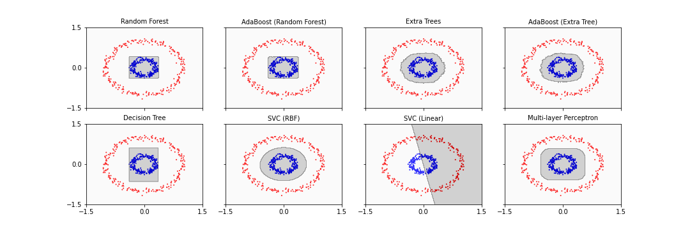

[**Download Chapter notebook (ipynb)**](https://drive.usercontent.google.com/u/1/uc?id=1Gib2BeOLzIb6dgVMQQuPqw8nLA8Ti0SX&export=download)

[**Download Chapter PDF**](https://drive.usercontent.google.com/u/1/uc?id=16tDnxEFO77t0UusDStdhXdnm9duuMCOP&export=download)

[<span style="color: rgb(255, 0, 0);">**Mandatory Lesson Feedback Survey**</span>](https://docs.google.com/forms/d/e/1FAIpQLSdr0capF7jloJhPH3Pki1B3LZoKOG16poOpuVJ7SL2LkwLHQA/viewform?pli=1)


:::::::::::::::::::::::::::::::::::::: discussion

- How to deal with complex classification problems?
- Why is it important to use different classification algorithms?
- What is the best way to find the optimal classifier?
- How can we avoid over-fitting of data?
- How do we evaluate the performance of classifiers?

:::::::::::::::::::::::::::::::::::::::::::::::::

::::::::::::::::::::::::::::::::::::: objectives

- Understanding complex training and testing data.
- Comparison of different model classes.
- Explaining the stratified shuffle split.
- Evaluation of classification - the ROC and AUC curves.


::::::::::::::::::::::::::::::::::::::::::::::::


<p align = "center">
<iframe width="560" height="315" src="https://www.youtube.com/embed/LH3cUN7WXlg" title="YouTube video player" frameborder="0" allow="accelerometer; autoplay; clipboard-write; encrypted-media; gyroscope; picture-in-picture" allowfullscreen></iframe>
</p>
<br>
<p align = "center">
<iframe width="560" height="315" src="https://www.youtube.com/embed/GvUvwHmTXUs" title="YouTube video player" frameborder="0" allow="accelerometer; autoplay; clipboard-write; encrypted-media; gyroscope; picture-in-picture" allowfullscreen></iframe>
</p>
<br>
<p align = "center">
<iframe width="560" height="315" src="https://www.youtube.com/embed/xjpQRhtY1l0" title="YouTube video player" frameborder="0" allow="accelerometer; autoplay; clipboard-write; encrypted-media; gyroscope; picture-in-picture" allowfullscreen></iframe>
</p>
<br>
<p align = "center">
<iframe width="560" height="315" src="https://www.youtube.com/embed/nEyt1Ht8GOk" title="YouTube video player" frameborder="0" allow="accelerometer; autoplay; clipboard-write; encrypted-media; gyroscope; picture-in-picture" allowfullscreen></iframe>
</p>
<br>

:::::::::::::::: callout

## Remarks
1. From now on the code will become more complex. When copied, the code should run without errors with the given data sets. (Please report any errors thrown when running the code without modifications).

2. Make a copy of the notebook and start experimenting by modifying part of the code and comparing the outcome. Modifying existing code is one of the successful strategies when learning to programme as a non-programmer.

3. The first resource to consult when facing bugs are the official documentations, be it Python, Numpy, SciKit Learn or other.

4. If you formulate a problem adequately, often there may be good answers on [Stack Overflow](https://stackoverflow.com).

5. Sometimes, simply copying and pasting an error message into the search engine can point you to the solution.

::::::::::::::::

### **Import functions**

``` python

from numpy import mgrid, linspace, c_, arange, mean, array
from numpy.random import uniform, seed

from mpl_toolkits import mplot3d
from matplotlib.pyplot import subplots, axes, scatter, xticks, show

from sklearn.datasets import make_circles
```

:::::::::::::::::::::::::::::::: challenge
## Challenge
<p style='text-align: justify;'>
We would like to test several machine learning models' ability to deal with a complicated task. A complicated task is one where the topology of the labelled data is not trivially separable into classes by (hyper)planes, e.g. by a straight line in a scatter plot.
</p>

Our example is one class of data organised in a doughnut shape and the other class contained within the first doughnut forming a doughnut-within-a-doughnut.

Here is the function code to create these data, followed by a function call to produce a figure.


``` python
def make_torus_3D(n_samples=100, shuffle=True, noise=None, random_state=None,
                 factor=.8):
    """Make a large torus containing a smaller torus in 3-D.

    A toy dataset to visualise clustering and classification
    algorithms.

    Read more in the User Guide.

    Parameters
    ----------
    n_samples : int, optional (default=100)
        The total number of points generated. If odd, the inner circle will
        have one point more than the outer circle.

    shuffle : bool, optional (default=True)
        Whether to shuffle the samples.

    noise : double or None (default=None)
        Standard deviation of Gaussian noise added to the data.

    random_state : int, RandomState instance or None (default)
        Determines random number generation for dataset shuffling and noise.
        Pass an int for reproducible output across multiple function calls.
        See :term:`Glossary <random_state>`.

    factor : 0 < double < 1 (default=.8)
        Scale factor between inner and outer circle.

    Returns
    -------
    X : array of shape [n_samples, 2]
        The generated samples.

    y : array of shape [n_samples]
        The integer labels (0 or 1) for class membership of each sample.
    """
    from numpy import pi, linspace, cos, sin, append, ones, zeros, hstack, vstack, intp
    from sklearn.utils import check_random_state, shuffle

    if factor >= 1 or factor < 0:
        raise ValueError("'factor' has to be between 0 and 1.")
    
    # Determine the number of samples for each torus.
    n_samples_out = n_samples // 2
    n_samples_in = n_samples - n_samples_out
    
    # Define the radii and thickness of the outer and inner tori.
    co, ao, ci, ai = 3, 1, 3.6, 0.2
    
    # Initialize the random number generator.
    generator = check_random_state(random_state)
    
    # to not have the first point = last point, we set endpoint=False.
    linspace_out = linspace(0, 2 * pi, n_samples_out, endpoint=False)
    linspace_in  = linspace(0, 2 * pi, n_samples_in,  endpoint=False)
    
    # Compute 3D coordinates for the outer torus.
    outer_circ_x = (co+ao*cos(linspace_out)) * cos(linspace_out*61.1)
    outer_circ_y = (co+ao*cos(linspace_out)) * sin(linspace_out*61.1)
    outer_circ_z =    ao*sin(linspace_out)
    
    # Compute 3D coordinates for the inner torus (scaled by `factor`).
    inner_circ_x = (ci+ai*cos(linspace_in)) * cos(linspace_in*61.1)* factor
    inner_circ_y = (ci+ai*cos(linspace_in)) * sin(linspace_in*61.1) * factor
    inner_circ_z =    ai*sin(linspace_in) * factor

    # Stack the coordinates into a single array (X: [n_samples, 3]).
    X = vstack([append(outer_circ_x, inner_circ_x),
                append(outer_circ_y, inner_circ_y),
                append(outer_circ_z, inner_circ_z)]).T

    # Generate class labels: 0 for outer torus, 1 for inner torus.
    y = hstack([zeros(n_samples_out, dtype=intp),
                   ones(n_samples_in, dtype=intp)])

    # If specified, shuffle the dataset.
    if shuffle:
        X, y = shuffle(X, y, random_state=generator)

    # Add Gaussian noise if specified.
    if noise is not None:
        X += generator.normal(scale=noise, size=X.shape)

    return X, y
```


``` python
# Set a fixed random seed for reproducibility
RANDOM_STATE  = 12345
seed(RANDOM_STATE)

# Generate a 3D torus dataset with 2000 samples
X, y = make_torus_3D(n_samples=2000, factor=.9, noise=.001, random_state=RANDOM_STATE)

# Select feature indices for 3D visualization
feature_1, feature_2, feature_3 = 0, 1, 2

# Get the minimum and maximum values of X for scaling (not used later)
ft_min, ft_max = X.min(), X.max()

# Create a new figure and axis for 3D plotting
fig, ax = subplots(figsize=(12, 9))

# Set up 3D axes for visualization
ax = axes(projection="3d")

# Create a 3D scatter plot
im = ax.scatter3D(X[:, feature_1], X[:, feature_2], X[:, feature_3], marker='o', s=20, c=y, cmap='bwr');

# Set axis labels
ax.set_xlabel('Feature 1')
ax.set_ylabel('Feature 2')
ax.set_zlabel('Feature 3')

# Angles to pick the perspective
ax.view_init(30, 50);

show()
```


<p style='text-align: justify;'>
The challenge here is that the only way to separate the data of the two labels from each other is to find a separating border that lies between the blue and the red doughnut (mathematically: torus) and itself is a torus, i.e. a complex topology. Similarly, one can test to separate one class of data that lie on the surface of a sphere and then have data on another sphere embedded within it. Typically, it is unknown what type of high-dimensional topologies is present in biological data. As such it is not clear at the outset which classification strategy will work best. Let us start with a simpler example.
</p>


::::::::::::::::::::::::::::::::

## Training a variety of machine learning models

`scikit-learn` provides the means to generate practice datasets with specific qualities. In this section, we will use the `make_circles` function - a function that generates a toy dataset which consists of two concentric circles (see the function's [documentation.](https://scikit-learn.org/stable/modules/generated/sklearn.datasets.make_circles.html)) for more information:

### **Circular Test Data**


``` python
# Set random seed for reproducibility.
RANDOM_STATE  = 1234
seed(RANDOM_STATE)

# Generates synthetic circular data: 'n_samples' sets the total number of datapoints to 500.
# 'factor' controls the inner circle to be 30% of the radius of the outer circle.
# 'noise' adds a very small amount of Gaussian noise.
X, y = make_circles(n_samples=500, factor=0.3, noise=.05, random_state=RANDOM_STATE)

# This obtains the overall maximum and minimum feature values:
feature_1, feature_2 = 0, 1
ft_min, ft_max = X.min(), X.max()

print('Shape of X:', X.shape)
```

``` output
Shape of X: (500, 2)
```

``` python
# Plotting:
fig, ax = subplots(figsize=(10, 5), nrows=1, ncols=2)
ax[0].scatter(X[:, feature_1], X[:, feature_2], c=y, s=4, cmap='bwr');
ax[1].hist(X);

show()
```


<p style='text-align: justify;'>
The function yields only two features. The reason is that with two features we can visualise the complete state space in a two-dimensional scatter plot. The data of both labels are organised along a ring. There is a certain amount of randomness added to create data distributed normally around the ring.
</p>
<p style='text-align: justify;'>
The tricky thing about such a data distribution is that in a standard view of the data, the histogram, the clear state space organisation is not visible. There are e.g. no two distinct mean values of the distributions. Also, while the two features are clearly dependent on each other (as seen in the scatter plot), it is not possible to regress one with the other by means of fits of the type y = f(x).
</p>

We will now use different classes of machine learning models to fit to these labelled data.


### **Classification Algorithms**

Different classification algorithms approach problems differently. Let us name the algorithms in `scikit-learn`.

`scikit-learn` provides the following algorithms for classification problems. Each listed classifier is hyperlinked to its relevant scikit-learn Documentation page.

- Ensemble: Averaging:
    - [Random Forest](https://scikit-learn.org/stable/modules/generated/sklearn.ensemble.RandomForestClassifier.html)
    - [Extra Tree](https://scikit-learn.org/stable/modules/generated/sklearn.ensemble.ExtraTreesClassifier.html)
    - [Isolation Forest](https://scikit-learn.org/stable/modules/generated/sklearn.ensemble.IsolationForest.html)
    - [Bagging](https://scikit-learn.org/stable/modules/generated/sklearn.ensemble.BaggingClassifier.html)
    - [Voting](https://scikit-learn.org/stable/modules/generated/sklearn.ensemble.VotingClassifier.html)

- Boosting:
    - [Gradient Boosting](https://scikit-learn.org/stable/modules/generated/sklearn.ensemble.GradientBoostingClassifier.html)
    - [AdaBoost](https://scikit-learn.org/stable/modules/generated/sklearn.ensemble.AdaBoostClassifier.html)

- Decision Trees:
    - [Decision Tree](https://scikit-learn.org/stable/modules/generated/sklearn.tree.DecisionTreeClassifier.html)
    - [Extra Tree](https://scikit-learn.org/stable/modules/generated/sklearn.tree.ExtraTreeClassifier.html)

- Nearest Neighbour:
    - [K Nearest Neighbour](https://scikit-learn.org/stable/modules/generated/sklearn.neighbors.KNeighborsClassifier.html)
    - [Radius Neighbours](https://scikit-learn.org/stable/modules/generated/sklearn.neighbors.RadiusNeighborsClassifier.html)
    - [Nearest Centroid](https://scikit-learn.org/stable/modules/generated/sklearn.neighbors.NearestCentroid.html)

- Support Vector Machine:
    - with non-linear kernel:
        - [Radial Basis Function (RBF)](https://scikit-learn.org/stable/modules/svm.html#svm-kernels)
        - [Polynomial](https://scikit-learn.org/stable/modules/svm.html#svm-kernels)
        - [Sigmoid](https://scikit-learn.org/stable/modules/svm.html#svm-kernels)
    - with linear kernel:
        - [Linear kernel](https://scikit-learn.org/stable/modules/svm.html#svm-kernels)
    - parametrised with non-linear kernel:
        - [Nu-Support Vector Classification](https://scikit-learn.org/stable/modules/generated/sklearn.svm.NuSVC.html)

- Neural Networks:
    - [Multi-layer Perceptron](https://scikit-learn.org/stable/modules/generated/sklearn.neural_network.MLPClassifier.html)
    - Gaussian:
        - [Gaussian Process](https://scikit-learn.org/stable/modules/generated/sklearn.gaussian_process.GaussianProcessClassifier.html)
    - Linear Models:
        - [Logistic Regression](https://scikit-learn.org/stable/modules/generated/sklearn.linear_model.LogisticRegression.html)
        - [Passive Aggressive](https://scikit-learn.org/stable/modules/generated/sklearn.linear_model.PassiveAggressiveClassifier.html)
        - [Ridge](https://scikit-learn.org/stable/modules/generated/sklearn.linear_model.RidgeClassifier.html)
        - [Linear classifiers with Stochastic Gradient Descent](https://scikit-learn.org/stable/modules/generated/sklearn.linear_model.SGDClassifier.html)

- Baysian:
    - [Bernoulli](https://scikit-learn.org/stable/modules/generated/sklearn.naive_bayes.BernoulliNB.html)
    - [Multinomial](https://scikit-learn.org/stable/modules/generated/sklearn.naive_bayes.MultinomialNB.html)
    - [Complement](https://scikit-learn.org/stable/modules/generated/sklearn.naive_bayes.ComplementNB.html)

Some of these algorithms require a more in-depth understanding of how they work. To that end, we only review the performance of those that are easier to implement and adjust.

__AdaBoost__
<p style='text-align: justify;'>
The AdaBoost algorithm is special in that it does not work on its own; instead, it complements another ensemble algorithm (e.g. Random Forest) and _boosts_ its performance by weighing the training data through a boosting algorithm. Note that boosting the performance does not necessarily translate into a better fit. This is because boosting algorithms are generally robust against over-fitting, meaning that they always try to produce generalisable models.
</p>

__Seeding__
<p style='text-align: justify;'>
Most machine learning algorithms rely on random number generation to produce results. Therefore, one simple, but important adjustment is to `seed` the number generator, and thereby making our comparisons more consistent; i.e. ensure that all models use the same set of random numbers. Almost all scikit-learn models take an argument called `random_state`, which takes an integer number to seed the random number generator.
</p>

### **Training and Testing**

Here is code to import a number of classifiers from scikit-learn, fit them to the training data and predict the (complete) state space. The result is plotted below.


``` python
from sklearn.ensemble import RandomForestClassifier, ExtraTreesClassifier, GradientBoostingClassifier, AdaBoostClassifier
from sklearn.tree import DecisionTreeClassifier
from sklearn.svm import SVC, LinearSVC
from sklearn.neural_network import MLPClassifier
from sklearn.neighbors import KNeighborsClassifier

classifiers = {
    'Random Forest': RandomForestClassifier(random_state=RANDOM_STATE),
    'AdaBoost (Random Forest)': AdaBoostClassifier(RandomForestClassifier(random_state=RANDOM_STATE)),
    'Extra Trees': ExtraTreesClassifier(random_state=RANDOM_STATE),
    'AdaBoost (Extra Tree)': AdaBoostClassifier(ExtraTreesClassifier(random_state=RANDOM_STATE)),
    'Decision Tree': DecisionTreeClassifier(random_state=RANDOM_STATE),
    'SVC (RBF)': SVC(random_state=RANDOM_STATE),
    'SVC (Linear)': LinearSVC(random_state=RANDOM_STATE),
    'Multi-layer Perceptron': MLPClassifier(max_iter=5000, random_state=RANDOM_STATE)
}
```


``` python
ft_min, ft_max = -1.5, 1.5

# Constructing (2 grids x 300 rows x 300 cols):
grid_1, grid_2 = mgrid[ft_min:ft_max:.01, ft_min:ft_max:.01]

# We need only the shape for one of the grids (i.e. 300 x  300):
grid_shape = grid_1.shape

# state space grid for testing
new_obs = c_[grid_1.ravel(), grid_2.ravel()]
```


``` python
contour_levels = linspace(0, 1, 6)

fig, all_axes = subplots(figsize=[15, 5], ncols=4, nrows=2, sharey=True, sharex=True)

for ax, (name, clf) in zip(all_axes.ravel(), classifiers.items()):
    clf.fit(X, y)
    y_pred = clf.predict(new_obs)
    y_pred_grid = y_pred.reshape(grid_shape)

    ax.scatter(X[:, feature_1], X[:, feature_2], c=y, s=1, cmap='bwr_r')
    ax.contourf(grid_1, grid_2, y_pred_grid, cmap='gray_r', alpha=.2, levels=contour_levels)
    ax.set_ylim(ft_min, ft_max)
    ax.set_xlim(ft_min, ft_max)
    ax.set_yticks([-1.5, 0, 1.5])
    ax.set_xticks([-1.5, 0, 1.5])
    ax.set_title(name, fontsize=10);

show()
```



<p style='text-align: justify;'>
Seven of the eight classifiers were able to separate the inner data set from the outer data set successfully. The main difference is that some algorithms ended up with a more rectangular shape of the boundary whereas the others found a more circular form which reflects the original data distribution more closely. One classifier simply fails: the support vector classifier (SVC) with linear basis functions: it tries to fit a straight line to separate the classes which in this case is impossible.
</p>

### **The Train-Test Split**
<p style='text-align: justify;'>
We will now modify our workflow to avoid the need to create separate testing data (the typical situation when dealing with recorded data). For this we start with a data set of n labelled samples. Of these n samples, a certain percentage is used for training (using the provided labels) and the rest for testing (withholding the labels). The testing data then do not need to be prepared separately.
</p>
<p style='text-align: justify;'>
The function we use is `train_test_split` from SciKit Learn. A nice feature of this function is that it tries to preserve the ratio of labels in the split. E.g. if the data contain 70% of `True` and 30 % of `False` labels, the algorithm tries to preserve this ratio in the split as good as possible: around 70% of the training data and of the testing data will have the `True` label.
</p>


``` python
from sklearn.model_selection import train_test_split

X, y = make_circles(n_samples=1000, factor=0.3, noise=.05, random_state=RANDOM_STATE)

X_train, X_test, y_train, y_test = train_test_split(X, y, test_size=.3, random_state=RANDOM_STATE, shuffle=True)

print(X_train.shape, X_test.shape)
```

``` output
(700, 2) (300, 2)
```

<p style='text-align: justify;'>
Here is an illustration of the two sets of data. The splitting into testing and training data is done randomly. Picking test data randomly is particularly important for real data as it helps to reduce potential bias in the recording order.
</p>


``` python
fig, ax = subplots(figsize=(7, 6), ncols=2, nrows=2, sharex=True)

ax[0, 0].scatter(X_train[:, feature_1], X_train[:, feature_2], c=y_train, s=4, cmap='bwr')
ax[0, 1].scatter(X_test[:, feature_1], X_test[:, feature_2], c=y_test, s=4, cmap='bwr')

ax[1, 0].hist(X_train)
ax[1, 1].hist(X_test)

ax[0, 0].set_title('Training data')
ax[0, 1].set_title('Test data')

ax[0, 0].set_ylim(ft_min, ft_max)
ax[0, 1].set_ylim(ft_min, ft_max)

ax[1, 0].set_ylim(0, 100)
ax[1, 1].set_ylim(0, 100);

show()
```


Now we can repeat the training with this split dataset using eight types of models as above.
<p style='text-align: justify;'>
To compare the model performances, we use __scoring__: the method `.score` takes as input arguments the testing samples and their true labels. It then uses the model predictions to calculate the fraction of labels in the testing data that were predicted correctly.
</p>
<p style='text-align: justify;'>
There are different techniques to evaluate the performance, but the `.score`  method provides a quick, simple, and handy way to assess a model. As far as classification algorithms in scikit-learn are concerned, the method usually produces the __mean accuracy__, which is between 0 and 1; and the higher the score, the better the fit.
</p>


``` python
fig, all_axes = subplots(figsize=[15, 5], ncols=4, nrows=2, sharey=True, sharex=True)

for ax, (name, clf) in zip(all_axes.ravel(), classifiers.items()):
    # Training the model using training data:
    clf.fit(X_train, y_train)

    y_pred = clf.predict(new_obs)
    y_pred_grid = y_pred.reshape(grid_shape)

    # Evaluating the score using test data:
    score = clf.score(X_test, y_test)

    # Scattering the test data only:
    ax.scatter(X_test[:, feature_1], X_test[:, feature_2], c=y_test, s=4, cmap='bwr', marker='.')

    ax.contourf(grid_1, grid_2, y_pred_grid, cmap='gray_r', alpha=.2, levels=contour_levels)
#    ax.contourf(grid[0], grid[1], y_pred_grid, cmap='gray_r', alpha=.2, levels=contour_levels)

    ax.set_ylim(ft_min, ft_max)
    ax.set_xlim(ft_min, ft_max)
    ax.set_yticks([-1.5, 0, 1.5])
    ax.set_xticks([-1.5, 0, 1.5])

    label = '{} - Score: {:.2f}'.format(name, score)
    ax.set_title(label , fontsize=10);

show()
```


<p style='text-align: justify;'>
Here, we only plotted the test data, those that were classified based on the trained model. The gray area shows the result of the classification: within the gray area the prediction is 1 (the red samples) and outside it is 0 (the blue samples). The result is that testing data are classified correctly in all but one of the classifiers, so their performance is 1, or 100 %. This is excellent because it demonstrates that most classifiers are able to deal with embedded topologies.
</p>

Let us now repeat the procedure with a higher level of noise to make the task more complicated.


``` python
X, y = make_circles(n_samples=1000, factor=.5, noise=.3, random_state=RANDOM_STATE)

X_train, X_test, y_train, y_test = train_test_split(X, y, test_size=.3, random_state=RANDOM_STATE, shuffle=True)

fig, ax = subplots(figsize=(7, 6), ncols=2, nrows=2, sharex=True)

ax[0, 0].scatter(X_train[:, feature_1], X_train[:, feature_2], c=y_train, s=4, cmap='bwr')
ax[0, 1].scatter(X_test[:, feature_1], X_test[:, feature_2], c=y_test, s=4, cmap='bwr')


ax[1, 0].hist(X_train)

ax[1, 1].hist(X_test)

ax[0, 0].set_title('Training data')
ax[0, 1].set_title('Test data')

ax[0, 0].set_ylim(-3, 3)
ax[0, 1].set_ylim(-3, 3)

ax[1, 0].set_ylim(0, 200)
ax[1, 1].set_ylim(0, 200);

show()
```


``` python
fig, all_axes = subplots(figsize=[15, 5], ncols=4, nrows=2, sharey=True, sharex=True)

for ax, (name, clf) in zip(all_axes.ravel(), classifiers.items()):
    # Training the model using training data:
    clf.fit(X_train, y_train)

    y_pred = clf.predict(new_obs)
    y_pred_grid = y_pred.reshape(grid_shape)

    # Evaluating the score using test data:
    score = clf.score(X_test, y_test)

    # Scattering the test data only:
    ax.scatter(X_test[:, feature_1], X_test[:, feature_2], c=y_test, s=4, cmap='bwr', marker='.')

    ax.contourf(grid_1, grid_2, y_pred_grid, cmap='gray_r', alpha=.2, levels=contour_levels)

    ax.set_ylim(ft_min, ft_max)
    ax.set_xlim(ft_min, ft_max)
    ax.set_yticks([-1.5, 0, 1.5])
    ax.set_xticks([-1.5, 0, 1.5])

    label = '{} - Score: {:.2f}'.format(name, score)
    ax.set_title(label , fontsize=10);

show()
```


<p style='text-align: justify;'>
Now the data are mixed in the plane and there is no simple way to separate the two classes.
We can see in the plots how the algorithms try to cope with their different strategies. One thing that is immediately obvious is that the fitting patterns are different. Particularly, we can see the fragmented outcome of the _decision tree_ classifier and the smooth elliptic area found by the _support vector classifier (SVC)_ with radial basis functions (RBF) and the neural network (MLP). On a closer look, you may also notice that with ensemble methods in the upper row, the patterns are somewhat disorganised. This is due to the way ensemble methods work: they sample the data randomly and then class them into different categories based on their labels.
</p>
<p style='text-align: justify;'>
If the prediction was made by chance (throwing a dice), one would expect a 50 % score. Thus, the example also shows that the performance depends on the type of problem and that this testing helps to find an optimal classifier.
</p>

::::::::::::::::::::: callout
## **Never expose the test data**
<p style='text-align: justify;'>
Testing a model on data that is used in training is a methodological mistake. It is therefore vital that the test data is **never, ever** used for training a model at any stage. This is one of the most fundamental principles of machine learning, and its importance cannot be exaggerated. There are numerous examples of people making this mistake one way or another, especially where multiple classification algorithms are used to address a problem.
</p>

:::::::::::::::::::::

## The Stratified Shuffle Split
<p style='text-align: justify;'>
One potential bias arises when we try to improve the performance of our models through the change of the so-called __hyperparameters__ (instead of using the default parameters as we did so far). We will always receive the optimal output given __the specific test data chosen__. This may lead to overfitting the model on the chosen training and testing data. This can be avoided by choosing different splits into testing and training data and repeating the fit procedure. Doing different splits while preserving the fraction of labels of each class in the original data, the method is called the __stratified shuffle split__.
</p>
<p style='text-align: justify;'>
We first need to import and instantiate the splitter. We set key word argument `n_splits` to determine the number of different splits. `test_size` lets us determine what fraction of samples is used for the testing data.
</p>


``` python
from sklearn.model_selection import StratifiedShuffleSplit

sss = StratifiedShuffleSplit(random_state=RANDOM_STATE, n_splits=10, test_size=0.3)
```

Let us look at the different splits obtained:


``` python
fig, ax = subplots(figsize=[10, 5])

n_splits = sss.n_splits
split_data_indices = sss.split(X=X, y=y)

for index, (tr, tt) in enumerate(split_data_indices):
    indices = X[:, feature_1].copy()
    indices[tt] = 1
    indices[tr] = 0

    # Visualize the results
    x_axis = arange(indices.size)
    y_axis = [index + .5] * indices.size
    ax.scatter(x_axis, y_axis, c=indices, marker='_', lw=10, cmap='coolwarm', vmin=-.2, vmax=1.2)

# Plot the data classes and groups at the end
class_y = [index + 1.5] * indices.size
ax.scatter(x_axis, class_y, c=y, marker='_', lw=10, cmap='coolwarm')

# Formatting
ylabels = list(range(n_splits))
ylabels.extend(['Data'])

ax.set_yticks(arange(n_splits + 1) + .5)
ax.set_yticklabels(ylabels)
ax.set_xlabel('Sample index')
ax.set_ylabel('SSS iteration');

show()
```


<p style='text-align: justify;'>
By choosing n_splits=10, we obtained ten different splits that have similarly distributed train and test data subsets from the original data. The fraction of the data set aside for testing is 30 %. The different splits cover the whole data set evenly. As such, using them for training and testing will lead to a fairly unbiased average performance.
</p>

Let us look at the data in state space to check that the classification task is now a real challenge.


``` python
fig, ax = subplots(figsize=(8, 8))

for train_index, test_index in sss.split(X, y):
    ax.scatter(X[train_index, 0], X[train_index, 1], c=y[train_index], cmap='Set1', s=30, marker='^', alpha=.5)
    ax.scatter(X[test_index, 0], X[test_index, 1], c=y[test_index], cmap='cool', s=30, alpha=.5, marker='*', label='Test');

show()
```


These are the scatter plots of the training (magenta) and testing (blue) data. Here are their distributions:


``` python
fig, ax = subplots(figsize=(8, 8))

for train_index, test_index in sss.split(X, y):
    ax.hist(X[train_index], color=['magenta', 'red'], alpha=.5, histtype='step')
    ax.hist(X[test_index], color=['cyan', 'blue'], alpha=.4, histtype='step');

show()
```


<p style='text-align: justify;'>
The distributions differ in height because less data are in the testing test. Otherwise they are similarly centred and spread. Using a number of realisations (instead of just one) we expect to obtain a more accurate and robust result of the training.
</p>
<p style='text-align: justify;'>
We now train our classifiers on these different splits and obtain the respective scores. They will give a robust measure of the classifier's performance given the data and avoid potential bias due to the selection of specific test data.
</p>


``` python
X, y = make_circles(n_samples=1000, factor=.3, noise=.4, random_state=RANDOM_STATE)

score = list()

for train_index, test_index in sss.split(X, y):
    X_s, y_s = X[train_index, :], y[train_index]
    new_obs_s, y_test_s = X[test_index, :], y[test_index]

    score_clf = list()

    for name, clf in classifiers.items():

        clf.fit(X_s, y_s)
        y_pred = clf.predict(new_obs_s)
        score_clf.append(clf.score(new_obs_s, y_test_s))

    score.append(score_clf)

score_mean = mean(score, axis=0)

bins = arange(len(score_mean))

fig, ax = subplots()

ax.bar(bins, score_mean);
ax.set_xticks(arange(0,8)+0.4)
ax.set_xticklabels(classifiers.keys(), rotation=-70);

show()

print(classifiers.keys())
print('Average scores: ')
print(["{0:0.2f}".format(ind) for ind in score_mean])
```

```{=html}
<style>#sk-container-id-1 {
  /* Definition of color scheme common for light and dark mode */
  --sklearn-color-text: #000;
  --sklearn-color-text-muted: #666;
  --sklearn-color-line: gray;
  /* Definition of color scheme for unfitted estimators */
  --sklearn-color-unfitted-level-0: #fff5e6;
  --sklearn-color-unfitted-level-1: #f6e4d2;
  --sklearn-color-unfitted-level-2: #ffe0b3;
  --sklearn-color-unfitted-level-3: chocolate;
  /* Definition of color scheme for fitted estimators */
  --sklearn-color-fitted-level-0: #f0f8ff;
  --sklearn-color-fitted-level-1: #d4ebff;
  --sklearn-color-fitted-level-2: #b3dbfd;
  --sklearn-color-fitted-level-3: cornflowerblue;

  /* Specific color for light theme */
  --sklearn-color-text-on-default-background: var(--sg-text-color, var(--theme-code-foreground, var(--jp-content-font-color1, black)));
  --sklearn-color-background: var(--sg-background-color, var(--theme-background, var(--jp-layout-color0, white)));
  --sklearn-color-border-box: var(--sg-text-color, var(--theme-code-foreground, var(--jp-content-font-color1, black)));
  --sklearn-color-icon: #696969;

  @media (prefers-color-scheme: dark) {
    /* Redefinition of color scheme for dark theme */
    --sklearn-color-text-on-default-background: var(--sg-text-color, var(--theme-code-foreground, var(--jp-content-font-color1, white)));
    --sklearn-color-background: var(--sg-background-color, var(--theme-background, var(--jp-layout-color0, #111)));
    --sklearn-color-border-box: var(--sg-text-color, var(--theme-code-foreground, var(--jp-content-font-color1, white)));
    --sklearn-color-icon: #878787;
  }
}

#sk-container-id-1 {
  color: var(--sklearn-color-text);
}

#sk-container-id-1 pre {
  padding: 0;
}

#sk-container-id-1 input.sk-hidden--visually {
  border: 0;
  clip: rect(1px 1px 1px 1px);
  clip: rect(1px, 1px, 1px, 1px);
  height: 1px;
  margin: -1px;
  overflow: hidden;
  padding: 0;
  position: absolute;
  width: 1px;
}

#sk-container-id-1 div.sk-dashed-wrapped {
  border: 1px dashed var(--sklearn-color-line);
  margin: 0 0.4em 0.5em 0.4em;
  box-sizing: border-box;
  padding-bottom: 0.4em;
  background-color: var(--sklearn-color-background);
}

#sk-container-id-1 div.sk-container {
  /* jupyter's `normalize.less` sets `[hidden] { display: none; }`
     but bootstrap.min.css set `[hidden] { display: none !important; }`
     so we also need the `!important` here to be able to override the
     default hidden behavior on the sphinx rendered scikit-learn.org.
     See: https://github.com/scikit-learn/scikit-learn/issues/21755 */
  display: inline-block !important;
  position: relative;
}

#sk-container-id-1 div.sk-text-repr-fallback {
  display: none;
}

div.sk-parallel-item,
div.sk-serial,
div.sk-item {
  /* draw centered vertical line to link estimators */
  background-image: linear-gradient(var(--sklearn-color-text-on-default-background), var(--sklearn-color-text-on-default-background));
  background-size: 2px 100%;
  background-repeat: no-repeat;
  background-position: center center;
}

/* Parallel-specific style estimator block */

#sk-container-id-1 div.sk-parallel-item::after {
  content: "";
  width: 100%;
  border-bottom: 2px solid var(--sklearn-color-text-on-default-background);
  flex-grow: 1;
}

#sk-container-id-1 div.sk-parallel {
  display: flex;
  align-items: stretch;
  justify-content: center;
  background-color: var(--sklearn-color-background);
  position: relative;
}

#sk-container-id-1 div.sk-parallel-item {
  display: flex;
  flex-direction: column;
}

#sk-container-id-1 div.sk-parallel-item:first-child::after {
  align-self: flex-end;
  width: 50%;
}

#sk-container-id-1 div.sk-parallel-item:last-child::after {
  align-self: flex-start;
  width: 50%;
}

#sk-container-id-1 div.sk-parallel-item:only-child::after {
  width: 0;
}

/* Serial-specific style estimator block */

#sk-container-id-1 div.sk-serial {
  display: flex;
  flex-direction: column;
  align-items: center;
  background-color: var(--sklearn-color-background);
  padding-right: 1em;
  padding-left: 1em;
}


/* Toggleable style: style used for estimator/Pipeline/ColumnTransformer box that is
clickable and can be expanded/collapsed.
- Pipeline and ColumnTransformer use this feature and define the default style
- Estimators will overwrite some part of the style using the `sk-estimator` class
*/

/* Pipeline and ColumnTransformer style (default) */

#sk-container-id-1 div.sk-toggleable {
  /* Default theme specific background. It is overwritten whether we have a
  specific estimator or a Pipeline/ColumnTransformer */
  background-color: var(--sklearn-color-background);
}

/* Toggleable label */
#sk-container-id-1 label.sk-toggleable__label {
  cursor: pointer;
  display: flex;
  width: 100%;
  margin-bottom: 0;
  padding: 0.5em;
  box-sizing: border-box;
  text-align: center;
  align-items: start;
  justify-content: space-between;
  gap: 0.5em;
}

#sk-container-id-1 label.sk-toggleable__label .caption {
  font-size: 0.6rem;
  font-weight: lighter;
  color: var(--sklearn-color-text-muted);
}

#sk-container-id-1 label.sk-toggleable__label-arrow:before {
  /* Arrow on the left of the label */
  content: "▸";
  float: left;
  margin-right: 0.25em;
  color: var(--sklearn-color-icon);
}

#sk-container-id-1 label.sk-toggleable__label-arrow:hover:before {
  color: var(--sklearn-color-text);
}

/* Toggleable content - dropdown */

#sk-container-id-1 div.sk-toggleable__content {
  max-height: 0;
  max-width: 0;
  overflow: hidden;
  text-align: left;
  /* unfitted */
  background-color: var(--sklearn-color-unfitted-level-0);
}

#sk-container-id-1 div.sk-toggleable__content.fitted {
  /* fitted */
  background-color: var(--sklearn-color-fitted-level-0);
}

#sk-container-id-1 div.sk-toggleable__content pre {
  margin: 0.2em;
  border-radius: 0.25em;
  color: var(--sklearn-color-text);
  /* unfitted */
  background-color: var(--sklearn-color-unfitted-level-0);
}

#sk-container-id-1 div.sk-toggleable__content.fitted pre {
  /* unfitted */
  background-color: var(--sklearn-color-fitted-level-0);
}

#sk-container-id-1 input.sk-toggleable__control:checked~div.sk-toggleable__content {
  /* Expand drop-down */
  max-height: 200px;
  max-width: 100%;
  overflow: auto;
}

#sk-container-id-1 input.sk-toggleable__control:checked~label.sk-toggleable__label-arrow:before {
  content: "▾";
}

/* Pipeline/ColumnTransformer-specific style */

#sk-container-id-1 div.sk-label input.sk-toggleable__control:checked~label.sk-toggleable__label {
  color: var(--sklearn-color-text);
  background-color: var(--sklearn-color-unfitted-level-2);
}

#sk-container-id-1 div.sk-label.fitted input.sk-toggleable__control:checked~label.sk-toggleable__label {
  background-color: var(--sklearn-color-fitted-level-2);
}

/* Estimator-specific style */

/* Colorize estimator box */
#sk-container-id-1 div.sk-estimator input.sk-toggleable__control:checked~label.sk-toggleable__label {
  /* unfitted */
  background-color: var(--sklearn-color-unfitted-level-2);
}

#sk-container-id-1 div.sk-estimator.fitted input.sk-toggleable__control:checked~label.sk-toggleable__label {
  /* fitted */
  background-color: var(--sklearn-color-fitted-level-2);
}

#sk-container-id-1 div.sk-label label.sk-toggleable__label,
#sk-container-id-1 div.sk-label label {
  /* The background is the default theme color */
  color: var(--sklearn-color-text-on-default-background);
}

/* On hover, darken the color of the background */
#sk-container-id-1 div.sk-label:hover label.sk-toggleable__label {
  color: var(--sklearn-color-text);
  background-color: var(--sklearn-color-unfitted-level-2);
}

/* Label box, darken color on hover, fitted */
#sk-container-id-1 div.sk-label.fitted:hover label.sk-toggleable__label.fitted {
  color: var(--sklearn-color-text);
  background-color: var(--sklearn-color-fitted-level-2);
}

/* Estimator label */

#sk-container-id-1 div.sk-label label {
  font-family: monospace;
  font-weight: bold;
  display: inline-block;
  line-height: 1.2em;
}

#sk-container-id-1 div.sk-label-container {
  text-align: center;
}

/* Estimator-specific */
#sk-container-id-1 div.sk-estimator {
  font-family: monospace;
  border: 1px dotted var(--sklearn-color-border-box);
  border-radius: 0.25em;
  box-sizing: border-box;
  margin-bottom: 0.5em;
  /* unfitted */
  background-color: var(--sklearn-color-unfitted-level-0);
}

#sk-container-id-1 div.sk-estimator.fitted {
  /* fitted */
  background-color: var(--sklearn-color-fitted-level-0);
}

/* on hover */
#sk-container-id-1 div.sk-estimator:hover {
  /* unfitted */
  background-color: var(--sklearn-color-unfitted-level-2);
}

#sk-container-id-1 div.sk-estimator.fitted:hover {
  /* fitted */
  background-color: var(--sklearn-color-fitted-level-2);
}

/* Specification for estimator info (e.g. "i" and "?") */

/* Common style for "i" and "?" */

.sk-estimator-doc-link,
a:link.sk-estimator-doc-link,
a:visited.sk-estimator-doc-link {
  float: right;
  font-size: smaller;
  line-height: 1em;
  font-family: monospace;
  background-color: var(--sklearn-color-background);
  border-radius: 1em;
  height: 1em;
  width: 1em;
  text-decoration: none !important;
  margin-left: 0.5em;
  text-align: center;
  /* unfitted */
  border: var(--sklearn-color-unfitted-level-1) 1pt solid;
  color: var(--sklearn-color-unfitted-level-1);
}

.sk-estimator-doc-link.fitted,
a:link.sk-estimator-doc-link.fitted,
a:visited.sk-estimator-doc-link.fitted {
  /* fitted */
  border: var(--sklearn-color-fitted-level-1) 1pt solid;
  color: var(--sklearn-color-fitted-level-1);
}

/* On hover */
div.sk-estimator:hover .sk-estimator-doc-link:hover,
.sk-estimator-doc-link:hover,
div.sk-label-container:hover .sk-estimator-doc-link:hover,
.sk-estimator-doc-link:hover {
  /* unfitted */
  background-color: var(--sklearn-color-unfitted-level-3);
  color: var(--sklearn-color-background);
  text-decoration: none;
}

div.sk-estimator.fitted:hover .sk-estimator-doc-link.fitted:hover,
.sk-estimator-doc-link.fitted:hover,
div.sk-label-container:hover .sk-estimator-doc-link.fitted:hover,
.sk-estimator-doc-link.fitted:hover {
  /* fitted */
  background-color: var(--sklearn-color-fitted-level-3);
  color: var(--sklearn-color-background);
  text-decoration: none;
}

/* Span, style for the box shown on hovering the info icon */
.sk-estimator-doc-link span {
  display: none;
  z-index: 9999;
  position: relative;
  font-weight: normal;
  right: .2ex;
  padding: .5ex;
  margin: .5ex;
  width: min-content;
  min-width: 20ex;
  max-width: 50ex;
  color: var(--sklearn-color-text);
  box-shadow: 2pt 2pt 4pt #999;
  /* unfitted */
  background: var(--sklearn-color-unfitted-level-0);
  border: .5pt solid var(--sklearn-color-unfitted-level-3);
}

.sk-estimator-doc-link.fitted span {
  /* fitted */
  background: var(--sklearn-color-fitted-level-0);
  border: var(--sklearn-color-fitted-level-3);
}

.sk-estimator-doc-link:hover span {
  display: block;
}

/* "?"-specific style due to the `<a>` HTML tag */

#sk-container-id-1 a.estimator_doc_link {
  float: right;
  font-size: 1rem;
  line-height: 1em;
  font-family: monospace;
  background-color: var(--sklearn-color-background);
  border-radius: 1rem;
  height: 1rem;
  width: 1rem;
  text-decoration: none;
  /* unfitted */
  color: var(--sklearn-color-unfitted-level-1);
  border: var(--sklearn-color-unfitted-level-1) 1pt solid;
}

#sk-container-id-1 a.estimator_doc_link.fitted {
  /* fitted */
  border: var(--sklearn-color-fitted-level-1) 1pt solid;
  color: var(--sklearn-color-fitted-level-1);
}

/* On hover */
#sk-container-id-1 a.estimator_doc_link:hover {
  /* unfitted */
  background-color: var(--sklearn-color-unfitted-level-3);
  color: var(--sklearn-color-background);
  text-decoration: none;
}

#sk-container-id-1 a.estimator_doc_link.fitted:hover {
  /* fitted */
  background-color: var(--sklearn-color-fitted-level-3);
}
</style><div id="sk-container-id-1" class="sk-top-container"><div class="sk-text-repr-fallback"><pre>MLPClassifier(max_iter=5000, random_state=1234)</pre><b>In a Jupyter environment, please rerun this cell to show the HTML representation or trust the notebook. <br />On GitHub, the HTML representation is unable to render, please try loading this page with nbviewer.org.</b></div><div class="sk-container" hidden><div class="sk-item"><div class="sk-estimator fitted sk-toggleable"><input class="sk-toggleable__control sk-hidden--visually" id="sk-estimator-id-1" type="checkbox" checked><label for="sk-estimator-id-1" class="sk-toggleable__label fitted sk-toggleable__label-arrow"><div><div>MLPClassifier</div></div><div><a class="sk-estimator-doc-link fitted" rel="noreferrer" target="_blank" href="https://scikit-learn.org/1.6/modules/generated/sklearn.neural_network.MLPClassifier.html">?<span>Documentation for MLPClassifier</span></a><span class="sk-estimator-doc-link fitted">i<span>Fitted</span></span></div></label><div class="sk-toggleable__content fitted"><pre>MLPClassifier(max_iter=5000, random_state=1234)</pre></div> </div></div></div></div>
```


``` output
dict_keys(['Random Forest', 'AdaBoost (Random Forest)', 'Extra Trees', 'AdaBoost (Extra Tree)', 'Decision Tree', 'SVC (RBF)', 'SVC (Linear)', 'Multi-layer Perceptron'])
Average scores: 
['0.76', '0.76', '0.75', '0.75', '0.70', '0.79', '0.50', '0.78']
```

The result is the average score for the ten splits performed. All results for the noise-contaminated data are now in the seventies.

<p style='text-align: justify;'>
This is still good given the quality of the data. It appears that the _decision tree_ classifier gives the lowest result for this kind of problem, _SVC (RBF)_ scores highest. We have to keep in mind, however, that we are using the classifiers with their default settings. We will later use variation of the so-called hyperparameters to further improve the classification score.
</p>

Here we have used a for loop to train and test on each of the different splits of the data. SciKit Learn also contains functions that take the stratified shuffle split as an argument, e.g. `permutation_test_score`. In that case, the splits do not need to be done separately.

We have now reached a point where we can trust to have a robust and unbiased outcome of the training. Let us now look at more refined ways to quantify the result.

## Evaluation: ROC and AUC
<p style='text-align: justify;'>
There are various measures that may be used to evaluate the performance of a machine learning model. Such measures look at different characteristics, including the goodness of fit and generalisability of a model. Evaluation measures used with regards to classification models include, but are not limited to:
</p>

- Receiver Operation Characteristic (ROC) and Area Under the Curve (AUC) - for binary classifiers.
- Accuracy
- Precision
- Recall

<p style='text-align: justify;'>
There are many other metrics that, depending on the problem, we may use to evaluate a machine learning model. Please see [the official documentation](https://scikit-learn.org/stable/modules/model_evaluation.html) for additional information on these measures and their implementation in scikit-learn.
</p>

The quantities we are going to look at are the __Receiver Operation Characteristic (ROC)__ and the __Area Under the Curve (AUC)__.

<p style='text-align: justify;'>
A receiver operation characteristic, often referred to as the __ROC curve__, is a visualisation of the discrimination threshold in a binary classification model. It illustrates the rate of true positives (TPR) against the rate of false positives (FPR) at different thresholds. The aforementioned rates are essentially defined as:
</p>

- True Positive Rate (TPR): the sensitivity of the model
- False Positive Rate (FPR): one minus the specificity of the model

This makes ROC a measure of sensitivity versus specificity.

<p style='text-align: justify;'>
The area under the ROC curve, often referred to as AUC, reduces the information contained within a ROC curve down to a value between 0 and 1, with 1 being a perfect fit. An AUC value of 0.5 represents any random guess, and values below demonstrate a performance that’s even worse than a lucky guess!
</p>

:::::::::::::::::::::::::::::::: discussion

<p style='text-align: justify;'>
`scikit-learn` includes specialist functions called `roc_curve` and  `roc_auc_score` to obtain ROC (FPR and TPR values for visualisation) and AUC respectively. Both functions receive as input arguments the test labels (i.e. `y_test`) and the score (probability) associated with each prediction. We obtain the latter measure using one of the following two techniques:
</p>

- Decision function: where classification models have a `.decision_function` method that provides us with score associated with each label.
- Probability: where classification models have a `.predict_proba`  method that provides us with the probability associated with each prediction (we used it in the Classification Introduction lesson). In this case, however, the results are provided in the form of a two-dimensional array where columns represent different labels (as defined in   property). Given that we will plot ROC curves for binary problems (two labels), we only pick one of these columns. Usually, the second column (the feature representing `True` or __1__) is the one to choose. However, if you notice that the results are unexpectedly bad, you may try the other column just be sure.

::::::::::::::::::::::::::::::::

<p style='text-align: justify;'>
We can see that our classifiers now reach different degrees of prediction. The degree can be quantified by the
__Area Under the Curve (AUC)__. It refers to the area between the blue ROC curve and the orange diagonal.
The area under the ROC curve, often referred to as AUC, reduces the information contained within a ROC curve down to a value between and 0 and 1, with 1 being a perfect fit. An AUC value of 0.5 represents a random guess, and values below the diagonal demonstrate a performance that’s even worse than a guess!
</p>
<p style='text-align: justify;'>
scikit-learn includes specialist functions called `roc_curve` and `roc_auc_score` to obtain ROC (FPR and TPR values for visualisation) and AUC respectively. Both function receive as input arguments the test labels (i.e. y_score) and the score (probability) associated with each prediction. We obtain the latter measure using one of the following two techniques:
</p>

- Decision function: where classification models have a `.decision_function` method that provides us with a score associated with each label.
- Probability: where classification models have a `predict_proba_` method that provides us with the probability associated with each prediction. In this case, however, the results are provided in the form of a two-dimensional array where columns represents different labels (as defined in  `.classes` property). Given that we only plot ROC curves for binary problems, we should only use one of these columns. Usually, the second column (the feature representing `True` or __1__) is the one to choose. However, if you notice that the results are unexpectedly bad, you may try the other column just be sure.


``` python
from sklearn.metrics import roc_curve, roc_auc_score

fig, all_axes = subplots(figsize=[15, 10], ncols=4, nrows=2, sharey=True, sharex=True)

for ax, (name, clf) in zip(all_axes.ravel(), classifiers.items()):
    clf.fit(X_train, y_train)

    # Checking whether or not the object has `decision_function`:
    if hasattr(clf, 'decision_function'):
        # If it does:
        y_score = clf.decision_function(X_test)
    else:
        # Otherwise:
        y_score = clf.predict_proba(X_test)[:, feature_2]  # We only need one column.

    # Obtaining the x- and y-axis values for the ROC curve:
    fpr, tpr, thresh = roc_curve(y_test, y_score)

    # Obtaining the AUC value:
    roc_auc = roc_auc_score(y_test, y_score)

    ax.plot(fpr, tpr, lw=2)
    ax.plot([0, 1], [0, 1], lw=1, linestyle='--')

    ax.set_xlabel('False Positive Rate')
    ax.set_ylabel('True Positive Rate')

    label = '{} - AUC: {:.2f}'.format(name, roc_auc)
    ax.set_title(label, fontsize=10)

show()
```


The (orange) diagonal represents predictions of the two labels by a coin toss. To be of value the classifier must reach a ROC curve above the diagonal.

<p style='text-align: justify;'>
This concludes our first steps into classification with scikit-learn. There are many more aspects of classification. From a practical point of view, [data normalisation](https://scikit-learn.org/stable/modules/preprocessing.html) and [permutation test score](https://scikit-learn.org/stable/modules/generated/sklearn.model_selection.permutation_test_score.html) as well as the workflow report are important. These will be the topics of our next lesson.
</p>

<br />


## Exercises
:::::::::::::::::::::::::::::::::::::::: challenge

#### End of chapter Exercises

Take the torus-within-a-torus data generator from the __Challenge__ above.

1. Create a 3-feature dataset with the `make_torus_3D()` function using the following properties:

- 2000 samples
- A factor of 0.8
- A noise level of 0.3

2. Create a 3-D scatter plot of the newly generated dataset.
 
_(Optional: Play around with factor and noise to observe how they can make the dataset more or less complex)_.

3a. Using the classifiers given above, train and score each model:

- Use the stratified-shuffle-split method:
    - Set the function to generate 5 sets of test/train splits
    - Set the test size to 0.3 (30%)

- Calculate and store the average score for each classifier

3b. Plot the average score for all classifiers. 
- What is the best performing classifier?

4. Select the best-performing model from the previous question and store it as a new instance:
- Plot the feature importances obtained from your chosen model to see how each feature contriutes to the outcome.

_(Hint: You'll need to intialise and fit the model again. You can use the whole dataset for this)_.

5. OPTIONAL: Explore how noise affects the accuracy of a classifier.


- Generate three datasets with noise levels of **0.05,  0.2,  0.6** using `make_torus_3D()`. Keep the number of samples and factor the same as in **Question 1**.

- Create an ROC AUC plot for each dataset using the same-best performing model you used in **Question 4** as the model to train and predict with.
    
    - Use the `train_test_split()` function from scikit-learn to split your data.
    - _Look to the lesson for an example of how to generate ROC curve plots._

_(Hint! When calling a for loop on your datasets you will need to nest them inside a list)._


Observe and comment on how noise affects the performance of the classifiers in terms of True and False positives.

## Recommendation

<p style='text-align: justify;'>
Pick any of the provided (or other) data sets with labels to repeat the above. Feel free to try and do any testing or plotting that you find important. This is not an assignment to get the correct answer. Rather at this stage, we practise to use functionality from scikit-learn to search for structure in the data that helps to achieve the best predictions possible.
</p>

::::::::::::::::::::: solution

## Solutions are provided after assignments are marked.

:::::::::::::::::::::
::::::::::::::::::::::::::::::::::::::::


::::::::::::::::::::::::::::::::::::: keypoints

- Different classification algorithms approach problems differently.
- `train_test_split` function tries to preserve the ratio of labels in the split
- Increasing the level of noise in the data makes the task more complicated.
- The potential bias due to splitting could be avoid using stratified shuffle split.
- `StratifiedShuffleSplit` is a method that uses `n_splits` and `test_size` parameters.


::::::::::::::::::::::::::::::::::::::::::::::::

[r-markdown]: https://rmarkdown.rstudio.com/
