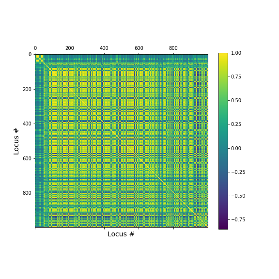
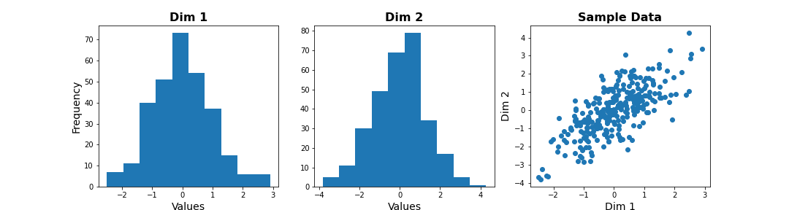
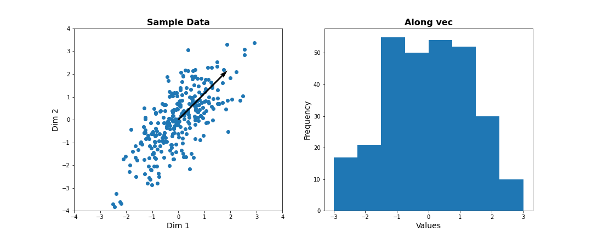
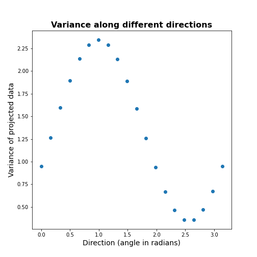
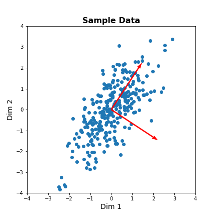
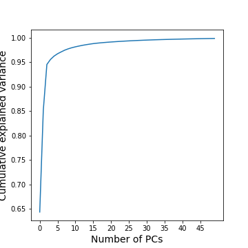
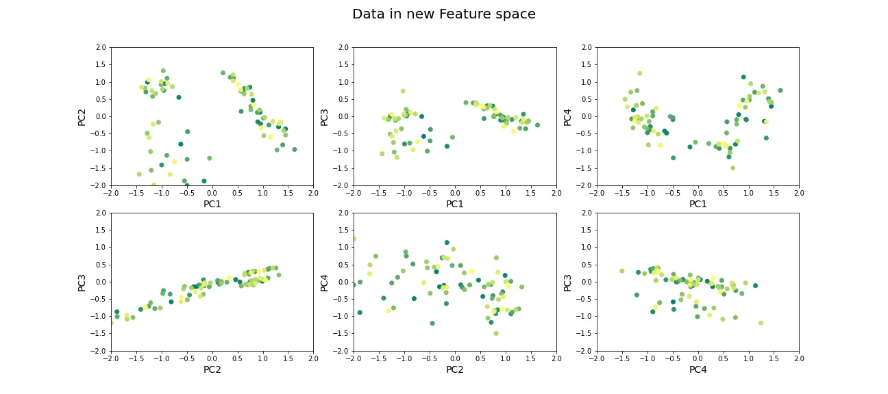

[**Download Chapter notebook (ipynb)**](https://drive.usercontent.google.com/u/1/uc?id=1QpuoibEsIfbllix2dElYpfl5TBe700EP&export=download)

[**Download Chapter PDF**](https://drive.usercontent.google.com/u/1/uc?id=1vGeUNnFSlcAOVNkfB5OEFMCWL3BQY6Mq&export=download)

[<span style="color: rgb(255, 0, 0);">**Mandatory Lesson Feedback Survey**</span>](https://docs.google.com/forms/d/e/1FAIpQLSdr0capF7jloJhPH3Pki1B3LZoKOG16poOpuVJ7SL2LkwLHQA/viewform?pli=1)


:::::::::::::::::::::::::::::::::::::: questions

- Why is it important to perform dimensionality reduction?
- How is dimensionality reduction performed?
- How PCA is used to determine variance?
- When does PCA fail?

::::::::::::::::::::::::::::::::::::::::::::::::

::::::::::::::::::::::::::::::::::::: objectives
- Understanding high-dimensional datasets.
- Applying dimensionality reduction to extract features.
- Learning to use PCA for dimensionality reduction.
- Estimating the optimal number of features.
::::::::::::::::::::::::::::::::::::::::::::::::

<br>
<p align = "center">
<iframe width="560" height="315" src="https://www.youtube.com/embed/ql80ZoyiWKY" title="YouTube video player" frameborder="0" allow="accelerometer; autoplay; clipboard-write; encrypted-media; gyroscope; picture-in-picture" allowfullscreen></iframe>
</p>
<br>
<p align = "center">
<iframe width="560" height="315" src="https://www.youtube.com/embed/yLjzGlZ19pM" title="YouTube video player" frameborder="0" allow="accelerometer; autoplay; clipboard-write; encrypted-media; gyroscope; picture-in-picture" allowfullscreen></iframe>
</p>
<br>
<p align = "center">
<iframe width="560" height="315" src="https://www.youtube.com/embed/E0YytUSJsQY" title="YouTube video player" frameborder="0" allow="accelerometer; autoplay; clipboard-write; encrypted-media; gyroscope; picture-in-picture" allowfullscreen></iframe>
</p>
<br>

:::::::::::::::::: prereq
- [Clustering Introduction](01-clustering-intro.Rmd)
- [Clustering Images](02-clustering-image.Rmd)
::::::::::::::::::

### **Code Preparation**


``` python
from numpy import reshape, append, mean, pi, linspace, var, array, cumsum, arange
from numpy.random import seed, multivariate_normal, binomial
from numpy.linalg import norm

from math import cos, sin, atan2
from matplotlib.pyplot import subplots, xlabel, ylabel, scatter, title
from matplotlib.pyplot import figure, plot, xticks, xlabel, ylabel, suptitle, show

import glob
from pathlib import Path
from pandas import read_csv, DataFrame
import csv
```


## Introduction
<p style='text-align: justify;'>
Clinical and scientific datasets often contain measurements of many physiological variables, expression of many genes or metabolic markers. These datasets, where each individual observation/sample is described by many variables are referred to as __high-dimensional__. However, some of these features can be highly correlated or redundant, and we sometimes want a more condensed description of the data. This process of describing the data by a reduced number of new combined features that reduces redundancy, is called __dimensionality reduction__.
</p>


There are several reasons for performing dimensionality reduction, both for data exploration and for pre-processing:

- Data compression, to optimize memory usage/loading speed and visualisation of "important features".

- To find the individual variable or combinations of variables that give a condensed but accurate description of the data (sometimes also called feature extraction).

- It can also be used for "denoising" - removing features that only account for small variability.

- It is also useful to perform this step before other supervised (regression, classification) or unsupervised learning procedures (like clustering), by reducing data to "main features" to improve robustness of learning, especially with a limited number of independent observations.


## Example: Predicting outcome from large-scale genetic or molecular studies
<p style='text-align: justify;'>
Clinical research can involve doing an exhaustive measurement of all tentative diagnostic markers, for example levels of various cytokines and hormones, or searching for genetic markers of a disease. There is good reason to expect that these share regulatory/signalling mechanisms, and that their interaction determines disease outcome. Building a regression model including all measurements is problematic because of multicollinearity and the demand for a much larger number of observations.
</p>
<p style='text-align: justify;'>
By performing dimensionality reduction, we first find features that capture the major patterns of covariation of these factors in the sample population. Then we will use these compact features, rather than individual measurements, to train our classifier or regression model, to study outcomes. With fewer features, we train models with less data.
</p>

### **Loading example data: Childhood Onset Rheumatic Disease gene expression profile**
<p style='text-align: justify;'>
[Gene expression data](https://www.ebi.ac.uk/arrayexpress/experiments/E-GEOD-11083/) (for selected markers) is available for 83 individuals, including some patients with varying forms of early-onset rheumatic disease (available at EMBL-Bioinformatics database, also included in folder). This is a typical example of high dimensional datasets, with transcript levels for >50,000 genes measured!
</p>
Here, the data are read from individual files in the 'Dataset' folder and combined into a Pandas dataframe called 'geneData'.


``` python
# Load all data
nGenes = 1000 # keep only these genes for now

filectr=0

datapath = Path("data")    #/relative/path/to/folder/with/datsets

for txt in datapath.glob("*.txt"):
    b=read_csv(txt, sep='\t', usecols=[1])
    b=reshape(b.values, (1,54675)) # each file is 1 observation sample i.e. 1 row.
    if filectr==0:
        coln =  read_csv(txt, sep='\t', usecols=[0])
        a = b
    else:
        a=append( a, b, axis=0)
    filectr+=1

# convert 2D array to dataframe
geneData = DataFrame( data=a[:,range(nGenes)]- mean(a[:,range(nGenes)], axis=0), columns = coln.values[range(nGenes)])
```

The dataframe has 80 samples and 1000 features.
<p style='text-align: justify;'>
Apart from the large number of variables (compared to number of samples), we also have strongly correlated expression of various markers. We can see that by plotting the correlation matrix of the dataframe.
</p>


``` python
fig, ax = subplots(figsize=(8,8))
im = ax.matshow(geneData.corr())
cbar = fig.colorbar(im, shrink=0.82)
xlabel('Locus #', fontsize=14);
ylabel('Locus #', fontsize=14);

show()
```



<p style='text-align: justify;'>
The little yellow blocks indicate that various features are strongly correlation (values around 1). Further analyses (e.g. checking if we find clusters mapping to healthy individuals and patients, respectively, or whether patients with different patterns of marker expression can be identified for future diagnostic purposes) can be thus be improved if we perform a dimensionality reduction, i.e. decrease the number of features while maintaining relevant information.
</p>

## Principal Component Analysis
<p style='text-align: justify;'>
Principal component analysis (PCA) is one of the most commonly used dimensionality reduction methods. Instead of describing the data using the original measurements, it finds a new set of ranked features (the "basis"). The new "features" are linear combinations of the original variables, such that they are all *orthogonal* to each other, and the "importance" of a feature (called the __principal component__) is generally given by how much of the variability in the dataset it captures (the so-called __explained variance__). Thus, we first transform the data from the original variables into a new set of features or principal components (PCs).
</p>

To get a lower dimensional description of the data, we retain only the top features (PCs) such that the largest variations or 'patterns' in the dataset are preserved.

<p style='text-align: justify;'>
To apply __PCA__ from `Scikit-learn`, we need to specify the number of components (`n_components`) we want to reduce the data to. `n_components` must be less than the *rank* of the dataset, i.e. less than the smaller of the number of samples and number of variables measured.
</p>

### **Simple example with 2D generated dataset**

To first explore what dimensionality reduction with PCA looks like, we will work with a simple 2-dimensional (2D) dataset, where we want to find a 1D description instead.

We start with generating some observations from a two-dimensional (multivariate) Gaussian distribution, with mean and covariance specified.


``` python
RND_SEED = 7890
seed(RND_SEED)

# Set up 2D multivariate Gaussians
means = [20, 20]

cov_mat = [[1, .85], [.85, 1.5]] # 2x2 covariance matrix must be symmetric and positive-semidefinite(>=0)

# Generate data
nSamples = 300

data = multivariate_normal(means, cov_mat, nSamples)

print(data.shape)
```

(300, 2)

We can check the distribution of the two features in histograms, and we can see how the two data dimensions relate to each other in the scatter plot.


``` python
# Center data
zdata = data - mean(data, axis=0)

fig, ax = subplots(ncols=3, nrows=1, figsize=(15, 4))

ax[0].hist(zdata[:, 0]);
ax[0].set_title('Dim 1', fontsize=16, fontweight='bold');
ax[0].set_xlabel('Values', fontsize=14);
ax[0].set_ylabel('Frequency', fontsize=14);

ax[1].hist(zdata[:, 1]);
ax[1].set_title('Dim 2', fontsize=16, fontweight='bold');
ax[1].set_xlabel('Values', fontsize=14);


ax[2].scatter(zdata[:, 0], zdata[:, 1]);
ax[2].set_title('Sample Data', fontsize=16, fontweight='bold')
ax[2].set_xlabel('Dim 1', fontsize=14);
ax[2].set_ylabel('Dim 2', fontsize=14);

show()
```



::::::::::::::::: callout
## Note
_The last plot, with the samples plotted as scatter in the space of measured variables is called a "state space plot". The main axes correspond to individual variables._

:::::::::::::::::

<p style='text-align: justify;'>
Now if we want to represent data by a single feature, we can see that the individual variables are not ideal. If we only keep Dim 1, we lose substantial variability along Dim 2. We see that the data points are stretched along the main diagonal. This implies that the two variables co-vary to some extent. Thus, a linear combination of the two might capture this relevant pattern.
</p>

A linear combination corresponds to a vector (or direction) in this 2D state space.
<p style='text-align: justify;'>
For example, the x-axis vector (1, 0) = [1 x Dim1 + 0 x Dim2], i.e. it contains Dim 1 only. More generally, (a, b) represents the linear combination [a x Dim1 +  b x Dim2], i.e. a mixture of the two variables. Typically, we ensure that the length of these vectors is 1, to avoid artefactual rescaling of data.
</p>

### **PCA as projection or rotation of basis**
<p style='text-align: justify;'>
Instead of representing data by their values along Dim 1 and Dim 2, we now try to describe them along different directions. We do so by *projecting* 2D data onto that vector. To quantify the importance of each direction, we measure the variance of the projected samples.
</p>
<p style='text-align: justify;'>
Let us examine different vectors that point at various angles compared to the x-axis. Remember that the vector denoted by the angle = *( cos(angle), sin(angle) )* denotes the following linear combination of the 2D sample d=[d1, d2]:
</p>
f(d1,d2) = cos(angle) * d1 + sin(angle) * d2


``` python
## Centre data at origin by subtracting mean
zdata = data - mean(data, axis=0)

# Define a feature as a direction in the 2D space using the angle
angle = pi/4

# Obtain the vector
vec = [cos(angle), sin(angle)] # has norm=1 by definition, otherwise:  vec = vec/norm(vec)

# Project 2D data onto this single dimension
dim1_data = zdata.dot(vec)


fig, ax = subplots(ncols=2, nrows=1, figsize=(15, 6))

# Plot data and the feature direction
ax[0].scatter(zdata[:, 0], zdata[:, 1]);
ax[0].quiver([0], [0], vec[0], vec[1], scale=3);

ax[0].set_title('Sample Data', fontsize=16, fontweight='bold')
ax[0].set_xlabel('Dim 1', fontsize=14); ax[0].set_xlim([-4,4]);
ax[0].set_ylabel('Dim 2', fontsize=14); ax[0].set_ylim([-4,4]);

# Plot histogram of new projected data
ax[1].hist(dim1_data, bins = linspace(-3,3,9));
ax[1].set_title('Along vec', fontsize=16, fontweight='bold');
ax[1].set_xlabel('Values', fontsize=14);
ax[1].set_ylabel('Frequency', fontsize=14);

show()
```



::::::::::::::::::::::::::::::: challenge

## Do it Yourself

Change the angle in the code above and see how distribution of projected data changes. Use e.g. 0,  $\pi$ /2,   2/3*$\pi$,  and $\pi$. Try to estimate how much the variance changes.
::::::::::::::::::::::::::::::

<p style='text-align: justify;'>
Now let's formally calculate the variance by projecting along a set of different directions. We use angles between 0 and $\pi$ (i.e. between 0 and 180 degrees). For each direction (projection) we  calculate the variance and plot it against the angle.
</p>


``` python
allAngles = linspace( start=0, stop=pi, num=20)
allVar = []
for angle in allAngles:
    vec = array([cos(angle), sin(angle)]) #Unit length vector on which data will be projected
    dim1_data = data.dot(vec)
    allVar.append( var(dim1_data))

# Plot variance captured by different features
scatter( allAngles, allVar );
title('Variance along different directions', fontsize=16, fontweight='bold')
xlabel('Direction (angle in radians)', fontsize=14);
ylabel('Variance of projected data', fontsize=14);
```



<p style='text-align: justify;'>
It can be seen there is a particular direction that retains maximal variance. This would be the optimal feature to give a 1D description of the 2D data while retaining maximum variability. PCA is the method that directly find this optimal direction. This makes it especially powerful for high dimensional datasets.
</p>

### **Find 1-D description using PCA**
<p style='text-align: justify;'>
Let us now use dimensionality reduction `PCA` to directly find the direction that captures maximal variance. For an n-dimensional dataset, PCA finds a set of _n_ new features, ranked by the variance along each feature. See the [Scikit-learn documentation](https://scikit-learn.org/stable/modules/generated/sklearn.decomposition.PCA.html) for information.
</p>

To get the best 1D representation of data, we instantiate the class with one component (*n_components* = 1) to be returned, and transform the data to the feature space of that component.


``` python
from sklearn.decomposition import PCA

# Initialize the PCA model
pcaResults = PCA(n_components=1, whiten=False) # specify no. of components, and whether to standardize

# Fit to data
pcaResults = pcaResults.fit(data)

# Transform the data, using our learned PCA representation
dim1_data = pcaResults.transform(data)

print( "Size of new dataset: ", dim1_data.shape )
```

Size of new dataset:  (300, 1)

    Size of new dataset:  (300, 1)


From the fitted model 'pcaResults' we can now get:

- The fractional variance using `explained_variance_ratio_`. It tells us what fraction of the total variance is retained by th reduced 1D description of the data.

- The direction (angle) of this first PC as calculate from the arcus tangens `atan` of the vector. You can compare it directly to the angle in the above plot.


``` python
# How much variance was captured compared to original data?
print("Fractional variance captured by first PC: {:1.4f}.".format(pcaResults.explained_variance_ratio_[0]))
```

Fractional variance captured by first PC: 0.8722.

``` python
vec1 = pcaResults.components_[0,:]
print("Direction of PC1 is at angle = {:1.2f} radians".format(atan2(vec1[1],vec1[0])))
```

Direction of PC1 is at angle = 0.99 radians

::::::::::::::::::::::::::::::: challenge

## Do it Yourself
Exercise (DIY): Change the covariance of the synthetic data, and repeat the above steps.
Try to infer the relationship between the shape of the scatter, the strength of correlation between the two dimensions, and the variance captured by the first PC.
:::::::::::::::::::::::::::::::

### **Find 2-D description using PCA**
<p style='text-align: justify;'>
Our dataset has two features. We can thus obtain two principal components. The two components must be orthogonal to each other (form a right angle). Let us get the corresponding vectors and plot them on the scatterplot.
</p>


``` python
# Initialize the PCA model
pcaResults = PCA(n_components=2, whiten=False) # specify no. of components, and whether to standardize

# Fit to data
pcaResults = pcaResults.fit(data)

# Transform the data, using our learned PCA representation
dim1_data = pcaResults.transform(data)

print( "Size of new dataset: ", dim1_data.shape )
```

Size of new dataset:  (300, 2)

``` python
print(pcaResults.components_)
```

[[ 0.54864625  0.8360546 ]
 [ 0.8360546  -0.54864625]]

``` python
vec1 = pcaResults.components_[0,:]
vec2 = pcaResults.components_[1,:]


fig, ax = subplots(figsize=(6, 6))

# Plot data and the feature direction
ax.scatter(zdata[:, 0], zdata[:, 1]);
ax.quiver([0], [0], vec1[0], vec1[1], scale=3, color='r');
ax.quiver([0], [0], vec2[0], vec2[1], scale=3, color='r');

ax.set_title('Sample Data', fontsize=16, fontweight='bold')
ax.set_xlabel('Dim 1', fontsize=14); ax.set_xlim([-4,4]);
ax.set_ylabel('Dim 2', fontsize=14); ax.set_ylim([-4,4]);

show()
```



<p style='text-align: justify;'>
The red arrows show the new coordinate system, defined by the principal components. It also shows that the more correlated the data are, the less information we lose by reducing the data representation using PCA.
</p>

:::::::::::::: callout
## Important
When reading about PCA you will come across the term __Singular Value Decomposition__ (SVD). As mentioned in the [Scikit-learn documentation for PCA](https://scikit-learn.org/stable/modules/generated/sklearn.decomposition.PCA.html#sklearn.decomposition.PCA), when you apply `PCA` the algorithm in the background uses SVD to return the results. The difference between the two is technical but SVD is the more general method. Wikipedia has as [mathematical introduction to PCA](https://en.wikipedia.org/wiki/Principal_component_analysis#Singular_value_decomposition) which also discusses [the relationship to SVD](https://en.wikipedia.org/wiki/Principal_component_analysis#Singular_value_decomposition).
::::::::::::::

## PCA of the Gene Expression Data
<p style='text-align: justify;'>
Now, we will use PCA to find a few features that capture most of the variability in the gene expression dataset. we arbitrarily start with 50 components assuming that this will include the important features.
</p>


``` python
nComp = 50 # Number of PCs to be returned
#trainIndx = binomial(1,0.9,size=filectr)

GenePCA = PCA(n_components=nComp, whiten=True)
GenePCA = GenePCA.fit(geneData) #.values[trainIndx==1,:]
```

<p style='text-align: justify;'>
How many features should we retain? To investigate this question, we plot the total (cumulative) variance for retaining the top *k* modes. The more we use, the higher the cumulative variance.
</p>


``` python
cumExpVar = cumsum(GenePCA.explained_variance_ratio_)
fig = figure(figsize=(5, 5))
im  = plot( range(nComp), cumExpVar )
xticks(arange(0,nComp,5));
xlabel( 'Number of PCs', fontsize=14);
ylabel('Cumulative explained variance', fontsize=14);

show()
```



<p style='text-align: justify;'>
A common heuristic for choosing the number of components is by defining a set threshold for the total explained variance.
Thresholds commonly vary between 0.8-0.9, depending on the structure of the PCs, e.g. depending on whether there are a few top PCs or many small PCs, but also depending on the expected noise in data, and on the desirable accuracy of the reduced data set. While a dimensionality reduction is convenient it always loses some information.
</p>

As an example, we can check how many PCs we need to retain 99 % of the variance.


``` python
threshold = 0.99

keepPC = [pc for pc in range(nComp) if cumExpVar[pc]>=threshold][0]

print('Number of features needed to explain {:1.2f} fraction of total variance is {:2d}. '.format(threshold, keepPC) )
```

Number of features needed to explain 0.99 fraction of total variance is 19. 

There are many alternative methods for estimating the number of features. These include:

- Plot explained variance of individual PCs and cut off when there is a sharp drop/saturation in the values.

- Cross-validation - Find number of PCs that maximize explained variance on heldout data (using a bi-cross validation scheme).

- Visual inspection or interpretable PCs


### **Visualization of reduced dataset**
Now that we have selected the number of features to be used, we can see what the data along those features looks like.


``` python
newGeneData = GenePCA.transform(geneData)[:,range(keepPC)]

fig, ax = subplots(ncols=3, nrows=2, figsize=(18, 8))
suptitle('Data in new Feature space', fontsize=20)

ax[0, 0].scatter(newGeneData[:,0], newGeneData[:,1], c=range(filectr), cmap='summer');
ax[0, 0].set_xlabel('PC1', fontsize=14); ax[0, 0].set_xlim([-2,2]);
ax[0, 0].set_ylabel('PC2', fontsize=14); ax[0, 0].set_ylim([-2,2]);


ax[0, 1].scatter(newGeneData[:,0], newGeneData[:,2], c=range(filectr), cmap='summer');
ax[0, 1].set_xlabel('PC1', fontsize=14); ax[0, 1].set_xlim([-2,2]);
ax[0, 1].set_ylabel('PC3', fontsize=14); ax[0, 1].set_ylim([-2,2]);


ax[0, 2].scatter(newGeneData[:,0], newGeneData[:,3], c=range(filectr), cmap='summer');
ax[0, 2].set_xlabel('PC1', fontsize=14); ax[0, 2].set_xlim([-2,2]);
ax[0, 2].set_ylabel('PC4', fontsize=14); ax[0, 2].set_ylim([-2,2]);


ax[1, 0].scatter(newGeneData[:,1], newGeneData[:,2], c=range(filectr), cmap='summer');
ax[1, 0].set_xlabel('PC2', fontsize=14); ax[1, 0].set_xlim([-2,2]);
ax[1, 0].set_ylabel('PC3', fontsize=14); ax[1, 0].set_ylim([-2,2]);


ax[1, 1].scatter(newGeneData[:,1], newGeneData[:,3], c=range(filectr), cmap='summer');
ax[1, 1].set_xlabel('PC2', fontsize=14); ax[1, 1].set_xlim([-2,2]);
ax[1, 1].set_ylabel('PC4', fontsize=14); ax[1, 1].set_ylim([-2,2]);


ax[1, 2].scatter(newGeneData[:,3], newGeneData[:,2], c=range(filectr), cmap='summer');
ax[1, 2].set_xlabel('PC4', fontsize=14); ax[1, 2].set_xlim([-2,2]);
ax[1, 2].set_ylabel('PC3', fontsize=14); ax[1, 2].set_ylim([-2,2]);

show()
```



### **Beyond dimensionality reduction**

After reducing dataset from hundreds or thousands of genes to fewer features (PCs), it can be used:

- To find groups of genes that seem to be co-regulated (using clustering).

- To build classifiers to predict the likelihood of juvenile or late-onset rheumatoid disease. For example, one feature can be highly variable in the sampled population and therefore has high explained variance, but it may not predictive for the current objective of predicting disease phenotype (e.g. eye pigmentation genes).

- To find what combination of genes the top features correspond to.

- To suggest what individual genes are most variable.

- To discover co-expression patterns of multiple genes.

::::::::::::::::::::::::::::::: challenge

## Optional Exercises

1. The dataset contains two types of samples, expression in neutrophil and expression in peripheral blood mononuclear cells (PBMC). Download the [sample-data table](https://www.ebi.ac.uk/arrayexpress/experiments/E-GEOD-11083/samples/) to get the category of each sample. Make a scatter plot of two (original) features and set the colour of the scatter based on the sample's origin. Do a PCA, scatter the top scoring components and colour the samples in the same way.  Do the top PCs capture gene expression differences in the two types of cells?

2. The dataset similarly contains samples from individuals with differing phenotypes - healthy, as well as 2 different disease characteristics. Similar to the previous exercise, colour the scatter based on the disease phenotypes. Do the top PCs capture variability in gene expression for different phenotypes?


:::::::::::::::::::::::::::::::


## When does PCA fail?

Although PCA is the first and simplest method of exploring high-dimensional datasets, there are important caveats to keep in mind:

1. *PCA is a linear method*

Nonlinear patterns of co-expression will be seemingly broken up into many features. Thus, the ability to find whether genes are co-regulated may be reduced if the effects are nonlinear.

2. *PCA depends on scaling of individual measurements.*

As PCA measures variance along different directions, changing the scale of one variable (for example from cm to mm, or fold-change to actual levels) may drastically change the dominant "features" extracted.

The lesson on clustering of images with Gaussian mixture models contained instructions to scale data. You can explore the original dataset of this lesson, to investigate how scaling of variables impacts the results.

3. *Estimating number of features is heuristic, and depends on the purpose.*

The definition of what is the 'relevant' number of features can depend on:

- the signal-to-noise ratio in data. For example, noisier or smaller datasets make it harder to accurately estimate smaller PCs. In such cases, a more conservative threshold should be used.
- the classifier or regression performance following the dimensionality reduction.


## Resources

- [Detailed tutorial on PCA](http://sebastianraschka.com/Articles/2015_pca_in_3_steps.html)

- [Other methods for dimensionality reduction](https://towardsdatascience.com/dimension-reduction-techniques-with-python-f36ca7009e5c):

  - [Matrix factorization methods](https://scikit-learn.org/stable/modules/decomposition.html)

  - [Manifold learning or topological methods](https://scikit-learn.org/stable/modules/manifold.html)

  - [Example pipelines with Scikit-learn](https://scikit-learn.org/stable/modules/unsupervised_reduction.html)

Dataset from:

Frank MB, Wang S, Aggarwal A, et al. **Disease-associated pathophysiologic structures in pediatric rheumatic diseases show characteristics of scale-free networks seen in physiologic systems: implications for pathogenesis and treatment.** _BMC Med Genomics. 2009;2:9._  Published 2009 Feb 23. doi:10.1186/1755-8794-2-9

Download data from: https://www.ebi.ac.uk/arrayexpress/experiments/E-GEOD-11083/

::::::::::::::::::::::::::::::::::::: keypoints

- Reduced features in a dataset reduce redundancy and process is called dimensionality reduction.
- Principal component analysis (PCA) is one of the commonly used dimensionality reduction methods.
- `n_components` is used specify the number of components in `Scikit-learn`.
- PCA can be helpful to find groups of genes that seem to be co-regulated.

::::::::::::::::::::::::::::::::::::::::::::::::


[r-markdown]: https://rmarkdown.rstudio.com/
