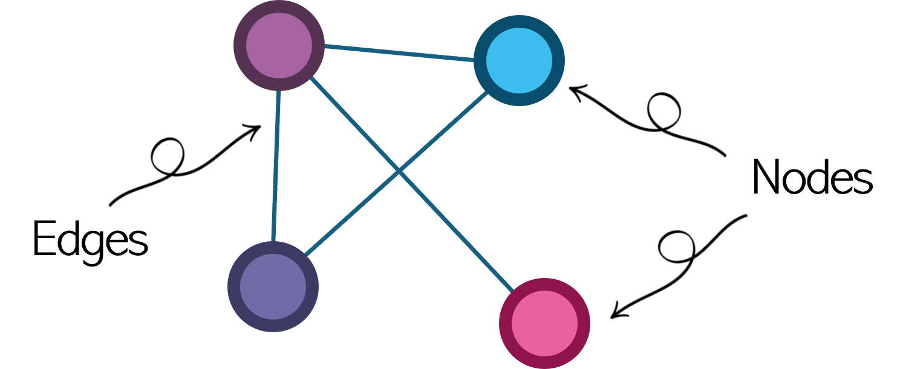
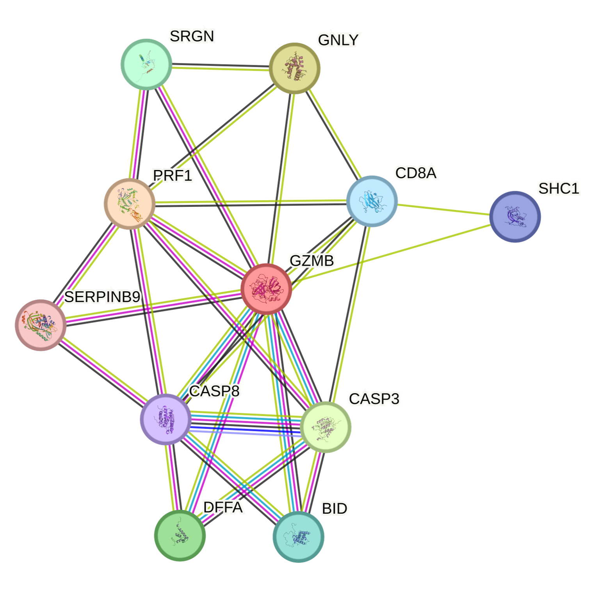
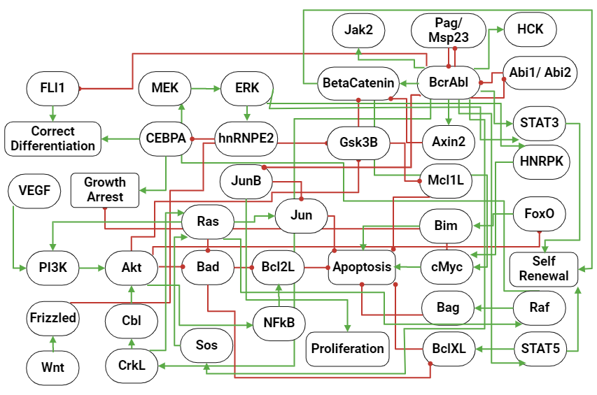
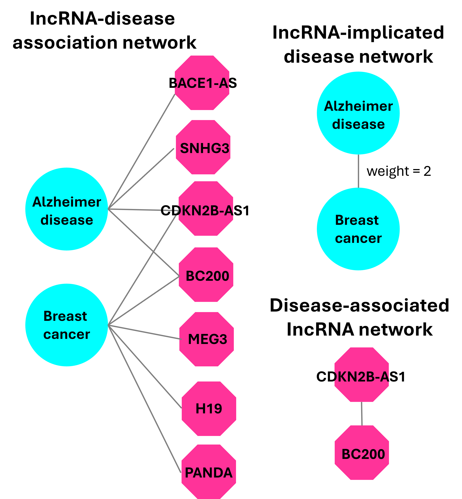
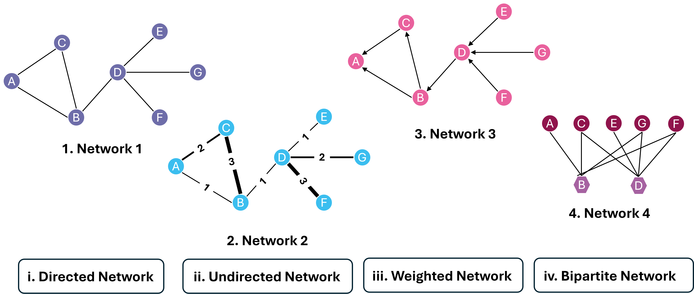
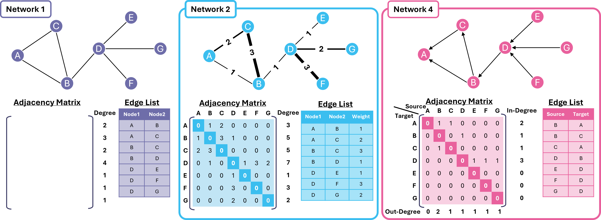
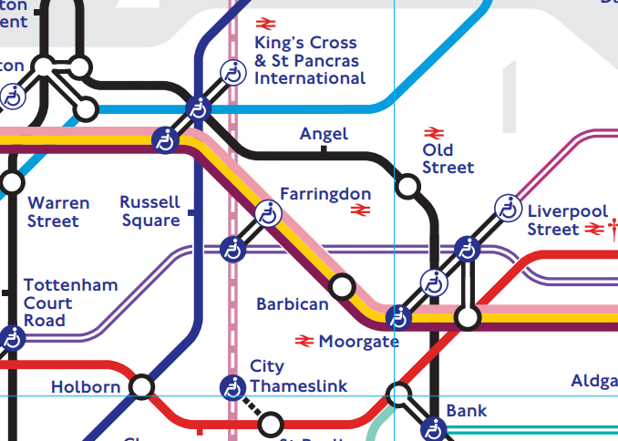

[**Download Chapter notebook (ipynb)**](https://drive.usercontent.google.com/u/1/uc?id=1OoOb5yx0Tc8joP3fjihvG460Eqdb-VBi&export=download)

[**Download Chapter PDF**](https://drive.usercontent.google.com/u/1/uc?id=16sWXA5SQUKzbeTUY5iVBE89q2J1RxSyU&export=download)

[<span style="color: rgb(255, 0, 0);">**Mandatory Lesson Feedback Survey**</span>](https://docs.google.com/forms/d/e/1FAIpQLSdr0capF7jloJhPH3Pki1B3LZoKOG16poOpuVJ7SL2LkwLHQA/viewform?pli=1)

```{r setup, include=FALSE}
# Load reticulate for Python integration
library(reticulate)

# 1) Override knitr's default "python" engine with reticulate's single-session engine
knitr::knit_engines$set(python = reticulate::eng_python)

# 2) (Optional) Unset any previously set Python environments to avoid conflicts
Sys.unsetenv("RETICULATE_PYTHON")

# 3) Check if Pandoc is available
if (!file.exists("/opt/homebrew/bin/pandoc")) {
  stop("Pandoc is not found. Please install Pandoc or update the path.")
}

# 4) Dynamically set the Python environment via a virtualenv
tryCatch({
  use_virtualenv("/Users/Adam/.virtualenvs/r-reticulate", required = TRUE)
  cat("Python environment set successfully.\n")
}, error = function(e) {
  cat("Error setting Python environment:", e$message, "\n")
  stop("Failed to set Python environment.")
})

# 5) Validate Python environment and check for numpy
tryCatch({
  py_config()
  py_run_string("import numpy")  # Check for numpy availability
  cat("Python environment and numpy are correctly configured.\n")
}, error = function(e) {
  cat("Error in Python environment configuration or numpy check:", e$message, "\n")
  stop("Failed to validate Python environment.")
})

# 6) Configure knitr chunk defaults (but DO NOT force engine = "python" globally)
knitr::opts_chunk$set(
  eval    = TRUE,
  echo    = TRUE,
  message = FALSE,
  warning = FALSE,
  results = "markup"
)

cat("Setup chunk complete.\n")
```

:::::::::::::::::::::::::::::::::::::: questions

-   How are graphs represented?
-   How can we construct a network with NetworkX?
-   How can a network be quantified?

::::::::::::::::::::::::::::::::::::::::::::::::

::::::::::::::::::::::::::::::::::::: objectives

-   Understanding the concept of a network graph
-   Creating network matrices and importing network data
-   Quantifying network properties
-   Visualising networks

::::::::::::::::::::::::::::::::::::::::::::::::

## **What is a network?**

A graph is a mathematical representation that describes the relationships between objects. A simple graph (such as the one pictured, below) typically contains two types of objects:

-   **Nodes** - also referred to as vertices, these are the entities of interest.

-   **Edges** - also referred to as links or arcs. These form the bridges between objects.



In the pictured 'simple' network, there are four nodes, connected by four edges. Notice that in this network, the edges represent simple connections, without any 'flow' of signal implied. Thus, this network is referred to as an **undirected network**.

### Types of Network:

Besides representing the connections between nodes, networks can also contain other properties at both node and edge level. In the previous example, we saw that an edge can be represented as a simple connection, with undirected edges. Let's take a closer look at a few other types of edge:

### Edge Properties:

-   **Undirected edges**: these are simple connections, that merely link two or more nodes without an implied flow of signal. In biological data, a common example might be in protein–to-protein interaction (PPI) networks, for example. We will actually learn more about these, later in these lessons.

-   **Directed edges**: these are connections with a clear flow of signal implied. A common biological example is in metabolic or gene regulatory networks.

-   **Weighted edges**: these can be undirected or directed edges, and have a weight or quantitative value associated with them. As an example, these weights can conceptually represent properties such as the reliability of an interaction, the correlation between linked gene expressions, or even sequence similarity between two genes. Edges can also be weighted to reflect topological parameters, such as centrality scores and clustering.

-   **Bipartite edges**: these entail a more complex type of edge, connecting nodes from different groups in a network. Nodes of the same type are not at all connected in a network with bipartite edges. This edge type is often used to transform biological networks to study common components across nodes, and represent complex relationships across different types of data: for instance, gene-disease and enzyme-reaction associations in metabolic pathways.

### Node Properties:

Similar to edge properties, nodes can also contain additional information other than the name of the entity. Below are a few examples of different properties nodes can have, that are commonly found in biological networks:

-   **Attribute**: This can be a quantitative or qualitative value, and can define the characteristic of the entity in question. For instance, in a complex gene regulatory network, nodes may have group labels showing whether or not a node might be a transcription factor regulator, or a target gene. Attributes such as these, can also contain other information; anything from time and colour, through to centrality scores (a topological parameter discussed in the next bullet point).

-   **Topological parameters**: a specific type of node attribute, topological parameters are of particular interest in this chapter, as they are mathematical properties that represent the spatial relations of nodes in a network, both globally (as in, the position of a node relative to the entire network) and locally (a node relative to other nodes to which it is directly connected). These properties are particularly important in interpreting the characteristic of the entity relative to the network, itself. Topological parameters will be discussed in more depth, further in this chapter.

## **Applications of Networks in the Life Sciences:**

Networks are widely used in biology to represent complex relationships. We have previously referenced protein-protein interactions (PPI) as one such example, whereby nodes represent an individual protein, and the edges connected to it, represent its interactions with other proteins in the network.

### Undirected Network Example:

Continuing in this vein, let's look at a PPI network of Granzyme B (GZMB) in humans, extracted from the STRING-DB database:



In this diagram, we can see the PPI network centers around the GZMB protein in *Homo sapiens*, where the edges connect proteins to one another. Note that the edges here have no arrowheads on them, and thus represent an **undirected** network.

Granzyme B is secreted by immune cells, and mediates apoptosis (or programmed cell death). GZMB is often secreted in conjunction with another protein called perforin, which facilitates the formation of a pore in the target cell membrane. In order to trigger apoptosis, GZMB cleaves and activates initiator caspase enzymes - two such caspases are CASP3 and CASP9. Thus, the network clearly shows an interaction between GZMB and both CASP3 and CASP8. If you would like to learn more about the interactions in this network, you can find out more on [STRING-DB on the following link](https://version-12-0.string-db.org/cgi/network?networkId=bbJf3mMyJokI).

### Directed Network Example:

As an example of a directed network, let's take a look at the signalling regulation in Philadelpha chromsome positive Chronic Myeloid Leukemia (Ph+CML), referenced from [Chuang *et al.*, 2015](https://pubmed.ncbi.nlm.nih.gov/25644994/).



In this network, key proteins and pathways dysregulated in CML are represented in capsule-shaped and rectangular nodes, respectively. Unlike the earlier GZMB PPI network example, this network contains two examples of **directed** interactions: activating (green) and inhibitory (red). All interactions represent a directed flow of information, indicating both the regulator and effector of the interaction.

Ph+ CML is characterised by the abnormal translocation between chromosomes 9 and 22, resulting in the fusion gene of BCR-ABL1. The presence of BCR-ABL1 leads to the upregulation of pro-survival and proliferation pathways such as JAK/STAT signalling (as indicidated by BcrAbl activating Jak2, STAT3, and STAT5 in the network shown), whist bypassing cell cycle checkpoint inhibitors in the Ras/MAPK/ERK pathway. BRC-ABL fusion also inhibits apoptosis through direct and indirect interactions with pro- and anti-apoptotic proteins. The importnace of BCR-ABL in Ph+CML drives the development of tyrosine kinase inhibitors, including lmatinib, Dastinib, and Nilotinib, to diminish CML tumour cell growth in CML patients.

### Bipartite Network Example:

Bipartite networks are usually used to study the association between nodes of the same type. An example of such an application is referenced in [Yang *et al.*, 2014](https://doi.org/10.1371/journal.pone.0087797).



In this diagram, we can see a portion of one of the networks constructed in this study. The initial IncRNA-disease association network is a **bipartite** network, inferring the IncRNAs associated to Alzheimer's disease (AD) and breast cancer (BC). From the bipartite network, both CDKN2B-AS1 and BC200 are associated to both AD and BC. Based on this, a IncRNA-implicated disease network can be constructed, connecting AD and BC with a **weighted edge** of 2. Similarly, a disease-associated IncRNA network can be constructed connecting the IncRNA nodes CDKN2B-AS1 and BC200.

## **Further examples:**


### Disease spread mapping:

Networks can also be used to model how infection diseases spread. In a study published by [Moon & Scoglio (2021)](https://www.nature.com/articles/s41598-021-83722-y), an example of a two-layer network model was used to estimate how contact tracing can impact the spread of COVID-19. The network model used comprises a mixture of both **weighted** and **unweighted**, **undirected** networks, with a staggering 445, 350 edges representing the individual households across Manhattan, NYC.

### Inferring gene regulation from an omics dataset:

Another popular application of networks is the inference of gene regulatory crosstalk based on single omics or multiple omics data, or even single-cell data. This has been reviewed by [Kim *et al*. (2023)](https://www.nature.com/articles/s41540-023-00312-6). Tehse gene regulatory networks (GRNs) are **directed** and contain two types of nodes: regulators and gene targets. Capturing the regulatory activity at multi-omics or single-cell levels, allows for a deeper understanding of the regulatory activity driving cellular identity and disease.

:::: challenge
## Practise Exercise 1

Match the following networks (top) to the term (bottom) that best describes the edge properties of that network.

</p>



::: solution
Answer:

1.  ii
2.  iii
3.  i 
4.  iv
:::
::::

## **Creating graphs with NetworkX:**

[NetworkX](https://networkx.org/) is a Python package for styding networks in Python. In this chapter, we will make use of NetworkX to create networks and study their properties.

Firstly, let's begin by importing NetworkX:

```{python}
import networkx as nx

```

To make networks intelligible to a computer, they can be represented as one of the following:

-   **Adjacency matrix**: this is where rows and columns are assigned to nodes in the network, and the presence of an edge is indicated by a numerical value.
-   **Edge list**: this is a list of the edges in a network. This list can be stored in a two-column matrix for directed or undirected networks. For weighted networks, a third column would be present, representing the edge weight.



**Network 1**

The adjacency matrix of this undirected and unweighted network is represented as a symmetric matrix containing solely 0 and 1 values. This represents the presence and absence of connections, respectively. The edge list of this undirected and unweighted network is represented by two columns of nodes.

**Network 2**

The adjacency matrix of this undirected and weighted network are represented by a symmetric matrix containing the weights of the edges. Similar to Network 1, when no connection is present, the edge is represented by a value of 0. The list of edges for this undirected and weighted network is represented by two columns of nodes, and a column of the edge weight.

**Network 3**

The adjacency matrix of this directed and unweighted network is represented as an unsymmetric matrix, containing values of either 0 or 1. The edge list of this undirected and weighted network is represented by two columns of nodes, specifying the source and target, showing the signal flow of the edge in question.

## **Creating a network using an adjacency matrix:**

Next, we will cover how to create network with Python, using an adjacency matrix or edgelist.

In order to create a network from an adjacency matrix, we must firstly construct said adjacency matrix. Based on the Network 1 example given above, let's create the adjacency matrix variable as a NumPy array.

```{python}
import numpy as np

Network1_m = np.matrix([[0, 1, 1, 0, 0, 0, 0], #A
                        [1, 0, 1, 1, 0, 0, 0], #B
                        [1, 1, 0, 0, 0, 0, 0], #C
                        [0, 1, 0, 0, 0, 0, 0], #D
                        [0, 0, 0, 1, 0, 0, 0], #E
                        [0, 0, 0, 1, 0, 0, 0], #F
                        [0, 0, 0, 1, 0, 0, 0]])#G
```

Next, we must convert this adjacency matrix into a network. We can do so using the NetworkX method [`from_numpy_array`](https://networkx.org/documentation/stable/reference/generated/networkx.convert_matrix.from_numpy_array.html), as follows:

```{python}
Network1 = nx.from_numpy_array(Network1_m)
```

We can then view the edges of this network, using the [`edges()`](https://networkx.org/documentation/stable/reference/classes/generated/networkx.Graph.edges.html) attribute; and the nodes using [`nodes()`](https://networkx.org/documentation/stable/reference/classes/generated/networkx.Graph.nodes.html), as follows:

```{python}
Network1.edges()
```

```{python}
Network1.nodes()
```

Note that, when using the NumPy array, the names of the nodes (i.e. A, B, C *etc*.) are not stored in the network. In order to change the node names, we can use the [`relabel_nodes`](https://networkx.org/documentation/stable/reference/generated/networkx.relabel.relabel_nodes.html) method together with a mapping dictionary, as follows:

```{python}
mapping = {0: "A", 1: "B", 2: "C", 3: "D", 4: "E", 5: "F", 6: "G"}
Network1_new = nx.relabel_nodes(Network1, mapping)

Network1_new.nodes()
```

In the case of larger networks with thousands of nodes, the corresponding adjacency matrices would also be very large. For instance, if a network has 1,000 nodes, the adjacency matrix would have a dimension of 1000 x 1000. Most of these nodes may not be connected, and thus the matrix itself could be sparse, and filled with values of 0. Reading this volume of data into memory would prove to be resource-heavy for your computer.

## **Creating a network using edge lists:**

Contrastingly, edge lists are more succinct, and are legible even for larger networks. This is because an absent connection with a value of 0 is not stored as data, unlike in an adjacency matrix; making them computationally more efficient.

In the following cell, let's create the directed network referenced above (Network 4), using an edge list. Firstly, we must create a Python list that will serve as our edge list, containing elements of paired tuples. We can do this using the function [`from_edgelist`](https://networkx.org/documentation/stable/reference/generated/networkx.convert.from_edgelist.html):

```{python}
Network3_edgelist = [("B", "A"),
                     ("B", "C"),
                     ("C", "A"),
                     ("D", "B"),
                     ("E", "D"),
                     ("F", "D"),
                     ("G", "D")]

Network3 = nx.from_edgelist(Network3_edgelist,
                            create_using = nx.DiGraph()) ## Specify so that the network is directed.
```

Then, as before, we can observe the edges and nodes in the network:

```{python}
Network3.edges()
```

```{python}
Network3.nodes()
```

Notice that by using the `from_edgelist()` function, we do not have to assign the names again to the network, using a dictionary.

## **Reading a Pandas DataFrame into a network:**

It is also possible to read in an edge list that has been previously stored as a Pandas DataFrame. Let's use Network 2 as an example from the previous figure at the start of the lesson. The edge list for Network 2 is stored as a .csv file in your repository's data folder, and can be read into a Pandas DataFrame using the [`from_pandas_edgelist`](https://networkx.org/documentation/stable/reference/generated/networkx.convert_matrix.from_pandas_edgelist.html) function:

```{python}
from pandas import read_csv

Network2_edgelist = read_csv("./Data/Network2.csv")

Network2_edgelist.head()
```

```{python}
Network2 = nx.from_pandas_edgelist(Network2_edgelist,
                                   source = "Node1",
                                   target = "Node2",
                                   edge_attr = True)
```

As before, we can access the network's edge and node attributes:

```{python}
Network2.edges()
```


```{python}
Network2.nodes()
```

The edge weight information can then be accessed using the [`get_edge_attributes`](https://networkx.org/documentation/stable/reference/generated/networkx.classes.function.get_edge_attributes.html) method:

```{python}
nx.get_edge_attributes(Network2,"Weight")
```

:::: challenge
## Practise Exercise 2

Create a NetworkX graph object based on the adjacency matrix, from the bipartite 'Network 4' example.

</p>


```{python}
Network4_m = np.matrix([[0, 1, 0, 0, 0, 0, 0], #A
                        [1, 0, 1, 0, 0, 1, 1], #B
                        [0, 1, 0, 1, 0, 0, 0], #C
                        [0, 0, 1, 0, 1, 1, 1], #D
                        [0, 0, 0, 1, 0, 0, 0], #E
                        [0, 1, 0, 1, 0, 0, 0], #F
                        [0, 1, 0, 1, 0, 0, 0]])#G
```

::: solution
```{python}
Network4 = nx.from_numpy_array(Network4_m)
```
:::
::::

## **Quantifying network properties:**

In order to study a network, we can measure how its nodes are positioned using **centrality scores**. A centrality score is a numerical measure of how important a node is, its influence and/or its structural position within a given network.

### Degree distribution:

In an undirected network, the term **degree** refers to the number of edges connected to any given node. For a directed network, a degree is subdivided to an **in-degree** and **out-degree**:

-   **In-degree** refers to the number of incoming edges to a node.

-   **Out-degree** refers to the number of outgoing edges from a node.

Although the degree can be calculated rather simply by counting the number of edges connected to a given node, this may be difficult for networks that are large. To illustrate this, we will incorporate the example of the **Breast Cancer Network** graph, at this point in the lesson.

### Breast Cancer Network:

This is a network generated from a list of 202 mutated genes in breast cancer, identified by [Repana *et al.*, 2019](https://genomebiology.biomedcentral.com/articles/10.1186/s13059-018-1612-0#Sec14). The resulting network was constructed from the STRING protein-protein interaction database, and its 3,696 edge weights were calculated from the evidence-based strength of interactions between its nodes. The next lesson will serve to reveal more information about constructing PPI networks based on lists of genes.

The Breast Cancer Network is given in the data folder of your repository, and is stored as a .csv file. Let's commence by reading this into a Pandas DataFrame, as before:

```{python}
bcn_df = read_csv("./Data/BreastCancerNetwork.csv")

bcn_df.head()
```

Let's then convert it into a NetworkX graph object:

```{python}
BC_g = nx.from_pandas_edgelist(bcn_df,
                               source = "Node1",
                               target = "Node2",
                               edge_attr = True)
```

We can calculate the degree centrality of each node using the NetworkX [`degree()`](https://networkx.org/documentation/stable/reference/generated/networkx.classes.function.degree.html) function"

```{python}
degree = nx.degree(BC_g)

print(degree)
```

The degree distribution can then be plotted using NetworkX and matplotlib to give a histogram:

```{python}
from matplotlib.pyplot import subplots, show

degs = dict(BC_g.degree()).values()

fig, ax = subplots()

ax.hist(degs, bins=20);

ax.set_title("Degree Distribution", fontsize=20)
ax.set_ylabel("Count", fontsize=16)
ax.set_xlabel("Degree", fontsize=16);


show()
```

## **Degree centrality:**

**Degree centrality** is the degree of each node normalised by the maximum possible degree that exists within the network. It can be calculated easily using the NetworkX function [`degree_centrality()`](https://networkx.org/documentation/stable/reference/algorithms/generated/networkx.algorithms.centrality.degree_centrality.html):

```{python}
degree_centrality = nx.degree_centrality(BC_g)

print(degree_centrality)
```

As is evident from the output of the previous cell, the resulting degree centrality is given as a Python dictionary. It is then possible to convert this dictionary into a Pandas DataFrame using the `DataFrame.from_dict` function:

```{python}
import pandas as pd

dc_df = pd.DataFrame.from_dict(degree_centrality, orient='index')
dc_df.head()
```

The resulting network can also then be ranked according the centrality score, as follows:

```{python}
print(dc_df.sort_values(by=[0]).head())
```

## **Closeness centrality:**

**Closeness centrality** is another topological measure that is commonly used in analysing a biological network. It measures how close a node is to all other nodes in a graph, based on the amount of flow information that can be measured crossing through a node (i.e. the shortest path). Closeness centrality is particularly useful in identifying nodes that can spread information efficiently throughout a network. In a biological context, an example might be a gene that is in the centre of a network, which is highly connected to other genes, and therefore influential to the connectivity measured across the entire network.

In NetworkX, it is possible to calculate closeness centrality using the function: [`closeness_centrality()`](https://networkx.org/documentation/stable/reference/algorithms/generated/networkx.algorithms.centrality.closeness_centrality.html). The results of this calculation are presented, once again, in dictionary format; which w can convert into a DataFrame, as before:

```{python}
closeness_centrality = nx.closeness_centrality(BC_g)
cc_df = pd.DataFrame.from_dict(closeness_centrality, orient='index')
cc_df.head()
```

## **Personalised PageRank:**

PageRank is a ranking system developed by Google's founder Larry Page in collaboration with Sergey Brin, and is used to identify the most central or interesting node in a network; conceptually, it is relatively similar to closeness centrality. However, PageRank allso accounts for whether the nodes are connected to another important node in the network.

### The London Underground Analogy:

Envision that you are newly settling into London after finding a suitable place to live, close to your workplace. You are exploring London by travelling, at random, across the city using the London Underground (Tube). You can initiate your travel from any station in the Tube network and, while travelling, you decide - by means of a dice toss - which of the neighbouring stations you would like to visit, next.

Suppose you begin this following your arrival at Angel Station. You then toss the dice to decide whether to next visit King's Cross St. Pancras, or Old Street Station, with an equal chance of visiting each station. Your dice throw points to Old Street Station, and you proceed, accordingly. Once you arrive at Old Street, you then toss the dice again to decide whether or not to travel back to Angel, or proceed to Moorgate. In order to prevent the scenario where you get trapped in one part of the Tube network, an occasional random jump or teleportation to any station on the network, is introduced. This allows you to travel across the entire London Underground network. This process then repeats infinitely, leading to the computation of probabilities for being at a specific station, and this is represented as a PageRank score.



PageRank results in a probability independent of the starting station. However, if you work at a particular station such as Angel, you may wish to live near to a station that is closely connected to Angel, and not too far away from it. In order to address this problem, we can then assign Angel a non-zero value, with other stations set to 0; this means that the PageRank algorithm is forcing you back to Angel, every time a random jump occurs. This process then repeats infinitely, and the probability for each station that you take to Angel, is calculated as a **Personalised PageRank (PPR)** score.

## **The Breast Cancer Network:**

In the context of a biological network, we may be interested in nodes that are highly connected to a particular gene, protein or transcription factor, for example. Using the Breast Cancer Network as an example to illustrate this, let's explore nodes within this network that are highly connected to EGFR using the aforementioned PPR score. EGFR is an Epidermal Growth Factor Receptor - a transmembrane receptor which regulates cell growth and proliferation, in which mutations can contribute to the progression of tumours in cancers such as breast cancer.

Fistly, let us observe how we can address the teleportation customisation, using a Python dictionary:

```{python}
EGFR_dict = dict()

for i in BC_g.nodes():
    if i == "EGFR":
        EGFR_dict[i] = 1 ## Only assigning 1 to EGFR

    else:
        EGFR_dict[i] = 0 ## Assigning 0 to all other nodes in the network

```

PPR can then be calculated using the [`pagerank` function in NetworkX](https://networkx.org/documentation/stable/reference/algorithms/generated/networkx.algorithms.link_analysis.pagerank_alg.pagerank.html). As the results are returned in a dictionary, we can use Pandas functions to convert these into a Pandas DataFrame:

```{python}

EGFR_ppr = nx.pagerank(BC_g, personalization = EGFR_dict)
EGFR_ppr_df = pd.DataFrame.from_dict(EGFR_ppr, orient = "index")
print(EGFR_ppr_df.head())
```

The results are arranged alphabetically. Let's have a look at the top 10 nodes from the EGFR PPR analysis:

```{python}
import matplotlib.pyplot as plt
EGFR_PPR_top10 = EGFR_ppr_df.sort_values(by=[0], ascending=False).head(n = 10)

plt.barh(EGFR_PPR_top10.index,
        EGFR_PPR_top10[0],
        color="blue")

plt.xlabel("Score")
plt.ylabel("Node")
plt.title("EGFR PPR")
plt.legend()
plt.show()
```

EGFR is ranked highly, as we have prioritised it in the personalisation. In biological context, we know that [EGFR, and other proteins such as p53 and PTEN](https://www.tandfonline.com/doi/full/10.4161/cbt.23297), are often cooperative in the initiation of tumours and their progression. Having them rank as highly as they do, is consistent with this information.

:::: challenge
## Practise Exercise 3

Calculate the degree centrality of Network 1, and store the result in a Pandas DataFrame:

</p>

::: solution
```{python}
Network1_DC = nx.degree_centrality(Network1_new)

N1_DC_df = pd.DataFrame.from_dict(Network1_DC, orient='index')

print(N1_DC_df.head(10))
```
:::
::::

## **Visualising graphs:**

Previously, we saw that Python could be used to readily extract information about a given network. We can move on to visualise these networks using the [`draw`](https://networkx.org/documentation/stable/reference/generated/networkx.drawing.nx_pylab.draw.html#networkx.drawing.nx_pylab.draw) function from the NetworkX library.

We can start by visualising the more simple Network 3 example, from the previously referenced example figure:

```{python}
nx.draw(Network2,
        with_labels = True)
show()
```

Using NetworkX, we can also dictate the way the nodes are positioned, by constraining and specifying the layout of a network. There is an extensive variety of options for doing this, but we will use a layout known as the 'spiral' layout, for our first example. For a list of layout options, [refer to the NetworkX documentation](https://networkx.org/documentation/stable/reference/drawing.html#module-networkx.drawing.layout).

```{python}
Network3Layout = nx.spiral_layout(Network2)

nx.draw(Network2, 
        Network3Layout,
        with_labels = True)

show()
```

Another popular network layout that is frequently used is known as the [spring_layout](https://networkx.org/documentation/stable/reference/generated/networkx.drawing.layout.spring_layout.html). Lets visualise this layout using the directed network example from our figure (Network 3):

```{python}
Network3Layout = nx.spring_layout(Network3)

nx.draw(Network3, 
        Network3Layout,
        node_color='pink',
        with_labels = True)

show()
```

Earlier in this lesson we generated a bar chart of the EGFR top 10 PPR nodes within the Breast Cancer Network. We can now demonstrate how to overlay this bar chart with the subgraph of the top 10 PPR nodes, using the NetworkX function `nx.draw()`, as follows:

```{python}
from matplotlib.pyplot import axes, axis, title
import collections
import matplotlib.pyplot as plt

## Generating the dictionary for EGFR PPR
EGFR_dict = dict()
for i in BC_g.nodes():
    if i == "EGFR":
        EGFR_dict[i] = 1 ## Only assigning 1 to EGFR
    else:
        EGFR_dict[i] = 0 ## Assigning 0 to all other nodes in the network

## Calculate PPR from EGFR
EGFR_ppr = nx.pagerank(BC_g,
                        personalization = EGFR_dict)
EGFR_ppr_df = pd.DataFrame.from_dict(EGFR_ppr, orient = "index")

## Getting the top 10 nodes for PageRank
EGFR_PPR_top10 = EGFR_ppr_df.sort_values(by=[0], ascending=False).head(n = 10)

## Creating subplot
fig, ax = subplots()

title("EGFR PPR")

## Generating the horizontal barplot
ax.barh(EGFR_PPR_top10.index,
        EGFR_PPR_top10[0],
        color="blue")


ax.set_xlabel("Score")
ax.set_ylabel("Node")

# draw graph in inset
axes([0.4, 0.4, 0.5, 0.5])

## Extract EGFR top 10 nodes to list
EGFR_PPR_nodes = EGFR_PPR_top10.index.tolist()

BC_EGFR_subgraph = BC_g.subgraph(EGFR_PPR_nodes)
pos = nx.spring_layout(BC_EGFR_subgraph, seed=2)

axis("off")

# this code draws the network node
nx.draw_networkx_nodes(BC_EGFR_subgraph, 
                       pos, 
                       node_size=30, 
                       node_color='r',
                       )
## this code shows the label
nx.draw_networkx_labels(BC_EGFR_subgraph, 
                       pos,
                       {lab:lab for n,lab in enumerate(EGFR_PPR_nodes) if lab in pos},
                       font_size=10,
                       font_color='black')
# this code draws the network edge
nx.draw_networkx_edges(BC_EGFR_subgraph, pos);

plt.show()
```

It is also possible to customise the network nodes and edges. For instance, it is easily possible to manipulate colour using one of a keyword argument pertaining to one of [matplotlib's many included colours](https://matplotlib.org/3.1.0/gallery/color/named_colors.html), and also to change both the [shape](https://matplotlib.org/3.1.1/api/markers_api.html) and size of the displayed nodes. Note that the plot will vary each time it is run, due to the layout algorithm selected.

```{python}
Network1Layout = nx.random_layout(Network1)

newLabels = {
    0: 'A',
    1: 'B',
    2: 'C',
    3: 'D',
    4: 'E',
    5: 'F',
    6: 'G'
}

nx.draw(Network1, 
        Network1Layout,
        labels=newLabels,
        node_color='gold',
        node_shape="H",
        node_size=800)
show()
```

Should you want to add another note, and have it connected to only one of the existing nodes, for example, you can add one, as follows, using the `.add_node` method available in NetworkX.

```{python}
Network1.add_node(7)

print(Network1.nodes)
```

We can make further modifications to the network graph. For instance - say we want to set a new layout for this graph, and update its labels to call the new node 'H'; and specify to which nodes it connects. We can do so, as follows:

```{python}
newLayoutNetwork1 = nx.random_layout(Network1)
newLabels = {
    0: 'A',
    1: 'B',
    2: 'C',
    3: 'D',
    4: 'E',
    5: 'F',
    6: 'G',
    7: 'H'
}


nx.draw(Network1, 
        newLayoutNetwork1,
        labels=newLabels,
        node_color='gold',
        node_shape="H",
        node_size=800);

show()
```

For nodes with high centrality scores, it may also be interesting to find out where in the network they are positioned. As referenced earlier in this lesson, we can make use of both the centrality results we obtained before, together with a function of our own, that makes use of several of the aforementioned NetworkX functions and methods. Into this function, we will build in code that allows us to colour the nodes based on the centrality score. Let's try this using the Network 4 example.

We must firstly define this function. In this example, we will call the function `draw_centarlity`:

```{python}
import matplotlib.colors as mcolors
def draw_centrality(G, pos, measures, measure_name):
    
    nodes = nx.draw_networkx_nodes(G, pos, node_size=250, cmap=plt.cm.plasma, 
                                   node_color=list(measures.values()),
                                   nodelist=measures.keys())
    nodes.set_norm(mcolors.SymLogNorm(linthresh=0.01, linscale=1, base=10))
    labels = nx.draw_networkx_labels(G, pos)
    edges = nx.draw_networkx_edges(G, pos)

    plt.title(measure_name)
    plt.colorbar(nodes)
    plt.axis('off')
    plt.show()
```

```{python}
pos = nx.spring_layout(Network4)
draw_centrality(Network4, 
        pos, 
        nx.closeness_centrality(Network4), 
        'Closeness Centrality')
```

### Visualising PPR:

We previously explored how PPR results can be viewed using a bar chart. However, from this, it is unclear as to how the 'walk' was performed. Let's use a block of code here that allows us to visualise the PPR of EGFR from its ten closest, neighbouring nodes:

```{python}
from matplotlib import animation
from IPython.display import HTML
import random

H = BC_g
top10 = EGFR_ppr_df.sort_values(by=[0], ascending=False).head(n = 10).index
G = H.subgraph(top10)
pos = nx.spectral_layout(G, dim=3)
nodes = np.array([pos[v] for v in G.nodes()])
edges = np.array([(pos[u], pos[v]) for u, v in G.edges()])

def _frame_update(index, target_node):
    ax.clear()
    ax.scatter(*nodes.T, alpha=0.2, s=100, color="blue")
    for key in pos:
        ax.text(pos[key][0],
                pos[key][1],
                pos[key][2],
                s=key)
    for vizedge in edges:
        ax.plot(*vizedge.T, color="gray")
    neighbors = list(G.neighbors(target_node))
    if index % 5 == 0:
        node[0] = random.choice(neighbors)
    node0 = pos[node[0]]
    ax.scatter(*node0, alpha=1, marker="s", color="red", s=100)
    ax.view_init(index * 0.2, index * 0.5)
    ax.grid(False)
    ax.set_axis_off()

    # Set axis limits to zoom in on the network
    ax.set_xlim3d(-0.8, 0.3)
    ax.set_ylim3d(-0.5, 0.5)
    ax.set_zlim3d(-0.5, 0.5)
    
    return

fig = plt.figure()
ax = fig.add_subplot(111, 
                     projection="3d")
ax.grid(False)
ax.set_axis_off()
node = [0]

ani = animation.FuncAnimation(fig, 
                              _frame_update, 
                              interval=20, 
                              frames=range(100), 
                              cache_frame_data=False,
                              fargs=("EGFR",), 
                              repeat=True)

HTML(ani.to_jshtml())
```

:::: challenge
## Practise Exercise 4

1.  Use the graph layout alrogrithm called shell_layout to plot Network 2 from our example figure.

2.  Draw the graph with a third layout algorithm called `random_layout`, and draw the graph several times by repeatedly executing the code.

3.  Draw the graph from the matrix n, created in Practise Exercise 1.1, with the layout algorithm `spectral_layout`, givint the nodes the names V, X, Y and Z.

</p>

::: solution
```{python}
# Practise Exercise 4, Question 1:
newLayout = nx.shell_layout(Network2)

nx.draw(Network2, 
        newLayout,
        with_labels = True)

show()

```

```{python}
# Practise Exercise 4, Question 2:
newLayout = nx.random_layout(Network2)

nx.draw(Network2, 
        newLayout)

show()
```

```{python}
# Practise Exercise 4, Question 3:
from numpy import zeros

n = zeros((4,4))

n[0, 1] = 1
n[1, 2] = 1
n[1, 3] = 1

new = nx.from_numpy_array(n)

newLabels = {
    0: 'V',
    1: 'X',
    2: 'Y',
    3: 'Z',
}

newLayout = nx.spectral_layout(new)

nx.draw(new, newLayout,
        labels=newLabels)

show()
```
:::
::::

## **Optional Materials:**

### Clustering Coefficient:

The clustering coefficient (CC) is a measure of the degree to which nodes in a graph tend to cluster together. Clustering coefficients can range from 0 to 1, where:

-   0 - none of the node's neighbours are connected.

-   1 - All of the node's neighbours are connected, forming a complete clique.

Similarly, the average CC also indicates how well the nodes in the graph are connected. As with the aforementioned centrality calculations, this can be calculated in a straightforward way for nodes in a graph. The following is a simple block of code that demonstrates how you can calculate the CC using the Breast Cancer Network example:

```{python}
clustering_coefficients = nx.clustering(BC_g)

# Calculate the average clustering coefficient for the entire graph
average_clustering_coefficient = nx.average_clustering(BC_g)
print(f"Average Clustering Coefficient: {average_clustering_coefficient}")
```

### Edge connectivity:

Edge connectivity measures the minimum number of edges that need to be removed in order to disconnect a network graph.

For example, the Breast Cancer Network is composed of two disconnected subgraphs. Let's calculate the edge connectivity for each of the subgraph components in this network:

```{python}
# Calculate edge connectivity
for i, c in enumerate(nx.connected_components(BC_g)): 
    edge_connectivity = nx.edge_connectivity(BC_g.subgraph(c))
    print(f"Subgraph size for {i} component: {len(c)}")
    print(f"Edge Connectivity for {i} component: {edge_connectivity}") 
```

Despite the two subgraphs being very different to each other, both only needed to remove a single edge in order to disconnect the subgraph, completely.

### Shortest path length:

The path length refers to the distance between two nodes in a network graph, calculated as the number of edges required to get from one node to the other. More specific information about a graph can be found using measures that build on the path length, such as the shortest path length, average shortest path length, and the shortest path length from the node in question, to all reachable nodes.

For illustration, here is how we can find out the shortest path of our Breast Cancer Network graph, from node ACTG1 to AGTR2 - the top, least-connected (in terms of degree centrality) nodes in the network. The output is the sequence of nodes along this shortest path.

```{python}
my_shortest_paths = nx.all_shortest_paths(BC_g, 
                                          source="ACTG1", 
                                          target="AGTR2")

for path in my_shortest_paths:
    print(path)
```

There are ten possible routes to get from node ACTG1 through to AGTR2: and it is *via* two intermediate nodes.

As a single summary quantity of a network, we can find the average shortest path length, as follows:

```{python}
for c in nx.connected_components(BC_g): 
    print(nx.average_shortest_path_length(BC_g.subgraph(c)))
```

## **Assignment Questions:**

:::: challenge
## End of chapter Exercises:

Using the code to create the (undirected) GZMB PPI network given at the start of this lesson.

1.  Experiment with the different layout algorithms, the node colour and shape, and the edge color.

*Hint:*

-   Using a pen and paper, draw a diagram of the PPI network.
-   Decide on the ordering of the nodes. One option is to start with the centre node, and subsequently number them in an anticlockwise direction. *(Hint: There are 11 nodes in total.)*
-   Label your pen and paper diagram with the node numbers.
-   Work out all the edges in the graph. Note the numbers of the node at the start of the edge and the node at the end of the edge. *(Hint: There are 20 edges in total.)*
-   Define a 11×11 matrix in Python using the NumPy `zeros` function.
-   For each edge, set the corresponding entry in the matrix to 1 (start node number corresponds to row number and end node number corresponds to column number in the adjacency matrix).
-   Define a cell array containing your node names and create a NetworkX object.
-   Experiment with the layout, colours, node shapes etc.

Remember to use the Python documentation, e.g. using `help()` if you have problems (alternatively use a search engine such as Google).

2.  Compute the number of edges in the generated network.

3.  Calculate the closeness centrality of each node in the network. Identify the top 5 nodes in the network.

4.  Plot the degree distribution of the network with inserted network graph.

5.  Calculate the Personalised PageRank starting from GZMB in this network.

::: solution
## Solutions are provided after assignments are marked.
:::
::::

::::::::::::::::::::::::::::::::::::: keypoints

- Concept of a network graph as a means of describing the interconnectivity between nodes, using edges.
- Concept of directed and undirected networks.
- Practice in creating network matrices, importing and handling network data.
- Practice in quantifying network properties.
- Practice in visualising networks.

::::::::::::::::::::::::::::::::::::::::::::::::


[r-markdown]: https://rmarkdown.rstudio.com/
