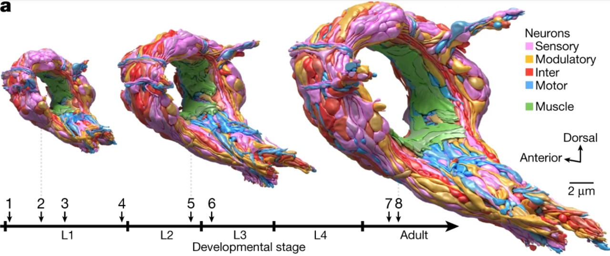
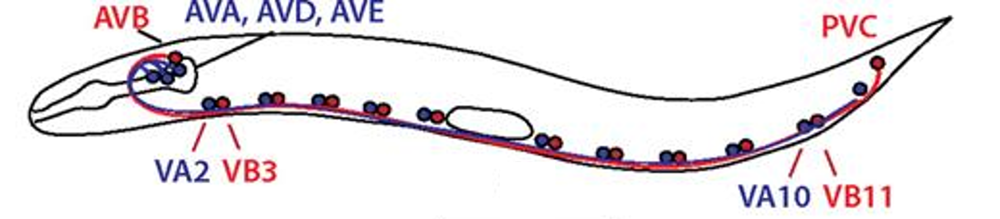

[**Download Chapter notebook (ipynb)**](https://drive.usercontent.google.com/u/1/uc?id=1KOKHzSwZSaMlfKNgMoAPW6jxcn51Igak&export=download)

[**Download Chapter PDF**](https://drive.usercontent.google.com/u/1/uc?id=1QC62IzCmb7AsABdkTg9c5rTIqCTeqWl1&export=download)

[<span style="color: rgb(255, 0, 0);">**Mandatory Lesson Feedback Survey**</span>](https://docs.google.com/forms/d/e/1FAIpQLSdr0capF7jloJhPH3Pki1B3LZoKOG16poOpuVJ7SL2LkwLHQA/viewform?pli=1)

```{r setup, include=FALSE}
# Load reticulate for Python integration
library(reticulate)

# 1) Override knitr's default "python" engine with reticulate's single-session engine
knitr::knit_engines$set(python = reticulate::eng_python)

# 2) (Optional) Unset any previously set Python environments to avoid conflicts
Sys.unsetenv("RETICULATE_PYTHON")

# 3) Check if Pandoc is available
if (!file.exists("/opt/homebrew/bin/pandoc")) {
  stop("Pandoc is not found. Please install Pandoc or update the path.")
}

# 4) Dynamically set the Python environment via a virtualenv
tryCatch({
  use_virtualenv("/Users/Adam/.virtualenvs/r-reticulate", required = TRUE)
  cat("Python environment set successfully.\n")
}, error = function(e) {
  cat("Error setting Python environment:", e$message, "\n")
  stop("Failed to set Python environment.")
})

# 5) Validate Python environment and check for numpy
tryCatch({
  py_config()
  py_run_string("import numpy")  # Check for numpy availability
  cat("Python environment and numpy are correctly configured.\n")
}, error = function(e) {
  cat("Error in Python environment configuration or numpy check:", e$message, "\n")
  stop("Failed to validate Python environment.")
})

# 6) Configure knitr chunk defaults (but DO NOT force engine = "python" globally)
knitr::opts_chunk$set(
  eval    = TRUE,
  echo    = TRUE,
  message = FALSE,
  warning = FALSE,
  results = "markup"
)

cat("Setup chunk complete.\n")
```

:::::::::::::::::::::::::::::::::::::: questions

- How can a meaningful biological network be constructed?
- How can networks be analysed to answer biological questions?
- How can we interpret the results of network analyses in a biological context?

::::::::::::::::::::::::::::::::::::::::::::::::

::::::::::::::::::::::::::::::::::::: objectives

- Reviewing data import and network quantification
- Network construction based on biological question of interest
- Selecting and using appropriate analyses, based on a research question

::::::::::::::::::::::::::::::::::::::::::::::::

```{python}
import networkx as nx
import numpy as np
import pandas as pd

from matplotlib.pyplot import subplots, show
import matplotlib.pyplot as plt
```
## **Importing data into NetworkX**

In the previous lesson, we explored the basics of NetworkX, creating and analysing various networks and their properties; we also practised these techniques using some named examples, including the Breast Cancer Network dataset. As previously demonstrated, using NetworkX with data of your own requirest that you import these data in an appropriate, and compatible manner. Specifically, this requires knowledge surrounding importing data from a multitude of different data formats. We will give an overview of a few of these formats, here.

### CSV Format

A frequently-encountered file format is CSV, whose .csv file extension is an abbreviation that stands for [**comma-separated values**](https://en.wikipedia.org/wiki/Comma-separated_values). In Networks 1, we used this file format to import the Breast Cancer Network as an edgelist. In this lesson, we will explore reading this data into NetworkX as an adjacency matrix. 

The network data file ‘breastcancermatrix.csv' comprises a large adjacency matrix of containing values of 0 and 1, with no further information included. The ‘breastcancerlabel.csv’ file, however, contains the list of neuron names, which we use to label the nodes of the network we will create. We will how this import works, in greater detail. While there are a multiple different methods we can use to import a CSV file, in this example, we will make use of the Pandas function `read_csv`.

The following code will import the entire Breast Cancer Network, as an adjacency matrix:

```{python}
BC_matrix = pd.read_csv('Data/breastcancermatrix.csv', 
                    header = 0, 
                    index_col = 0,
                    dtype = "int")

BC_matrix = BC_matrix.to_numpy()

print(len(BC_matrix))
```

This imports the CSV file, as before. The keyword argument `header` allows us to sepcify that Pandas should treat the first row (index 0) of data as a header (with name and textual information, as opposed to this being the first row of data). Thus, Pandas knows to parse or handle the second row of the file as the first row of actual data. The code then goes on to specify that the adjacency matrix is of data type `int`, indicating that integers are expected (although this does not necessarily have to be the case, for example, in a weighted network where weight data may also be present). The code then goes on to convert the Breast Cancer Network adjacency matrix from the newly-created Pandas DataFrame into a NumPy array, using the `.to_numpy()` method. 

In a similar fashion, the labels for the Breast Cancer Network nodes (BC_Names) should be imported. They will, however, need to be converted from a Pandas DataFrame into a dictionary, which is the format required by NetworkX for node labels:

```{python}
BC_Names = pd.read_csv('data/breastcancerlabel.csv', 
                    header=None)

BCnodeNames = BC_Names.to_dict()

BCLabels = BCnodeNames[0]

print(BCLabels)
```

As covered in the Basic Python lessons, dictionaries are associative arrays, containing entries comprising pairs of both keys and corresponding values. In the code block given above, we are converting the BCnodeNames DataFrame into a dictionary using the `.to_dict()` method. The numerical node (protein) identifiers are the keys, and the corresponding node (protein) names are the values. Note that the `to_dict()` method wraps the dictionary within a second, containing dictionary. Therefore, in order to obtain the plain labels dictionary alone, we must index into it, using index ‘0’; this is subsequently stored into the BCLabels variable for easy handling, in subsequent code.

Next, let's create a graph, specify a layout, and plot the network:

```{python}
BCGraph = nx.from_numpy_array(BC_matrix)

BCLayout = nx.random_layout(BCGraph, seed=123)

nx.draw_networkx(BCGraph, 
                BCLayout,
                node_size=100,
                labels = BCLabels)

show()
```

At first glance, the resulting network graph appears to be quite complex and chaotic. Although you couldn't tell by looking at this, the Breast Cancer Network contains two nodes that are isolated from the bigger module of the network. Using the random layout, we cannot see these isolated nodes. In this particular case, we also have other metadata that can be used for visualisation and analysis. We have a second file - ‘BCpositions2D.csv’ - which contains information on how the nodes relate to each other in a 2-dimensional space. We can include this information to replace the layout we visualised in the code chunk, above. 

In the block of code given below, we can also adjust the plotting size frame to enlarge the plotting area for the network. We can also change the edge colour to make it transparent, making it far easier for us to interpret the network structure. The resulting graph shows, much more clearly, the two isolated nodes, as well. 

```{python}
import matplotlib.pyplot as plt
BC2DPos = pd.read_csv('Data/BCpositions2D.csv', 
                   header=0,
                   index_col=0)

BC2DPositions = BC2DPos.values

fig = plt.figure(1, figsize=(20, 20))
nx.draw(BCGraph, 
        BC2DPositions,
        node_size=1500,
        edge_color="#20808080",
        labels = BCLabels)

show()
```

Using this new 2-D visualisation method, it is clear that these two isolated proteins - OR6A2 and OR2D2 (top right) - stand alone, away from the rest of the proteins in the Breast Cancer Network. For context, OR6A2 and OR2D2 encode part of the olfactory receptor. 

Olfactory receptor proteins are members of a large family of G-protein-coupled receptors arising from single, coding exon genes. Upon binding, they activate a signal transduction pathway that results in the generation of an electrical signal in olfactory sensory neurons, ultimately leading to the perception of smell in the brain. Although, a few studies have previously shown that olfactory receptor binding can also activate pathways associated to survival and proliferation of cancer cells (including MAPK, Rho and AKT signalling cascades), olfactory receptors are frequently neglected in cancer genomic and transcriptomic studies. It is assumed that their specialised role in the olfactory epithelium makes them unlikely to contribute to cancer development. Such negligence is also the likely explanation of the isolation and disconnection of OR6A2 and OR2D2 from the main functional module of the Breast Cancer Network.

```{python}
BC3DPos = pd.read_csv('Data/BCpositions3D.csv', 
                   header=0,
                   index_col=0)

## Code to convert positions to dictionary
BC3DPositions = BC3DPos.T.to_dict('list')

## Code to assign node and edge position
nodes = np.array([BC3DPos.loc[v].values for v in BCGraph])
edges = np.array([(BC3DPos.loc[u].values, BC3DPos.loc[v].values) for u, v in BCGraph.edges()])
```

Note: the block of code below may take some time to run, so please be patient.

```{python}
from matplotlib import animation
from IPython.display import HTML
def init():
    ax.scatter(*nodes.T,
               alpha=0.2,
               s=80,
               color="blue")
    for vizedge in edges:
        ax.plot(*vizedge.T,
                color="#05808080")
    ax.grid(False)
    ax.set_axis_off()
    plt.tight_layout()
    return


def _frame_update(index):
    ax.view_init(index * 0.2, index * 0.5)
    for key in BC3DPositions:
        ax.text(BC3DPositions[key][0],
                BC3DPositions[key][1],
                BC3DPositions[key][2],
                s=BCLabels[key])
    return


fig = plt.figure(1, figsize=(10, 10))
ax = fig.add_subplot(111,
                     projection="3d")
ax.grid(False)
ax.set_axis_off()

ani = animation.FuncAnimation(
                            fig,
                            _frame_update,
                            init_func=init,
                            interval=100,
                            cache_frame_data=False,
                            frames=25,
)

HTML(ani.to_jshtml())
```

In the resulting 3-dimensional plot displayed above, we grouped proteins that are enriched in the cellular membrane, cytoplasm and those usually associated around the nucleus. Using this visualization method, we are able to determine that most interactions are associated with proteins across different cellular compartments, rather than within the same compartments (i.e. less interactions across membrane-bound proteins). 

We can also see that most proteins are grouped into the nucleus, rather than at the membrane. Plots like this, when combined with the Personalised PageRank simulation discussed in the previous lesson, may help us envision how topological results project onto a constructed network, taking into consideration the position of a node.
## **The Network Repository - List of Edges**

Network files in the [Network Repository](https://networkrepository.com/index.php) are sourced from publications, and designated a ‘.edges’ file extension. The files themselves are plain text files. Let’s have a look at the network of a [mouse visual cortex](https://networkrepository.com/bn-mouse-visual-cortex-1.php).You can either download the zip file from the database, or use the file provided with this lesson.

Place the file ‘bn-mouse_visual-cortex_1.edges’ in your working directory. It can be helpful to first open it in a simple text editor to see what the data look like. In this case, it is a list of two numbers per row, separated by a space. This is the list of (directed) edges. The first number indicating ‘from’ or source, the second ‘to’ or target. Nodes are not given explicitly, but are inferred from the indices.

Being a list of edges, we can import this into NetworkX as an edgelist, specifying that the nodes are given as integers. The result is a standard graph object which we can plot using the NetworkX function, `draw`.

```{python}
MouseCortex = nx.read_edgelist("Data/bn-mouse_visual-cortex_1.edges", nodetype=int)

MouseCortexLayout = nx.random_layout(MouseCortex, seed=111)

nx.draw(MouseCortex, 
        MouseCortexLayout,
        node_size=1000,
        node_color='r',
        with_labels=True)

show()
```

To interpret this network, you can check it against the source [MOUSE-VISUAL-CORTEX-1](https://networkrepository.com/bn-mouse-visual-cortex-1.php).

### JSON Format:

[JSON (JavaScript Object Notation)](https://en.wikipedia.org/wiki/JSON) is an open standard file format that is language-independent and widely used. Here is some example code, where we import and display the network that contains [co-occurances of characters in Victor Hugo’s novel ‘Les Misérables’](http://konect.cc/networks/moreno_lesmis/).

```{python}
import json

with open('Data/miserables.json', 'r') as myfile:

    data=myfile.read()


miserables = json.loads(data)

miserablesNetwork = nx.json_graph.node_link_graph(miserables)

miserablesNetworkLayout = nx.circular_layout(miserablesNetwork)

fig, ax = subplots(figsize=(12,12))

nx.draw(miserablesNetwork, miserablesNetworkLayout,
        node_size=3000,
        with_labels=True)

fig.tight_layout()

show()
```

The ‘data’ variable contains the character names as node names. If you are curious, open the file with a text editor in order to manually check the entries, yourself.

For example, our file starts like this:

```{python}
{

  "nodes": [

    {"id": "Myriel", "group": 1},
```

The syntax - with curly brackets and colons - immediately suggests the use of associative arrays (dictionary), once the data are within Python. The function `node_link_graph` provides an interface to handle the data as a NetworkX graph.

There are many other file formats that can contain network data. For a list of NetworkX functions that allow import and export using other file formats, see [reading and writing graphs](https://networkx.org/documentation/stable/reference/readwrite/index.html).
## **Random Network Generation**

NetworkX has a number of methods for creating matrices with given specifications. In the previous lesson, we have seen that use of NumPy's `.zeros` function in an example such as `.zeros((5,5))` can be used to create a 5 × 5 matrix filled with zeroes. This speeds up the creation of a network matrix with only a few non-zero entries. Similarly, to approach this from another angle, NumPy's function `.ones` can be used to create a network matrix where most entries are 1, with few modifications required to create zero entries.

However, to test code for building a network it is often useful to be able to easily create test matrices, without having to fill in information about the edges, manually. For instance, it is not unusual to create an arbitrary number of realisations quickly, in order to study the distribution of network properties.

The code below, shows a fast way to create matrices with randomly assigned edges, using the function `randint`.

```{python}
from numpy.random import randint

nodes = 5

rm = randint(0, 2, size=(nodes, nodes))

print(rm)
```

The function `randint`, from the NumPy module `random`, is used to create an array or matrix filled with integers.

The first two arguments - two integers - specify which integers to use. The first number is the smallest integer, the second number is the largest integer plus one. The first two numbers work as *(a,b+1)*: thus, this function will produce numbers (N) in the range specified as: *a<=N<=b*. In our case entering *(0, 2)* will produce zeroes and ones. With *(1, 10)*, all integers from 1 to 9 will be used, all with equal probability.

The keyword argument `size` specifies the dimensions of the matrix. In our case, we want a *nodes × nodes* matrix for a specified number of nodes. The output of the code will look different at each function call, as each time you execute the code, Python will assign the zeroes and ones, randomly.

There are many ways to create network matrices with different specifications. These can often be used to test null hypotheses about experimental data. For example, networks with the same amount of nodes and edges can be generated as you might expect in an experimental network, but with the random assignment of edges in order to test whether the observed connections are likely to be due to chance. Some biological networks seem to have the so-called [small world](https://en.wikipedia.org/wiki/Small-world_network) property where, in spite of relatively few connections, there are often fast ways to get from one node to any other node by tracing a path along combinations of edges.

There is a way to have Python return the *same* random numbers when using functions like `randint`, by using the `seed` function (also abailable in the `random` module). Reproducibility is pivotal in coding, and functions such as this facilitate it.

The command `seed(1)`, for example, sets the value of the ‘seed’, used to initialise the random number generator, to 1. The choice of seed value is arbitrary. The important thing to note is that specifying a value will mean that the random number results are *reproducible*.

When we specify a starting seed value for the random number generator, it still produces random numbers; but will produce the same set of random numbers each time the code is executed. In order to test this, try running the following example:

```{python}
from numpy.random import seed

seed(1)

rm1 = randint(0, 2, size=(nodes, nodes))

print(rm1)
```

And try repeating it, again:

```{python}
seed(1)

rm2 = randint(0, 2, size=(nodes, nodes))

print(rm2)
```

Since we set the same, arbitrary seed for both calls of the `randint` function, the same, identical pattern of 0s and 1s is produced, each time. Verified with:

```{python}
rm1 == rm2
```
## **Bipartite Networks**

In the previous lesson, we saw an example of a bipartite network in one of the Practise Exercises, but we didn't load it into the Python environment. Bipartite networks are handled differently by NetworkX (and other Python network packages), in comparison to ordinary networks, as the nodes have different properties. Let's try and generate a bipartite network from the previous lesson:

```{python}
Network2 = nx.Graph()

# Add nodes with the node attribute "bipartite"
Network2.add_nodes_from(['A','C','E','F','G'], bipartite=0)
Network2.add_nodes_from(['B','D'], bipartite=1)

# Add edges only between nodes of opposite node sets
Network2.add_edges_from([('A','B'),
                         ('C','B'),
                         ('F','B'),
                         ('G','B'),
                         ('C','D'),
                         ('E','D'),
                         ('F','D'),
                         ('G','D')
                          ])
```

Here, we set up a bipartite network with 7 nodes. The 0 group has nodes *′A′,′C′,′E′,′F′,′G′*, and the 1 group has nodes *′B′,′D′*. The specified edges link nodes from the two groups with one another, but not to any nodes within their own group. NetworkX has a specific `.is_connected` function to check that your nodes are connected:

```{python}
nx.is_connected(Network2)
```

This will return a Boolean value - either True or False. Be cautious however, as this only tests for connection, not whether your graph is truly bipartite. You can use the function `nx.is_bipartite(Network2)` from the submodule `networkx.algorithms` to test whether or not your network is bipartite. It will similarly return a Boolean, with True indicating a bipartite network.

```{python}
nx.is_bipartite(Network2)
```

We can then plot this bipartite graph, using a layout of your choice. If we set the keyword argument condition `with_labels=True`, the node names that we set earlier become node *labels*.

```{python}
Network2Layout = nx.spiral_layout(Network2)

nx.draw(Network2, 
        Network2Layout,
        node_size=2000,
        with_labels=True)

show()
```

This might not look like a bipartite network; but if you check the edges that we set up earlier, you can see that no node has an edge with another node in each group, therefore qualifying this as a bipartite network. If we want it to look more like a classic bipartite network, we can make use of the attributes we set up earlier and the module `networkx.algorithms` in order to make a custom layout, and more clearly visualise the bipartite nature of this network graph:

```{python}
groupzero = nx.bipartite.sets(Network2)[0]

bipartitePos = nx.bipartite_layout(Network2, groupzero)

nx.draw(Network2, 
        bipartitePos,
        node_size=2000,
        with_labels = True)

show()
```

Using the bipartite network convention of giving one group of nodes the attribute 0 and the other 1, means that you can use this to change other aspects of your graph: such as colour. In this example, we can use the attributes of the nodes to assign a colour to each group of nodes. The colour list can then be incorporated into the plot:

```{python}
color_dictionary = {0: 'crimson', 1: 'pink'}

color_list = list()

for attr in Network2.nodes.data('bipartite'):

    color_list.append(color_dictionary[attr[1]])

print(color_list)
```

```{python}
nx.draw(Network2, 
        bipartitePos,
        node_size=2000,
        font_size=20,
        with_labels=True,
        node_color=color_list)

show()
```

A comprehensive introduction to bipartite networks and their application to gene-disease networks can be found in section 2.7 of the online textbook [Network Science by A. L. Barabási](https://networksciencebook.com/chapter/2#bipartite-networks).

### Review of Network Properties

In the previous lesson, we learned a few ways of quantifying node properties using centrality scores. We also learnt about Personalised PageRank and applied this onto the Breast Cancer Network. 

Let's take a look at how we can incorporate these network analysis results to our network visualization, using the 'miserablesNetwork' again, as an example:

```{python}
# Firstly, define a function to draw node colours by centrality scores:

import matplotlib.colors as mcolors
%matplotlib inline

def draw(G, pos, measures, measure_name):
    
    nodes = nx.draw_networkx_nodes(G, pos, node_size=250, cmap=plt.cm.plasma, 
                                   node_color=list(measures.values()),
                                   nodelist=measures.keys())
    nodes.set_norm(mcolors.SymLogNorm(linthresh=0.01, linscale=1, base=10))
    # labels = nx.draw_networkx_labels(G, pos)
    edges = nx.draw_networkx_edges(G, pos)

    plt.title(measure_name)
    plt.colorbar(nodes)
    plt.axis('off')
    plt.show()
```

```{python}
# We can then calculate the closeness centrality results in the Breast Cancer Network:
closeness_centrality = nx.closeness_centrality(miserablesNetwork)

# Adding together the position of the nodes using spring_layout:
pos = nx.spring_layout(miserablesNetwork, seed=675)

# We can then plot the network by centrality results:
draw(miserablesNetwork, 
     pos, 
     closeness_centrality,
     'Closeness Centrality')
```

```{python}
## Similarly, we can do this for degree centrality:
draw(miserablesNetwork, 
     pos, 
    nx.degree_centrality(miserablesNetwork),
     'Degree Centrality')
```

Similarly, we can also change the size of the nodes based on their centrality scores. 

For presentability and ease, let's begin by defining our own function to do so:

```{python}
def draw_size(G, pos, measures, measure_name):
    
    cent = np.fromiter(measures.values(), float)
    sizes = cent / np.max(cent) * 200
    nodes = nx.draw_networkx_nodes(G, pos, node_size=sizes, cmap=plt.cm.plasma, 
                                   node_color=list(measures.values()),
                                   nodelist=measures.keys())
    nodes.set_norm(mcolors.SymLogNorm(linthresh=0.01, linscale=1, base=10))
    # labels = nx.draw_networkx_labels(G, pos)
    edges = nx.draw_networkx_edges(G, pos)

    plt.title(measure_name)
    plt.colorbar(nodes)
    plt.axis('off')
    plt.show()
```

And plotting it for the centrality scores:

```{python}
## Similarly, we could do this for degree centrality:
draw_size(miserablesNetwork, 
     pos, 
    nx.degree_centrality(miserablesNetwork),
     'Degree Centrality')
```

## **Network Analysis using Real-World Datasets**
In the following section, you can choose one of the following examples:

- Identification of key targets in cancer networks
- Neural signal propagation in *C. elegans*

**NOTE**: For your Networks 2 assignment, there are two options available to you. Dependent on which of the above examples you choose, you can answer the question set at the end of the cancer network section, or that at the end of the *C. elegans* section.

## **Identification of Key Targets in Breast and Pancreatic Cancer Networks:**

Protein-protein interaction (PPI) networks offer a powerful approach to understanding the complex molecular mechanisms underlying diseases, including cancers. We touched on these briefly in the first Networks lesson. By mapping the interactions between proteins, researchers can identify key nodes and pathways critical to cancer progression. This network-based analysis not only highlights potential biomarkers for early diagnosis, but also reveals novel therapeutic targets. In breast and pancreatic cancers, leveraging PPI networks can uncover specific proteins that, when targeted, may disrupt cancer cell survival and proliferation, paving the way for more effective and personalised treatment strategies.

In this section, we will explore the construction of breast and pancreatic cancer networks using the genes that have been previously identified in the [Network of Cancer Genes (NCG)](https://genomebiology.biomedcentral.com/articles/10.1186/s13059-018-1612-0#Sec14). The PPI database used is [STRING-db](https://string-db.org/), a database of known and predicted protein-protein interactions. 

To simplify the process, all interactions used in this chapter have been filtered for high confidence scores (>400) from STRING-db; we only extracted the expanded network from breast, pancreatic and non-small cell lung cancers. For a full network, please refer to the [*Homo sapiens* PPI network in STRING-db](https://string-db.org/cgi/organisms).

Firstly, let's read in the (mock) STRING database network. This data is significantly reduced in size, compared to the full dataset:

```{python}
string_db = pd.read_csv("Data/STRING_db.csv")
string_db.head()
```

Let's then convert the entire STRING database into an undirected and weighted graph:

```{python}
STRING_network = nx.from_pandas_edgelist(string_db,
                               source = "protein1",
                               target = "protein2",
                               edge_attr = True)
```

We can then check if the network is directed and weighted, using the following code:

```{python}
nx.is_directed(STRING_network)
```

```{python}
nx.is_weighted(STRING_network)
```

And we can test the number of nodes and edges using the following code:

```{python}
STRING_num_node = STRING_network.number_of_nodes()
STRING_num_edge = STRING_network.number_of_edges()

print("Number of nodes in STRING db:", STRING_num_node)
print("Number of edges in STRING db:", STRING_num_edge)
```

### Extraction of a subnetwork with disease genes of interest:

The STRING database network contains a large number of nodes and edges which may not all be relevant to breast or pancreatic cancers (the two cancers we are looking at, in this lesson). To extract related edges we must first find out which proteins are relevant to breast or pancreatic cancers. We can do this using the list of genes curated from [this paper](https://genomebiology.biomedcentral.com/articles/10.1186/s13059-018-1612-0#Sec14). These gene lists are stored in the `Cancer_GeneList.csv` file which we will import as a Pandas DataFrame, using the following code:

```{python}
genelist_df = pd.read_csv("Data/Cancer_GeneList.csv")
genelist_df.head()
```

From visualising the top few rows of the DataFrame, there are a few cancers that have been included in this data. To extract the breast or pancreatic cancer gene list, we will have to filter the DataFrame, as follows:

```{python}
BC_genelist = genelist_df[genelist_df["primary_site"] == "breast"]["symbol"].tolist()
```

```{python}
Pan_genelist = genelist_df[genelist_df["primary_site"] == "pancreas"]["symbol"].tolist()
```

To create the breast cancer network, we will have to extract the relevant interactions from the STRING database network using the NetworkX function [`nx.subgraph`](https://networkx.org/documentation/stable/reference/classes/generated/networkx.Graph.subgraph.html), with a list of the nodes of interest:

```{python}
BC_network = STRING_network.subgraph(BC_genelist)
```

And similarly using the `Pan_genelist` we created for pancreatic cancer:    

```{python}
PC_network = STRING_network.subgraph(Pan_genelist)
```

:::: challenge
## Practise Exercise 1

1. Create a small network from the STRING-db PPI using the following list of genes: `["CASP8","TP53","FAS","MYC"]`

2. Calculate the number of edges in this network.

</p>

::: solution
Answer:

```{python}
# 1. Create a small network from gene list
genelist = ["CASP8","TP53","FAS","MYC"]
small_network = STRING_network.subgraph(genelist)
```

```{python}
# 2. Calculate number of edges in network
small_network.number_of_edges()
```

:::
::::

### Node centralities in the cancer networks:

Once we have extracted the networks, we can study the node properties, as we did, previously. This helps us to understand how important these nodes are, topologically, in the network. 

One of the few things we have covered is degree centrality. Let's calculate this for the breast cancer network, and plot this network with nodes coloured by degree centrality:

```{python}
## Adding together the position of the nodes using spring layout
pos = nx.spring_layout(BC_network, seed=675)

## We can then plot the network by centrality results
draw(BC_network, 
     pos, 
     nx.degree_centrality(BC_network),
     'Breast Cancer Network Degree Centrality')
```

:::: challenge
## Practise Exercise 2

1. Calculate the closeness centrality of each node in the pancreatic cancer network.

2. Plot the pancreatic cancer network using the `spring_layout` and draw the node colour based on the closeness centrality.

</p>

::: solution
Answer:

```{python}
# 1. Calculate the closeness centrality of each node in the pancreatic cancer network.
PC_closeness = nx.closeness_centrality(PC_network)
```

```{python}
# 2. Plot pancreatic cancer network with closeness centrality results
draw(PC_network, 
     nx.spring_layout(PC_network, seed=675), 
     PC_closeness,
     'Pancreatic Cancer Network Closeness Centrality')
```

:::
::::

### Comparing the importance of TP53 in breast and pancreatic cancer networks:

The TP53 gene, often referred to as the "guardian of the genome", plays a crucial role in cancer prevention by encoding the p53 protein;responsible for the regulation of cell division, and promoting DNA repair. When functioning correctly, p53 can induce cell cycle arrest, allowing time for DNA repair, or trigger apoptosis if the damage is irreparable. However, mutations in the TP53 gene are common in many cancers - including breast, pancreatic and lung cancers - leading to the loss of its tumor-suppressing abilities. These mutations can result in uncontrolled cell proliferation, contributing to tumor growth and metastasis. TP53 is therefore a significant focus in cancer research, with efforts aimed at restoring its normal function to inhibit cancer progression. 

In this lesson, we will consider the importance of TP53 in the breast and pancreatic cancer networks. In particular, we are interested in comparing the TP53 connections between breast and pancreatic cancers. As the network constructed from STRING database is represented as an undirected network, the flow of signal (i.e. co-expression and regulation) between the connected proteins will always occur, bidirectionally. Our goal is, therefore, to explore the differences in TP53 signal propagation between the two types of cancer based on their network structure.

### PPR from TP53:

In the previous lesson, we learned how personalised PageRank (PPR) can be used to study highly connected train stations, such as Kings Cross St. Pancras Station on the London Underground map. We then effectively applied the same algorithm to study genes that are strongly connected to, and therefore influenced by, EGFR in the Breast Cancer Network. In a similar way, we can also apply PPR to TP53, in order to understand which other proteins may be highly connected to the protein-protein interactions based on the weighted edges within the network.

To do this, we can start of with a personalisation list in the Breast cancer network:

```{python}
BC_dict = {}
for i in BC_network.nodes():
    if i == "TP53":
        BC_dict[i] = 1
    else:
        BC_dict[i] = 0
```

Then, we can run personalised PageRank, as follows:

```{python}
BC_TP53_ppr = nx.pagerank(BC_network,
                    personalization = BC_dict)
```

Results of this PPR are then stored in a dictionary. We can rearrange the results to show top proteins as a DataFrame, as follows:

```{python}
BC_TP53_ppr_df = pd.DataFrame.from_dict(BC_TP53_ppr, orient = "index")

## Rearrange dataframe result 
BC_TP53_ppr_df.columns = ["TP53_PPR"]
BC_TP53_ppr_df = BC_TP53_ppr_df.sort_values(by='TP53_PPR', ascending=False)

print(BC_TP53_ppr_df.head(n = 10))
```

:::: challenge
## Practise Exercise 3

1. Repeat the Personalised PageRank analysis, seeding from TP53, in pancreatic cancer.

2. Rearrange the PPR results and identify the top 20 targets in the network.

</p>

::: solution
Answer:

```{python}
# 1. PPR from TP53 in pancreatic cancer
PC_dict = {}
for i in PC_network.nodes():
    if i == "TP53":
        PC_dict[i] = 1
    else:
        PC_dict[i] = 0
    
PC_TP53_ppr = nx.pagerank(PC_network,
                    personalization = PC_dict)
```

```{python}
# 2. Rearrange results to obtain top 20 targets
PC_TP53_ppr_df = pd.DataFrame.from_dict(PC_TP53_ppr, orient = "index")
PC_TP53_ppr_df.columns = ["TP53_PPR"]
PC_TP53_ppr_df = PC_TP53_ppr_df.sort_values(by='TP53_PPR', ascending=False)

print(PC_TP53_ppr_df.head(n = 20))
```

:::
::::

### Shortest Paths between KRAS and TP53:

The KRAS gene is one of the most frequently-mutated oncogenes in cancer, playing a pivotal role in driving tumor growth and progression. Mutations in KRAS lead to the continuous activation of signaling pathways that promote cell proliferation and survival, contributing to the development of cancers such as lung, colorectal, and pancreatic cancers. When KRAS mutations co-occur with TP53 mutations, the effects can be particularly aggressive. Mutant KRAS can enhance the oncogenic activities of mutant TP53, leading to increased tumor growth, metastasis and chemoresistance. This interaction underscores the complexity of cancer biology and highlights the need for targeted therapies that can address the combined effects of these mutations.

In network biology, the concept of the shortest path can be incredibly useful for studying the interactions between KRAS and TP53. In this context, the shortest path refers to the *minimal number interactions needed* to connect two proteins within the cancer network. By identifying the shortest path between KRAS and TP53, we can uncover direct and indirect interactions that may influence cancer progression. Shortest path can be helpful in mapping out how mutant KRAS might affect the function of TP53, or *vice versa*, providing insights into the combined effects of these mutations on tumor growth and metastasis. Furthermore, understanding these pathways can aid in the development of targeted therapies that specifically disrupt these critical interactions, potentially leading to more effective cancer treatments.

Let's try and quantify this using the [shortest path analysis](https://networkx.org/documentation/stable/reference/algorithms/generated/networkx.algorithms.shortest_paths.generic.shortest_path.html#networkx.algorithms.shortest_paths.generic.shortest_path), with specific application to KRAS and TP53:

```{python}
## Extract all the shortest paths between KRAS and TP53 in breast cancer network:
KRAS_TP53_BC = nx.all_shortest_paths(BC_network, 
                 source="KRAS", 
                 target="TP53",
                 weight = None)

KRAS_TP53_BC = list(KRAS_TP53_BC)

print(KRAS_TP53_BC)
```

**Note**: we have specified the keyword argument `weight` here to have a value of `None`. This is because, although shortest path analysis can take into account edge weights, larger edge weights would be misinterpreted as meaning longer distance; this is because distance is calculated as the sum of the edge weights. In our network, the edge weights represent a higher confidence in interactions between the proteins, thus a stronger connection. In this scenario, the shortest path algorithm would therefore be evaluating the edge weight differently to the biological context.

To overcome this, we could summarise the edge weights through the NetworkX function [`nx.path_weight`](https://networkx.org/documentation/stable/reference/generated/networkx.classes.function.path_weight.html):

```{python}
## Path weight for BC network
path_weight = {}
for path in KRAS_TP53_BC:
    pw = nx.path_weight(BC_network,
                tuple(path),
                "weight")
    path_weight[tuple(path)] = pw

## First convert the results into a dataframe
BC_pathweight = pd.DataFrame.from_dict(path_weight, orient = "index")
BC_pathweight.columns = ["weight"]

## Then calculate the mean value
BC_mean_pathweight = BC_pathweight["weight"].mean()
print(BC_mean_pathweight)
```

Similarly, let's repeat the analysis in the pancreatic network:

```{python}
## Extract the shortest paths between KRAS and TP53 in Pancreatic cancer network
KRAS_TP53_PC= nx.all_shortest_paths(PC_network, 
                 source="KRAS", 
                 target="TP53",
                  weight = None)
KRAS_TP53_PC = list(KRAS_TP53_PC)
KRAS_TP53_PC
```

```{python}
## Calculate path weight for pancreatic cancer network
path_weight = {}
for path in KRAS_TP53_PC:
    pw = nx.path_weight(PC_network,
                tuple(path),
                "weight")
    path_weight[tuple(path)] = pw

## Calculate the average path weight
PC_pathweight = pd.DataFrame.from_dict(path_weight, orient = "index")
PC_pathweight.columns = ["weight"]
PC_mean_pathweight = PC_pathweight["weight"].mean()
print(PC_mean_pathweight)
```

The shortest path between KRAS and TP53 is significantly shorter in breast cancer, when compared to pancreatic cancer network, suggesting shorter regulations between the two proteins between the two networks. However, analysing the average path weight reveals that the pancreatic cancer network KRAS/TP53 axis has stronger interaction confidence, when compared to the breast cancer KRAS-TP53 axis. Why would that be the case?

We only calculated the path weight without considering the path length, and a longer path is always expected to result in a higher path weight. We therefore need to bring this into consideration in our code. Thus, path weight by length is calculated, as follows:

```{python}
## Calculate path weight for breast cancer network
path_weight = {}
for path in KRAS_TP53_BC:
    pw = nx.path_weight(BC_network,
                tuple(path),
                "weight")
    path_length = len(path)-1 # path length is always equal to number of nodes - 1, ie., for path length in A-B-C will equalt to 2
    pw_by_length = pw/path_length
    path_weight[tuple(path)] = pw_by_length

## Calculate the average path weight
BC_pathweight = pd.DataFrame.from_dict(path_weight, orient = "index")
BC_pathweight.columns = ["weight"]
BC_mean_pathweight = BC_pathweight["weight"].mean()
print(BC_mean_pathweight)
```

```{python}
## Calculate path weight for pancreatic cancer network
path_weight = {}
for path in KRAS_TP53_PC:
    pw = nx.path_weight(PC_network,
                tuple(path),
                "weight")
    path_length = len(path)-1 # path length is always equal to number of nodes - 1, ie., for path length in A-B-C will equalt to 2
    pw_by_length = pw/path_length
    path_weight[tuple(path)] = pw_by_length

## Calculate the average path weight
PC_pathweight = pd.DataFrame.from_dict(path_weight, orient = "index")
PC_pathweight.columns = ["weight"]
PC_mean_pathweight = PC_pathweight["weight"].mean()
print(PC_mean_pathweight)
```

By considering the path length in the calculation, we can now confirm that there is a higher confidence in the KRAS-TP53 interaction axis in the pancreatic network, when comparing this to the breast cancer network. Based on these networks, we can therefore speculate that regulating KRAS expression may have a bigger impact on TP53 expression in pancreatic cancer than in breast cancer. 

In fact, KRAS mutations are highly prevalent in pancreatic cancer, particularly in pancreatic ductal adenocarcinoma (PDAC), where they occur in approximately 95% of cases. Conversely, KRAS mutations are less common in breast cancer; and targeting the downstream pathways activated by KRAS (such as the MAPK pathway) has shown more promise.

:::: challenge
## Practise Exercise 4

1. Repeat the above analysis, but this time between BRCA1 to TP53, in the breast cancer network. What is the average shortest path weight?

2. What is the average shortest path weight by path length?

</p>

::: solution
Answer:

```{python}
# 1. Shortest path between BRCA to TP53 in breast cancer
BRCA_TP53_BC= nx.all_shortest_paths(BC_network, 
                 source="BRCA1", 
                 target="TP53",
                  weight = None)
BRCA_TP53_BC = list(BRCA_TP53_BC)
BRCA_TP53_BC
```

```{python}
# 2. Calculate path weight for breast cancer network
path_weight = {}
for path in BRCA_TP53_BC:
    pw = nx.path_weight(BC_network,
                tuple(path),
                "weight")
    path_length = len(path)-1 # path length is always equal to number of nodes - 1, ie., for path length in A-B-C will equal to 2
    pw_by_length = pw/path_length
    path_weight[tuple(path)] = pw_by_length

## Calculate the average path weight
BC_BRCA_pathweight = pd.DataFrame.from_dict(path_weight, orient = "index")
BC_BRCA_pathweight.columns = ["weight"]
BC_BRCA_mean_pathweight = BC_BRCA_pathweight["weight"].mean()
print(BC_BRCA_mean_pathweight)
```

:::
::::

### Modulating the KRAS/TP53 axis:

Based on the shortest path analysis we demonstrated between KRAS and TP53 in the breast cancer network, we can clearly see that some of the nodes connecting KRAS and TP53 are also ranked highly in the TP53 PPR analysis. Thus, these nodes may have an important role to the KRAS/TP53 axis in the breast cancer network.

Let's now explore the impact of removing these nodes to the shortest path connection, and the PPR results of the breast cancer network.

First let's identify the top node in the KRAS/TP53 shortest path overlapping as the top node in the PPR result:

```{python}
# Flatten the nested list in the shortest path analysis:
BC_SP_nodes = [item for sublist in KRAS_TP53_BC for item in sublist]
BC_SP_nodes = list(set(BC_SP_nodes))
BC_SP_nodes                           
```

```{python}
# From the list of nodes, remove KRAS and TP53, and extract their PPR scores:
BC_SP_PPR = {}
for node in BC_SP_nodes:
    if node in ["KRAS","TP53"]:
        continue # Skip the function
    else: 
        BC_SP_PPR[node] = BC_TP53_ppr[node]

# Convert results to dataframe 
BC_SP_PPR_df = pd.DataFrame.from_dict(BC_SP_PPR,
                                   orient = "index")

# Sort dataframe by PageRank result
BC_SP_PPR_df = BC_SP_PPR_df.sort_values(by=0, ascending=False)
BC_SP_PPR_df 
```

The top node is therefore (unsuprisingly) PIK3R1. Let's remove it from the breast cancer network, and see how this impacts the network in in regards to the KRAS/TP53 PPR:

```{python}
# Make a copy of the graph
BC_network_new = BC_network.copy()

# Remove a node from the copied graph
BC_network_new.remove_node("PIK3R1")

# Print the remaining nodes and edges
print("Nodes:", BC_network_new.number_of_nodes())
print("Edges:", BC_network_new.number_of_edges())
```

Let's repeat the PPR and shortest path analysis, as before:

```{python}
KRAS_TP53_dict_new_BC = {}
for i in BC_network_new.nodes():
    if i  == "TP53":
        KRAS_TP53_dict_new_BC[i] = 1
    else:
        KRAS_TP53_dict_new_BC[i] = 0
BC_TP53_ppr_new = nx.pagerank(BC_network_new,
                    personalization = KRAS_TP53_dict_new_BC)
BC_TP53_ppr_new_df = pd.DataFrame.from_dict(BC_TP53_ppr_new, orient = "index")

## Sort by PPR result
BC_TP53_ppr_new_df.columns = ["New_PPR"]
BC_TP53_ppr_new_df = BC_TP53_ppr_new_df.sort_values(by='New_PPR', ascending=False)

print(BC_TP53_ppr_new_df.head(n = 10))
```

And explore top changes by nodes:

```{python}
PPR_df = pd.merge(BC_TP53_ppr_df, 
                  BC_TP53_ppr_new_df, 
                  left_index=True, right_index=True, ## joining by index
                  how='inner') ## Makes sure only taking in common nodes
PPR_df.columns = ["PPR","New_PPR"]
PPR_df["Differences"] = PPR_df["New_PPR"] - PPR_df["PPR"]

PPR_df = PPR_df.reindex(PPR_df['Differences'].abs().sort_values(ascending=False).index)

top_changes = PPR_df.head(10).index.tolist()
print("Top 10 nodes with most signficant changes:", top_changes)
```

And repeating the shortest path analysis:

```{python}
KRAS_TP53_BC_new = nx.all_shortest_paths(BC_network_new, 
                 source="KRAS", 
                 target="TP53",
                  weight = None)
KRAS_TP53_BC_new = list(KRAS_TP53_BC_new)
KRAS_TP53_BC_new
```

```{python}
# Calculate path weight for breast cancer network
path_weight = {}
for path in KRAS_TP53_BC_new:
    pw = nx.path_weight(BC_network_new,
                tuple(path),
                "weight")
    path_length = len(path)-1 # path length is always equal to number of nodes - 1, ie., for path length in A-B-C will equal to 2
    pw_by_length = pw/path_length
    path_weight[tuple(path)] = pw_by_length

## Calculate the average path weight
BC_BRCA_pathweight_new = pd.DataFrame.from_dict(path_weight, orient = "index")
BC_BRCA_pathweight_new.columns = ["weight"]
BC_BRCA_mean_pathweight_new = BC_BRCA_pathweight["weight"].mean()
print(BC_BRCA_mean_pathweight_new)
```

## **Assignment Questions (Cancer Example):**

:::: challenge
## End of chapter Exercises (Cancer Example):

**NOTE:** You have one of two options for this assignment. If you choose the Cancer example, please complete and submit this assignment **only** (and not the *C. elegans* nematode neural propagation example).

1. Read in the STRING database network and the cancer gene list. Create a smaller network containing only the lung cancer proteins.

2. Calculate the number of nodes and edges in the lung cancer network.

3. Calculate the Personalised PageRank (PPR) of the lung cancer network from TP53. Which are the top 10 nodes by PageRank score?

4. Calculate all shortest paths and their associated edge weights between KRAS and TP53. What is the average edge weight by path length of the shortest path?

5. Based on the shortest path results and the PPR results, removing which node would have most impact on the KRAS/TP53 axis in this network? *Please give your answer by generating a new network and calculating a new set of PPR results and shortest path result.*

::: solution
## Solutions are provided after assignments are marked.
:::
::::

## **Neural Signal Propagation in Nematode Worms**


[Image reference.](https://www.nature.com/articles/s41586-021-03778-8/figures/1)

*Caenorhabditis elegans* (*C. elegans*), a nematode worm, is a key model organism in biology due to its transparency and simplicity, making it ideal for visualisation and research. In this example, we are going to look at its neural network, or **connectome**. *C. elegans* was the first multicellular organism to have its genome fully sequenced, and remains the only one with a complete connectome, or neural map. Such understanding has proven pivotal in the advancement of human brain research. Additionally, the *C. elegans* connectome has also been used to study complex networks.

The network we are exploring in this section, is one of many connectomes provided by [*Witvliet et al.*, 2021](https://www.nature.com/articles/s41586-021-03778-8) in studying *C. elegans* development. Of particular interest is comparing the connectome structures between young adult (YA) and initial larva stage (L1) nematodes.

The spread of signal between connected neurons always occurs in the same direction, and therefore these networks are instrinsically visualised as directed network graphs. An animal’s nervous system changes as its body grows - from birth through adulthood - and its behaviours mature accordingly. Thus, our aim is to explore the differences in signal propagation between these stages of the *C. elegans* connectome.

### Reading in larval and young adult adjacency matrices:

The L1 stage in *C. elegans* refers to the first larval stage after hatching. During this stage, the neural network of *C. elegans* is relatively simple but, at the same time, well-defined. We will read the L1 connectome, which is stored as an adjacency matrix, into a NetworkX object:

```{python}
L1_am = pd.read_csv("Data/L1_adjacency.csv",
                    index_col=0)
L1_connectome = nx.from_pandas_adjacency(L1_am,
                                         create_using = nx.DiGraph())
```

Note that we have specified the algorithm using [`DiGraph()`](https://networkx.org/documentation/stable/reference/classes/digraph.html) when converting the adjacency matrix to a NetworkX graph object using the [`.from_pandas_adjacency`](https://networkx.org/documentation/stable/reference/generated/networkx.convert_matrix.from_pandas_adjacency.html) function. This ensures that the graph is directed, when read. We can check whether this is true using the NetworkX function [`.is_directed`](https://networkx.org/documentation/stable/reference/generated/networkx.classes.function.is_directed.html):

```{python}
nx.is_directed(L1_connectome)
```

Additionally, if you look carefully at the adjacency matrix, the edges are non-binary:

```{python}
L1_am.head()
```

These numeric values represent the edge weights, and are assigned to reflect the number of neural connections (synapses or gap junctions) between the two nodes. We can, again, check whether the weight is retained in the NetworkX graph object using the function [`.is_weighted()`](https://networkx.org/documentation/stable/reference/generated/networkx.classes.function.is_weighted.html):

```{python}
nx.is_weighted(L1_connectome)
```

Contrastingly, the young adult connectome represents the neural circuit that governs various behaviours - including locomotion, feeding, mating and sensory responses. This connectome allows the young adult nematode to move more efficiently in line with its environment, with sensory neurons helping it to respond to external stimuli. Let's read in the young adult (YA) adjacency matrix into a NetworkX graph object:

```{python}
YA_am = pd.read_csv("Data/YA_adjacency.csv",
                    index_col=0)
YA_connectome = nx.from_pandas_adjacency(YA_am,
                                        create_using = nx.DiGraph())
```

:::: challenge
## Practise Exercise 5

1. How many nodes and edges are there in the L1 network?

2. How many nodes and edges are in the YA network?

3. Using the hint from the L1 network above, test whether the YA connectome is weighted.

4. Similarly, test whether the YA network is directed.

</p>

::: solution
Answer:

```{python}
# 1. Number of nodes and edges in the L1 network:
L1_num_node = L1_connectome.number_of_nodes()
L1_num_edge = L1_connectome.number_of_edges()

print("Number of nodes in L1:", L1_num_node)
print("Number of edges in L1:", L1_num_edge)
```

```{python}
# 2. Number of nodes and edges in the YA network:
YA_num_node = YA_connectome.number_of_nodes()
YA_num_edge = YA_connectome.number_of_edges()

print("Number of nodes in YA:", YA_num_node)
print("Number of edges in YA:", YA_num_edge)
```

```{python}
# 3. Test if YA connectome is weighted:
nx.is_weighted(YA_connectome)
```

```{python}
# 4. Test if YA connectome is directed:
nx.is_directed(YA_connectome)
```

:::
::::

### Node centralities in the *C. elegans* connectome:

Unlike the network we saw in the previous chapter, the *C. elegans* connectome is directed. It may, therefore, be important to consider the direction of the edges when we calculate the degree centrality of each neuron. Specifically, the *number of edges that are flowing in* could be calculated as **in-degree** using the function [`in_degree`](https://networkx.org/documentation/stable/reference/classes/generated/networkx.DiGraph.in_degree.html):

```{python}
L1_indegree = L1_connectome.in_degree()
print(L1_indegree)
```

The output is a list of tuples showing the neuron followed by its in-degree. We can convert this into a more readable format (such as a Pandas DataFrame), as follows:

```{python}
L1_indegree_df = pd.DataFrame(list(dict(L1_indegree).items()), 
                              columns=['Node', 'In-Degree'])
L1_indegree_df
```

And similarly for **out-degree**, which is the *number of edges flowing out* of the neuron node, using the function [`out_degree`](https://networkx.org/documentation/stable/reference/classes/generated/networkx.DiGraph.out_degree.html):

```{python}
L1_outdegree = L1_connectome.out_degree()
L1_outdegree_df = pd.DataFrame(list(dict(L1_outdegree).items()), 
                              columns=['Node', 'Out-Degree'])
L1_outdegree_df
```

In the previous lesson, we also learned how to plot the network nodes based on their centrality scores. Similarly, we can plot the L1 network based on the in-degree and out-degree centralities. First, let's load and define our plotting function:

```{python}
import matplotlib.colors as mcolors
def draw_centrality(G, pos, measures, measure_name):
    
    nodes = nx.draw_networkx_nodes(G, pos, node_size=200, cmap=plt.cm.plasma, 
                                   node_color=list(measures.values()),
                                   nodelist=measures.keys())
    nodes.set_norm(mcolors.SymLogNorm(linthresh=0.01, linscale=1, base=10))
    # labels = nx.draw_networkx_labels(G, pos)
    edges = nx.draw_networkx_edges(G, pos)

    plt.title(measure_name)
    plt.colorbar(nodes)
    plt.axis('off')
    plt.show()
```

Then we can pass the in-degree results for L1 to this plotting function. Note that this function requires that this is formatted as a dictionary of keys and values:

```{python}
plt.figure(figsize=(12, 8))
pos = nx.spring_layout(L1_connectome)
draw_centrality(L1_connectome, 
        pos, 
        dict(L1_indegree), 
        'In-degree')
```

And similarly for the out-degree centrality of L1:

```{python}
plt.figure(figsize=(12, 8))
pos = nx.spring_layout(L1_connectome)
draw_centrality(L1_connectome, 
        pos, 
        dict(L1_outdegree), 
        'Out-degree')
```

:::: challenge
## Practise Exercise 6

1. Calculate the in-degree in the YA network.

2. Generate a network plot of the YA network with node colours based on the in-degree centrality.

3. Calculate the out-degree in the YA network.

4. Generate a network plot of the YA network with node colours based on the out-degree centrality.

</p>

::: solution
Answer:

```{python}
#1. In-degree of YA network.
YA_indegree = YA_connectome.in_degree()
YA_indegree_df = pd.DataFrame(list(dict(YA_indegree).items()), 
                              columns=['Node', 'In-Degree'])
YA_indegree_df
```

```{python}
# 2. Plot YA network with nodes by in-degree

plt.figure(figsize=(12, 8))
pos = nx.spring_layout(YA_connectome)
draw_centrality(YA_connectome, 
        pos, 
        dict(YA_indegree), 
        'Young Adult Network In-Degree')
```

```{python}
# 3. Out-degree of YA network.
YA_outdegree = YA_connectome.out_degree()
YA_outdegree_df = pd.DataFrame(list(dict(YA_outdegree).items()), 
                              columns=['Node', 'Out-Degree'])
YA_outdegree_df
```

```{python}
# 4. Plot YA network with nodes by out-degree

plt.figure(figsize=(12, 8))
pos = nx.spring_layout(YA_connectome)
draw_centrality(YA_connectome, 
        pos, 
        dict(YA_outdegree), 
        'Young Adult Network Out-Degree')
```

:::
::::

### Comparing the in-degree changes between the L1 and YA network:

The number of in- and out-degrees is drastically different between the L1 and YA networks. It might, therefore, be interesting to perform a side-by-side comparison of the in- and out-degrees of common neurons across the two networks. We can easily do so by combining the DataFrames calculated above:

```{python}
Indegree_df = pd.merge(L1_indegree_df, 
                     YA_indegree_df, 
                     on='Node', ## joining by node name
                     how='inner') ## Makes sure only taking in common nodes
Indegree_df.columns = ["Node","L1","YA"]
Indegree_df
```

We can then calculate the differences between the columns:

```{python}
Indegree_df["Differences"] = Indegree_df["L1"] - Indegree_df["YA"]

## Sort by differences in absolute difference value
Indegree_df = Indegree_df.reindex(Indegree_df['Differences'].abs().sort_values(ascending=False).index)

Indegree_df.head(10)
```

:::: challenge
## Practise Exercise 6

1. Calculate the differences in out-degrees between the L1 and YA network

2. Which nodes experienced the greatest changes in out-degree centrality between the L1 and YA networks? Please list the top 10 nodes with the most significant changes.
</p>

::: solution
Answer:

```{python}
# 1. Calculate differences in out-degree
Outdegree_df = pd.merge(L1_outdegree_df, 
                     YA_outdegree_df, 
                     on='Node', ## joining by node name
                     how='inner') ## Makes sure only taking in common nodes
Outdegree_df.columns = ["Node","L1","YA"]
Outdegree_df["Differences"] = Outdegree_df["L1"] - Outdegree_df["YA"]
```

```{python}
# 2. Get the top 10 most signficant changes:
## Sort by differences in absolute difference value
Outdegree_df = Outdegree_df.reindex(Outdegree_df['Differences'].abs().sort_values(ascending=False).index)

top_changes = Outdegree_df.head(10)["Node"].tolist()
print("Top 10 nodes with most signficant changes:", top_changes)
```

:::
::::

### Comparing the locomotion neural circuit in L1 and YA networks:

Locomotion is crucial for *C. elegans* as it enables them to navigate their environment, find food and avoid harmful stimuli. During the larval stages, *C. elegans* nematodes exhibit both swimming and crawling behaviors, which are essential for their survival and development. These movements are characterised by rhythmic patterns of body postures, allowing the larvae to move efficiently despite their small size. As the larvae develop, their locomotor abilities become more coordinated and stable, coinciding with the maturation of their neural circuits. This progression in locomotion is vital for the larvae to transition successfully into adulthood, where they continue to rely on these behaviors for various activities. 

Let's explore how the nerual circuits of locomotion-related neurons between L1 and YA nematodes, using shortest path. Of particular interest:

**PVCR** (PVC-right) **PVCL** (PVC-left): the command interneuron primarily involved in *forward* locomotion in *C. elegans*. It collaborates with **AVB** interneurons to facilitate forward movement, allowing the worm to navigate its environment efficiently. PVCs also play a role in modulating responses to harsh touch stimuli to the tail, with increased calcium levels observed in these neurons following stimulation. This neuron forms synaptic connections with AVA neurons (AVAR and AVAL), enabling the coordination between forward and backward movements.

**AVAR** (AVA-right) and **AVAL** (AVA-left): the command interneurons in *C. elegans* that play a pivotal role in *backward* locomotion. These neurons - part of a bilaterally symmetric pair - collaborate to drive the worm's reversal movements. They receive sensory input and integrate signals to coordinate backward movement, ensuring the worm can respond effectively to environmental stimuli. AVAR and AVAL also interact with other neurons involved in locomotion, such as AVD and AVE, to maintain smooth and coordinated movements.


[Image reference.](https://doi.org/10.1242/dev.075184)

In the figure above, the anatomical sites of PVC and AVA are shown. They are situated at either ends of the nematode. As *C. elegans* ages, the neural circuits undergo signficant changes to support the worm's increasing complexity and behavioral needs. The maturation and refinement of the connectivity is, therefore, required to enhance the corrdination and efficiency of both forward and backward movement. 

Let's observe and explore the locomotion neural circuit in further detail.

### PPR from AVA and PVC:

Let's apply PPR to the AVA and PVC neurons to understand which other neurons may be highly connected to the locomotion circuit, based on the edge weights in the network.

To do so, here's a personalisation list of all the AVA and PVC neurons:

```{python}
locomotion_neurons = ["AVAL","AVAR","PVCL","PVCR"]
locomotion_dict_L1 = {}
for i in L1_connectome.nodes():
    if i in locomotion_neurons:
        locomotion_dict_L1[i] = 1
    else:
        locomotion_dict_L1[i] = 0
```

Let's then run the PPR algorithm on the L1 connectome:

```{python}
L1_locomotion_ppr = nx.pagerank(L1_connectome,
                    personalization = locomotion_dict_L1)
L1_locomotion_ppr_df = pd.DataFrame.from_dict(L1_locomotion_ppr, orient = "index")

## Rearrange dataframe result 
L1_locomotion_ppr_df.columns = ["L1_PPR"]
L1_locomotion_ppr_df = L1_locomotion_ppr_df.sort_values(by='L1_PPR', ascending=False)

print(L1_locomotion_ppr_df.head(n = 10))
```

And repeat this with the YA connectome:

```{python}
locomotion_dict_YA = {}
for i in YA_connectome.nodes():
    if i in locomotion_neurons:
        locomotion_dict_YA[i] = 1
    else:
        locomotion_dict_YA[i] = 0
YA_locomotion_ppr = nx.pagerank(YA_connectome,
                    personalization = locomotion_dict_YA)
YA_locomotion_ppr_df = pd.DataFrame.from_dict(YA_locomotion_ppr, orient = "index")

## Sort by PPR result
YA_locomotion_ppr_df.columns = ["YA_PPR"]
YA_locomotion_ppr_df = YA_locomotion_ppr_df.sort_values(by='YA_PPR', ascending=False)

print(YA_locomotion_ppr_df.head(n = 10))
```

As shown in the sorted DataFrame, the key top neurons have changed drastically between L1 and YA *C. elegans*. Again, we can visualise the results in the L1 network.

Let's begin by defining a function to plot the network nodes size by the result and highlighting node labels of the top n result:

```{python}
# Function to draw network 
def draw_size(G, pos, measures, measure_name, top_n = 10):
    
    cent = np.fromiter(measures.values(), float)
    sizes = cent / np.max(cent) * 200
    nodes = nx.draw_networkx_nodes(G, pos, node_size=sizes, cmap=plt.cm.plasma, 
                                   node_color=list(measures.values()),
                                   nodelist=measures.keys())
    nodes.set_norm(mcolors.SymLogNorm(linthresh=0.01, linscale=1, base=10))
    edges = nx.draw_networkx_edges(G, pos, edge_color="#80808080")

    ## Add top 10 nodes labels
    measures_df = pd.DataFrame.from_dict(measures, orient = "index")
    measures_df = measures_df.sort_values(by=0, ascending=False)
    labels = measures_df.head(n = top_n).index.tolist()
    labels_dict = {l:l for l in labels}
    nx.draw_networkx_labels(G, 
                        pos, 
                        font_size=12,
                        labels = labels_dict)

    plt.title(measure_name)
    plt.colorbar(nodes)
    plt.axis('off')
    plt.show()
```

```{python}
plt.figure(figsize=(12, 8))
pos = nx.kamada_kawai_layout(L1_connectome)
draw_size(L1_connectome, 
        pos, 
        L1_locomotion_ppr, 
        'L1 Network AVA/PVC PPR',
        top_n = 10)
```

:::: challenge
## Practise Exercise 7

1. Generate a plot of the YA network with node size based on the PPR result and labelling the top 20 nodes.
</p>

::: solution
Answer:

```{python}
# 1. Generate a plot with PPR results
plt.figure(figsize=(12, 8))
pos = nx.kamada_kawai_layout(YA_connectome)
draw_size(YA_connectome, 
        pos, 
        YA_locomotion_ppr, 
        'YA Network AVA/PVC PPR',
        top_n = 20)
```

:::
::::

Shortest path analysis is another a powerful tool in studying the AVA/PVC circuit within the *C. elegans* connectome. This analysis helps to identify the most efficient routes for signal transmission between neurons, which is critical to understanding how information flows through the nervous system. By determining the shortest paths, researchers can pinpoint critical nodes and connections that play significant roles in neural communication and behavior. In the context of the AVA/PVC circuit, this method can highlight potential vulnerabilities in the network, where disruptions might lead to functional impairments.

Let's try and quantify this using the [shortest path analysis algorithm](https://networkx.org/documentation/stable/reference/algorithms/generated/networkx.algorithms.shortest_paths.generic.shortest_path.html#networkx.algorithms.shortest_paths.generic.shortest_path), with specific application to AVA-Right and PVC-Left:

```{python}
## Extract all the shortest paths between AVAR and PVCL in L1
AVAR_PVCL_L1 = nx.all_shortest_paths(L1_connectome, 
                 source="AVAR", 
                 target="PVCL",
                 weight = None)

AVAR_PVCL_L1 = list(AVAR_PVCL_L1)

print(AVAR_PVCL_L1)
```

**Note**: we have specified that keyword argument `weight` is set to a value of `None`, in this case. This is because, although shortest path analysis can take into account edge weights, larger edge weights would be considered as longer distance. And distance is calculated as the sum of the edge weights. In our network, the edge weights represent the number of neural connections between nodes; thus, stronger connections are indicated by larger edge weights. In this scenario, the shortest path algorithm, therefore, would be evaluating the edge weight in contradiction with biological context.

To overcome this, we could summarise the edge weights using the function [`nx.path_weight`](https://networkx.org/documentation/stable/reference/generated/networkx.classes.function.path_weight.html):

```{python}
## Path weight for L1 network
path_weight = {}
for path in AVAR_PVCL_L1:
    pw = nx.path_weight(L1_connectome,
                tuple(path),
                "weight")
    path_weight[tuple(path)] = pw
```

We can then calculate the average weight of the shortest paths in L1 between AVAR and PCVL:

```{python}
## First convert the results into a dataframe
L1_pathweight = pd.DataFrame.from_dict(path_weight, orient = "index")
L1_pathweight.columns = ["weight"]

## Then calculate the mean value
L1_mean_pathweight = L1_pathweight["weight"].mean()
print(L1_mean_pathweight)
```

Similarly, let's repeat the analysis on the YA network:

```{python}
## Extract the shortest paths between AVAR and PVCL in YA
AVAR_PVCL_YA = nx.all_shortest_paths(YA_connectome, 
                 source="PVCL", 
                 target="AVAR",
                  weight = None)
AVAR_PVCL_YA = list(AVAR_PVCL_YA)

## Calculate path weight for YA network
path_weight = {}
for path in AVAR_PVCL_YA:
    pw = nx.path_weight(YA_connectome,
                tuple(path),
                "weight")
    path_weight[tuple(path)] = pw

## Calculate the average path weight
YA_pathweight = pd.DataFrame.from_dict(path_weight, orient = "index")
YA_pathweight.columns = ["weight"]
YA_mean_pathweight = YA_pathweight["weight"].mean()
print(YA_mean_pathweight)
```

Unsurprisingly, the shortest path between AVAR and PVCL has reduced in YA compared to L1, suggesting more efficient connectivty between the neurons responsible for forward and backward locomotion.

Analysing the average path weight reveals that the YA AVAR-PVCL axis has more connections compared to the L1 AVAR-PVCL axis. This supports the hypothesis that the locomotion link between AVAR and PVCL is stronger in young adults than in larval L1 stages: both in terms of the number of connections and the number of edges.

:::: challenge
## Practise Exercise 8

1. Repeat the above analysis, but this time between PVCL and AVAR in the L1 network. What is the average shortest path weight?

2. And now for PVCL and AVAR in the YA network. What is the average shortest path weight?
</p>

::: solution
Answer:

```{python}
## 1. Extract the shortest paths between PVCL and AVAR in L1
PVCL_AVAR_L1 = nx.all_shortest_paths(L1_connectome, 
                 source="PVCL", 
                 target="AVAR",
                  weight = None)
PVCL_AVAR_L1 = list(PVCL_AVAR_L1)

## Calculate path weight for L1 network
path_weight = {}
for path in PVCL_AVAR_L1:
    pw = nx.path_weight(L1_connectome,
                tuple(path),
                "weight")
    path_weight[tuple(path)] = pw

## Calculate the average path weight
L1_PA_pathweight = pd.DataFrame.from_dict(path_weight, orient = "index")
L1_PA_pathweight.columns = ["weight"]
L1_PA_pathweight = L1_PA_pathweight["weight"].mean()
print(L1_PA_pathweight)
```

```{python}
## 2. Extract the shortest paths between PVCL and AVAR in YA
PVCL_AVAR_YA= nx.all_shortest_paths(YA_connectome, 
                 source="PVCL", 
                 target="AVAR",
                  weight = None)
PVCL_AVAR_YA = list(PVCL_AVAR_YA)

## Calculate path weight for YA network
path_weight = {}
for path in PVCL_AVAR_YA:
    pw = nx.path_weight(YA_connectome,
                tuple(path),
                "weight")
    path_weight[tuple(path)] = pw

## Calculate the average path weight
YA_PA_pathweight = pd.DataFrame.from_dict(path_weight, orient = "index")
YA_PA_pathweight.columns = ["weight"]
YA_PA_pathweight = YA_PA_pathweight["weight"].mean()
print(YA_PA_pathweight)
```

:::
::::

### Modulating the AVA/PVC axis: 

Based on the shortest path analysis between AVAR and PVCL in the L1 network, we can see that some of the nodes connecting AVAR and PVCL also rank highly in the AVA/PVC PPR analysis. Thus, these nodes may have an important role to the AVA/PVC axis in the L1 network.

Let's explore the impact of removing these nodes to the shortest path connection, and the PPR results of the L1 network. 

Firstly, let's identify the top node in the AVAR-PVCL shortest path overlapping as the top node in the PPR result:

```{python}
# Flatten the nested list in the shortest path analysis:
L1_SP_nodes = [item for sublist in AVAR_PVCL_L1 for item in sublist]
L1_SP_nodes = list(set(L1_SP_nodes))
L1_SP_nodes
```

```{python}
# From the list of nodes, remove AVAR and PVCL, and extract their PPR scores:
L1_SP_PPR = {}
for node in L1_SP_nodes:
    if node in ["AVAR","PVCL"]:
        continue # Skip the function
    else: 
        L1_SP_PPR[node] = L1_locomotion_ppr[node]

# Convert results to dataframe 
L1_SP_PPR_df = pd.DataFrame.from_dict(L1_SP_PPR,
                                   orient = "index")

# Sort dataframe by PageRank result
L1_SP_PPR_df = L1_SP_PPR_df.sort_values(by=0, ascending=False)
L1_SP_PPR_df
```

Thus, the top node is RIH. Let's remove it from the L1 network and see how this impacts the L1 network in AVA/PVC PPR:

```{python}
# Make a copy of the graph
L1_connectome_new = L1_connectome.copy()

# Remove a node from the copied graph
L1_connectome_new.remove_node("RIH")

# Print the remaining nodes and edges
print("Nodes:", L1_connectome_new.number_of_nodes())
print("Edges:", L1_connectome_new.number_of_edges())
```

Let's calculate the AVA/PVC PPR, again:

```{python}
locomotion_dict_new_L1 = {}
for i in L1_connectome_new.nodes():
    if i in locomotion_neurons:
        locomotion_dict_new_L1[i] = 1
    else:
        locomotion_dict_new_L1[i] = 0
L1_locomotion_ppr_new = nx.pagerank(L1_connectome_new,
                    personalization = locomotion_dict_new_L1)
L1_locomotion_ppr_new_df = pd.DataFrame.from_dict(L1_locomotion_ppr_new, orient = "index")

## Sort by PPR result
L1_locomotion_ppr_new_df.columns = ["New_PPR"]
L1_locomotion_ppr_new_df = L1_locomotion_ppr_new_df.sort_values(by='New_PPR', ascending=False)

print(L1_locomotion_ppr_new_df.head(n = 10))
```

Let's explore the top changes, as before:

```{python}
PPR_df = pd.merge(L1_locomotion_ppr_df, 
                  L1_locomotion_ppr_new_df, 
                  left_index=True, right_index=True, ## joining by index
                  how='inner') ## Makes sure only taking in common nodes
PPR_df.columns = ["PPR","New_PPR"]
PPR_df["Differences"] = PPR_df["New_PPR"] - PPR_df["PPR"]

PPR_df = PPR_df.reindex(PPR_df['Differences'].abs().sort_values(ascending=False).index)

top_changes = PPR_df.head(10).index.tolist()
print("Top 10 nodes with most signficant changes:", top_changes)
```

And then quantify the shortest path weights, again:

```{python}
AVAR_PVCL_L1_new = nx.all_shortest_paths(L1_connectome_new, 
                 source="AVAR", 
                 target="PVCL",
                  weight = None)
AVAR_PVCL_L1_new = list(AVAR_PVCL_L1_new)

## Calculate path weight for L1 network
path_weight = {}
for path in AVAR_PVCL_L1_new:
    pw = nx.path_weight(L1_connectome_new,
                tuple(path),
                "weight")
    path_weight[tuple(path)] = pw

## Calculate the average path weight
L1_PA_pathweight_new = pd.DataFrame.from_dict(path_weight, orient = "index")
L1_PA_pathweight_new.columns = ["weight"]
L1_PA_pathweight_new = L1_PA_pathweight_new["weight"].mean()
print(L1_PA_pathweight_new)
```

## **Assignment Questions (Nematode Example):**

:::: challenge
## End of chapter Exercises (Nematode Example):

**NOTE:** You have one of two options for this assignment. If you choose the neural signal propagation in *C. elegans* nematode worms example, please complete and submit this assignment **only** (and not the cancer network example).

1. Read in the network for L3 of the *C. elegans* connectome and calculate the number of nodes and edges in the network.

2. Calculate the Personalised PageRank of L3 from the AVA/PVC axis. Which are the top 10 nodes by PPR score?

3. Calculate all shortest paths and their associated edge weights between AVAL and PVCR. What is the average edge weight of the shortest path?

4. Calculate all shortest paths and their associated edge weights between PVCR and AVAL. What is the average edge weight of the shortest path?

5. Based on the shortest path results and the PPR results, which node being removed would have the greatest impact on the AVA/PVC axis in this network? Please give your answer by generating a new network and calculating a new set of PPR and shortest path results.

::: solution
## Solutions are provided after assignments are marked.
:::
::::

::::::::::::::::::::::::::::::::::::: keypoints

- Construction of meaningful biological networks
- Using network analyses to answer biological questions
- Interpreting network analyses results in biological contexts
- Learning to select appropriate network analyses based on the research question
- Two case examples in the form of cancer networks and the *C. elegans* connectome

::::::::::::::::::::::::::::::::::::::::::::::::


[r-markdown]: https://rmarkdown.rstudio.com/
