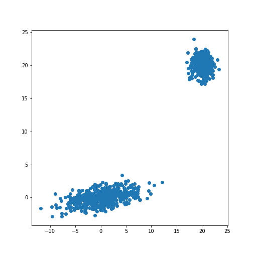
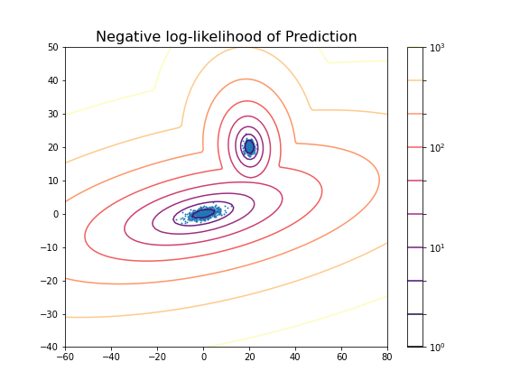
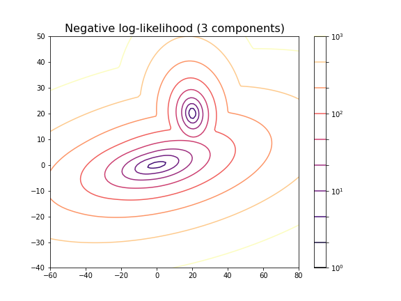
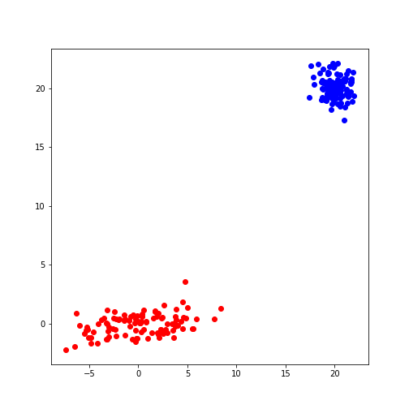
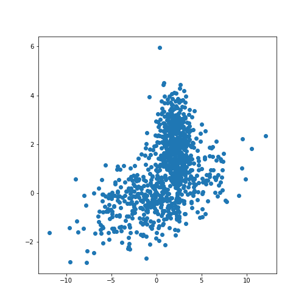
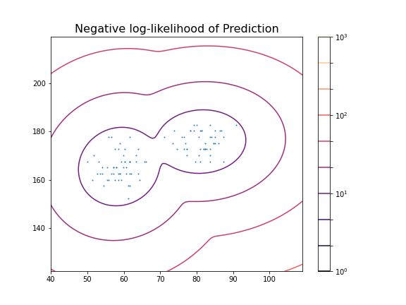
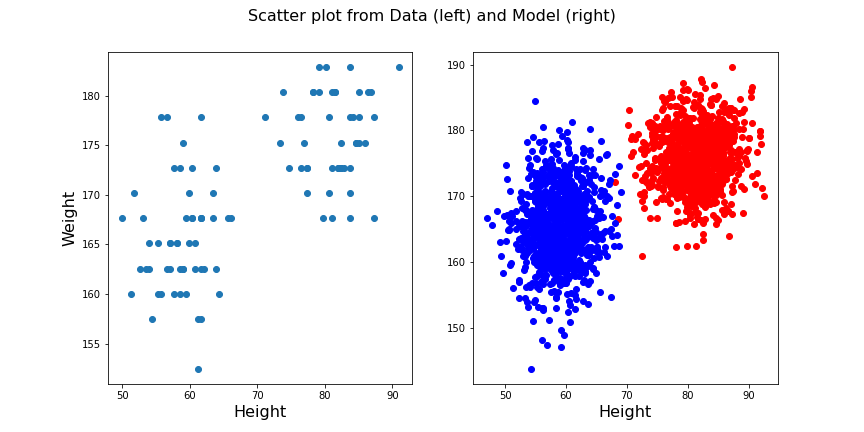

[**Download Chapter notebook (ipynb)**](https://drive.usercontent.google.com/u/1/uc?id=1o4rsr8av-DaGtNILCXNRLnkhCUfoipht&export=download)

[**Download Chapter PDF**](https://drive.usercontent.google.com/u/1/uc?id=1d25T9eqO1vbgIFzKNu3d7UeLSdFHW8i7&export=download)

[<span style="color: rgb(255, 0, 0);">**Mandatory Lesson Feedback Survey**</span>](https://docs.google.com/forms/d/e/1FAIpQLSdr0capF7jloJhPH3Pki1B3LZoKOG16poOpuVJ7SL2LkwLHQA/viewform?pli=1)


:::::::::::::::::::::::::::::::::::::: questions

- How to search for multiple distributions in a dataset?
- How to use Scikit-learn to perform clustering?
- How is data labelled in unsupervised learning?
- How can we score clustering predictions?

::::::::::::::::::::::::::::::::::::::::::::::::

::::::::::::::::::::::::::::::::::::: objectives
- Understanding Multiple Gaussian distributions in a dataset.
- Demonstrating Scikit-learn functionality for Gaussian Mixture Models.
- Learning automated labelling of dataset.
- Obtaining a basic quality score using a ground truth.
::::::::::::::::::::::::::::::::::::::::::::::::

<br>
<p align = "center">
<iframe width="560" height="315" src="https://www.youtube.com/embed/skuOor8jjlU" title="YouTube video player" frameborder="0" allow="accelerometer; autoplay; clipboard-write; encrypted-media; gyroscope; picture-in-picture" allowfullscreen></iframe>
</p>
<br>
<p align = "center">
<iframe width="560" height="315" src="https://www.youtube.com/embed/czt2rKrfIzw" title="YouTube video player" frameborder="0" allow="accelerometer; autoplay; clipboard-write; encrypted-media; gyroscope; picture-in-picture" allowfullscreen></iframe>
</p>
<br>

:::::::::::::::::: prereq
- [Classification Introduction](https://learntodiscover.github.io/ML_supervised/01-classification_intro.html)
- [Classification Improvement](https://learntodiscover.github.io/ML_supervised/02-improvement.html)
::::::::::::::::::

### **Import functions**


``` python
from numpy import arange, asarray, linspace, zeros, c_, mgrid, meshgrid, array, dot, percentile
from numpy import histogram, cumsum, around
from numpy import vstack, sqrt, logspace, amin, amax, equal, invert, count_nonzero
from numpy.random import uniform, seed, randint, randn, multivariate_normal

from matplotlib.pyplot import subplots, scatter, xlabel, ylabel, axis, figure, colorbar, title, show
from matplotlib.colors import LogNorm

from pandas import read_csv
```

## Example
Import the patients data, scatter the data for Weight and Height and get a summary statistics for both.


``` python
df = read_csv("data/patients_data.csv")

# Weigth to kg and height to cm
pound_kg_conversion = 0.45
inch_cm_conversion  = 2.54

df['Weight'] = pound_kg_conversion*df['Weight']
df['Height'] = inch_cm_conversion *df['Height']


fig, ax = subplots()

ax.scatter(df['Weight'], df['Height'])

ax.set_xlabel('Weight (kg)', fontsize=16)
ax.set_ylabel('Height (cm)', fontsize=16)

df[['Weight', 'Height']].describe()

show()
```

``` output
           Weight      Height
count  100.000000  100.000000
mean    69.300000  170.357800
std     11.957139    7.204631
min     49.950000  152.400000
25%     58.837500  165.100000
50%     64.125000  170.180000
75%     81.112500  175.895000
max     90.900000  182.880000
```


<p style='text-align: justify;'>
Looking at the data, one might expect that there are two distinct groups, visually identified as two clouds separated e.g. by a vertical line at Weight $\approx$ 70 (kg). A consequence is that the mean value of 69.3 kg (which was calculated over all samples) should better be replaced by two mean values, one for each of the clouds. Visually, these can be estimated at around 60 and 80 kg.
</p>

We can make this even clearer by looking at the two individual distributions.


``` python
fig, ax = subplots(ncols=2)

ax[0].hist(df['Weight'], bins=20);
ax[0].set_xlabel('Weight', fontsize=16)
ax[0].set_ylabel('Count', fontsize=16)

ax[1].hist(df['Height'], bins=12);
ax[1].set_xlabel('Height', fontsize=16);

show()
```


<p style='text-align: justify;'>
The Weight histogram shows two distributions (at the chosen number of bins) which now also points to the two mean values as guessed above. The Height histogram is at least not compatible with the assumption of a normal distribution as would be expected for a typically noisy variable.
</p>
<p style='text-align: justify;'>
Thus, visual inspection suggests to analyse the data in terms of more than one underlying distribution. The automated assignment of data points to distinct groups is called clustering.
</p>
<p style='text-align: justify;'>
We now want to learn to use the Gaussian Mixture Model approach to find those groups. As we will not provide any labels for the training, this presents an example of unsupervised machine learning. Algorithms of this type of machine learning are designed to learn to optimally assign labels through training. As a result, we will be able to separate a dataset into groups and be able to predict the labels of new, unlabelled data.
</p>

## Gaussian Mixture Models

<p style='text-align: justify;'>
A Gaussian Mixture Models (GMM) approach assumes that the data are composed of two or more normal distributions that may overlap. In a scatter plot that means that there is more than one centre in the density distribution of the data (see scatter plot above). The task is to find the centres and the spread of each distribution in the mixture. The GMM algorithm thus belongs to the category of (probability) Density Estimators. Another way of grouping is to find a curve that splits the plane into two areas.
</p>
<p style='text-align: justify;'>
The GMM assumes normally distributed data structure from at least two sources. Other than that it does not make assumptions about the data.
</p>
<p style='text-align: justify;'>
GMM is a parametric learning approach as it optimises the parameters of a normal distributions, i.e. the mean and the covariance matrix of each group. It is therefore an example of a model fitting method.
</p>
<p style='text-align: justify;'>
As its name suggests, it assumes that the distribution of each group is normal. If the groups are known to have a non-normal distribution, it may not be the optimal approach.
</p>
<p style='text-align: justify;'>
GMM is one example of clustering or [cluster analysis](https://en.wikipedia.org/wiki/Cluster_analysis).
Whenever we suspect that a data set contains contributions of qualitatively different types, we can consider doing a cluster analysis to separate those types. However, this is a vague notion and clustering is therefore a complex field. We can only provide an introduction to its basic components. The main point to keep in mind is that the algorithms provided e.g. by Scikit-learn will always give some result but that it is not easy to assess the quality of the results. Scikit-learn has a good [overview of clustering methods](https://scikit-learn.org/stable/modules/clustering.html#c) showing advantages and disadvantages of each. Here is a link to a readable introduction about the cautious application and the [pitfalls of clustering](https://stke.sciencemag.org/content/9/432/re6.full).
</p>

## Work Through Example

### **Creating test data**
<p style='text-align: justify;'>
Let us create synthetic data for testing of the clustering algorithm. We do this according to the assumptions of GMM: we create two Gaussian data sets with different means and different standard distributions and add them together. For illustration we only use two features.
</p>
The example is adapted from a [Scikit-learn example](https://scikit-learn.org/stable/modules/mixture.html#mixture). It uses the concept of [covariance matrix](https://datascienceplus.com/understanding-the-covariance-matrix/) which is the extension of variance (or standard deviation) to multivariate datasets.


``` python
n_samples = 500
m_features = 2

# Seed the random number generator
RANDOM_NUMBER = 1
seed(RANDOM_NUMBER)

# Data set 1, centered at (20, 20)
mean_11 = 20
mean_12 = 20

gaussian_1 = randn(n_samples, m_features) + array([mean_11, mean_12])


# Data set 2, zero centered and stretched with covariance matrix C
C = array([[1, -0.7], [3.5, .7]])

gaussian_2 = dot(randn(n_samples, m_features), C)


# Concatenate the two Gaussians to obtain the training data set
X_train = vstack([gaussian_1, gaussian_2])

print(X_train.shape)

fig, ax = subplots()

ax.scatter(X_train[:, 0], X_train[:, 1]);

show()
```

``` output
(1000, 2)
```



<p style='text-align: justify;'>
The scatter plot showes that this method allows the adjustment of the centres of the distributions as well as the elliptic shape of the distribution.
</p>
<p style='text-align: justify;'>
Now we fit a GMM. Note that the GMM needs to be told how many components one wants to fit. Modifications that estimate the optimal number of components exist but we will restrict the demonstration to the method that directly sets the number.
</p>
<p style='text-align: justify;'>
Analogous to the classifier in supervised learning, we instantiate the model from the imported class `GaussianMixture`. The instantiation takes the number of independent data sets (clusters) as an argument. By default, the classifier tries to fit the full covariance matrix of each group. The fitting is done using the method `fit`.
</p>


``` python
from sklearn.mixture import GaussianMixture

# Fit a Gaussian Mixture Model with two components

components = 2

clf = GaussianMixture(n_components=components)

clf.fit(X_train)
```

```{=html}
<style>#sk-container-id-1 {color: black;background-color: white;}#sk-container-id-1 pre{padding: 0;}#sk-container-id-1 div.sk-toggleable {background-color: white;}#sk-container-id-1 label.sk-toggleable__label {cursor: pointer;display: block;width: 100%;margin-bottom: 0;padding: 0.3em;box-sizing: border-box;text-align: center;}#sk-container-id-1 label.sk-toggleable__label-arrow:before {content: "▸";float: left;margin-right: 0.25em;color: #696969;}#sk-container-id-1 label.sk-toggleable__label-arrow:hover:before {color: black;}#sk-container-id-1 div.sk-estimator:hover label.sk-toggleable__label-arrow:before {color: black;}#sk-container-id-1 div.sk-toggleable__content {max-height: 0;max-width: 0;overflow: hidden;text-align: left;background-color: #f0f8ff;}#sk-container-id-1 div.sk-toggleable__content pre {margin: 0.2em;color: black;border-radius: 0.25em;background-color: #f0f8ff;}#sk-container-id-1 input.sk-toggleable__control:checked~div.sk-toggleable__content {max-height: 200px;max-width: 100%;overflow: auto;}#sk-container-id-1 input.sk-toggleable__control:checked~label.sk-toggleable__label-arrow:before {content: "▾";}#sk-container-id-1 div.sk-estimator input.sk-toggleable__control:checked~label.sk-toggleable__label {background-color: #d4ebff;}#sk-container-id-1 div.sk-label input.sk-toggleable__control:checked~label.sk-toggleable__label {background-color: #d4ebff;}#sk-container-id-1 input.sk-hidden--visually {border: 0;clip: rect(1px 1px 1px 1px);clip: rect(1px, 1px, 1px, 1px);height: 1px;margin: -1px;overflow: hidden;padding: 0;position: absolute;width: 1px;}#sk-container-id-1 div.sk-estimator {font-family: monospace;background-color: #f0f8ff;border: 1px dotted black;border-radius: 0.25em;box-sizing: border-box;margin-bottom: 0.5em;}#sk-container-id-1 div.sk-estimator:hover {background-color: #d4ebff;}#sk-container-id-1 div.sk-parallel-item::after {content: "";width: 100%;border-bottom: 1px solid gray;flex-grow: 1;}#sk-container-id-1 div.sk-label:hover label.sk-toggleable__label {background-color: #d4ebff;}#sk-container-id-1 div.sk-serial::before {content: "";position: absolute;border-left: 1px solid gray;box-sizing: border-box;top: 0;bottom: 0;left: 50%;z-index: 0;}#sk-container-id-1 div.sk-serial {display: flex;flex-direction: column;align-items: center;background-color: white;padding-right: 0.2em;padding-left: 0.2em;position: relative;}#sk-container-id-1 div.sk-item {position: relative;z-index: 1;}#sk-container-id-1 div.sk-parallel {display: flex;align-items: stretch;justify-content: center;background-color: white;position: relative;}#sk-container-id-1 div.sk-item::before, #sk-container-id-1 div.sk-parallel-item::before {content: "";position: absolute;border-left: 1px solid gray;box-sizing: border-box;top: 0;bottom: 0;left: 50%;z-index: -1;}#sk-container-id-1 div.sk-parallel-item {display: flex;flex-direction: column;z-index: 1;position: relative;background-color: white;}#sk-container-id-1 div.sk-parallel-item:first-child::after {align-self: flex-end;width: 50%;}#sk-container-id-1 div.sk-parallel-item:last-child::after {align-self: flex-start;width: 50%;}#sk-container-id-1 div.sk-parallel-item:only-child::after {width: 0;}#sk-container-id-1 div.sk-dashed-wrapped {border: 1px dashed gray;margin: 0 0.4em 0.5em 0.4em;box-sizing: border-box;padding-bottom: 0.4em;background-color: white;}#sk-container-id-1 div.sk-label label {font-family: monospace;font-weight: bold;display: inline-block;line-height: 1.2em;}#sk-container-id-1 div.sk-label-container {text-align: center;}#sk-container-id-1 div.sk-container {/* jupyter's `normalize.less` sets `[hidden] { display: none; }` but bootstrap.min.css set `[hidden] { display: none !important; }` so we also need the `!important` here to be able to override the default hidden behavior on the sphinx rendered scikit-learn.org. See: https://github.com/scikit-learn/scikit-learn/issues/21755 */display: inline-block !important;position: relative;}#sk-container-id-1 div.sk-text-repr-fallback {display: none;}</style><div id="sk-container-id-1" class="sk-top-container"><div class="sk-text-repr-fallback"><pre>GaussianMixture(n_components=2)</pre><b>In a Jupyter environment, please rerun this cell to show the HTML representation or trust the notebook. <br />On GitHub, the HTML representation is unable to render, please try loading this page with nbviewer.org.</b></div><div class="sk-container" hidden><div class="sk-item"><div class="sk-estimator sk-toggleable"><input class="sk-toggleable__control sk-hidden--visually" id="sk-estimator-id-1" type="checkbox" checked><label for="sk-estimator-id-1" class="sk-toggleable__label sk-toggleable__label-arrow">GaussianMixture</label><div class="sk-toggleable__content"><pre>GaussianMixture(n_components=2)</pre></div></div></div></div></div>
```

<p style='text-align: justify;'>
After the fitting of the model, we first create a meshgrid of the (two-dimensional) state space. For each point in this state space, we obtain the predicted scores using the method `.score_samples`. These are the weighted logarithmic probabilities which show the predicted distribution of points in the state space.
</p>


``` python
resolution = 100

vec_a = linspace(-60., 80., resolution)
vec_b = linspace(-40., 50., resolution)

grid_a, grid_b = meshgrid(vec_a, vec_b)

XY_statespace = c_[grid_a.ravel(), grid_b.ravel()]

Z_score = clf.score_samples(XY_statespace)

Z_s = Z_score.reshape(grid_a.shape)

print(Z_s.shape)
```

``` output
(100, 100)
```

<p style='text-align: justify;'>
Now we can display the predicted scores as a contour plot. Typically, the negative log-likelihood or [density estimation](https://scikit-learn.org/stable/auto_examples/mixture/plot_gmm_pdf.html?highlight=lognorm) is used for this. In this case, the highest probabilities are shown as a landscape with two minima.
</p>


``` python
fig, ax = subplots(figsize=(8, 6))

cax = ax.contour(grid_a, grid_b, -Z_s,
           norm=LogNorm(vmin=1.0, vmax=1000.0),
           levels=logspace(0, 3, 10),
           cmap='magma'
          )

fig.colorbar(cax);

ax.scatter(X_train[:, 0], X_train[:, 1], .8)

title('Negative log-likelihood of Prediction', fontsize=16)
axis('tight');

show()
```



You can change the number of components to see the impact it has on the result. E.g. picking 3 components:


``` python
clf_3 = GaussianMixture(n_components=3)

clf_3.fit(X_train)

Z_score_3 = clf_3.score_samples(XY_statespace)

Z_s_3 = Z_score_3.reshape(grid_a.shape)

fig, ax = subplots(figsize=(8, 6))

cax = ax.contour(grid_a, grid_b, -Z_s_3,
           norm=LogNorm(vmin=1.0, vmax=1000.0),
           levels=logspace(0, 3, 10),
           cmap='magma'
          )

fig.colorbar(cax);

title('Negative log-likelihood (3 components)', fontsize=16)
axis('tight');

show()
```

```{=html}
<style>#sk-container-id-2 {color: black;background-color: white;}#sk-container-id-2 pre{padding: 0;}#sk-container-id-2 div.sk-toggleable {background-color: white;}#sk-container-id-2 label.sk-toggleable__label {cursor: pointer;display: block;width: 100%;margin-bottom: 0;padding: 0.3em;box-sizing: border-box;text-align: center;}#sk-container-id-2 label.sk-toggleable__label-arrow:before {content: "▸";float: left;margin-right: 0.25em;color: #696969;}#sk-container-id-2 label.sk-toggleable__label-arrow:hover:before {color: black;}#sk-container-id-2 div.sk-estimator:hover label.sk-toggleable__label-arrow:before {color: black;}#sk-container-id-2 div.sk-toggleable__content {max-height: 0;max-width: 0;overflow: hidden;text-align: left;background-color: #f0f8ff;}#sk-container-id-2 div.sk-toggleable__content pre {margin: 0.2em;color: black;border-radius: 0.25em;background-color: #f0f8ff;}#sk-container-id-2 input.sk-toggleable__control:checked~div.sk-toggleable__content {max-height: 200px;max-width: 100%;overflow: auto;}#sk-container-id-2 input.sk-toggleable__control:checked~label.sk-toggleable__label-arrow:before {content: "▾";}#sk-container-id-2 div.sk-estimator input.sk-toggleable__control:checked~label.sk-toggleable__label {background-color: #d4ebff;}#sk-container-id-2 div.sk-label input.sk-toggleable__control:checked~label.sk-toggleable__label {background-color: #d4ebff;}#sk-container-id-2 input.sk-hidden--visually {border: 0;clip: rect(1px 1px 1px 1px);clip: rect(1px, 1px, 1px, 1px);height: 1px;margin: -1px;overflow: hidden;padding: 0;position: absolute;width: 1px;}#sk-container-id-2 div.sk-estimator {font-family: monospace;background-color: #f0f8ff;border: 1px dotted black;border-radius: 0.25em;box-sizing: border-box;margin-bottom: 0.5em;}#sk-container-id-2 div.sk-estimator:hover {background-color: #d4ebff;}#sk-container-id-2 div.sk-parallel-item::after {content: "";width: 100%;border-bottom: 1px solid gray;flex-grow: 1;}#sk-container-id-2 div.sk-label:hover label.sk-toggleable__label {background-color: #d4ebff;}#sk-container-id-2 div.sk-serial::before {content: "";position: absolute;border-left: 1px solid gray;box-sizing: border-box;top: 0;bottom: 0;left: 50%;z-index: 0;}#sk-container-id-2 div.sk-serial {display: flex;flex-direction: column;align-items: center;background-color: white;padding-right: 0.2em;padding-left: 0.2em;position: relative;}#sk-container-id-2 div.sk-item {position: relative;z-index: 1;}#sk-container-id-2 div.sk-parallel {display: flex;align-items: stretch;justify-content: center;background-color: white;position: relative;}#sk-container-id-2 div.sk-item::before, #sk-container-id-2 div.sk-parallel-item::before {content: "";position: absolute;border-left: 1px solid gray;box-sizing: border-box;top: 0;bottom: 0;left: 50%;z-index: -1;}#sk-container-id-2 div.sk-parallel-item {display: flex;flex-direction: column;z-index: 1;position: relative;background-color: white;}#sk-container-id-2 div.sk-parallel-item:first-child::after {align-self: flex-end;width: 50%;}#sk-container-id-2 div.sk-parallel-item:last-child::after {align-self: flex-start;width: 50%;}#sk-container-id-2 div.sk-parallel-item:only-child::after {width: 0;}#sk-container-id-2 div.sk-dashed-wrapped {border: 1px dashed gray;margin: 0 0.4em 0.5em 0.4em;box-sizing: border-box;padding-bottom: 0.4em;background-color: white;}#sk-container-id-2 div.sk-label label {font-family: monospace;font-weight: bold;display: inline-block;line-height: 1.2em;}#sk-container-id-2 div.sk-label-container {text-align: center;}#sk-container-id-2 div.sk-container {/* jupyter's `normalize.less` sets `[hidden] { display: none; }` but bootstrap.min.css set `[hidden] { display: none !important; }` so we also need the `!important` here to be able to override the default hidden behavior on the sphinx rendered scikit-learn.org. See: https://github.com/scikit-learn/scikit-learn/issues/21755 */display: inline-block !important;position: relative;}#sk-container-id-2 div.sk-text-repr-fallback {display: none;}</style><div id="sk-container-id-2" class="sk-top-container"><div class="sk-text-repr-fallback"><pre>GaussianMixture(n_components=3)</pre><b>In a Jupyter environment, please rerun this cell to show the HTML representation or trust the notebook. <br />On GitHub, the HTML representation is unable to render, please try loading this page with nbviewer.org.</b></div><div class="sk-container" hidden><div class="sk-item"><div class="sk-estimator sk-toggleable"><input class="sk-toggleable__control sk-hidden--visually" id="sk-estimator-id-2" type="checkbox" checked><label for="sk-estimator-id-2" class="sk-toggleable__label sk-toggleable__label-arrow">GaussianMixture</label><div class="sk-toggleable__content"><pre>GaussianMixture(n_components=3)</pre></div></div></div></div></div>
```


<p style='text-align: justify;'>
For the choice of 3 components it does not lead to a probability distribution with 3 distinct maxima. This is because two of the maxima coincide or at least nearly coincide.
</p>
<p style='text-align: justify;'>
In our example, the choice of 2 components is very obvious because as done above, we could visualise the complete state space and there was a visually discernible structure in the data. In high-dimensional data the task is difficult and while methods exist to automatically find the [optimal number of components for some clustering methods](https://en.wikipedia.org/wiki/Determining_the_number_of_clusters_in_a_data_set), the success of these depends very much on the problem.
</p>

### **Getting optimal model parameters**
<p style='text-align: justify;'>
Now that the estimator is fitted, we can obtain the optimal parameters for the fitted components. They are stored in the model attributes. We can extract (i) the `.weights_`, the share of each of the components (Gaussians) in the mixture; (ii) the `.means_`, the coordinates of the mean values; and (iii) `.covariances_`, the covariance matrix of each component.
</p>


``` python
components = 2

clf = GaussianMixture(n_components=components);

clf.fit(X_train)

print('Model Weights: ')
print(clf.weights_)
print('')

print('Mean coordinates: ')
print(clf.means_)
print('')
print('Covariance Matrices: ')
print(clf.covariances_)
```

```{=html}
<style>#sk-container-id-3 {color: black;background-color: white;}#sk-container-id-3 pre{padding: 0;}#sk-container-id-3 div.sk-toggleable {background-color: white;}#sk-container-id-3 label.sk-toggleable__label {cursor: pointer;display: block;width: 100%;margin-bottom: 0;padding: 0.3em;box-sizing: border-box;text-align: center;}#sk-container-id-3 label.sk-toggleable__label-arrow:before {content: "▸";float: left;margin-right: 0.25em;color: #696969;}#sk-container-id-3 label.sk-toggleable__label-arrow:hover:before {color: black;}#sk-container-id-3 div.sk-estimator:hover label.sk-toggleable__label-arrow:before {color: black;}#sk-container-id-3 div.sk-toggleable__content {max-height: 0;max-width: 0;overflow: hidden;text-align: left;background-color: #f0f8ff;}#sk-container-id-3 div.sk-toggleable__content pre {margin: 0.2em;color: black;border-radius: 0.25em;background-color: #f0f8ff;}#sk-container-id-3 input.sk-toggleable__control:checked~div.sk-toggleable__content {max-height: 200px;max-width: 100%;overflow: auto;}#sk-container-id-3 input.sk-toggleable__control:checked~label.sk-toggleable__label-arrow:before {content: "▾";}#sk-container-id-3 div.sk-estimator input.sk-toggleable__control:checked~label.sk-toggleable__label {background-color: #d4ebff;}#sk-container-id-3 div.sk-label input.sk-toggleable__control:checked~label.sk-toggleable__label {background-color: #d4ebff;}#sk-container-id-3 input.sk-hidden--visually {border: 0;clip: rect(1px 1px 1px 1px);clip: rect(1px, 1px, 1px, 1px);height: 1px;margin: -1px;overflow: hidden;padding: 0;position: absolute;width: 1px;}#sk-container-id-3 div.sk-estimator {font-family: monospace;background-color: #f0f8ff;border: 1px dotted black;border-radius: 0.25em;box-sizing: border-box;margin-bottom: 0.5em;}#sk-container-id-3 div.sk-estimator:hover {background-color: #d4ebff;}#sk-container-id-3 div.sk-parallel-item::after {content: "";width: 100%;border-bottom: 1px solid gray;flex-grow: 1;}#sk-container-id-3 div.sk-label:hover label.sk-toggleable__label {background-color: #d4ebff;}#sk-container-id-3 div.sk-serial::before {content: "";position: absolute;border-left: 1px solid gray;box-sizing: border-box;top: 0;bottom: 0;left: 50%;z-index: 0;}#sk-container-id-3 div.sk-serial {display: flex;flex-direction: column;align-items: center;background-color: white;padding-right: 0.2em;padding-left: 0.2em;position: relative;}#sk-container-id-3 div.sk-item {position: relative;z-index: 1;}#sk-container-id-3 div.sk-parallel {display: flex;align-items: stretch;justify-content: center;background-color: white;position: relative;}#sk-container-id-3 div.sk-item::before, #sk-container-id-3 div.sk-parallel-item::before {content: "";position: absolute;border-left: 1px solid gray;box-sizing: border-box;top: 0;bottom: 0;left: 50%;z-index: -1;}#sk-container-id-3 div.sk-parallel-item {display: flex;flex-direction: column;z-index: 1;position: relative;background-color: white;}#sk-container-id-3 div.sk-parallel-item:first-child::after {align-self: flex-end;width: 50%;}#sk-container-id-3 div.sk-parallel-item:last-child::after {align-self: flex-start;width: 50%;}#sk-container-id-3 div.sk-parallel-item:only-child::after {width: 0;}#sk-container-id-3 div.sk-dashed-wrapped {border: 1px dashed gray;margin: 0 0.4em 0.5em 0.4em;box-sizing: border-box;padding-bottom: 0.4em;background-color: white;}#sk-container-id-3 div.sk-label label {font-family: monospace;font-weight: bold;display: inline-block;line-height: 1.2em;}#sk-container-id-3 div.sk-label-container {text-align: center;}#sk-container-id-3 div.sk-container {/* jupyter's `normalize.less` sets `[hidden] { display: none; }` but bootstrap.min.css set `[hidden] { display: none !important; }` so we also need the `!important` here to be able to override the default hidden behavior on the sphinx rendered scikit-learn.org. See: https://github.com/scikit-learn/scikit-learn/issues/21755 */display: inline-block !important;position: relative;}#sk-container-id-3 div.sk-text-repr-fallback {display: none;}</style><div id="sk-container-id-3" class="sk-top-container"><div class="sk-text-repr-fallback"><pre>GaussianMixture(n_components=2)</pre><b>In a Jupyter environment, please rerun this cell to show the HTML representation or trust the notebook. <br />On GitHub, the HTML representation is unable to render, please try loading this page with nbviewer.org.</b></div><div class="sk-container" hidden><div class="sk-item"><div class="sk-estimator sk-toggleable"><input class="sk-toggleable__control sk-hidden--visually" id="sk-estimator-id-3" type="checkbox" checked><label for="sk-estimator-id-3" class="sk-toggleable__label sk-toggleable__label-arrow">GaussianMixture</label><div class="sk-toggleable__content"><pre>GaussianMixture(n_components=2)</pre></div></div></div></div></div>
```

``` output
Model Weights: 
[0.5 0.5]

Mean coordinates: 
[[ 2.00467649e+01  2.00308601e+01]
 [ 1.10681138e-01 -6.87868023e-03]]

Covariance Matrices: 
[[[ 0.95442218 -0.06641459]
  [-0.06641459  0.97019156]]

 [[13.78557368  1.81677876]
  [ 1.81677876  1.04931994]]]
```

<p style='text-align: justify;'>
The fit returns a model where the two components have equal weight. The means and covariance matrices can be compared directly to the values chosen to create the data. They are not identical but good estimates are obtained from a fit to 500 data points in each group.
</p>

### **Create data from optimal model**
<p style='text-align: justify;'>
The result of the fitting are the parameters for two Gaussian distributions with two features each. These parameters can be used to create further model data with the same characteristics. In our demonstration we know the original sources but if the parameters are obtained from experimental or clinical data, it is useful to visualise the predicted distributions using as many samples as necessary.
</p>
If we know the mean and the covariance matrix of a Gaussian, the function `multivariate_normal` can be used to create data from that Gaussian.


``` python
model1_mean, model2_mean = clf.means_[0], clf.means_[1]
model1_cov, model2_cov =  clf.covariances_[0], clf.covariances_[1]

samples = 100

model1_data = multivariate_normal(model1_mean, model1_cov, samples)
model2_data = multivariate_normal(model2_mean, model2_cov, samples)

fig, ax = subplots()

ax.scatter(model1_data[:, 0], model1_data[:, 1], c='b');
ax.scatter(model2_data[:, 0], model2_data[:, 1], c='r');

show()
```



### **Predicting Labels**

Now we can apply what we have discussed in supervised machine learning and use the trained model to predict.
<p style='text-align: justify;'>
We can get the predictions of the group for new data. Here, for simplicity, we create test data from the same distribution as the train data. The label is obtained from the method `.predict`.
</p>


``` python
n_samples = 10
m_features = 2

# Seed the random number generator
RANDOM_NUMBER = 111
seed(RANDOM_NUMBER)

# Data set 1, centered at (20, 20)

mean_11 = 20
mean_12 = 20

gaussian_1 = randn(n_samples, m_features) + array([mean_11, mean_12])


# Data set 2, zero centered and stretched with covariance matrix C

C = array([[1, -0.7], [3.5, .7]])

gaussian_2 = dot(randn(n_samples, m_features), C)


# Concatenate the two Gaussians to obtain the training data set
X_test = vstack([gaussian_1, gaussian_2])


# Predict group
y_test = clf.predict(X_test)

print(y_test)
```

``` output
[0 0 0 0 0 0 0 0 0 0 1 1 1 1 1 1 1 1 1 1]
```
<p style='text-align: justify;'>
For simplicity, fit and predict can be combined with the `.fit_predict` method to directly get the labels for each sample. Here is an example where we fit the model to the test data and directly extract their predicted labels.
</p>


``` python
components = 2

clf_2 = GaussianMixture(n_components=components, covariance_type='full')

labels = clf_2.fit_predict(X_test)
print(labels)
```

``` output
[1 1 1 1 1 1 1 1 1 1 0 0 0 0 0 0 0 0 0 0]
```

<p style='text-align: justify;'>
The probabilities of the predictions are obtained from the method `.predict_proba`. In this case, all probabilities are 0 and 1 respectively. The model is sure about their group signature.
</p>


``` python
y_proba = clf.predict_proba(X_test)

fig, ax = subplots()

ax.hist(y_proba, bins=10);

show()
```


<p style='text-align: justify;'>
The `.sample_` method produces individual samples from the trained model. It takes the number of required samples as an input argument and yields the sample values as well as the group for each sample. Samples for each group are given with probability according to the group weights.
</p>


``` python
samples = clf.sample(5)

print(samples[0])
print('')
print(samples[1])
```

``` output
[[20.06076245 20.69983729]
 [21.67317947 21.86459529]
 [ 4.90658144 -0.99981225]
 [ 4.74232451  0.2655483 ]
 [ 0.92148265  2.32782549]]

[0 0 1 1 1]
```

We can now redo the example with two distributions that lie closer together, i.e. making the clustering task harder.


``` python
n_samples = 500
m_features = 2

# Seed the random number generator
RANDOM_NUMBER = 1
seed(RANDOM_NUMBER)

# Data set 1, centered at (20, 20)

mean_11 = 2
mean_12 = 2

gaussian_1 = randn(n_samples, m_features) + array([mean_11, mean_12])


# Data set 2, zero centered and stretched with covariance matrix C

C = array([[1, -0.7], [3.5, .7]])

gaussian_2 = dot(randn(n_samples, m_features), C)


# Concatenate the two Gaussians to obtain the training data set
X_train = vstack([gaussian_1, gaussian_2])

print(X_train.shape)

fig, ax = subplots()

ax.scatter(X_train[:, 0], X_train[:, 1]);

show()
```

``` output
(1000, 2)
```




``` python
components = 2

clf2 = GaussianMixture(n_components=components)

clf2.fit(X_train)

resolution = 100

vec_a = linspace(-40., 60., resolution)
vec_b = linspace(-20., 30., resolution)

grid_a, grid_b = meshgrid(vec_a, vec_b)

XY_statespace = c_[grid_a.ravel(), grid_b.ravel()]

Z_score = clf2.score_samples(XY_statespace)

Z_s = Z_score.reshape(grid_a.shape)

fig, ax = subplots(figsize=(8, 6))

cax = ax.contour(grid_a, grid_b, -Z_s,
           norm=LogNorm(vmin=1.0, vmax=1000.0),
           levels=logspace(0, 3, 10),
           cmap='magma'
          )

fig.colorbar(cax);

ax.scatter(X_train[:, 0], X_train[:, 1], .8)

title('Negative log-likelihood of Prediction', fontsize=16)
axis('tight');

show()
```

```{=html}
<style>#sk-container-id-4 {color: black;background-color: white;}#sk-container-id-4 pre{padding: 0;}#sk-container-id-4 div.sk-toggleable {background-color: white;}#sk-container-id-4 label.sk-toggleable__label {cursor: pointer;display: block;width: 100%;margin-bottom: 0;padding: 0.3em;box-sizing: border-box;text-align: center;}#sk-container-id-4 label.sk-toggleable__label-arrow:before {content: "▸";float: left;margin-right: 0.25em;color: #696969;}#sk-container-id-4 label.sk-toggleable__label-arrow:hover:before {color: black;}#sk-container-id-4 div.sk-estimator:hover label.sk-toggleable__label-arrow:before {color: black;}#sk-container-id-4 div.sk-toggleable__content {max-height: 0;max-width: 0;overflow: hidden;text-align: left;background-color: #f0f8ff;}#sk-container-id-4 div.sk-toggleable__content pre {margin: 0.2em;color: black;border-radius: 0.25em;background-color: #f0f8ff;}#sk-container-id-4 input.sk-toggleable__control:checked~div.sk-toggleable__content {max-height: 200px;max-width: 100%;overflow: auto;}#sk-container-id-4 input.sk-toggleable__control:checked~label.sk-toggleable__label-arrow:before {content: "▾";}#sk-container-id-4 div.sk-estimator input.sk-toggleable__control:checked~label.sk-toggleable__label {background-color: #d4ebff;}#sk-container-id-4 div.sk-label input.sk-toggleable__control:checked~label.sk-toggleable__label {background-color: #d4ebff;}#sk-container-id-4 input.sk-hidden--visually {border: 0;clip: rect(1px 1px 1px 1px);clip: rect(1px, 1px, 1px, 1px);height: 1px;margin: -1px;overflow: hidden;padding: 0;position: absolute;width: 1px;}#sk-container-id-4 div.sk-estimator {font-family: monospace;background-color: #f0f8ff;border: 1px dotted black;border-radius: 0.25em;box-sizing: border-box;margin-bottom: 0.5em;}#sk-container-id-4 div.sk-estimator:hover {background-color: #d4ebff;}#sk-container-id-4 div.sk-parallel-item::after {content: "";width: 100%;border-bottom: 1px solid gray;flex-grow: 1;}#sk-container-id-4 div.sk-label:hover label.sk-toggleable__label {background-color: #d4ebff;}#sk-container-id-4 div.sk-serial::before {content: "";position: absolute;border-left: 1px solid gray;box-sizing: border-box;top: 0;bottom: 0;left: 50%;z-index: 0;}#sk-container-id-4 div.sk-serial {display: flex;flex-direction: column;align-items: center;background-color: white;padding-right: 0.2em;padding-left: 0.2em;position: relative;}#sk-container-id-4 div.sk-item {position: relative;z-index: 1;}#sk-container-id-4 div.sk-parallel {display: flex;align-items: stretch;justify-content: center;background-color: white;position: relative;}#sk-container-id-4 div.sk-item::before, #sk-container-id-4 div.sk-parallel-item::before {content: "";position: absolute;border-left: 1px solid gray;box-sizing: border-box;top: 0;bottom: 0;left: 50%;z-index: -1;}#sk-container-id-4 div.sk-parallel-item {display: flex;flex-direction: column;z-index: 1;position: relative;background-color: white;}#sk-container-id-4 div.sk-parallel-item:first-child::after {align-self: flex-end;width: 50%;}#sk-container-id-4 div.sk-parallel-item:last-child::after {align-self: flex-start;width: 50%;}#sk-container-id-4 div.sk-parallel-item:only-child::after {width: 0;}#sk-container-id-4 div.sk-dashed-wrapped {border: 1px dashed gray;margin: 0 0.4em 0.5em 0.4em;box-sizing: border-box;padding-bottom: 0.4em;background-color: white;}#sk-container-id-4 div.sk-label label {font-family: monospace;font-weight: bold;display: inline-block;line-height: 1.2em;}#sk-container-id-4 div.sk-label-container {text-align: center;}#sk-container-id-4 div.sk-container {/* jupyter's `normalize.less` sets `[hidden] { display: none; }` but bootstrap.min.css set `[hidden] { display: none !important; }` so we also need the `!important` here to be able to override the default hidden behavior on the sphinx rendered scikit-learn.org. See: https://github.com/scikit-learn/scikit-learn/issues/21755 */display: inline-block !important;position: relative;}#sk-container-id-4 div.sk-text-repr-fallback {display: none;}</style><div id="sk-container-id-4" class="sk-top-container"><div class="sk-text-repr-fallback"><pre>GaussianMixture(n_components=2)</pre><b>In a Jupyter environment, please rerun this cell to show the HTML representation or trust the notebook. <br />On GitHub, the HTML representation is unable to render, please try loading this page with nbviewer.org.</b></div><div class="sk-container" hidden><div class="sk-item"><div class="sk-estimator sk-toggleable"><input class="sk-toggleable__control sk-hidden--visually" id="sk-estimator-id-4" type="checkbox" checked><label for="sk-estimator-id-4" class="sk-toggleable__label sk-toggleable__label-arrow">GaussianMixture</label><div class="sk-toggleable__content"><pre>GaussianMixture(n_components=2)</pre></div></div></div></div></div>
```


``` python
print('Model Weights: ')
print(clf2.weights_)
print('')

print('Mean coordinates: ')
print(clf2.means_)
print('')

print('Covariance Matrices: ')
print(clf2.covariances_)
print('')

y_predict = clf2.predict(X_train)

print('Predicted Labels')
print(y_predict)
```

``` output
Model Weights: 
[0.51626883 0.48373117]

Mean coordinates: 
[[ 2.02822009  2.0218213 ]
 [ 0.06535904 -0.06576508]]

Covariance Matrices: 
[[[ 0.95990893 -0.03850552]
  [-0.03850552  0.94445254]]

 [[14.15940548  1.77380246]
  [ 1.77380246  0.97555916]]]

Predicted Labels
[0 0 1 0 0 1 0 0 0 0 0 0 0 0 0 0 0 0 0 0 0 0 0 0 0 0 0 0 0 0 0 0 0 0 1 0 0
 1 0 0 0 0 0 0 0 0 0 0 0 0 0 0 0 0 0 0 0 0 0 0 0 0 0 0 0 0 0 0 0 0 0 0 0 0
 0 1 0 0 0 0 0 0 0 0 1 0 1 0 0 0 0 0 0 0 0 0 0 1 0 0 0 0 1 0 0 0 0 0 0 0 0
 0 0 0 0 0 0 0 0 0 0 0 0 0 1 0 0 0 0 0 0 0 0 0 0 0 0 0 0 0 0 0 0 0 0 0 0 0
 0 0 1 0 0 0 0 0 0 0 0 0 0 0 0 0 0 0 0 0 1 1 0 0 0 0 0 0 0 0 0 0 0 0 0 1 0
 0 0 0 1 0 0 0 0 0 0 0 0 0 0 0 0 0 0 1 0 0 0 1 0 1 0 0 0 0 0 0 0 0 0 0 1 0
 0 0 0 0 0 0 0 0 0 0 0 0 0 0 0 0 1 0 0 0 0 0 0 0 0 0 1 0 0 0 0 0 0 0 0 0 0
 0 0 0 0 0 0 0 0 0 0 0 0 0 1 0 0 0 0 0 0 0 0 0 0 0 0 0 0 0 0 0 0 0 0 0 1 0
 0 0 0 0 0 0 0 0 0 0 0 1 0 0 1 0 0 0 0 0 0 0 0 0 0 0 0 1 0 0 0 0 0 0 1 0 0
 0 0 0 0 0 0 0 0 0 1 0 0 0 0 0 0 0 0 0 0 0 0 1 0 0 0 0 0 0 0 0 0 0 1 0 0 1
 0 0 0 0 0 0 0 0 0 0 0 0 1 0 0 0 0 0 0 1 0 0 1 0 0 0 0 0 0 0 0 0 0 0 0 0 0
 0 0 0 0 0 0 0 0 0 0 0 0 0 0 0 0 0 0 0 0 0 0 0 0 0 0 0 0 1 0 0 0 0 0 0 0 0
 0 0 0 0 1 0 0 0 0 0 0 0 0 0 0 0 0 0 0 0 0 0 0 0 0 0 0 0 0 0 0 0 0 0 0 0 0
 0 0 0 0 0 1 0 1 0 0 0 0 0 0 0 0 0 0 0 1 1 1 0 1 1 0 1 1 1 1 1 1 1 1 1 1 1
 1 1 0 1 1 1 1 1 1 1 1 1 1 1 1 1 1 0 1 1 1 0 1 1 1 1 1 1 1 1 1 1 1 1 1 1 0
 0 1 1 1 1 0 0 1 1 1 1 1 1 1 0 1 1 0 1 1 1 1 0 1 1 1 1 1 1 0 1 0 1 1 1 1 0
 1 1 1 1 1 1 1 1 0 1 1 1 1 1 1 1 1 1 0 1 1 0 1 1 1 1 1 1 1 1 1 1 1 0 1 1 1
 0 1 1 1 1 1 1 1 1 1 1 1 1 0 1 1 1 1 1 1 1 1 1 1 0 0 0 1 1 1 1 1 1 1 1 1 1
 1 1 1 1 1 1 1 1 1 1 1 1 0 0 1 1 0 1 1 1 1 1 1 1 1 1 1 1 1 0 1 1 1 1 1 1 1
 1 1 1 1 1 1 1 1 1 1 1 1 0 1 1 0 1 1 1 1 1 0 1 1 1 1 1 0 1 1 1 1 0 1 1 1 1
 1 1 1 1 1 1 1 1 1 1 1 1 0 1 1 0 1 1 1 1 1 1 1 1 1 1 1 1 1 1 1 1 1 1 1 1 0
 1 1 1 1 1 1 0 1 1 1 1 1 1 1 1 1 1 1 1 0 1 1 1 1 1 0 1 1 0 1 1 1 1 1 1 1 1
 1 1 1 1 1 1 1 1 1 1 0 1 0 0 0 1 1 1 1 1 1 1 1 1 1 0 1 1 1 0 1 1 1 1 0 0 1
 1 1 1 0 1 1 1 1 1 1 1 1 0 1 1 1 0 1 1 1 1 1 1 1 1 1 1 0 1 1 0 0 1 1 1 0 1
 1 0 1 1 1 1 1 1 1 0 1 1 0 1 1 1 1 1 1 1 0 1 1 0 1 1 1 1 1 1 1 1 1 1 1 1 1
 1 1 1 1 0 1 1 1 1 1 1 1 1 0 1 1 1 0 1 1 1 0 1 1 1 1 1 0 1 1 1 1 1 1 1 1 1
 1 1 1 1 1 0 1 0 1 0 1 1 1 1 1 1 1 1 1 1 1 1 1 1 1 1 1 1 1 1 1 1 1 0 1 1 1
 1]
```


### **Scoring of Predictions**
<p style='text-align: justify;'>
Knowing the origin of the data we can now compare the predicted labels with the true labels (the ground truth) and obtain a scoring. A function provided by Scikit-learn is the (adjusted or unadjusted) __Rand index__. It measures the similarity of the predicted and the true assignments. However, random assignment of labels will (by chance) lead to a number of correct predictions. To adjust for this fact and ensure that randomly assigned labels get a scoring close to zero, the function to use is `adjusted_rand_score`:
</p>


``` python
from sklearn.metrics.cluster import adjusted_rand_score

y_true = zeros(2*n_samples)
y_true[n_samples:] = 1

scoring = adjusted_rand_score(y_true, y_predict)

print(scoring)
```

``` output
0.6174145036659798
```
<p style='text-align: justify;'>
The result shows that even though the two distributions are strongly overlapping, there is still a reasonable score based on the known ground truth.
</p>
<p style='text-align: justify;'>
It is important to remember that the ground truth is typically not known. There are therefore also measures to score the outcome based on within-data criteria. See [internal evaluation of the wikipedia article](https://en.wikipedia.org/wiki/Cluster_analysis) for some techniques.
</p>
<p style='text-align: justify;'>
In general, the outcome of clustering is not easy to assess with confidence and specific measures need to be developed based on additional knowledge about the source of the data.
</p>

## Application to Example Data

Let us now apply the GMM approach to the example at the beginning of the lesson.


``` python
from pandas import read_csv

df = read_csv("data/patients_data.csv")

df['Weight'] = 0.45*df['Weight']
df['Height'] = 2.54*df['Height']

X_train = df[['Weight', 'Height']]
X_train = X_train.to_numpy()

print(X_train.shape)
```

``` output
(100, 2)
```

Now we can fit the GMM classifier using the suspected number of two components.


``` python
clf = GaussianMixture(n_components=2)

clf.fit(X_train)

resolution = 100

vec_a = linspace(0.8*min(X_train[:,0]), 1.2*max(X_train[:,0]), resolution)
vec_b = linspace(0.8*min(X_train[:,1]), 1.2*max(X_train[:,1]), resolution)

grid_a, grid_b = meshgrid(vec_a, vec_b)

XY_statespace = c_[grid_a.ravel(), grid_b.ravel()]

Z_score = clf.score_samples(XY_statespace)

Z_s = Z_score.reshape(grid_a.shape)


fig, ax = subplots(figsize=(8, 6))

cax = ax.contour(grid_a, grid_b, -Z_s,
           norm=LogNorm(vmin=1.0, vmax=1000.0),
           levels=logspace(0, 3, 10),
           cmap='magma'
          )

fig.colorbar(cax);

ax.scatter(X_train[:, 0], X_train[:, 1], .8)

title('Negative log-likelihood of Prediction', fontsize=16)
axis('tight');

show()
```

```{=html}
<style>#sk-container-id-5 {color: black;background-color: white;}#sk-container-id-5 pre{padding: 0;}#sk-container-id-5 div.sk-toggleable {background-color: white;}#sk-container-id-5 label.sk-toggleable__label {cursor: pointer;display: block;width: 100%;margin-bottom: 0;padding: 0.3em;box-sizing: border-box;text-align: center;}#sk-container-id-5 label.sk-toggleable__label-arrow:before {content: "▸";float: left;margin-right: 0.25em;color: #696969;}#sk-container-id-5 label.sk-toggleable__label-arrow:hover:before {color: black;}#sk-container-id-5 div.sk-estimator:hover label.sk-toggleable__label-arrow:before {color: black;}#sk-container-id-5 div.sk-toggleable__content {max-height: 0;max-width: 0;overflow: hidden;text-align: left;background-color: #f0f8ff;}#sk-container-id-5 div.sk-toggleable__content pre {margin: 0.2em;color: black;border-radius: 0.25em;background-color: #f0f8ff;}#sk-container-id-5 input.sk-toggleable__control:checked~div.sk-toggleable__content {max-height: 200px;max-width: 100%;overflow: auto;}#sk-container-id-5 input.sk-toggleable__control:checked~label.sk-toggleable__label-arrow:before {content: "▾";}#sk-container-id-5 div.sk-estimator input.sk-toggleable__control:checked~label.sk-toggleable__label {background-color: #d4ebff;}#sk-container-id-5 div.sk-label input.sk-toggleable__control:checked~label.sk-toggleable__label {background-color: #d4ebff;}#sk-container-id-5 input.sk-hidden--visually {border: 0;clip: rect(1px 1px 1px 1px);clip: rect(1px, 1px, 1px, 1px);height: 1px;margin: -1px;overflow: hidden;padding: 0;position: absolute;width: 1px;}#sk-container-id-5 div.sk-estimator {font-family: monospace;background-color: #f0f8ff;border: 1px dotted black;border-radius: 0.25em;box-sizing: border-box;margin-bottom: 0.5em;}#sk-container-id-5 div.sk-estimator:hover {background-color: #d4ebff;}#sk-container-id-5 div.sk-parallel-item::after {content: "";width: 100%;border-bottom: 1px solid gray;flex-grow: 1;}#sk-container-id-5 div.sk-label:hover label.sk-toggleable__label {background-color: #d4ebff;}#sk-container-id-5 div.sk-serial::before {content: "";position: absolute;border-left: 1px solid gray;box-sizing: border-box;top: 0;bottom: 0;left: 50%;z-index: 0;}#sk-container-id-5 div.sk-serial {display: flex;flex-direction: column;align-items: center;background-color: white;padding-right: 0.2em;padding-left: 0.2em;position: relative;}#sk-container-id-5 div.sk-item {position: relative;z-index: 1;}#sk-container-id-5 div.sk-parallel {display: flex;align-items: stretch;justify-content: center;background-color: white;position: relative;}#sk-container-id-5 div.sk-item::before, #sk-container-id-5 div.sk-parallel-item::before {content: "";position: absolute;border-left: 1px solid gray;box-sizing: border-box;top: 0;bottom: 0;left: 50%;z-index: -1;}#sk-container-id-5 div.sk-parallel-item {display: flex;flex-direction: column;z-index: 1;position: relative;background-color: white;}#sk-container-id-5 div.sk-parallel-item:first-child::after {align-self: flex-end;width: 50%;}#sk-container-id-5 div.sk-parallel-item:last-child::after {align-self: flex-start;width: 50%;}#sk-container-id-5 div.sk-parallel-item:only-child::after {width: 0;}#sk-container-id-5 div.sk-dashed-wrapped {border: 1px dashed gray;margin: 0 0.4em 0.5em 0.4em;box-sizing: border-box;padding-bottom: 0.4em;background-color: white;}#sk-container-id-5 div.sk-label label {font-family: monospace;font-weight: bold;display: inline-block;line-height: 1.2em;}#sk-container-id-5 div.sk-label-container {text-align: center;}#sk-container-id-5 div.sk-container {/* jupyter's `normalize.less` sets `[hidden] { display: none; }` but bootstrap.min.css set `[hidden] { display: none !important; }` so we also need the `!important` here to be able to override the default hidden behavior on the sphinx rendered scikit-learn.org. See: https://github.com/scikit-learn/scikit-learn/issues/21755 */display: inline-block !important;position: relative;}#sk-container-id-5 div.sk-text-repr-fallback {display: none;}</style><div id="sk-container-id-5" class="sk-top-container"><div class="sk-text-repr-fallback"><pre>GaussianMixture(n_components=2)</pre><b>In a Jupyter environment, please rerun this cell to show the HTML representation or trust the notebook. <br />On GitHub, the HTML representation is unable to render, please try loading this page with nbviewer.org.</b></div><div class="sk-container" hidden><div class="sk-item"><div class="sk-estimator sk-toggleable"><input class="sk-toggleable__control sk-hidden--visually" id="sk-estimator-id-5" type="checkbox" checked><label for="sk-estimator-id-5" class="sk-toggleable__label sk-toggleable__label-arrow">GaussianMixture</label><div class="sk-toggleable__content"><pre>GaussianMixture(n_components=2)</pre></div></div></div></div></div>
```


<p style='text-align: justify;'>
These predictions can now be compared with labels in the data, for example the Gender. To check the outcome of the fitted model versus the gender, we obtain the predicted labels from the model. We can compare this with the Gender labels in the data:
</p>


``` python
y_predict = clf.predict(X_train)

gender_boolean = df['Gender'] == 'Female'

y_gender = gender_boolean.to_numpy()

scoring = adjusted_rand_score(y_gender, y_predict)

print(scoring)
```

``` output
1.0
```


In this case, the predictions from the GMM coincide 100 % with the gender label in the data. The outcome is therefore perfect in both cases.

We can also compare the predictions with the smoker labels:


``` python
y_smoker = df['Smoker']

scoring = adjusted_rand_score(y_smoker, y_predict)

print(scoring)
```

``` output
0.039367492745118096
```


This result shows that the GMM labelling is arbitrary when compared the smoker labels in the data.

From the trained model we create the individual predicted distributions for each group.


``` python
group1_mean = clf.means_[0]
group1_cov  = clf.covariances_[0]

group2_mean = clf.means_[1]
group2_cov  = clf.covariances_[1]

samples = 1000


group1_data = multivariate_normal(group1_mean, group1_cov, samples)
group2_data = multivariate_normal(group2_mean, group2_cov, samples)

fig, ax = subplots(ncols=2, figsize=(12, 6))

ax[1].scatter(group1_data[:, 0], group1_data[:, 1], c='r');
ax[1].scatter(group2_data[:, 0], group2_data[:, 1], c='b');
ax[1].set_xlabel('Height', fontsize=16)

ax[0].scatter(df['Weight'], df['Height']);
ax[0].set_xlabel('Height', fontsize=16)
ax[0].set_ylabel('Weight', fontsize=16)

fig.suptitle('Scatter plot from Data (left) and Model (right)', fontsize=16);

show()
```




## Exercises
:::::::::::::::::::::::::::::::::::::::: challenge

#### End of chapter Exercises

Create the training and prediction workflow as above for a data set with two other features, namely: Diastole and Systole values from the 'patients_data.csv' file.

1. Extract the Diastole and Systole columns.

2. Use the data to fit a Gaussian model with 2 components and create a state space contour plot of the negative log likelihood with scattered data superimposed.

3. Extract the model weights, the means of the two Gaussians and their corresponding covariance matrices.

4. Calculate the adjusted random score for the labels 'gender' and 'smoker' in the data to estimate whether these have som overlap with the model fit.

5. Compare the original scatter plot versus the model generated scatter plot. Use a total of 100 samples for the model generated data and distribute them according to the model weights.

6. Repeat the plot multiple times to see how the degree of overlap in the model output changes with each choice of samples from the fitted distribution.

7. Create corresponding histograms of the Diastolic and Systolic blood pressure values from data and model. Try to guess where the differences in appearance come from.

<p style='text-align: justify;'>
The data show systematic gaps in the histogram meaning that some values do not occur (integer values only). In contrast, the model data from the random number generator can take any value. Therefore the counts per bin are generally lower for the model.
</p>

::::::::::::::::::::: solution

## Solutions are provided after assignments are marked.

:::::::::::::::::::::
::::::::::::::::::::::::::::::::::::::::

::::::::::::::::::::::::::::::::::::: keypoints

- The automated assignment of data points to distinct groups is called `clustering`.
- Gaussian Mixture Models (GMM) is one example of cluster analysis.
- `.fit`, `..score_samples` and `.predict` are some of the key methods in GMM clustering.
- `adjusted_rand_score` method randomly assigns labels for prediction scoring.
::::::::::::::::::::::::::::::::::::::::::::::::


[r-markdown]: https://rmarkdown.rstudio.com/
