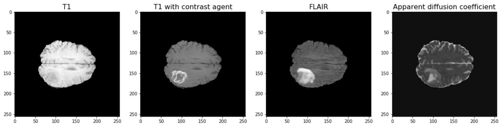
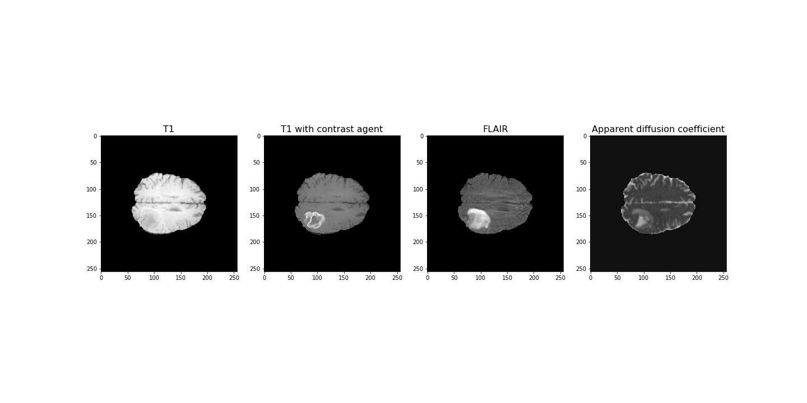
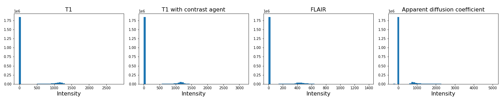
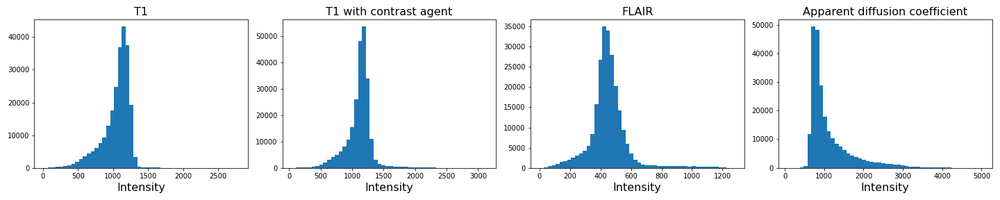
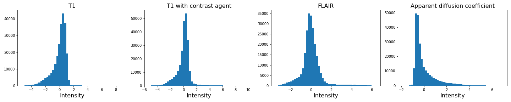
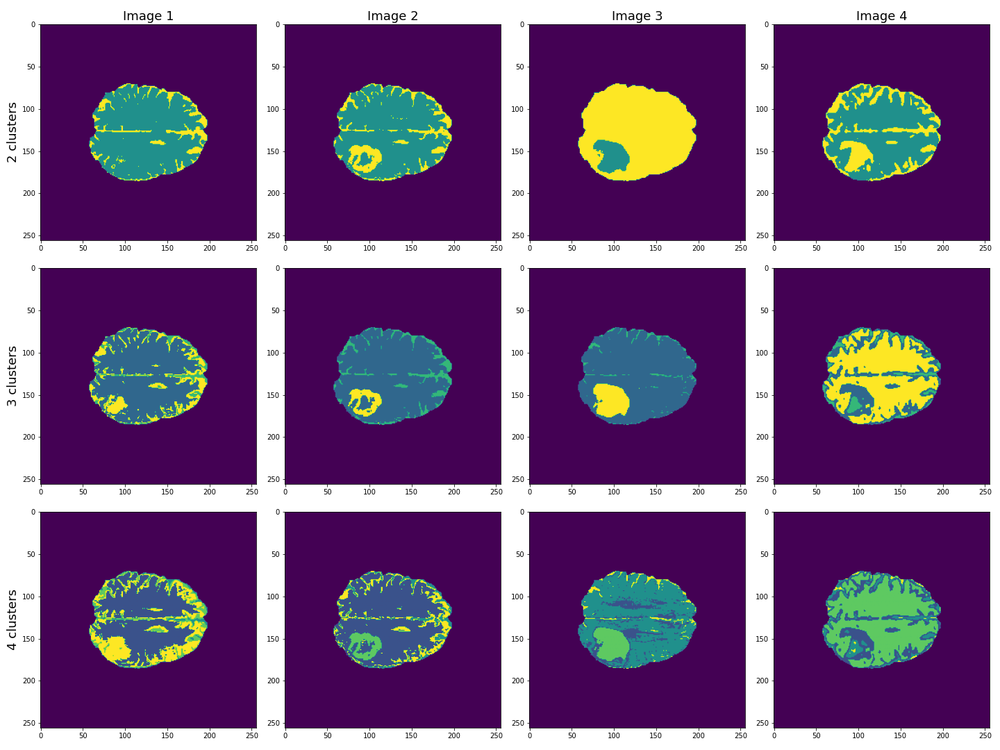
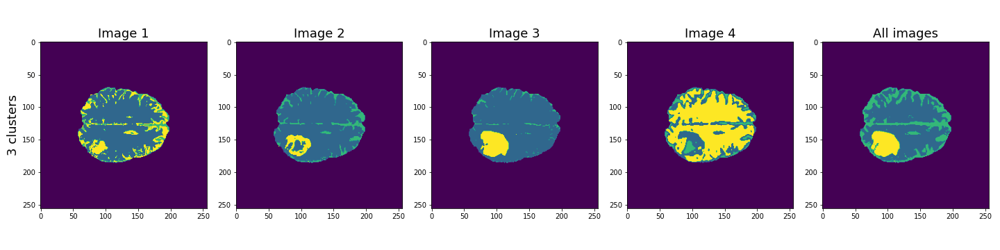
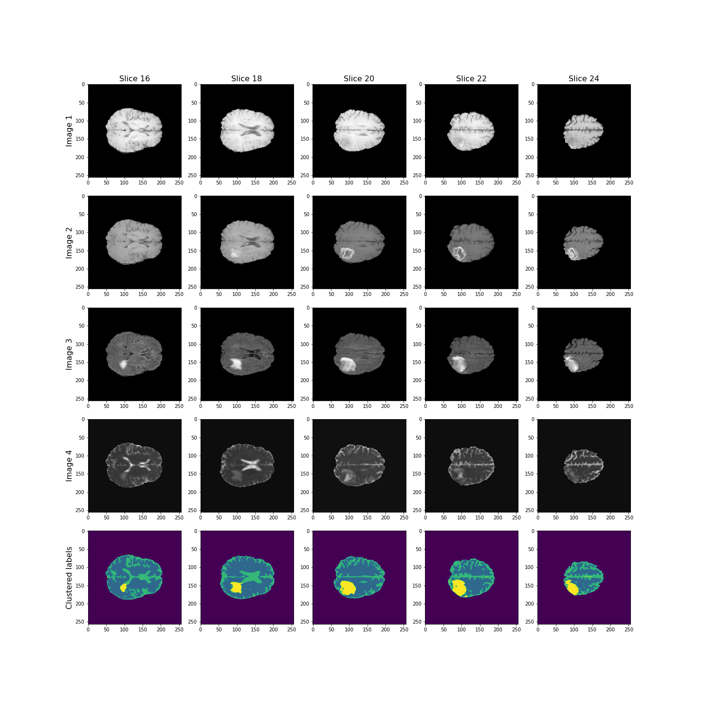
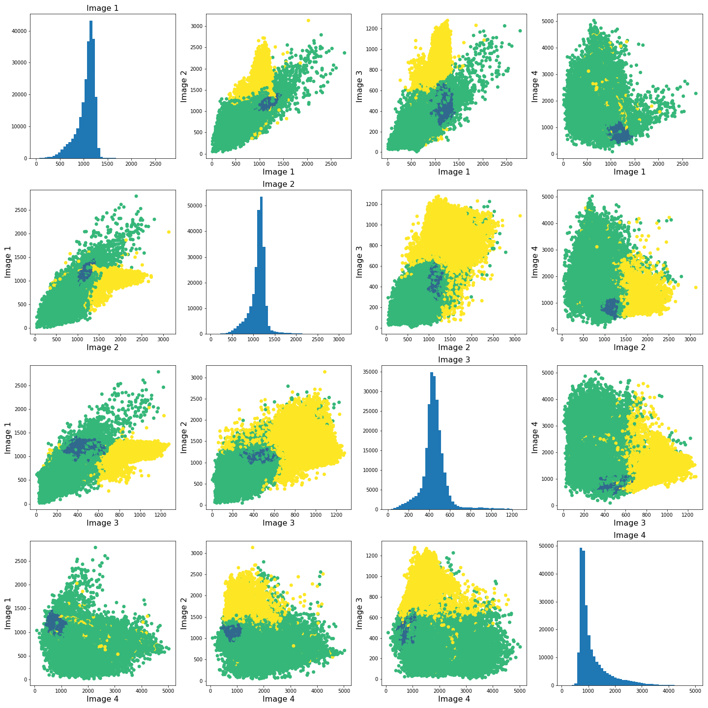
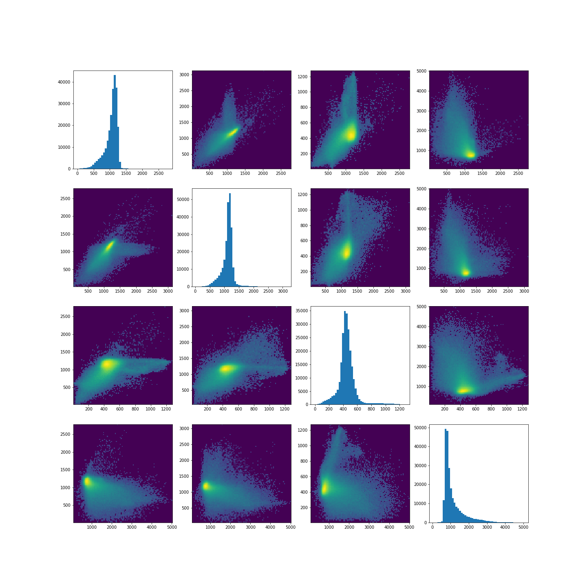

[**Download Chapter notebook (ipynb)**](https://drive.usercontent.google.com/u/1/uc?id=1fR6j_lbrHp2Ojwi24jy9Og-PnHGGT16a&export=download)

[**Download Chapter PDF**](https://drive.usercontent.google.com/u/1/uc?id=1UvmmoebKwkDX8Wk3iUHMJklp1fTyzzb1&export=download)

[<span style="color: rgb(255, 0, 0);">**Mandatory Lesson Feedback Survey**</span>](https://docs.google.com/forms/d/e/1FAIpQLSdr0capF7jloJhPH3Pki1B3LZoKOG16poOpuVJ7SL2LkwLHQA/viewform?pli=1)


:::::::::::::::::::::::::::::::::::::: questions

- What makes image data unique for machine learning?
- How can MR images be clustered and segmented?
- How can segmentation be improved?
- How do we visualise clustered image data?

::::::::::::::::::::::::::::::::::::::::::::::::

::::::::::::::::::::::::::::::::::::: objectives
- Learning to work with a domain-specific Python package.
- Clustering with Gaussian Mixture Models (GMM) to segment a medical image.
- Combining information from different imaging modalities for improved segmentation.
- Understanding strategies to visualise clustered output.

::::::::::::::::::::::::::::::::::::::::::::::::


<br>
<p align = "center">
<iframe width="560" height="315" src="https://www.youtube.com/embed/IuvEj39rM7k" title="YouTube video player" frameborder="0" allow="accelerometer; autoplay; clipboard-write; encrypted-media; gyroscope; picture-in-picture" allowfullscreen></iframe>
</p>
<br>
<p align = "center">
<iframe width="560" height="315" src="https://www.youtube.com/embed/6LaIhEdco8g" title="YouTube video player" frameborder="0" allow="accelerometer; autoplay; clipboard-write; encrypted-media; gyroscope; picture-in-picture" allowfullscreen></iframe>
</p>
<br>

:::::::::::::::::: prereq
- [Data Handling Images](https://learntodiscover.github.io/Data_Handling/03-image_handling.html)
::::::::::::::::::

## Concept

### **Image Segmentation with Clustering**
<p style='text-align: justify;'>
Medical imaging techniques are a valuable tool for probing diseases and disorders non-invasively. Processing medical images often consists of an expert, such as a radiologist, looking at the images and identifying, labelling and characterising potential lesions. This process can be time-consuming and reliant on a well-trained expert's eye. To make medical imaging techniques feasible in circumstances where there may be insufficient time or resources for expert labelling, there is current research into using artificial intelligence to label images. There are many supervised learning techniques that utilise previously labelled data from experts to train a computer algorithm to recognise certain features of an image. However, this may require large amounts of data that were previously labelled, which again is not always available. An alternative approach is to use unsupervised learning strategies, such as clustering, to group images into different regions. The interpretation of these regions may be ambiguous, but with some previous knowledge, we may still use it to infer information from an image.
</p>

### **Medical Image Example**
<p style='text-align: justify;'>
The example used in this lesson is part of the National Cancer Institute’s Clinical Proteomic Tumor Analysis Consortium Glioblastoma Multiforme (CPTAC-GBM) cohort and is available at The Cancer Imaging Archive: https://wiki.cancerimagingarchive.net/display/Public/CPTAC-GBM. For each subject in this study, several different brain MRI scans were performed, each of which gives different contrast in the brain. Each subject has been diagnosed with glioblastoma, and a tumour is visible in the MRI scans. To analyse the images and to, for example, estimate the size of the tumour, we may wish to segment the brain into healthy tissue and tumour tissue. The figure below shows four images in the different modalities.
</p>




## Work Through Example

### **Code Preparation**
<p style='text-align: justify;'>
We first import the modules needed for this lesson. We use Numpy to store and process images and we use __nibabel__ to read the MRI images, which have a file type called 'nifti'. Nibabel is freely available for download here: https://nipy.org/nibabel/
</p>


``` python
from numpy import zeros, sum, stack
import nibabel as nib
from matplotlib.pyplot import subplots, tight_layout, show
```

:::::::::::::::::: callout
## Note
Note how we import the nibabel package as 'nib'. You can use any abbreviation to access the package's functions from within your programme.
::::::::::::::::::

To familiarise yourself with the nibabel package, try the [Getting started tutorial](https://nipy.org/nibabel/gettingstarted.html) using an example image file.


### **Reading Images into Numpy Arrays**
<p style='text-align: justify;'>
Next, we want to use the nibabel package to read the MRI images into Numpy arrays. In this example, we use four different images that were acquired with different MRI protocols.
</p>


``` python
img_3d = nib.load('fig/t1.nii')
img1 = img_3d.get_fdata()

img_3d = nib.load('fig/t1_contrast.nii')
img2 = img_3d.get_fdata()

img_3d = nib.load('fig/flair.nii')
img3 = img_3d.get_fdata()

img_3d = nib.load('fig/adc.nii')
img4 = img_3d.get_fdata()
```

Let's have a look at the data shape:


``` python
print(img1.shape)
```

(256, 256, 32)
<p style='text-align: justify;'>
For plotting, we select a slice from the images. In this example we will view axial slices, i.e. slices from the last dimension. Thus, we choose a slice number between 0 and 31, here we go with slice 20 and plot it.
</p>


``` python
img_slice = 20
```


``` python
fig, ax = subplots(nrows=1, ncols=4, figsize=(20, 10))

ax[0].imshow(img1[:, :, img_slice], cmap='gray')
ax[0].set_title("T1", fontsize=16)
ax[1].imshow(img2[:, :, img_slice], cmap='gray')
ax[1].set_title("T1 with contrast agent", fontsize=16)
ax[2].imshow(img3[:, :, img_slice], cmap='gray')
ax[2].set_title("FLAIR", fontsize=16)
ax[3].imshow(img4[:, :, img_slice], cmap='gray')
ax[3].set_title("Apparent diffusion coefficient", fontsize=16);

show()
```



### **Data Pre-processing**

To analyse the images, we need to do a bit of pre-processing. First of all, let us plot the histogram of the voxel (volume pixel) intensities.


``` python
fig, ax = subplots(nrows=1, ncols=4, figsize=(20, 4))

ax[0].hist(img1.flatten(), bins=50);
ax[0].set_title("T1", fontsize=16)
ax[0].set_xlabel("Intensity", fontsize=16)

ax[1].hist(img2.flatten(), bins=50);
ax[1].set_title("T1 with contrast agent", fontsize=16)
ax[1].set_xlabel("Intensity", fontsize=16)

ax[2].hist(img3.flatten(), bins=50);
ax[2].set_title("FLAIR", fontsize=16)
ax[2].set_xlabel("Intensity", fontsize=16)

ax[3].hist(img4.flatten(), bins=50);
ax[3].set_title("Apparent diffusion coefficient", fontsize=16)
ax[3].set_xlabel("Intensity", fontsize=16)

tight_layout()

print('Number of voxels with intensity equal to 0 is: %d'%sum(img1==0))
print('')

show()
```

``` output
Number of voxels with intensity equal to 0 is: 1848804
```



<p style='text-align: justify;'>
As we can see from these histograms, a large number of the values are zero. This corresponds to the background voxels shown in black. We want to remove these voxels, as they are not useful for our analysis. For this, we create a binary mask and apply it to the images.
</p>

:::::::::::::::::: callout
## Note
Note the use of `tight_layout` in the cell above. It is a [Matplotlib function](https://matplotlib.org/3.1.1/api/_as_gen/matplotlib.pyplot.tight_layout.html) to pad between the figure edge and the edges of subplots. This can be useful to avoid overlap of figures and labels. The keyword parameter `pad` is set to 1.08 by default.
::::::::::::::::::


``` python
mask = (img1>0) & (img2>0) & (img3>0) & (img4>0)

img1_nz = img1[mask]
img2_nz = img2[mask]
img3_nz = img3[mask]
img4_nz = img4[mask]
```

With the mask applied, let us plot the histograms of the non-zero voxels again:


``` python
fig, ax = subplots(1, 4, figsize=(20, 4))

ax[0].hist(img1_nz, bins=50);
ax[0].set_title("T1", fontsize=16)
ax[0].set_xlabel("Intensity", fontsize=16)

ax[1].hist(img2_nz, bins=50);
ax[1].set_title("T1 with contrast agent", fontsize=16)
ax[1].set_xlabel("Intensity", fontsize=16)

ax[2].hist(img3_nz, bins=50);
ax[2].set_title("FLAIR", fontsize=16)
ax[2].set_xlabel("Intensity", fontsize=16)

ax[3].hist(img4_nz, bins=50);
ax[3].set_title("Apparent diffusion coefficient", fontsize=16)
ax[3].set_xlabel("Intensity", fontsize=16)

tight_layout()

show()
```



We can see that the data is no longer confounded by the zero-valued background voxels. The distribution of relevant intensities now becomes apparent.


### **Image scaling**
<p style='text-align: justify;'>
In many machine learning applications (both supervised and unsupervised) an additional step of data preparation consists in normalising or scaling, i.e. adjustment of the values under certain conditions. For example, the numbers in a data file are all positive and very large but the algorithms work best for numbers with mean zero and variance 1. In Scikit-learn this can be done by using `fit_transform` for an instance of the `StandardScaler`.
</p>


``` python
from sklearn.preprocessing import StandardScaler

scaler = StandardScaler()

img1_scaled = scaler.fit_transform(img1_nz.reshape(-1, 1))
img2_scaled = scaler.fit_transform(img2_nz.reshape(-1, 1))
img3_scaled = scaler.fit_transform(img3_nz.reshape(-1, 1))
img4_scaled = scaler.fit_transform(img4_nz.reshape(-1, 1))

fig, ax = subplots(1, 4, figsize=(20, 4))

ax[0].hist(img1_scaled, bins=50);
ax[0].set_title("T1", fontsize=16)
ax[0].set_xlabel("Intensity", fontsize=16)

ax[1].hist(img2_scaled, bins=50);
ax[1].set_title("T1 with contrast agent", fontsize=16)
ax[1].set_xlabel("Intensity", fontsize=16)

ax[2].hist(img3_scaled, bins=50);
ax[2].set_title("FLAIR", fontsize=16)
ax[2].set_xlabel("Intensity", fontsize=16)

ax[3].hist(img4_scaled, bins=50);
ax[3].set_title("Apparent diffusion coefficient", fontsize=16)
ax[3].set_xlabel("Intensity", fontsize=16)

tight_layout()

show()
```



If you compare the histograms, you can see that the values in the data have changed (horizontal axis) but the shapes of the distributions are the same.

We are not pursuing this further here but you are encouraged to re-do the clustering below with the scaled images and check if there are any differences.


### **Image Segmentation with Clustering**
<p style='text-align: justify;'>
After this data cleaning step, we can proceed with our analysis. We want to segment the images into brain tissue and tumour tissue. It is not obvious how to do this, as the intensity values in the above histogram are continuous with only one major peak in intensity. We will nonetheless attempt to cluster the images using a Gaussian Mixture Model (GMM).
</p>
First, we import the GMM class from Scikit-learn.


``` python
from sklearn.mixture import GaussianMixture
```

<p style='text-align: justify;'>
We then fit the instantiated model with a few different numbers of clusters (argument `n_components`, between n = 2-4) individually for each image. We use the `fit_predict` method to simultaneously fit and label the images. Note that we also add 1 to each image label. This is because each data point gets labelled with a number from 0 to _n-1_ where _n_ is the number of clusters used to fit the model. At the plotting stage, we do not want any of our labels to be equal to 0, as this corresponds to the background.
</p>


``` python
RANDOM_SEED = 123

gmm_2 = gmm_2 = GaussianMixture(2, random_state=RANDOM_SEED)
img1_n2_labels = gmm_2.fit_predict(img1_nz.reshape(-1, 1))
img1_n2_labels += 1

gmm_3 = GaussianMixture(3, random_state=RANDOM_SEED)
img1_n3_labels = gmm_3.fit_predict(img1_nz.reshape(-1, 1))
img1_n3_labels += 1

gmm_4 = GaussianMixture(4, random_state=RANDOM_SEED)
img1_n4_labels = gmm_4.fit_predict(img1_nz.reshape(-1, 1))
img1_n4_labels += 1
```


``` python
gmm_2 = GaussianMixture(2, random_state=RANDOM_SEED)
img2_n2_labels = gmm_2.fit_predict(img2_nz.reshape(-1, 1))
img2_n2_labels += 1

gmm_3 = GaussianMixture(3, random_state=RANDOM_SEED)
img2_n3_labels = gmm_3.fit_predict(img2_nz.reshape(-1, 1))
img2_n3_labels += 1

gmm_4 = GaussianMixture(4, random_state=RANDOM_SEED)
img2_n4_labels = gmm_4.fit_predict(img2_nz.reshape(-1, 1))
img2_n4_labels += 1
```


``` python
gmm_2 = GaussianMixture(2, random_state=RANDOM_SEED)
img3_n2_labels = gmm_2.fit_predict(img3_nz.reshape(-1, 1))
img3_n2_labels += 1

gmm_3 = GaussianMixture(3, random_state=RANDOM_SEED)
img3_n3_labels = gmm_3.fit_predict(img3_nz.reshape(-1, 1))
img3_n3_labels += 1

gmm_4 = GaussianMixture(4, random_state=RANDOM_SEED)
img3_n4_labels = gmm_4.fit_predict(img3_nz.reshape(-1, 1))
img3_n4_labels += 1
```


``` python
gmm_2 = GaussianMixture(2, random_state=RANDOM_SEED)
img4_n2_labels = gmm_2.fit_predict(img4_nz.reshape(-1, 1))
img4_n2_labels += 1

gmm_3 = GaussianMixture(3, random_state=RANDOM_SEED)
img4_n3_labels = gmm_3.fit_predict(img4_nz.reshape(-1, 1))
img4_n3_labels += 1

gmm_4 = GaussianMixture(4, random_state=RANDOM_SEED)
img4_n4_labels = gmm_4.fit_predict(img4_nz.reshape(-1, 1))
img4_n4_labels += 1
```

Once we have all our image labels, we map the labels back to the two-dimensional image array and plot the result.


``` python
img1_n2_labels_mapped = zeros(img1.shape)
img1_n2_labels_mapped[mask] = img1_n2_labels

img1_n3_labels_mapped = zeros(img1.shape)
img1_n3_labels_mapped[mask] = img1_n3_labels

img1_n4_labels_mapped = zeros(img1.shape)
img1_n4_labels_mapped[mask] = img1_n4_labels
```


``` python
img2_n2_labels_mapped = zeros(img2.shape)
img2_n2_labels_mapped[mask] = img2_n2_labels

img2_n3_labels_mapped = zeros(img2.shape)
img2_n3_labels_mapped[mask] = img2_n3_labels

img2_n4_labels_mapped = zeros(img2.shape)
img2_n4_labels_mapped[mask] = img2_n4_labels
```


``` python
img3_n2_labels_mapped = zeros(img3.shape)
img3_n2_labels_mapped[mask] = img3_n2_labels

img3_n3_labels_mapped = zeros(img3.shape)
img3_n3_labels_mapped[mask] = img3_n3_labels

img3_n4_labels_mapped = zeros(img3.shape)
img3_n4_labels_mapped[mask] = img3_n4_labels
```


``` python
img4_n2_labels_mapped = zeros(img4.shape)
img4_n2_labels_mapped[mask] = img4_n2_labels

img4_n3_labels_mapped = zeros(img4.shape)
img4_n3_labels_mapped[mask] = img4_n3_labels

img4_n4_labels_mapped = zeros(img4.shape)
img4_n4_labels_mapped[mask] = img4_n4_labels
```


``` python
fig, ax = subplots(3, 4, figsize=(20, 15))

ax[0, 0].imshow(img1_n2_labels_mapped[:, :, img_slice], cmap='viridis')
ax[1, 0].imshow(img1_n3_labels_mapped[:, :, img_slice], cmap='viridis')
ax[2, 0].imshow(img1_n4_labels_mapped[:, :, img_slice], cmap='viridis')
ax[0, 1].imshow(img2_n2_labels_mapped[:, :, img_slice], cmap='viridis')
ax[1, 1].imshow(img2_n3_labels_mapped[:, :, img_slice], cmap='viridis')
ax[2, 1].imshow(img2_n4_labels_mapped[:, :, img_slice], cmap='viridis')

ax[0, 2].imshow(img3_n2_labels_mapped[:, :, img_slice], cmap='viridis')
ax[1, 2].imshow(img3_n3_labels_mapped[:, :, img_slice], cmap='viridis')
ax[2, 2].imshow(img3_n4_labels_mapped[:, :, img_slice], cmap='viridis')

ax[0, 3].imshow(img4_n2_labels_mapped[:, :, img_slice], cmap='viridis')
ax[1, 3].imshow(img4_n3_labels_mapped[:, :, img_slice], cmap='viridis')
ax[2, 3].imshow(img4_n4_labels_mapped[:, :, img_slice], cmap='viridis')

ax[0, 0].set_ylabel("2 clusters", fontsize=18)
ax[1, 0].set_ylabel("3 clusters", fontsize=18)
ax[2, 0].set_ylabel("4 clusters", fontsize=18)

ax[0, 0].set_title("Image 1", fontsize=18)
ax[0, 1].set_title("Image 2", fontsize=18)
ax[0, 2].set_title("Image 3", fontsize=18)
ax[0, 3].set_title("Image 4", fontsize=18)

tight_layout()

show()
```



<p style='text-align: justify;'>
This figure shows the labels acquired from each of the images, using different numbers of clusters. We see that using Image 3 (acquired with FLAIR protocol), the lesion is segmented quite well from the rest of the brain. The other images are less effective at clearly identifying the lesion. However, some of these images, e.g. Image 4 (apparent diffusion coefficient) performs better at segmenting brain tissue from surrounding cerebrospinal fluid (CSF). CSF is not part of brain tissue and can contaminate our results. Ideally, we want to segment three key areas: brain, lesion and CSF.
</p>

### **Combining Contrast from Different Images**
<p style='text-align: justify;'>
So far, we only used the intensities of each image individually, i.e. using only one feature. We now try to combine the images into a single Numpy array containing four columns, one for each image.
</p>


``` python
all_img = stack([img1_nz, img2_nz, img3_nz, img4_nz], axis=1)
all_img.shape
```

(240391, 4)


``` python
gmm_3 = GaussianMixture(3, random_state=RANDOM_SEED)

all_img_n3_labels = gmm_3.fit_predict(all_img)
all_img_n3_labels += 1
```


``` python
all_img_n3_labels_mapped = zeros(img1.shape)
all_img_n3_labels_mapped[mask] = all_img_n3_labels
```


``` python
fig, ax = subplots(1, 5, figsize=(20, 5))
ax[0].imshow(img1_n3_labels_mapped[:, :, img_slice], cmap='viridis')
ax[1].imshow(img2_n3_labels_mapped[:, :, img_slice], cmap='viridis')
ax[2].imshow(img3_n3_labels_mapped[:, :, img_slice], cmap='viridis')
ax[3].imshow(img4_n3_labels_mapped[:, :, img_slice], cmap='viridis')
ax[4].imshow(all_img_n3_labels_mapped[:, :, img_slice], cmap='viridis')

ax[0].set_ylabel("3 clusters", fontsize=18)

ax[0].set_title("Image 1", fontsize=18)
ax[1].set_title("Image 2", fontsize=18)
ax[2].set_title("Image 3", fontsize=18)
ax[3].set_title("Image 4", fontsize=18)
ax[4].set_title("All images", fontsize=18)

tight_layout()

show()
```



<p style='text-align: justify;'>
Here, the last column shows the cluster results when all four images are used in the Gaussian mixture model. These results seem to be better than the individual images, and with three clusters, the lesion, CSF and brain tissue seem clearly identified.
</p>

Let's plot some of the other image slices to check that the segmentation performs well on the whole 3D image.


``` python
fig, ax = subplots(5, 5, figsize=(20, 20))

ax[0, 0].imshow(img1[:, :, 16], cmap='gray')
ax[0, 1].imshow(img1[:, :, 18], cmap='gray')
ax[0, 2].imshow(img1[:, :, 20], cmap='gray')
ax[0, 3].imshow(img1[:, :, 22], cmap='gray')
ax[0, 4].imshow(img1[:, :, 24], cmap='gray')

ax[1, 0].imshow(img2[:, :, 16], cmap='gray')
ax[1, 1].imshow(img2[:, :, 18], cmap='gray')
ax[1, 2].imshow(img2[:, :, 20], cmap='gray')
ax[1, 3].imshow(img2[:, :, 22], cmap='gray')
ax[1, 4].imshow(img2[:, :, 24], cmap='gray')

ax[2, 0].imshow(img3[:, :, 16], cmap='gray')
ax[2, 1].imshow(img3[:, :, 18], cmap='gray')
ax[2, 2].imshow(img3[:, :, 20], cmap='gray')
ax[2, 3].imshow(img3[:, :, 22], cmap='gray')
ax[2, 4].imshow(img3[:, :, 24], cmap='gray')

ax[3, 0].imshow(img4[:, :, 16], cmap='gray')
ax[3, 1].imshow(img4[:, :, 18], cmap='gray')
ax[3, 2].imshow(img4[:, :, 20], cmap='gray')
ax[3, 3].imshow(img4[:, :, 22], cmap='gray')
ax[3, 4].imshow(img4[:, :, 24], cmap='gray')

ax[4, 0].imshow(all_img_n3_labels_mapped[:, :, 16], cmap='viridis')
ax[4, 1].imshow(all_img_n3_labels_mapped[:, :, 18], cmap='viridis')
ax[4, 2].imshow(all_img_n3_labels_mapped[:, :, 20], cmap='viridis')
ax[4, 3].imshow(all_img_n3_labels_mapped[:, :, 22], cmap='viridis')
ax[4, 4].imshow(all_img_n3_labels_mapped[:, :, 24], cmap='viridis')

ax[0, 0].set_title("Slice 16", fontsize=16)
ax[0, 1].set_title("Slice 18", fontsize=16)
ax[0, 2].set_title("Slice 20", fontsize=16)
ax[0, 3].set_title("Slice 22", fontsize=16)
ax[0, 4].set_title("Slice 24", fontsize=16)

ax[0, 0].set_ylabel("Image 1", fontsize=16)
ax[1, 0].set_ylabel("Image 2", fontsize=16)
ax[2, 0].set_ylabel("Image 3", fontsize=16)
ax[3, 0].set_ylabel("Image 4", fontsize=16)
ax[4, 0].set_ylabel("Clustered labels", fontsize=16);

show()
```



Overall, the lesion, shown in yellow, seems to be segmented well across the volume.

### **Checking the GMM Labels**
<p style='text-align: justify;'>
To investigate how the image intensities were clustered, we can look at the scatter plots for each combination of images. The diagonal plots show histograms of each image. This type of plot can be very useful in exploratory data analysis.
</p>

:::::::::::::: callout
## Note
Note that this plot might take a bit longer to run, as there are a very large number of data points.
::::::::::::::

In a python plotting library called [seaborn](https://seaborn.pydata.org), such plots are called `pairplots` and can be very easily plotted if your data is in a pandas dataframe.

You can install it at the command prompt (Windows) or terminal (MacOS, Linux) using:


```
conda install seaborn
```

To use it, import the required functions in your Python kernel, e.g.:


``` python
from seaborn import pairplot
```

ModuleNotFoundError: No module named 'seaborn'

We don't use this library here, but encourage you to look up further information in [the seaborn documentation](https://seaborn.pydata.org/generated/seaborn.pairplot.html).


``` python
fig, ax = subplots(4, 4, figsize=(20, 20))

ax[0, 0].hist(img1_nz, bins=50);
ax[0, 0].set_title('Image 1', fontsize=16)
ax[0, 1].scatter(img1_nz, img2_nz, c=all_img_n3_labels, cmap='viridis', vmin=0);
ax[0, 1].set_xlabel('Image 1', fontsize=16)
ax[0, 1].set_ylabel('Image 2', fontsize=16)
ax[0, 2].scatter(img1_nz, img3_nz, c=all_img_n3_labels, cmap='viridis', vmin=0);
ax[0, 2].set_xlabel('Image 1', fontsize=16)
ax[0, 2].set_ylabel('Image 3', fontsize=16)
ax[0, 3].scatter(img1_nz, img4_nz, c=all_img_n3_labels, cmap='viridis', vmin=0);
ax[0, 3].set_xlabel('Image 1', fontsize=16)
ax[0, 3].set_ylabel('Image 4', fontsize=16)

ax[1, 0].scatter(img2_nz, img1_nz, c=all_img_n3_labels, cmap='viridis', vmin=0);
ax[1, 0].set_xlabel('Image 2', fontsize=16)
ax[1, 0].set_ylabel('Image 1', fontsize=16)
ax[1, 1].hist(img2_nz, bins=50);
ax[1, 1].set_title('Image 2', fontsize=16)
ax[1, 2].scatter(img2_nz, img3_nz, c=all_img_n3_labels, cmap='viridis', vmin=0);
ax[1, 2].set_xlabel('Image 2', fontsize=16)
ax[1, 2].set_ylabel('Image 3', fontsize=16)
ax[1, 3].scatter(img2_nz, img4_nz, c=all_img_n3_labels, cmap='viridis', vmin=0);
ax[1, 3].set_xlabel('Image 2', fontsize=16)
ax[1, 3].set_ylabel('Image 4', fontsize=16)

ax[2, 0].scatter(img3_nz, img1_nz, c=all_img_n3_labels, cmap='viridis', vmin=0);
ax[2, 0].set_xlabel('Image 3', fontsize=16)
ax[2, 0].set_ylabel('Image 1', fontsize=16)
ax[2, 1].scatter(img3_nz, img2_nz, c=all_img_n3_labels, cmap='viridis', vmin=0);
ax[2, 1].set_xlabel('Image 3', fontsize=16)
ax[2, 1].set_ylabel('Image 2', fontsize=16)
ax[2, 2].hist(img3_nz, bins=50);
ax[2, 2].set_title('Image 3', fontsize=16)
ax[2, 3].scatter(img3_nz, img4_nz, c=all_img_n3_labels, cmap='viridis', vmin=0);
ax[2, 3].set_xlabel('Image 3', fontsize=16)
ax[2, 3].set_ylabel('Image 4', fontsize=16)

ax[3, 0].scatter(img4_nz, img1_nz, c=all_img_n3_labels, cmap='viridis', vmin=0);
ax[3, 0].set_xlabel('Image 4', fontsize=16)
ax[3, 0].set_ylabel('Image 1', fontsize=16)
ax[3, 1].scatter(img4_nz, img2_nz, c=all_img_n3_labels, cmap='viridis', vmin=0);
ax[3, 1].set_xlabel('Image 4', fontsize=16)
ax[3, 1].set_ylabel('Image 2', fontsize=16)
ax[3, 2].scatter(img4_nz, img3_nz, c=all_img_n3_labels, cmap='viridis', vmin=0);
ax[3, 2].set_xlabel('Image 4', fontsize=16)
ax[3, 2].set_ylabel('Image 3', fontsize=16)
ax[3, 3].hist(img4_nz, bins=50);
ax[3, 3].set_title('Image 4', fontsize=16)

fig.tight_layout()
show()
```



<p style='text-align: justify;'>
The colours in the scatter plots above correspond to the labels we extracted using all four images and three clusters. I.e. green corresponds to healthy brain tissue, yellow corresponds to CSF and blue corresponds to the lesion. This figure shows reasonably well how CSF (yellow) and lesion (blue) can be clustered. However, it is not as easy to see how the healthy tissue was separated from CSF and lesion tissue. To investigate further, we can plot the above slightly differently, using a 2-dimensional histogram instead of a scatter plot.
</p>

::::::::::::::::: callout
##
A 2-dimensional histogram plots the counts of values in bins for two variables. The results are displayed as a heatmap. An intuitive example with code using the Matplotlib function `hist2d` [is available here](https://matplotlib.org/3.1.1/gallery/scales/power_norm.html#sphx-glr-gallery-scales-power-norm-py).|
:::::::::::::::::


``` python
import matplotlib.colors as mcolors

fig, ax = subplots(4, 4, figsize=(20, 20))

ax[0, 0].hist(img1_nz, bins=50);
ax[0, 1].hist2d(img1_nz, img2_nz, bins=100, norm=mcolors.PowerNorm(0.2));
ax[0, 2].hist2d(img1_nz, img3_nz, bins=100, norm=mcolors.PowerNorm(0.2));
ax[0, 3].hist2d(img1_nz, img4_nz, bins=100, norm=mcolors.PowerNorm(0.2));

ax[1, 0].hist2d(img2_nz, img1_nz, bins=100, norm=mcolors.PowerNorm(0.2));
ax[1, 1].hist(img2_nz, bins=50);
ax[1, 2].hist2d(img2_nz, img3_nz, bins=100, norm=mcolors.PowerNorm(0.2));
ax[1, 3].hist2d(img2_nz, img4_nz, bins=100, norm=mcolors.PowerNorm(0.2));

ax[2, 0].hist2d(img3_nz, img1_nz, bins=100, norm=mcolors.PowerNorm(0.2));
ax[2, 1].hist2d(img3_nz, img2_nz, bins=100, norm=mcolors.PowerNorm(0.2));
ax[2, 2].hist(img3_nz, bins=50);
ax[2, 3].hist2d(img3_nz, img4_nz, bins=100, norm=mcolors.PowerNorm(0.2));

ax[3, 0].hist2d(img4_nz, img1_nz, bins=100, norm=mcolors.PowerNorm(0.2));
ax[3, 1].hist2d(img4_nz, img2_nz, bins=100, norm=mcolors.PowerNorm(0.2));
ax[3, 2].hist2d(img4_nz, img3_nz, bins=100, norm=mcolors.PowerNorm(0.2));
ax[3, 3].hist(img4_nz, bins=50);

show()
```



<p style='text-align: justify;'>
Note in the plot, we used a PowerNorm normalisation on the image intensities. This is just to aid with visualisation, and you are welcome to change or completely remove the normalisation.
</p>
<p style='text-align: justify;'>
The plots show that there is a bright, high-density region corresponding to the clustered healthy tissue region. This gives us a better idea how the GMM algorithm found the three regions. Healthy tissue has low signal variance in all 4 images. Signal intensity in CSF and the lesion have much higher variance making it possible to distinguish them from healthy tissue. Furthermore, the relative intensities of CSF and lesion tissue are different as shown in the scatter plots, making it possible for the GMM to distinguish between the two.
</p>


## Exercises
:::::::::::::::::::::::::::::::::::::::: challenge

#### End of chapter Exercises

<p style='text-align: justify;'>
In this assignment, we ask you to use the same set of images as in the work through example. However, instead of GMM, we want you to try a different clustering method called __KMeans__. The documentation for KMneans is available here: https://scikit-learn.org/stable/modules/generated/sklearn.cluster.KMeans.html. Some examples of how kmeans clustering can go wrong are shown in [this example code](https://scikit-learn.org/stable/auto_examples/cluster/plot_kmeans_assumptions.html#sphx-glr-auto-examples-cluster-plot-kmeans-assumptions-py).
</p>

Using `KMeans` from 'sklearn.cluster', do the following tasks:

1. Investigate different numbers of clusters, similarly to what we did in th work through example.

2. Use different combinations of the 4 images to see how the clustering performs in different cases.

3. The labelled results using all four images may not look as clean as the ones in the work-through example. Try scaling the images e.g. using the sklearn standard scaler, and combining the scaled images. Do the results change? If yes, explore and comment on why you think scaling may be advantageous in this clustering example.

4. Compare the behaviour of `KMeans` to the outcome with `GaussianMixture`.

::::::::::::::::::::: solution

## Solutions are provided after assignments are marked. 

:::::::::::::::::::::
::::::::::::::::::::::::::::::::::::::::

## Further Reading

If after this lesson you want to deepen your understanding of clustering and, in particular, want to compare the performance of different clustering methods when dealing with images, try the article [Clustering techniques for
neuroimaging applications](https://onlinelibrary.wiley.com/doi/pdf/10.1002/widm.1174). It is paywalled and you will need an institutional access to download.

::::::::::::::::::::::::::::::::::::: keypoints

- Image analysis almost always requires a bit of pre-processing.
- Image scaling is performed by using `fit_transform` method from module `StandardScaler` in `Scikit-learn`.
- GMM offers a good startig point in image clustering.
- Diagonal plots are very useful in exploratory data analysis.

::::::::::::::::::::::::::::::::::::::::::::::::


[r-markdown]: https://rmarkdown.rstudio.com/
